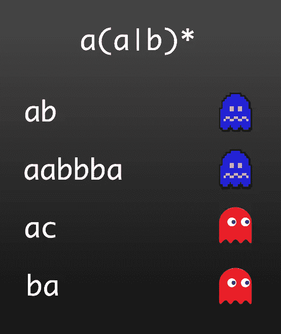
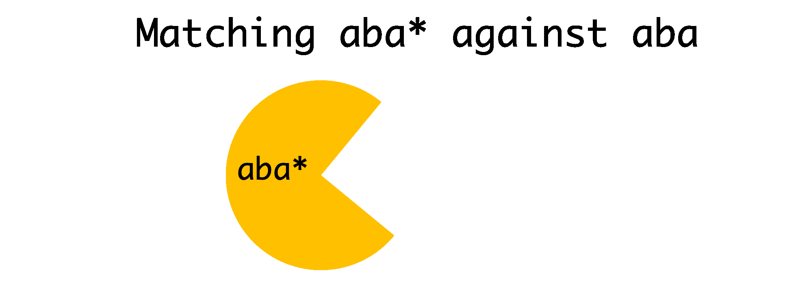
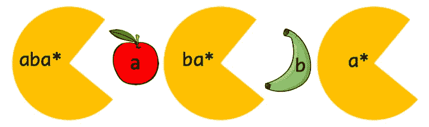
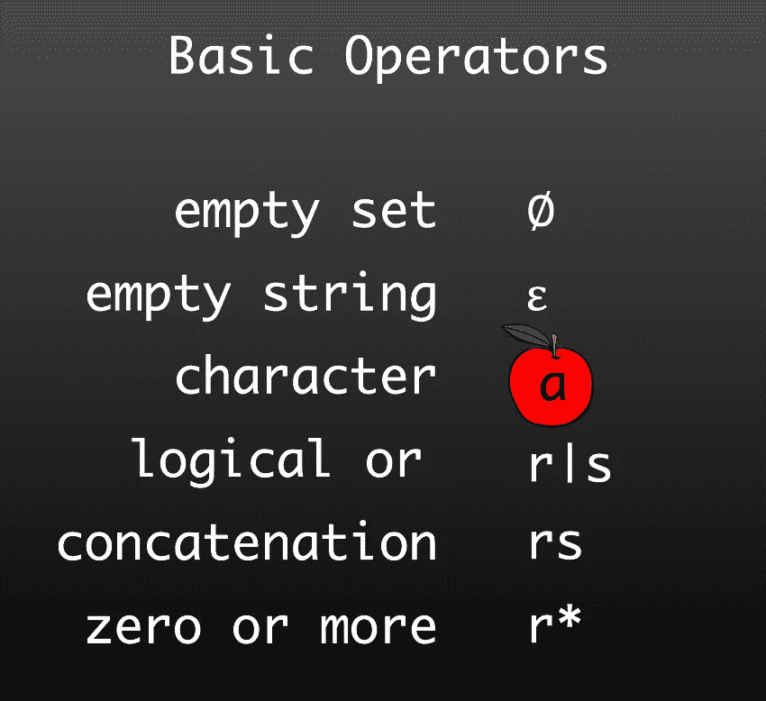
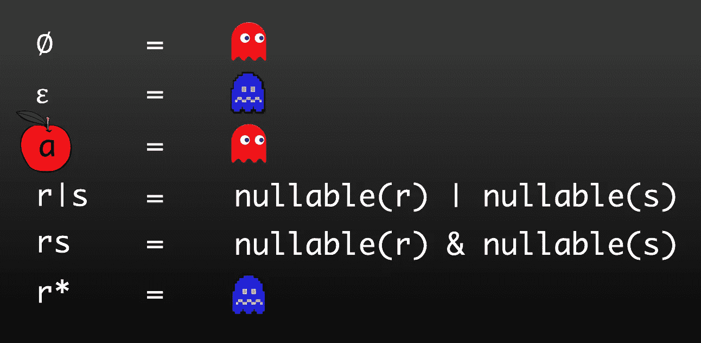
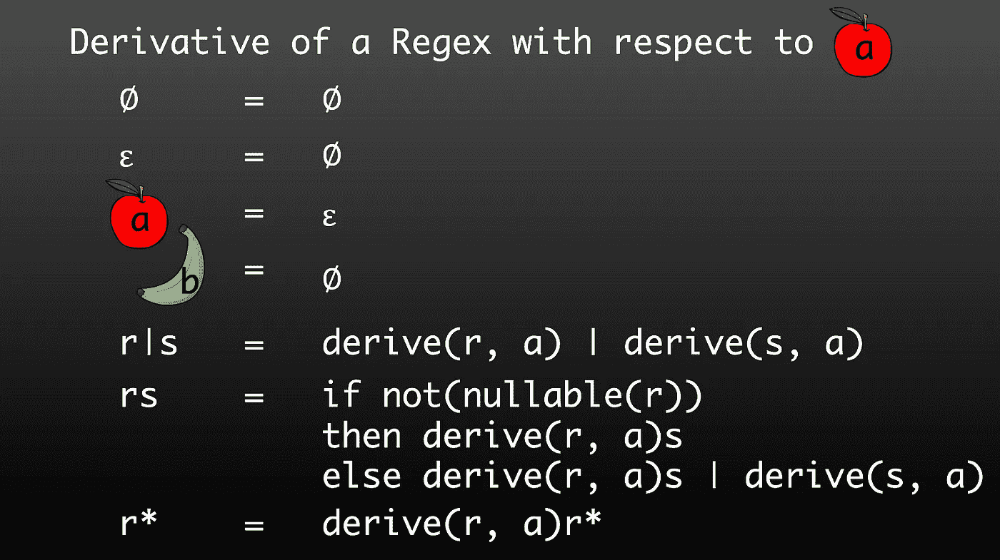
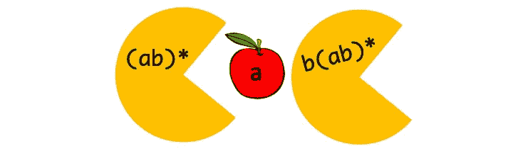

# 使用 Pac-Man 解释正则表达式的导数

> 原文：<https://betterprogramming.pub/how-to-take-the-derivative-of-a-regular-expression-explained-2e7cea15028d>

## 解释函数正则表达式匹配算法的教程

作者图片|吃豆人的幽灵和樱桃

吃红樱桃让你有吃蓝鬼的能力。导数可以用来创建正则表达式匹配算法的想法几乎同样荒谬。让我解释一下这个算法是如何工作的，以及它与吃豆人的关系。

1964 年，Brzozowski 发表了第一篇关于正则表达式导数的论文。这是迄今为止我最喜欢的算法之一。使用正则表达式的导数，我们可以实现一个算法来进行正则表达式匹配。这个算法非常:

*   简单的
*   功能的
*   使用您自己的运营商可以轻松扩展

这也是向您介绍其他函数概念的好方法，比如记忆化、智能构造函数、懒惰和不动点。它甚至可以扩展到处理上下文无关的语法、树和一般列表的匹配。

在本文中，我将向您展示如何仅使用两个纯函数和一些 Pac-Man 类比，用正则表达式匹配字符串。如果您愿意，您可以观看以下视频，而不是阅读文章，因为它涵盖了相同的内容:

# 正则表达式概述

首先，让我们快速回顾一下正则表达式，以确保我们在同一页上。表达式`a(a|b)*`匹配以`a`开头的字符串，后面是任意数量的`a`和`b`

*   字符串`ab`将匹配`a(a|b)*`。我们将用可食用的蓝色幽灵来表示这一点。
*   字符串`aabbba`也匹配`a(a|b)*`，因为它以`a`开始，后面跟着几个`a`和`b`。
*   接下来，字符串`ac`与`a(a|b)*`不匹配，因为正则表达式与任何`c`都不匹配，而我们的正则表达式不进行任何子字符串匹配。我们将用追逐吃豆人的红色幽灵来表示这一点。
*   最后，字符串`ba`也与`a(a|b)*`不匹配，因为它不是以`a`开头的。

现在我们快速回顾一下算法。

# 算法概述

在深入研究细节之前，让我们先了解一下这个算法是如何工作的。我设计了一个奇怪的吃豆人游戏，在这个游戏中，如果你按照与正则表达式相匹配的顺序吃水果，你就只能吃到鬼魂。我们的 Pac-Man 代表 regex `aba*`。它有以下一串水果可以吃:一个苹果，然后是一个香蕉，然后是一个苹果:`aba`。

1.  当我们开始的时候，幽灵在追我们，我们剩下来匹配的正则表达式是`aba*`。
2.  我们吃第一个苹果，我们现在剩下来匹配的正则表达式是`ba*`。鬼魂仍然在追我们，因为我们到目前为止吃的水果，苹果，与正则表达式不匹配。
3.  接下来，我们吃香蕉。我们剩下要匹配的正则表达式是`a*`。现在鬼魂开始逃跑，因为从技术上来说，`ab`已经和`aba*`匹配了。
4.  我们可以尝试吃掉幽灵或者再吃一个苹果，在这种情况下，我们剩下来匹配的正则表达式仍然是`a*`。由于`aba`也匹配正则表达式`aba*`，幽灵仍然在逃跑。

Pac-Main 吃苹果、香蕉和另一个苹果的动画

让我们分析一下这里发生了什么。吃水果的吃豆人代表了导数函数。这意味着`aba*`相对于`a`的导数是`ba*`。导数函数接受一个正则表达式和一个字符，并返回剩下要匹配的正则表达式。吃完苹果剩下来配的正则表达式是`ba*`。这也意味着`ba*`相对于`b`的导数是`a*`。

这里还有一个功能在起作用。该函数检查幽灵是否正在追逐 Pac-Man，或者 Pac-Man 是否已经匹配正则表达式并正在追逐幽灵。这个函数称为可空函数；它检查剩下要匹配的正则表达式是否与空字符串匹配。它可以这样做，因为如果剩下的正则表达式匹配空字符串，它吃的水果一定已经足够满足正则表达式了。

可空:匹配空字符串

不可为空:与空字符串不匹配

# 导数匹配算法

这意味着我们只需要两个函数来编写导数匹配算法:

1.  导数函数
2.  可空函数

当我们有了这些，我们可以循环输入字符串，吃掉所有的水果，并检查结果正则表达式是否与空字符串匹配。这里我们有两个实现。

一个在 Golang，面向命令式程序员:

Golang 中的导数匹配算法

Haskell 中的另一个面向函数式程序员:

Haskell 中的导数匹配算法

这两个函数是等价的，只是用不同的编程风格编写。在 Haskell 代码中，`foldl`在其他语言中也称为 fold left 或 reduce，为您完成 for 循环的工作。还有，在 Haskell 中，我们不需要逗号来给函数传递参数；由于函数应用是函数式编程语言中最常见的操作，所以我们使用空格来分隔参数。

现在，让我们更深入地研究如何实现可空函数和导数函数。

# 吃豆人起源故事题外话

但在我们开始之前，我不知道你是否想过吃豆人起源的故事。我认为吃豆人没有掉进核废料桶，所以吃豆人获得了吃鬼的能力。逻辑就简单多了。

吃豆人是水果！当吃豆人吃其他水果时，吃豆人就是食人者。所以，如果你被鬼魂追赶，你必须吃些人肉，而鬼魂应该，至少暂时，开始逃离你。现在，我自己还没有尝试过，但是这个逻辑似乎是合理的。

这就解释了为什么僵尸总是在追人类。正如大卫·爱登堡曾经说过的:

> “追赶我们的僵尸，他们自己也在被我们看不见的鬼魂追赶。僵尸吃了我们的一些人肉后，你会看到他们表现出对着空气大口大口的奇怪行为，这是僵尸在吃之前追赶它的鬼魂。”

# 基本运算符

可空函数和导数函数的实现要求我们首先定义正则表达式中可用的基本操作符。

我们可以把正则表达式想象成描述一组字符串。

*   这意味着空集表示不匹配任何字符串的运算符。
*   空字符串表示只匹配空字符串的单个字符串的单例集。
*   该字符还表示只匹配单个字符`a`的单例集。
*   然后，我们可以使用运算符来组合这些基本正则表达式，例如:`or`、`concatenation`和`Kleene star`，其中`r`和`s`表示我们要组合的两个正则表达式。

现在我们已经定义了正则表达式数据类型，我们可以看看如何实现使用该数据类型作为输入的两个函数。

# 可空函数

我们可以从可空函数开始。让我们看一些例子，找出这些正则表达式中的哪一个与空字符串匹配，以深入了解这个函数是如何实现的。

*   `a*`匹配空字符串，因为零或更多包括零。
*   `(a*|b)`匹配空字符串，因为 or 的左侧匹配空字符串。
*   `ab`不匹配空字符串，因为它只匹配字符串`ab`
*   `ab*`也不匹配空字符串，因为`ab*`需要一个以`a`开头的字符串
*   `(a|b)`不匹配空字符串，因为`or`的左右两边都不匹配空字符串。

可空的例子

我希望这些例子能让我们深入了解如何定义可空函数。

下面是可空函数的实现。左边表示传入函数的值，右边表示在这种情况下函数的实现。红鬼代表假，蓝鬼代表真:

可空函数的实现

*   空集不匹配空字符串，因为它不匹配任何字符串。
*   空字符串匹配空字符串，因为它只匹配空字符串。
*   字符`a`不匹配空字符串，因为它只匹配字符`a`。
*   如果我们有一个逻辑`or`，我们必须检查两边。如果任何一个匹配空字符串，那么逻辑`or`匹配空字符串。
*   对于匹配空字符串的两个正则表达式的`concatenation`,它们都必须匹配空字符串。
*   最后，如果我们有某个东西的`zero or more`，那么它包括零，这意味着它总是匹配空字符串。

让我们通过函数运行一个例子。给定正则表达式`(b | a*)`。

1.  我们的顶级操作符是`or`，这意味着我们必须检查左右两边的可空性:`b`和`a*`。
2.  我们检查并看到左边的字符`b`不可空:`false`。
3.  然后我们检查并看到右边的`a*`是可空的:`true`。
4.  现在我们得到了`false`和`true`，我们可以`or`它们来得到`true`。

所以表达式`(b|a*)`是可空的。这是有意义的，因为它将匹配空字符串。在我们继续学习导数函数之前，让我们再做一些练习:

## 无效练习

尝试遍历实现并检查以下正则表达式是否可为空。你可以点击它们来检查你的答案:

1.  [答](https://gist.github.com/awalterschulze/7594432f1d08e321ba9546520dc62bab)
2.  [a*(b*|∅)](https://gist.github.com/awalterschulze/5d1e049e99fff677ceee75ae19c1c723)
3.  [εa](https://gist.github.com/awalterschulze/7f276c1d21cf8413263bd504512e3d09)
4.  [∅*](https://gist.github.com/awalterschulze/b2d75d4211bfe1d15818939d4267cc0c)
5.  [(∅|b)*(abc|ε)](https://gist.github.com/awalterschulze/4584ac57670d425b223436b8ddfdc85a)

# 导数函数

在我们看函数的实现之前，让我们看一下导数的例子。这里我们将对几个正则表达式求导，都是关于字符`a`:

*   `a*`吃了一个`a` pple 之后剩下来匹配的正则表达式还是`a*`。
*   `ab*`相对于`a`的导数是`b*`，因为我们已经匹配了前缀`a`。
*   `(a|b)b`相对于`a`的导数为`b`。
*   `b|(a*b)`相对于`a`的导数为`a*b`。左边的`b`不匹配，所以我们可以扔掉它，而`a`被右边的`zero or more` `a`消耗掉了。
*   接下来，我们有`ab*`，这个稍微有点棘手。它吃完苹果后，剩下来匹配的正则表达式是`b(ab)*`。由于我们只匹配了`a`，我们期望至少再看到一个`b`。

我希望这些例子能给我们一些关于如何定义导函数的直觉。我们需要定义一个导数函数，它接受一个正则表达式，匹配一个字符，并返回一个新的正则表达式。这里我们定义了关于字符`a`的导函数。左侧表示函数的输入，右侧表示函数的实现。

*   空集的导数总是空集。因为空集不匹配任何内容，所以无法恢复。
*   关于任何字符的空字符串的导数是空集。它并不期望匹配一个字符。它将只匹配空字符串。
*   单个字符对一个相似字符(在本例中是`a` pple)的派生是一个空字符串，因为在它匹配了自己之后，剩下要匹配的就是空字符串了。
*   一个字符相对于不相等的另一个字符的导数，在这种情况下，`b` anana，是空集，因为我们没有匹配特定的字符。
*   一个`or`表达式的导数就是导数的`or`。它只是把问题推给了它的孩子。
*   `concat`表达式的导数要考虑是否可以跳过第一个表达式。只有当第一个表达式匹配空字符串并且可为空时，它才能跳过第一个表达式。所以我们要做的第一件事就是检查这个。让我们考虑这样一种情况，当表达式`r`不可为空时，它不能跳过第一个表达式。那么导数就是第一个表达式`concatenated`对第二个表达式`s`的导数。如果我们可以跳过第一个正则表达式，我们必须考虑另一个表达式，它只是第二个表达式的衍生物。然后我们可以`or`跳过`r`和不跳过`r`这两个选项，并返回结果。
*   最后，我们有`star`操作符。它匹配一个表达式零次或多次。因为我们被传递一个字符，这不是零的情况。所以我们不得不考虑`one or more`的情况。这意味着我们必须对`star`中的表达式求导，然后再用`zero or more`表达式对`concatenate`求导。

如前所述，我们可以将导数函数与可空函数结合起来，创建一个正则表达式匹配函数。完全掌握`concatenation`和`zero or more`规则需要一段时间。所以，我们来做一些例子。

## 衍生实例 1

让我们对`(ab)*`相对于`a`求导。

`(ab)*`是一个`zero or more`表达式，所以我们看一下`zero or more`规则。我们看到这需要对`star`中的表达式求导。

这是`a`和`b`的`concatenation`。所以我们检查左侧是否可空，字符`a`不可空。这意味着我们不能跳过它。我们必须对`a`相对于`a`求导。但那是空字符串，所以如果我们用右边的空字符串`concatenate`，也就是`b`，我们得到`b`。

现在，我们递归回到`zero or more`，记住我们对`ab`相对于`a`求导，得到一个`b`。现在我们可以把它和`(ab)*`连接起来，得到`b(ab)*`。

## 衍生实例 2

让我们对`b`求导`(a*ba)`。

*   `a*`与`ba`连接在一起，所以我们来看看连接规则。
*   我们检查左边的`a*`是否可以为空，它确实可以为空。这意味着我们可以跳过它，也意味着我们必须创建两个导数的`or`。
*   左侧最终不匹配，因为`a*`与`b`不匹配。
*   幸运的是，我们还有一个选择`ba`。`ba`相对于`b`的导数是和`a`。

所以，我们最后只有一个`a`。

我在这里跳过了一些细节。把它当作一个练习，通过自己遍历函数来检查我的工作。

## 衍生练习

尝试遍历实现并检查以下正则表达式相对于`b`的导数。你可以点击它们来检查你的答案:

1.  [εb](https://gist.github.com/awalterschulze/05dd4dfa34726e8eb8870c931a322cf1)
2.  [b*(b|c)](https://gist.github.com/awalterschulze/ce715c85161ee9d149553a9cf2411860)
3.  [a*(b|c)](https://gist.github.com/awalterschulze/ca6659f9babc8f9d656fe26d5ec764a2)
4.  [bεb](https://gist.github.com/awalterschulze/91c97349868b7dcdf85593e79db49691)
5.  [∅*b](https://gist.github.com/awalterschulze/0c23d9cc5a1174b923e5f55e388075d9)

# 结论

我希望你现在明白为什么吃红樱桃会让你有能力吃蓝幽灵，以及如何使用导数算法实现一个正则表达式匹配器。

我们已经在这里介绍了基本的工作算法，但是有很多方法可以通过很小的调整使这个算法变得更好。在这篇文章中，我们欺骗和掩饰了简化规则，使用它们而没有解释它们，如果你完成练习，这将变得特别明显。我们也没有讨论如何使用记忆化来构建一个高效的自动机。

我们还可以轻松地扩展该算法，以包括新的运算符，如，`not`，`interleave`，甚至支持上下文无关的语法。我将在下一篇文章中讨论其中的一些话题。

同时，我希望看到你用自己最熟悉的编程语言实现这个算法。请在评论中给我发一个链接。

# 谢谢你

*   Brink van der Merwe 花时间向我解释这个算法。

# 参考

*   “正则表达式的衍生物”美国计算机学会杂志(JACM)11.4(1964):481–494。
*   [欧文斯、斯科特、约翰·雷皮和亚伦·图伦。"正则表达式衍生工具重新检查."《函数编程杂志》19.2(2009):173–190。](https://www.cambridge.org/core/journals/journal-of-functional-programming/article/regularexpression-derivatives-reexamined/E5734B86DEB96C61C69E5CF3C4FB0AFA)