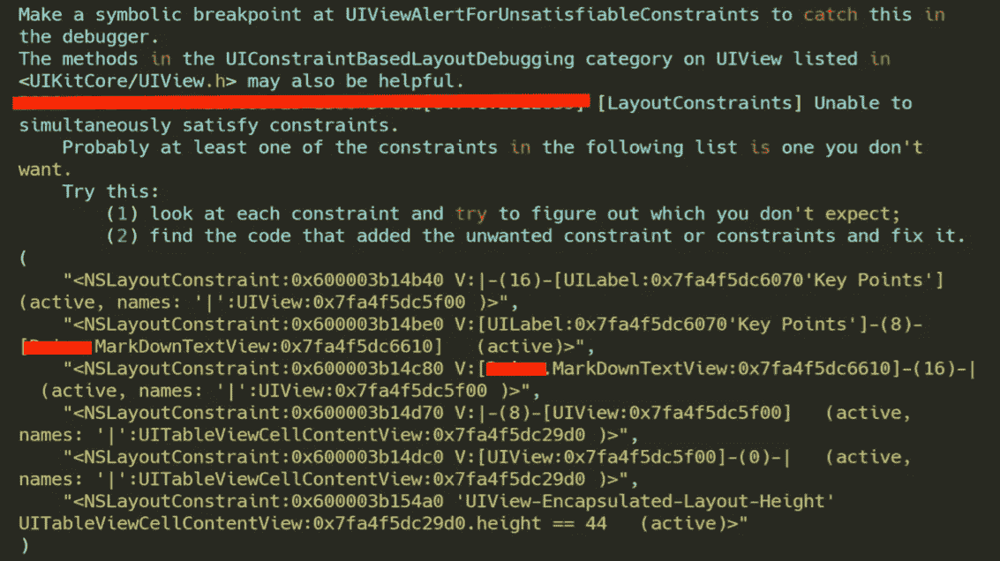

# 如何使用 LLDB 将 UI 调试提升到一个新的水平

> 原文：<https://betterprogramming.pub/how-to-take-ui-debugging-to-the-next-level-with-lldb-aaeaa76eb910>

## 评估语句、查找内存地址等等


作者照片。

如果您还不熟悉的话， [LLDB](https://lldb.llvm.org/) 是 LLVM 中使用的调试器工具。如果你做过 iOS 或 Mac 开发，你会知道它是控制台中的调试工具。

当我刚开始 iOS 开发时，我的技术主管演示了如何 *po* 一个对象。换句话说，就是打印变量*的值。*很长一段时间，这就是我用它的全部目的，也是我认为它能做的全部事情。然而，我最近发现它比我想象的要强大得多。

您是否遇到过约束冲突，无法确定哪个屏幕或 UIView 受到了影响？你曾经想要在运行时调试一个可视化组件的属性，但是你不能吗？你并不孤单。我经常发现自己想要研究视图、层或动画属性的自定义属性，但由于 Xcode 的视图层次调试器的有限功能而无法实现。好吧，如果你想知道你能调试这些，继续读下去。

# 用 LLDB 编写基本表达式

在深入之前，我将快速介绍如何使用 LLDB 在 Swift 中编写表达式。首先，您希望通过使用 Xcode 中的暂停按钮、单击查看调试层次结构或点击断点来暂停代码执行。通过使用`expression`或`e`关键字后跟`--`来编写命令，可以开始编写表达式。由于本教程将使用 Swift，我们将使用可选的`-l`标志将语言设置为 Swift，如下所示:

```
(lldb) expression -l Swift -- print("Hello world")// Or for shorthand abbreviate `expression` to `e`.(lldb) e -l Swift -- print("Hello world")
```

需要注意的是，Foundation 是运行时唯一导入的库，所以如果我们想使用另一个库(例如`UIKit`，我们稍后会用到它)，那么我们需要导入:

```
(lldb) e -l Swift -- import UIKit
```

# 如何找到 UI 组件的内存地址

因为我们使用的是命令行调试器，所以我们必须首先获得我们想要检查的 UI 组件的内存地址。这可能是一个中断的约束，或者是一个已经在控制台中打印了内存地址的视图，如下所示。或者，您可能希望从视图层次结构调试器或手动打印的语句中获得它。



# 在运行时改变和检查用户界面

在 Swift 中，有一个功能叫做`[unsafeBitCast(_:to:)](https://developer.apple.com/documentation/swift/1641250-unsafebitcast)`。当给定内存地址和类类型时，它可以返回对象。

现在我们有了对对象的引用，我们可以从对象中进行以下任何基本的读或写操作。请注意，如果您改变了 UI，您必须恢复执行，以便主线程可以进行适当的更改。

我们还可以使用它来查看和修改约束，以帮助在运行时修复冲突:

或者通过导入应用程序的主要目标与您自己的视图进行交互:

# 摘要

这是一个非常强大的工具，可以让你做任何你通常会做的事情，但是是在运行时。我发现这在与需要大量导航开销的视图控制器一起使用时影响最大(例如，在注册流程的末尾)。通过理解能够改变和验证更改的运行时状态，您可以最小化重新编译和导航回屏幕以验证更改的开销。

希望这有助于让你的 UI 调试更容易！