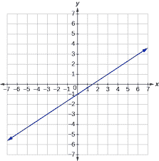
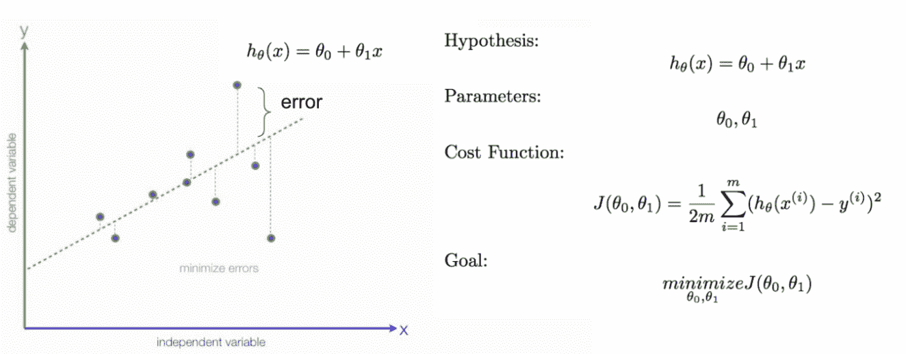
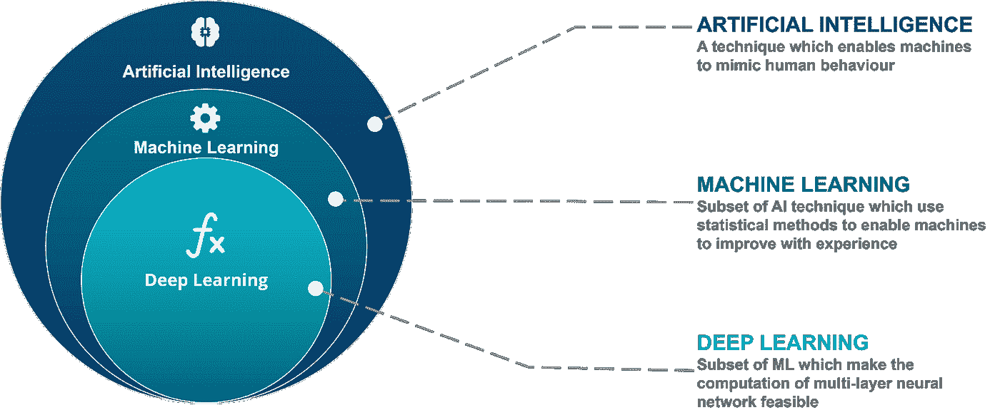
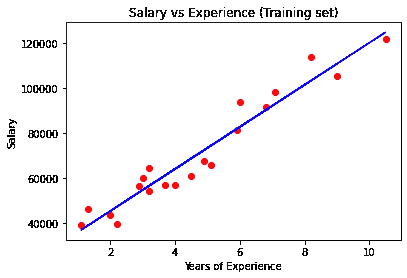

# 如何向中学生教授人工智能和人工智能

> 原文：<https://betterprogramming.pub/how-to-teach-ai-and-ml-to-middle-schoolers-34bf59262ea8>

## *以简单有趣的方式教授中学生人工智能和人工智能的技巧和建议*

大多数中学生认为的 AI 是什么(图片来源——复仇者联盟:奥创时代)

人工智能(AI)在过去几年中已经成为一场革命，探索该领域的开发人员、研究生甚至高中生的数量已经爆炸式增长。这回避了一个基本问题:什么时候是开始学习人工智能的正确时间？我们假设从小开始教学生人工智能，特别是在中学，是一个完美的开始时间。在今年夏天教授了人工智能/人工智能入门课程后，我们意识到中学生确实能够理解人工智能/人工智能，尽管有一些注意事项。

让我们建立一些大多数中学生知道的基线。就编码而言，大多数六到八年级的学生理解编码的基础，无论是块编码，像 [Scratch](https://scratch.mit.edu/developers) ，甚至是诸如 Java 这样的实际语言。如果幸运的话，有些同学甚至会 Python。只要学生理解基本的编码概念，如循环和 if 语句，他们就能够学习人工智能的概念，因为在表面水平上学习人工智能不需要深入的编码技能。

就数学而言，大多数学生都知道基本的代数概念，除非他们真的很高级。大多数学生将理解坐标平面，如 x-y 轴和斜率，这无疑是一个良好的开端。然而，这意味着教授概念背后的真正理论是非常困难的，例如损失函数和梯度下降。相反，最好不要太深入地解释总体主题，并展示如何在现实世界中实现这些主题。

大多数中学生的一般数学水平(图片来源:作者 via [Desmos](https://www.desmos.com/calculator)

# 教学哲学

保持年轻学生参与的最有效的方法是使用积极的强化和鼓励来帮助他们感觉他们正在理解这些概念。

要向中学生介绍人工智能，必须从极端基础开始。这首先要消除这样一种看法，即人工智能让可以完全独立操作的机器人感到恐惧。从我们的经验来看，大多数学生会立刻想到《复仇者联盟:奥创时代》中的人工智能。我们需要消除他们的理论，首先要澄清人工智能到底是什么，并给出精确、准确的例子。我们展示了人工智能是如何围绕在他们身边的，从亚马逊 Alexa 到网飞推荐，这帮助他们更好地理解人工智能到底是什么。

大多数中学生认为的 AI 是什么(图片来源——复仇者联盟:奥创时代)

最重要的是，为了让学生保持参与，他们必须理解为什么人工智能对他们的学习很重要。他们应该明白，未来的大多数工作机会都需要人工智能，现在学习这些概念将使他们在高中和大学获得优势。此外，提供一些正在转向使用人工智能的领域的例子，如医学和经济学，将使学生对各种不同的兴趣感兴趣。

人工智能是在机器中模拟人类智能，这些机器被编程为像人类一样思考和行动。

为了帮助中学生理解 AI/ML，应该非常简单直观地定义主题。我们解释说，机器将从自己的结果中学习，并运行数千次测试来改进。中学生的一个很好的例子如下:一个人工智能是一个小婴儿，一遍又一遍地向他展示正方形和三角形，直到他能够在正方形和三角形之间做出判断。这解释了为模型提供数据和标签的基本概念，以便以一种普遍可理解的方式进行学习。

这是你**不该**教的(图片来源: [KDnuggets](https://www.kdnuggets.com/)

与其试图区分 AI 和 ML，不如直接说它们非常相似，本质上是同一件事要容易得多。试图区分这两者只会让已经困惑的中学生更加困惑。这类似于教小学生 0 是最小的数，但后来教他们负数的存在。

# 深度学习与标准 ML

老实说，教授深度学习并不是最有效的举措。从标准机器学习算法的基础开始，如线性和逻辑回归，将帮助学生轻松进入概念，而不是不知所措。如果一个学生学过代数，或者甚至理解基本的线性方程(y = mx + b ),他们将能够理解线性回归是如何工作的。再次强调，正向强化让学生保持参与。

如果教授 DL 和神经网络是必要的，尽可能简单。解释一下，神经网络简单来说就是一个函数，就像(x)一样，其中，是网络，x 是数据。该函数的目标是使函数的输出尽可能接近数据的真实标签。在训练过程中，等式不断改进，以始终获得正确的输出。这使得深度学习看起来像一个基本的代数函数，使其对于中学生来说是可以理解的。

最简单的解释 AI vs ML vs DL(图片来源: [Edureka](https://www.edureka.co/) )

# 项目和问题

同样，由于目标群体非常年轻，首要目标应该是让他们保持参与和兴趣。毫无疑问，项目是实现这一目标的最佳方式。对这些项目进行编码所获得的真实世界的经验对于帮助他们理解所有部分是如何组合在一起的是至关重要的。

这也意味着项目应该尽可能简单，并且普遍有趣。例如，一个乳腺癌分类项目被证明非常受欢迎；许多学生觉得他们在“治愈癌症”，这是一个令人难以置信的动力。

一般来说，代码显然会涉及到比实际模型更多的东西——例如，语法和数据预处理。请记住，这里的目标是关注实际的模型，这意味着许多其他部分与教授学生有关 ML 的目标无关。最重要的是，教师不应该陷入忘记项目中实际涉及的 ML 的陷阱。

一个简单有效的项目开始(图片来源:作者笔记本)

# 最后的想法

对于中学生来说，真正重要的是帮助他们培养兴趣。当真正归结到它的时候，只要有足够的热情，任何人都可以在以后的教育中学习高层次的概念。

从我们的经验中，我们发现向中学生教授人工智能/人工智能是完全可行的，从而尽早播下灵感的种子。然而，考虑到他们仍在发展的数学和编码技能，避免精疲力尽是非常重要的。当向中学生教授人工智能时，目标不应该是让他们建立公司或进行研究。虽然看起来他们在短期内学到了更多，但这种心态会长期阻碍他们。目标是激发下一代对人工智能领域的兴趣，以及它是多么有趣和重要。用压倒性的复杂性吓跑学生阻碍了任何感兴趣的机会。

未来更多的 AI 工程师绝对是关键。为了吸引更多的学生进入这个领域，确保他们对这些严格的概念有一个坚实的基础是绝对重要的。对于中学生来说，真正重要的是帮助他们培养兴趣。当真正归结到它的时候，只要有足够的热情，任何人都可以在以后的教育中学习高层次的概念。不管怎样，对于最有抱负的学生来说，在早期培养兴趣和理解无疑会大有帮助。

我们的 GitHub 课程组织可以在这里找到:https://github.com/[SiP-AI-ML](https://github.com/Intro-Course-AI-ML/LessonMaterials)

我们的课程资料可以在这里找到:【https://github.com/SiP-AI-ML/LessonMaterials 

*作者 Ayaan Haque 和 Viraaj Reddi*