# 如何在 Google 的云平台上与 Jenkins 和 Slack 进行平台化

> 原文：<https://betterprogramming.pub/how-to-terraform-with-jenkins-and-slack-on-googles-cloud-platform-56c5e8b3aeeb>

## 哈希公司地形图图解指南


埃里克·穆尔在 [Unsplash](https://unsplash.com/s/photos/infrastructure?utm_source=unsplash&utm_medium=referral&utm_content=creditCopyText) 上拍摄的照片

[Terraform](https://www.terraform.io/) 是哈希公司提供的最流行的基础设施代码(IAC)工具。随着云和自助式基础设施的出现，一个名为*基础设施的开创性概念应运而生。*

原因很简单。在 IaC 之前，团队通常手动构建和配置基础架构。慢慢地，基础设施的规模和复杂性逐渐增加，导致了不一致性，这导致了多种问题，如成本、可伸缩性和可用性。

手动构建的基础设施需要手动维护。如果您需要再次创建一个类似的基础设施，比如为了可伸缩性和可用性，您将需要一个专家团队来完成这项工作。

对于大型组织来说，这并不简单，因为他们的基础架构非常复杂，而且在管理基础架构的过程中涉及到许多团队。迁移项目耗时数月，因为没有基础架构和配置的单一真实来源。

人们过去依赖于大量的文件，这些文件通常不能反映事物的真实状态。由于这个原因，扩展基础设施是一个问题。

IaC 解决了所有这些问题，因为现在您已经将所有的基础设施定义为代码，这些代码可以进入版本控制系统，比如 Git。然后，您可以通过 pull 请求审查代码，并且可以维护单一的事实来源，因为您从代码中构建基础设施。

Terraform 是一个声明式 IaC 工具，这意味着您只需声明您需要的配置，Terraform 将确保基础架构保持所需的状态。

这为组织提供了定义可重用模块以及通过模板应用策略和最佳实践的能力。这样做的好处是多方面的。

Terraform 使开发变得更加容易，因为开发人员不再需要学习另一种编程语言或编写复杂的代码来旋转基础设施。

它促进了重用，没有太多基础设施经验的开发人员可以使用基础设施专家开发的模块，只需将变量传递到模块中。

因此，Terraform 加快了整个基础设施供应流程，确保了定义过程的一致性，在开发人员将代码签入 VCS 并维护历史记录时，带来了更多的责任。

如果您希望专家检查基础结构代码并确保其符合组织策略(如预算和安全性)，也可以创建审批工作流。

您可以做一些聪明的事情，比如在 GitOps 中挂钩和基于角色的访问控制，以确保人们只拥有他们需要的访问权限。

对于采用更有利于开发人员的方法和工作方式的组织来说，这是一个极好的促进因素。这提高了团队的整体效率，因为现在团队可以自己决定他们需要什么样的基础设施，编码它，透明地部署它，并根据他们的学习和反馈对它进行更改。

您不再需要过度供应基础设施，因为您总是可以在以后进行受控的更改，因此，它是组织内敏捷软件开发的优秀推动者。

# 这是如何工作的？

Hashicorp 提出了以下管理基础设施的模型。

*   基础设施操作员负责创建可重用的模块，并将它们存储在模块注册中心。
*   策略所有者负责编写代码形式的哨兵策略，确保 Terraform 配置符合安全、预算等组织指导原则。
*   然后，应用程序开发人员重用模块注册中心的模块来选择他们需要的东西，并根据他们的需求通过变量对它们进行定制。

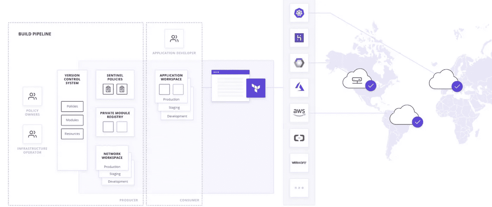

图片来自[哈希公司](https://www.datocms-assets.com/2885/1543882273-tfe-multi-cloud-diagram.jpg)

# 使用 Terraform 的 CI/CD 工作流

借助 Terraform，您可以为基础设施运行持续集成、持续交付的工作流程。下面是一个典型的工作流程:

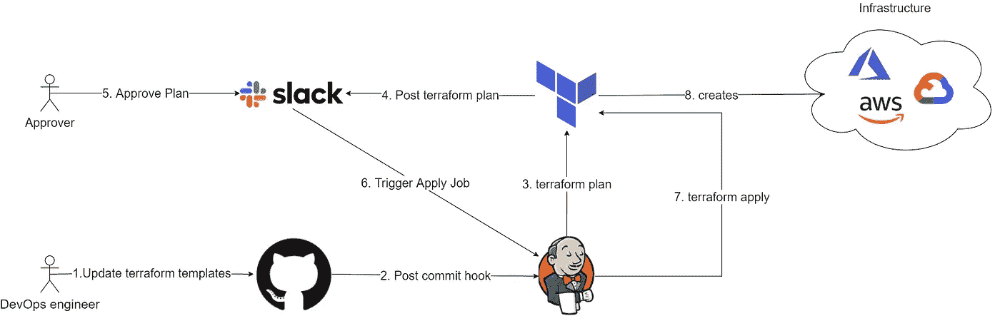

审批工作流

1.  DevOps 工程师编写基础设施代码并签入 GitHub 等 VCS 存储库。
2.  然后，VCS 存储库触发一个提交后挂钩到 CI/CD 工具，比如 [Jenkins](https://jenkins.io/) 。
3.  詹金斯然后运行一个地形计划。该计划详细说明了如果应用 IaC，it 将创建、修改和删除哪些基础架构组件。
4.  然后，Jenkins 将 Terraform 计划发布到 Slack，这样，如果该计划符合所有组织政策并实现了预期目标，批准人就可以审阅并批准该计划。
5.  然后，审批人批准了时差计划，时差触发了 Jenkins 的“应用”任务。
6.  然后，Jenkins 运行“Terraform apply”将更改应用到基础架构。

# 配置时差

您需要配置 Slack 来接收来自 Jenkins 的计划和通知。

在您的 Slack 工作区中，创建一个名为`terraform-approval`的新通道。

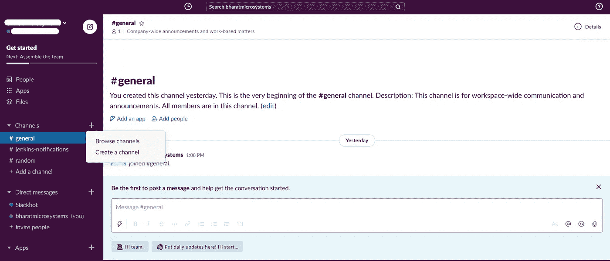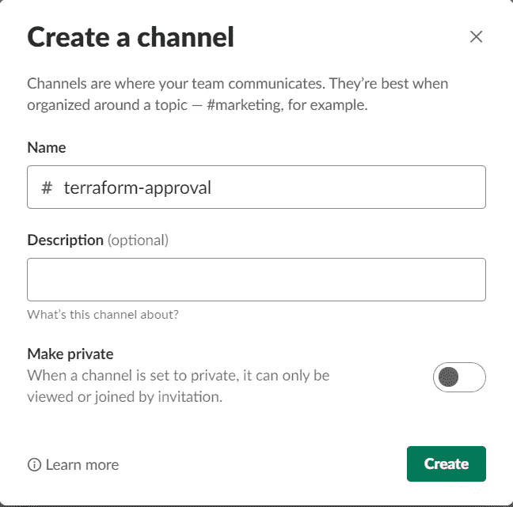

## 在 Slack 上安装 Jenkins CI 应用程序

转到`[your-workspace].slack.com/apps`并搜索 Jenkins CI 应用程序。


点击*添加到松弛时间*。

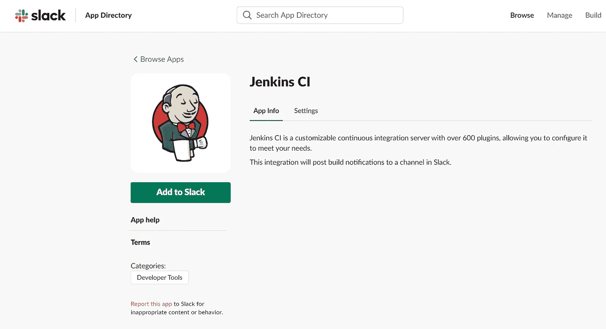

选择`terraform-approval`渠道和“添加 Jenkins CI 集成”

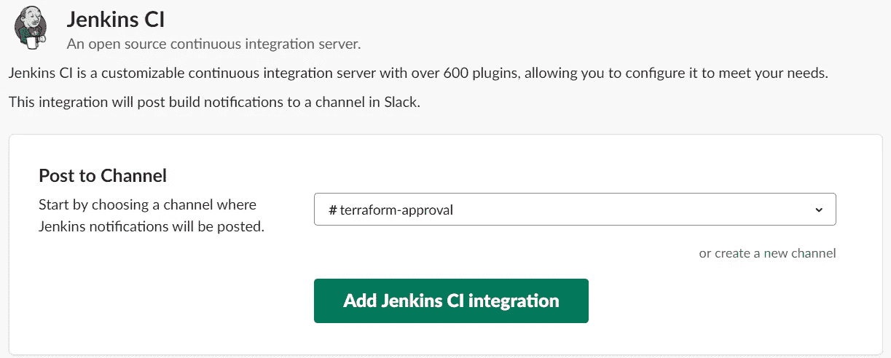

在下一页，你会找到一个`Integration Token Credential Id`，放在手边。

## 在 Slack 上创建一个文件上传应用

您现在需要创建一个自定义应用程序，以便 Jenkins 可以使用该应用程序将计划文件上传到 Slack。

转到`api.slack.com`并点击*开始建造*。

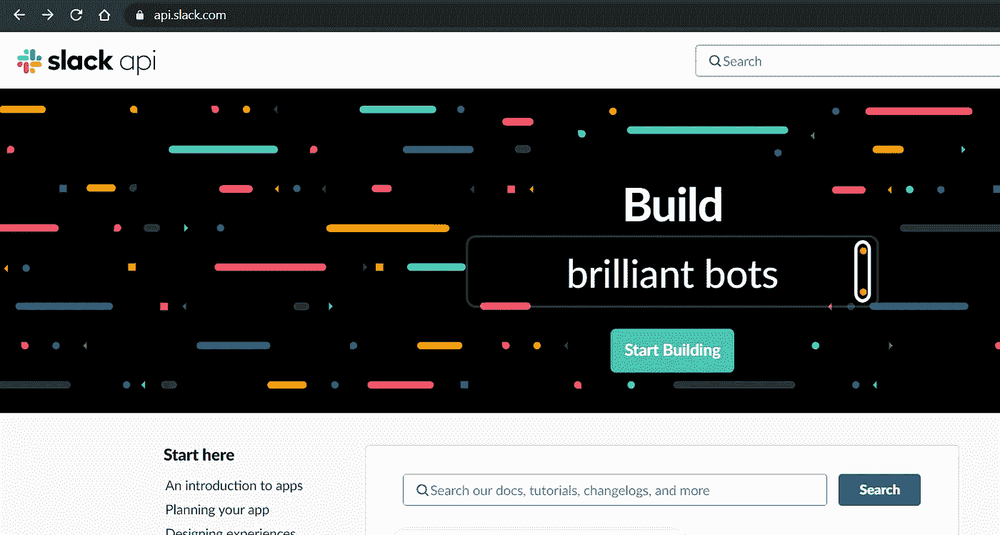

转到 *OAuth &权限*。


向下滚动并向应用程序添加一个`file:write` bot 令牌 OAuth 范围。

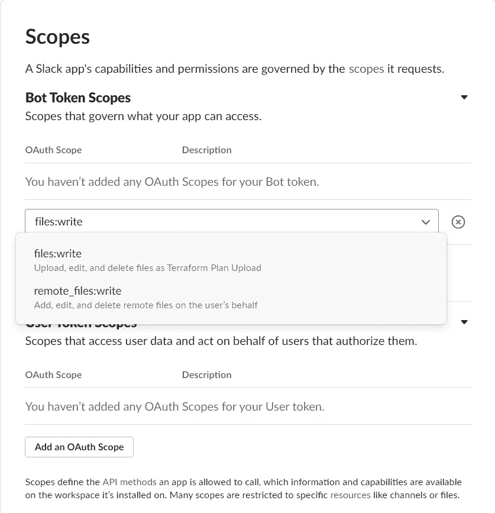

点击*将应用程序安装到工作区*并允许应用程序在频道和对话中执行操作。

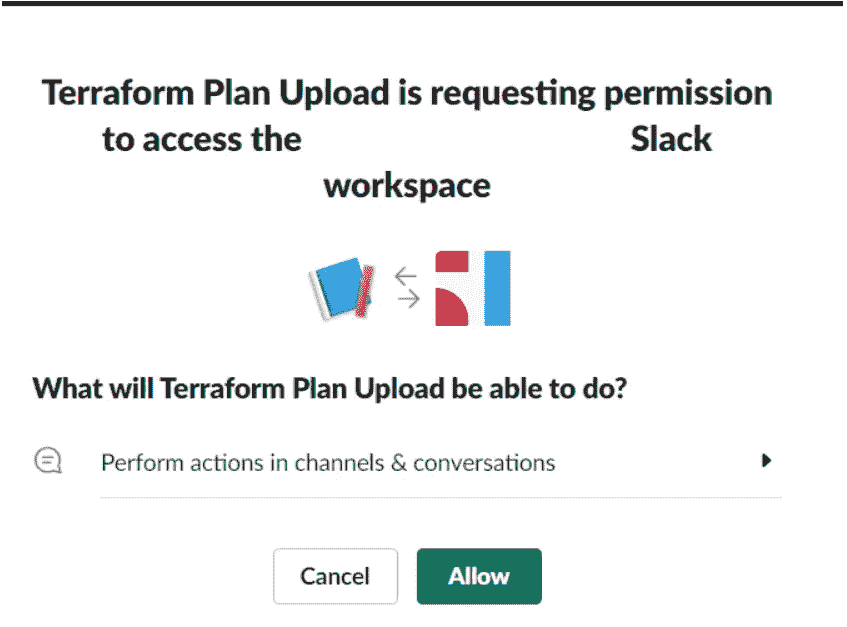

将下一页生成的`Bot User OAuth Access Token`复制下来，放在手边。

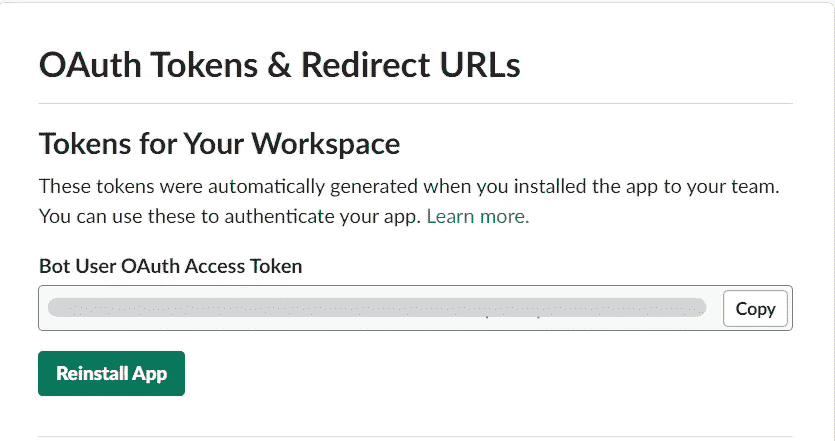

转到您的 Slack 频道，将`terraform_plan_upload`用户添加到您的频道。

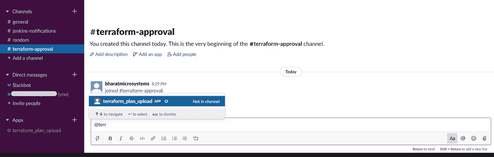

点击“邀请进入频道”

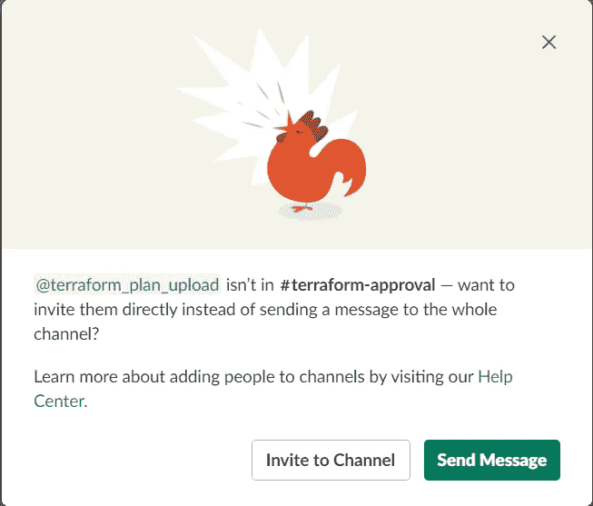

# 设置您的云环境

您现在需要配置云环境，以允许 Terraform 远程管理基础设施。在这个故事中，我以谷歌云平台为例。您需要创建一个服务帐户。

进入 *IAM 和管理*->-*服务账户*。

创建一个名为 *Terraform* 的服务帐户。

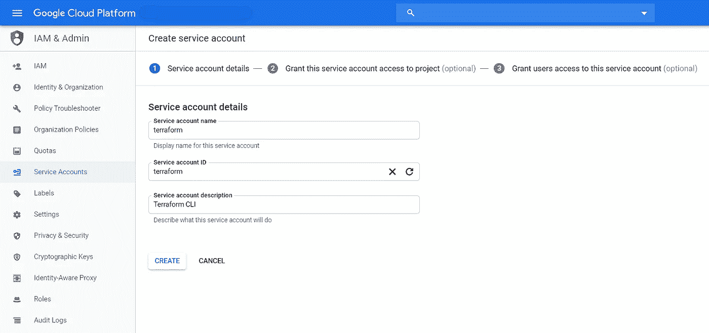

向服务帐户授予项目编辑器角色，以便它可以旋转资源。

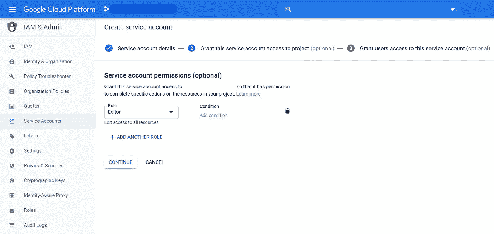

授予服务帐户“服务帐户用户”访问权限，并为 Terraform 生成一个 JSON 密钥，以作为服务帐户使用 Google Cloud APIs 进行身份验证。

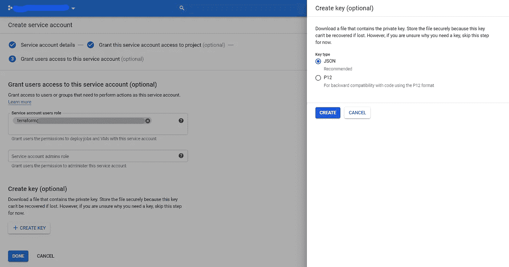

# 安装 Terraform

Terraform CLI 是一个二进制文件，易于设置和使用。请访问 Terraform 的网站，根据您的环境下载合适的软件包。

解压缩软件包，然后设置指向 Terraform 二进制文件的路径，或者将 Terraform 二进制文件移动到您的 bin 目录。

# 旋转詹金斯

为 Terraform 运行以下命令来启动 Jenkins。

```
git clone [https://github.com/bharatmicrosystems/terraform-ci-cd.git](https://github.com/bharatmicrosystems/terraform-ci-cd.git)
cd terraform-ci-cd/
cp terraform.tfvars.example terraform.tfvars
```

修改`terraform.tfvars`文件，将变量替换为`project`、`region`、`instance_zone`、`subnet_name`和`source_ranges`的相关值。

将下载的 JSON 密钥复制到`terraform-ci-cd/`中，并将其重命名为`credentials.json`。

使用 Terraform 在 Google Cloud 上旋转 Jenkins。

```
terraform init
terraform plan
terraform apply
```

转到 *Google 计算引擎*部分，您会看到 Terraform 已经创建了一个名为`jenkins-master`的 GCE 实例。

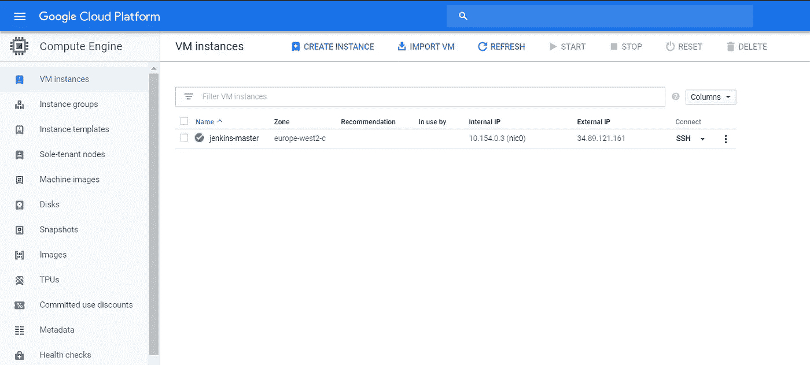

# 陷害詹金斯

在`[http://External_IP:8080](http://External_IP:8080)`访问詹金斯。

SSH 到您的`jenkins-master`实例并打印`initialAdminPassword`。

```
sudo cat /var/lib/jenkins/secrets/initialAdminPassword
```

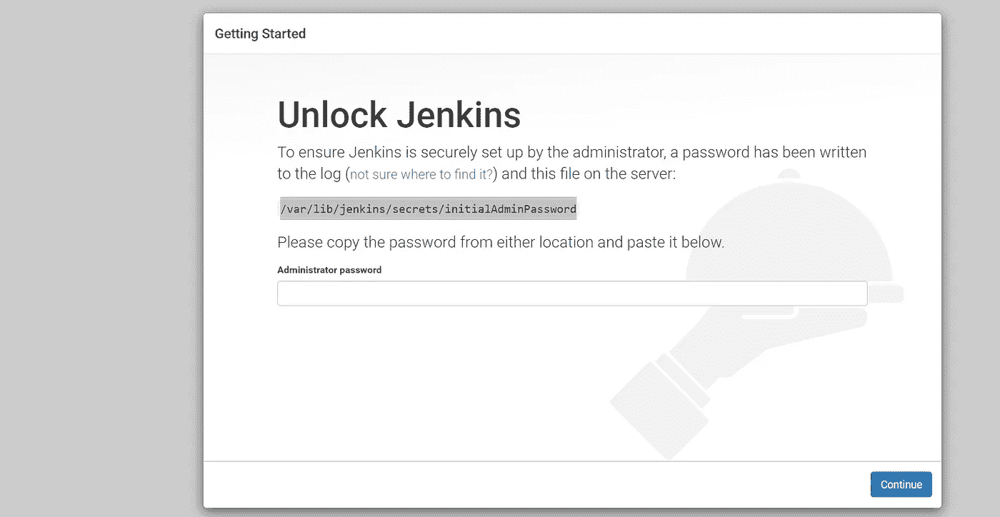

安装建议的插件。

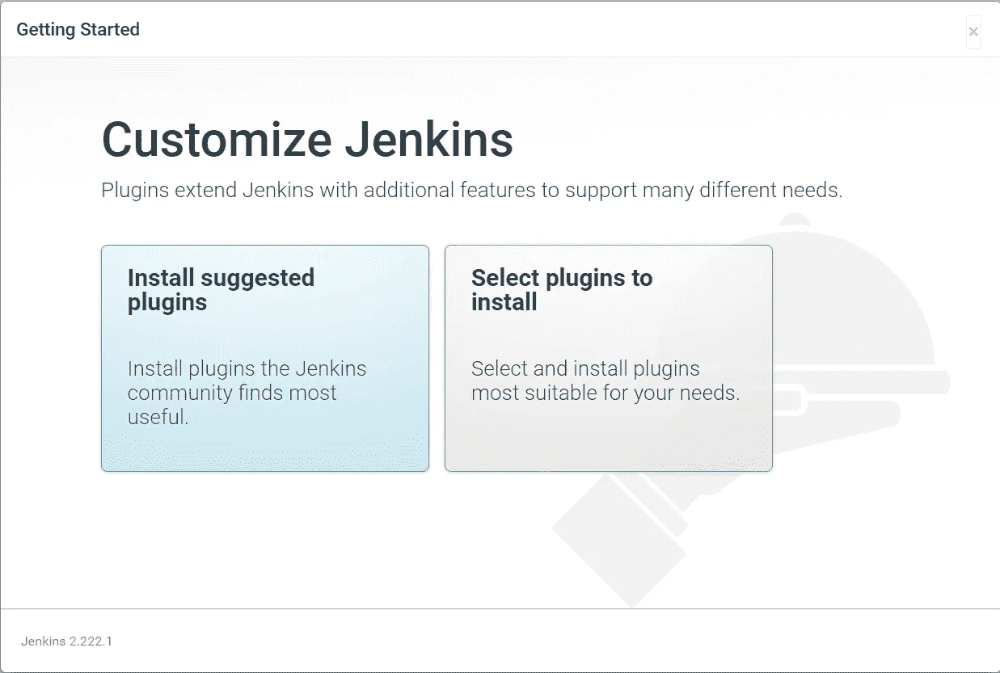

创建一个管理员用户帐户，然后点击“保存并继续”

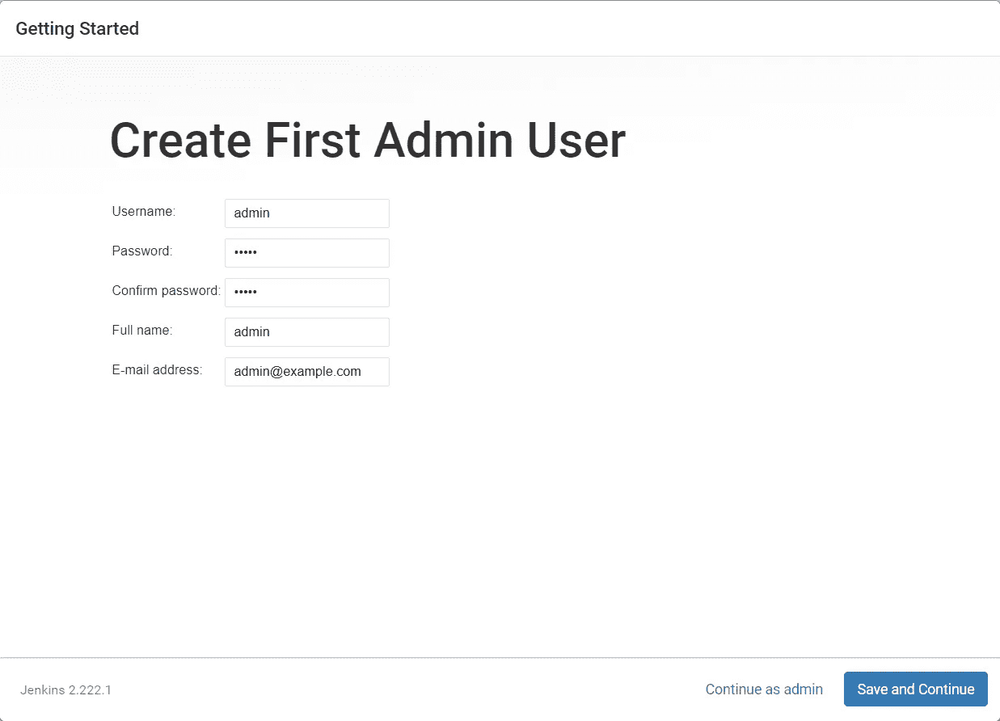

## 安装所需的插件

您现在需要安装 Slack 上传和 Slack 通知插件，以便 Jenkins 可以在您运行计划时上传计划并向 Slack 发送通知。

去插件管理器(`[your_jenkins_url]/pluginManager/available`)安装松弛上传和松弛通知插件。

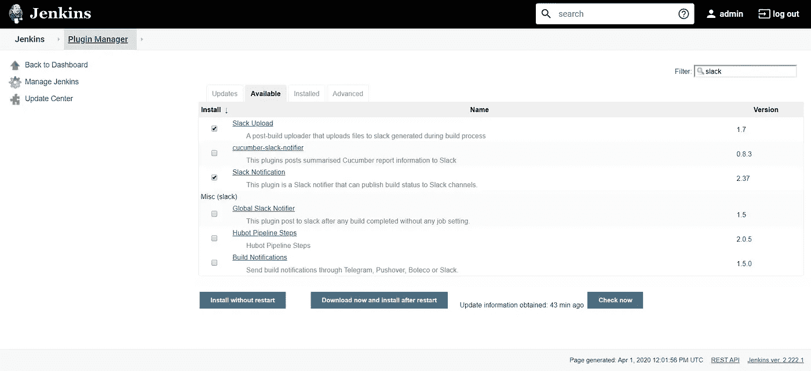

安装“构建授权令牌根”插件，以允许远程触发构建。

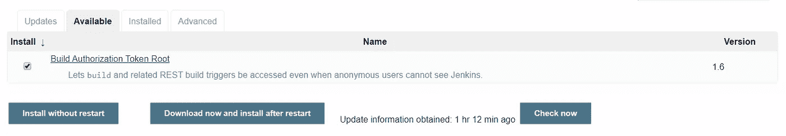

安装插件后，配置 Jenkins Slack 通知插件设置。

进入*管理詹金斯* - > *配置系统* - > *松弛通知*。

创建一个秘密文本凭证，并将您从 Slack 上的 Jenkins CI 应用程序获得的`Integration Token Credential Id`粘贴到 secret 字段。

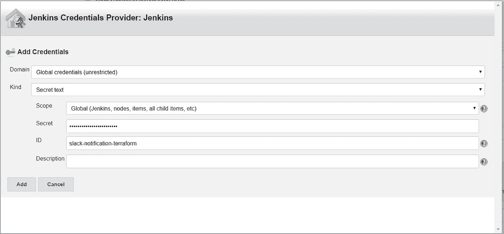

添加您的工作空间和通道名称，测试连接，然后保存。

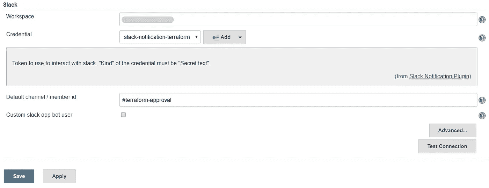

## 在詹金斯安装 Terraform

由于詹金斯将运行 Terraform，我们需要将它安装在那里。

```
su  — jenkins
wget [https://releases.hashicorp.com/terraform/0.12.24/terraform_0.12.24_linux_amd64.zip](https://releases.hashicorp.com/terraform/0.12.24/terraform_0.12.24_linux_amd64.zip)
yum install -y unzip
unzip terraform_0.12.24_linux_amd64.zip 
mv terraform /usr/bin/
chmod +x /usr/bin/terraform
```

## 设置地形环境

有一些东西是不能在 VCS 办理登机手续的，比如证件和机密、项目细节等。为此，Terraform 提供了一种使用`*.auto.tfvars`文件集中存储的方式。

将`credentails.json`文件复制到`/var/lib/jenkins/`。

```
$ vim terraform.auto.tfvars
project = "<your_project_name>"
region = "<your_default_region>"
credentials = "/var/lib/jenkins/credentials.json"
```

## 在 Jenkins 上设置 Terraform 作业

使用以下配置创建一个名为`terraform-gce-instance`的自由作业:

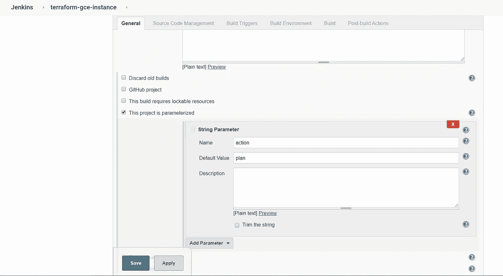

选择 *Git* 作为*源代码管理*。你可以把这个 repo 作为源代码仓库的例子。

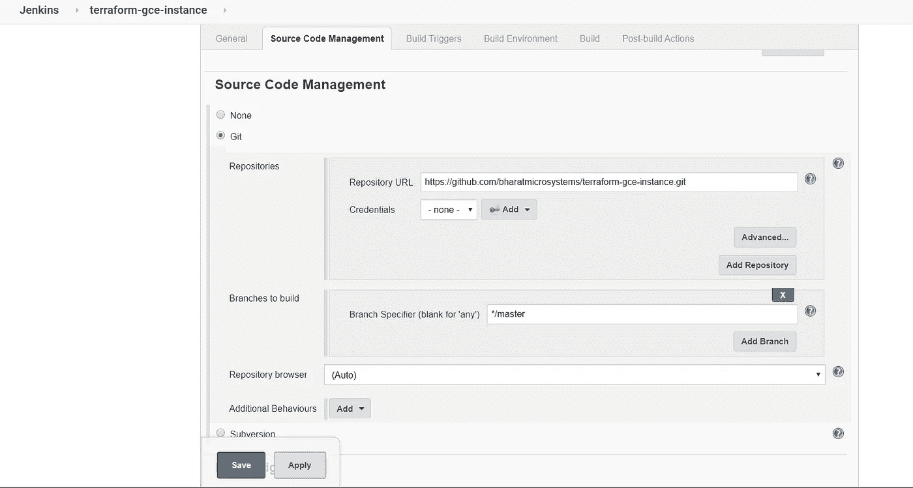

生成一个随机身份验证令牌，您将在下面的配置中使用它来触发构建添加。使用[这个链接](https://www.random.org/strings/)生成一个。

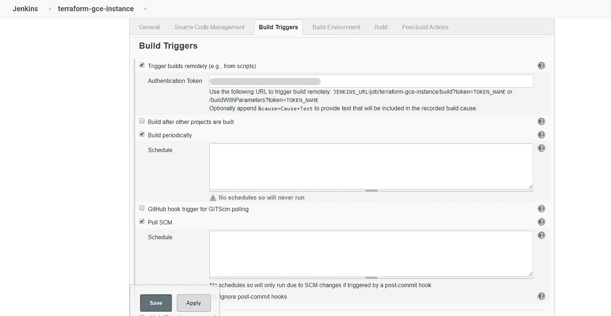

添加一个`Execute Shell`构建步骤，并添加以下脚本:

```
cp -a /var/lib/jenkins/terraform.auto.tfvars .
terraform init
if [ $action = ‘plan’ ]; then
 terraform plan > plan.out
elif [ $action = ‘apply’ ]; then
 terraform apply — auto-approve
elif [ $action = ‘destroy’ ]; then
 terraform destroy — auto-approve
fi
```

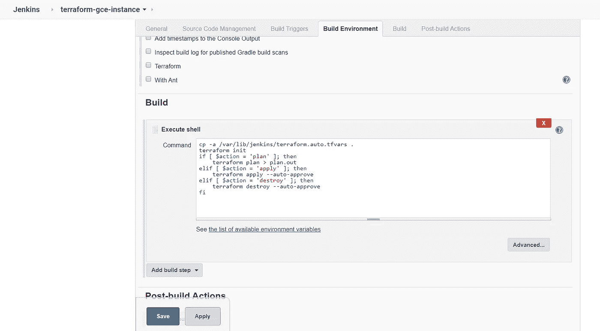

添加后构建步骤`Post files to Slack`和`Slack Notifications`。

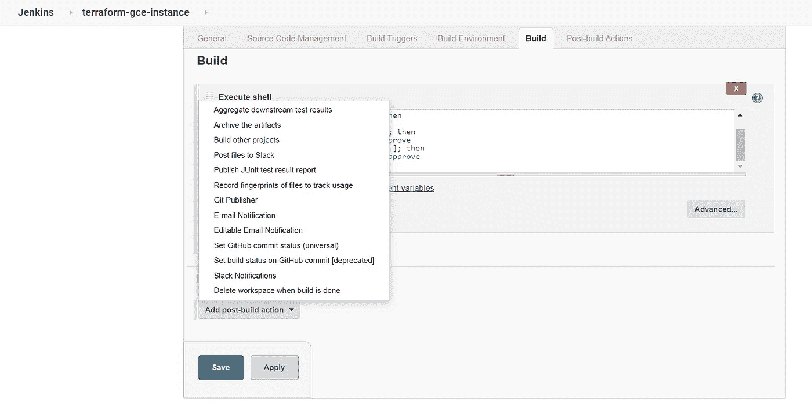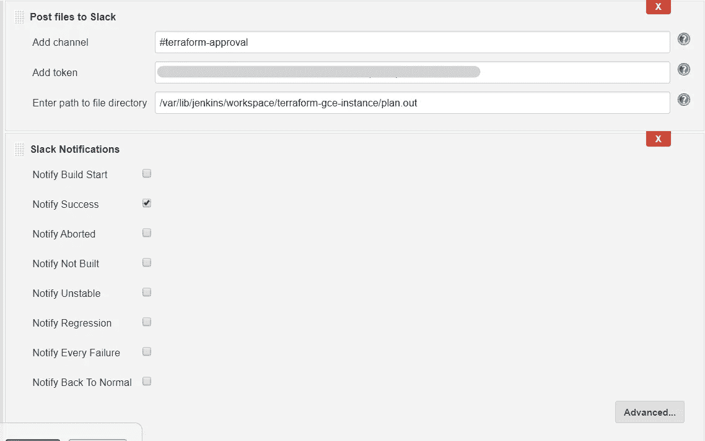

将文件上传应用的`Bot token`复制到*添加令牌*。

点击*高级*并添加自定义消息，并包含审批链接(`[your_jenkins_url]/buildByToken/buildWithParameters?job=$JOB_NAME&token=[YOUR_JENKINS_BUILD_TOKEN]&action=apply`)，点击该链接将触发具有应用操作的作业。

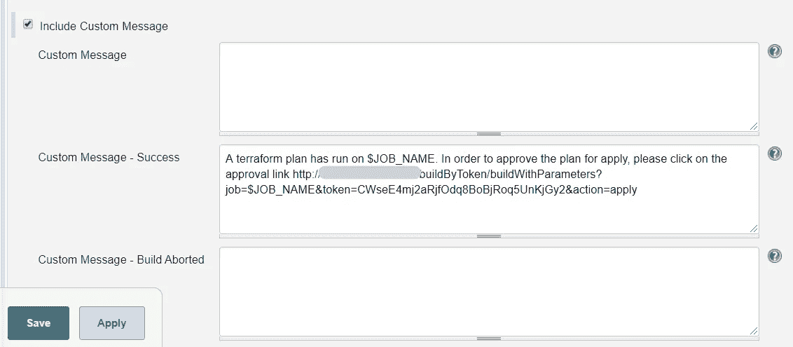

应用并保存。

## 在存储库中设置提交后挂钩

在这个例子中，我将使用 GitHub 向 Jenkins 发送一个提交后钩子。您可以从您的存储库向 Jenkins 使用一个等效的 webhook。

转到`[https://github.com/<your_repo>/settings/hooks](https://github.com/bharatmicrosystems/terraform-ci-cd/settings/hooks)`

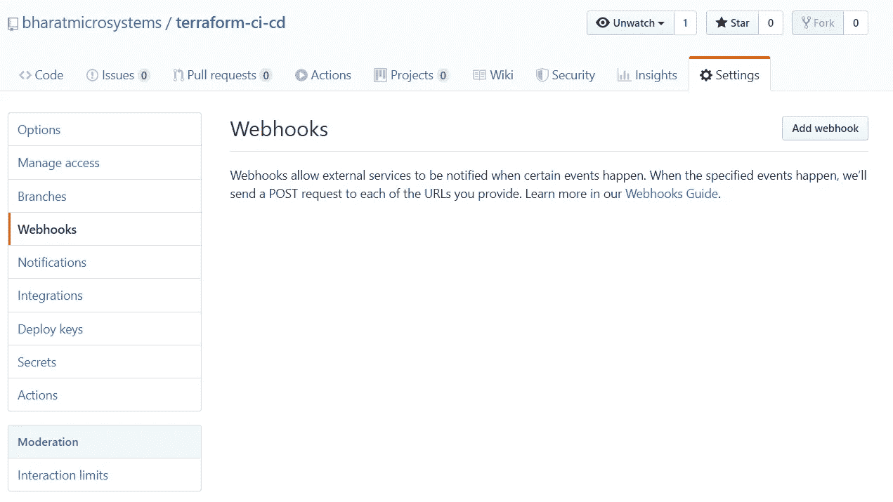

添加 webhook。

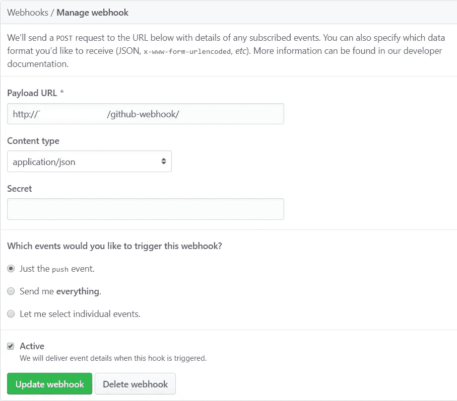

# 测试配置

将配置推送到 GitHub，这应该会触发运行计划的 Jenkins 作业。

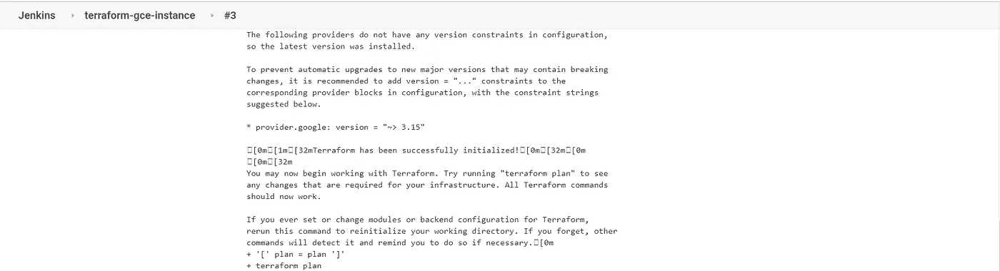

然后，Jenkins 将使用计划的输出和批准链接更新 Slack。

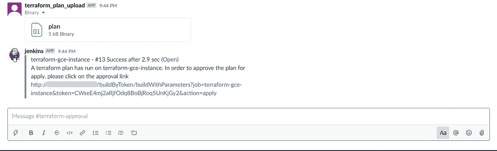

点击链接，看看它是否触发了 Jenkins 与`terraform apply`的工作。

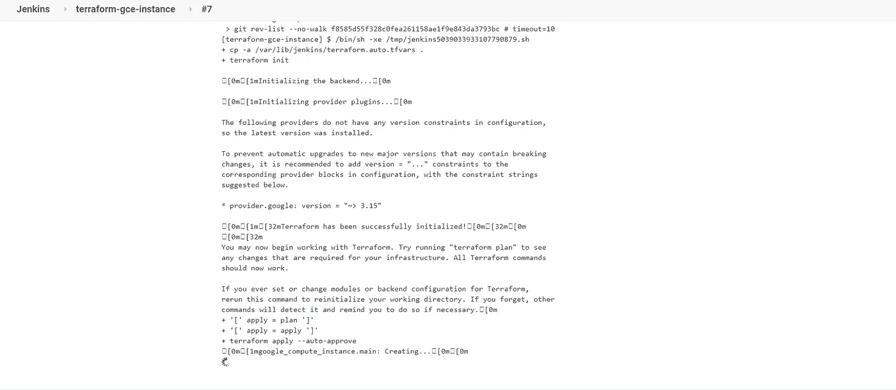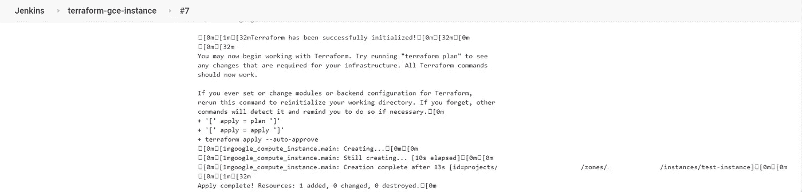

# 验证结果

转到*谷歌云控制台*->-*计算引擎*，您应该会看到一个新实例`test-instance`被创建。

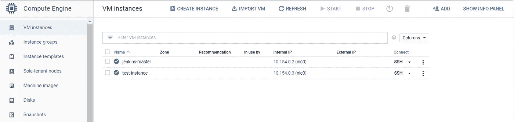

# 结论

感谢您的阅读。我希望你喜欢这篇文章！