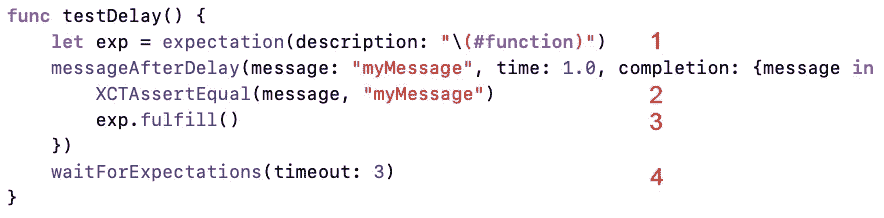

# 如何在 Swift 中使用 expect 测试异步功能

> 原文：<https://betterprogramming.pub/how-to-test-asynchronous-functions-using-expectation-2c9183fd99c9>

## 是的，你也可以等


照片由 [Aron 视觉效果](https://unsplash.com/@aronvisuals?utm_source=unsplash&utm_medium=referral&utm_content=creditCopyText)在 [Unsplash](https://unsplash.com/s/photos/time?utm_source=unsplash&utm_medium=referral&utm_content=creditCopyText) 上拍摄

您的应用程序中可能存在异步代码的原因有很多，想到的第一个原因是网络。

为了保持这篇文章的先决条件，这个例子是一个经过一定时间后的简单等待——但是它将向您展示如何使用 [Swift](https://developer.apple.com/swift/) 和 [Xcode](https://developer.apple.com/xcode/) 工具来充分测试您的代码。

本指南展示了如何在单视图应用中测试异步代码，随后的一节介绍了如何在 Playgrounds 中做同样的事情。别说我什么都不给你！

难度:初级|简单| **普通** |挑战

# 先决条件:

我真的希望你能够在一个基本的水平上运行项目和完成项目(包括 Swift 中的闭包和函数，以及可以从测试中初始化的视图控制器)。)

# 术语

单元测试:软件测试，对软件的单个单元或组件进行测试

一个允许你在 Xcode 中运行单元测试、性能测试和 UITests 的框架

`XCTestCase`:定义测试用例、测试方法和性能测试的类

`XCTestExpectation`:异步测试中的预期结果

# 需要测试的一般代码

我们将测试一个函数，它接受一条消息、时间(双精度)和一个在延迟完成后调用的完成处理程序。

这方面的代码如下所示:

```
func messageAfterDelay(message: String, time: Double, completion: @escaping (String)->()) {
    DispatchQueue.main.asyncAfter(deadline: DispatchTime.now() + time) {
        completion (message)
    }
}
```

然后可以从我们的视图控制器中调用这段代码。在这里，我们只是打印消息:

```
messageAfterDelay(message: "message", time: 2.0, completion: {      
    message in
        print (message)
}
)
```

# 在单一视图项目中测试异步代码

将可测试代码从用户界面代码中分离出来有助于单元测试。

这里需要理解的重要一点是，我们遵循以下测试部分的顺序:

1.  设置一个带描述的`XCTestExpectation`。
2.  `assert`我们期望从封闭内部得到的结果。
3.  `fulfil`期待。
4.  `waitForExpectations`带有合适的超时。

这有点难以理解，因为根据定义，代码是异步的，因此不一定按照我们指定的顺序运行。

让我们用代码来看看。



当然，1。是在其余代码之前完成的，但是`messageAfterDelay`是运行的，我们知道，在这种情况下，它只会在一秒钟后完成。

现在代码到达数字 4。，我将它编码为等待三秒钟(好吧，有点夸张，因为代码实际上只需要一秒多一点就可以运行)。

当我们测试的函数返回时(如前所述，这应该是运行后的一秒钟)，我们可以在 2 秒钟内进行测试。对闭包中返回的消息使用`XCTAssertEqual`。然后我们实现了 3 中的期望。

那我们就完了。

# 在操场测试

有趣的是，你不需要使用操场支撑和`needsIndefiniteExecution`。要在操场上运行测试，我们需要在操场顶部导入`XCTest`。

```
import XCTest
```

和以前一样，我们可以创建要测试的函数:

```
func messageAfterDelay(message: String, time: Double, completion: @escaping (String)->()) {
    DispatchQueue.main.asyncAfter(deadline: DispatchTime.now() + time) {
        completion (message)
   }
}
```

其可以如下所示:

```
class asyncTests: XCTestCase {
    func testDelay() {
        let exp = expectation(description: "\(#function)")
        messageAfterDelay(message: "myMessage", time: 1.0, completion:
        {message in
              XCTAssertEqual(message, "myMessage")
              exp.fulfill()
        })
        waitForExpectations(timeout: 3)
    }
}
```

然后使用以下命令运行它:

```
asyncTests.defaultTestSuite.run()
```

通过突出显示语法，这更容易阅读，所以我将在这里添加一个要点。

当我们在操场上运行时，我们有如下输出。如果您运行相同的代码，您显然会有不同的时间和数据(并且测试运行的时间也可能不同)。

```
Test Suite ‘asyncTests’ started at 2020–04–01 12:18:43.989
Test Case ‘-[__lldb_expr_7.asyncTests testDelay]’ started.
Test Case ‘-[__lldb_expr_7.asyncTests testDelay]’ passed (1.021 seconds).
Test Suite ‘asyncTests’ passed at 2020–04–01 12:18:45.012.
Executed 1 test, with 0 failures (0 unexpected) in 1.021 (1.023) seconds
```

厉害！

# 另类期望

声明期望有两种选择。

当您进行测试时，您可以经历以下步骤:

```
let expect = expectation(description: #function)
expect.fulfill()
waitForExpectations(timeout: 3.0)
```

有一个替代方案可以接受一系列期望:

```
let expectation = XCTestExpectation(description: #function)
expectation.fulfill()
wait(for: [expectation], timeout: 3.0)
```

因此，我们可以接受一系列的期望，而不是单一的期望。

牛逼？

# 结论

无论您是在测试一段代码还是一个项目，您都可能需要测试异步函数。

这篇特别的文章涵盖了测试异步代码。测试网络遵循如上所示的相同模式(您当然应该测试您的网络代码)。

# 回购

这是 GitHub 上的[代码](https://github.com/stevencurtis/testasyncfunctions)，包括游戏场地和单一视图库。

# 扩展你的知识

*   苹果有一个关于测试异步代码的指南。