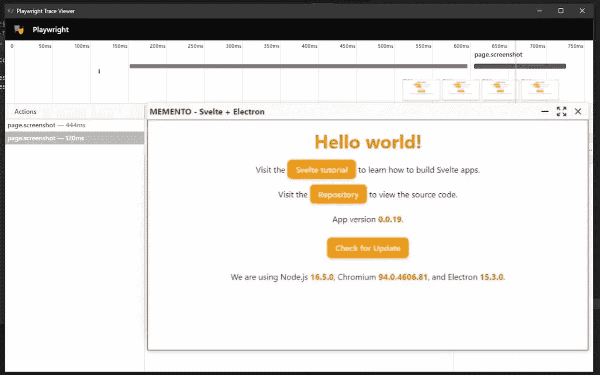

# 如何测试电子应用程序

> 原文：<https://betterprogramming.pub/how-to-test-electron-apps-1e8eb0078d7b>

## 探索剧作家工具



在我的上一篇文章中，我谈到了如何测试苗条的组件和 NPM 包。我的旅程还没有结束。我还得弄清楚如何测试电子应用程序。

# 可用的工具

测试电子应用程序的主要问题是缺乏已建立和更新的框架。几乎所有的指南都推荐使用 [Spectron](https://www.electronjs.org/spectron) 。但是 Spectron 只支持 13 以下的电子版本:[更新的版本不工作](https://github.com/electron-userland/spectron/issues/896)。这对我来说毫无用处。

Spectron 的最佳替代方案是[剧作家](https://playwright.dev/):一个由微软创建和维护的框架，此外还集成了 TypeScript。

# 安装剧作家

我一直在做我的模板，[MEMENTO——苗条，尾翼，电子，打字稿](https://github.com/el3um4s/memento-svelte-electron-typescript)。首先，我将剧作家添加到项目依赖项中:

```
npm i -D playwright @playwright/test
```

因为我只对测试电子感兴趣，所以我没有安装其他浏览器(我不使用`npx playwright install`因为我不需要它们)。但是我给`package.json`添加了一个脚本:

# 创建第一个测试:电子启动

我从创建第一个测试开始。我建立了一个`test`文件夹，里面是`base.test.ts`文件。我想检查的是电子应用程序启动并显示一个窗口。

阅读剧作家文档，我可以找到两个实验类:[电子](https://playwright.dev/docs/api/class-electron/)和[电子应用](https://playwright.dev/docs/api/class-electronapplication)。

我还需要 [Test](https://playwright.dev/docs/api/class-test/) 类，来运行各种测试并指出我期望达到的结果。

我必须编写的测试是异步的:电子打开并不总是即时的，所以我想确保只在实际可能的时候执行各种操作。首先要做的是启动电子:

启动应用程序后，检查是否有可见窗口。我用`[electronApplication.evaluate(pageFunction[, arg])](https://playwright.dev/docs/api/class-electronapplication#electron-application-evaluate)`

这样我最终得到一个包含电子窗口状态的`windowState`对象。我希望窗口是可见的，开发窗口是关闭的，应用程序不会崩溃。翻译成代码:

运行完测试后，我关闭电子:

现在我把它们放在一起，这是我的第一个测试:

要运行它，我使用以下命令:

```
npm run test
```

# 检查窗口的内容

应用程序启动了。接下来检查的是内容。因为我将在同一个页面上依次运行多个测试，所以我使用了`test.describe`

我可以与页面的各种元素进行交互，并检查它们的 HTML 代码。例如，我可以确定页面标题是什么:

或者，我可以检查应用程序的版本号是否确实显示出来:

# 检查图形

除了内容，一个有用的东西是检查电子外观和感觉的能力。为此，我必须截取窗口的截图，并与参考图像进行比较。

每次我运行测试时，剧作家都会将窗口截图(保存在`tests/screenshot/firstWindow.png`中)与参考截图进行比较。引用映像是在测试的第一次开始时创建的，并且是不可变的，除非您明确指出您想要更新它。

我给`package.json`添加了一个脚本来改变参考图像:

# 定制剧作家

我可以通过创建一个`playwright.config.ts`文件来配置剧作家的整体行为。我对定制`toMatchSnapshot`的灵敏度很感兴趣，所以写:

# 记录测试

剧作家的另一个有用的功能是能够记录各种测试并在屏幕上播放它们。它可以用来检查应用程序的行为，最重要的是了解什么不工作。我需要[跟踪](https://playwright.dev/docs/api/class-tracing)类。用`start`和`stop`我可以控制录音:

记录保存在`zip`文件中。为了能够轻松打开它，我给`package.json`添加了一个脚本:

# 结论

显然，这只是对剧作家的概述:我最近开始使用这个工具，充满了选择和可能性。我在网上没有找到太多资料，所以我建议从官方文档开始:

*   [剧作家入门](https://playwright.dev/docs/intro/)
*   [剧作家:第](https://playwright.dev/docs/api/class-page)页
*   编剧:电子
*   剧作家:电子应用
*   [剧作家:视觉对比](https://playwright.dev/docs/test-snapshots/)

我发现这些存储库很有用:

*   [cawa-93/vite-electron-builder](https://github.com/cawa-93/vite-electron-builder/blob/7d2df55fd8a0b3a803963d62558f719c9034ba2a/tests/app.spec.js)
*   [微软/剧作家—测试/电子](https://github.com/microsoft/playwright/tree/master/tests/electron)
*   [太空电视/电子-剧作家-例子](https://github.com/spaceagetv/electron-playwright-example)

当然，还有我的模板存储库:

[](https://github.com/el3um4s/memento-svelte-electron-typescript) [## GitHub-El 3um 4s/memento-svelte-electronic-typescript:使用 Svelte 创建桌面应用程序的模板…

### 模板创建一个桌面应用程序与苗条，TailwindCSS，电子和打字稿(与电子更新…

github.com](https://github.com/el3um4s/memento-svelte-electron-typescript) 

感谢阅读！敬请关注更多内容。

***不要错过我的下一篇文章—报名参加我的*** [***中邮箱列表***](https://medium.com/subscribe/@el3um4s)

[](https://el3um4s.medium.com/membership) [## 通过我的推荐链接加入 Medium—Samuele

### 阅读萨缪尔的每一个故事(以及媒体上成千上万的其他作家)。不是中等会员？在这里加入一块…

el3um4s.medium.com](https://el3um4s.medium.com/membership) 

*原载于【https://blog.stranianelli.com】[](https://blog.stranianelli.com/how-to-test-electronjs-app-english/)*