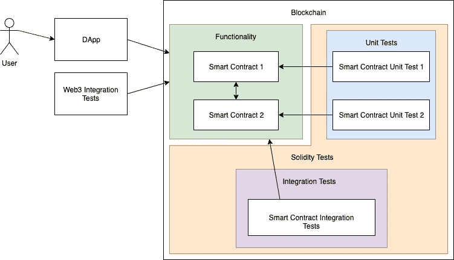

# 如何测试以太坊智能合约

> 原文：<https://betterprogramming.pub/how-to-test-ethereum-smart-contracts-35abc8fa199d>

## 用 Solidity 和 JavaScript 测试你的智能合约

由 [WorldSpectrum](https://pixabay.com/users/WorldSpectrum-7691421/?utm_source=link-attribution&utm_medium=referral&utm_campaign=image&utm_content=3412307) 发自 [Pixabay](https://pixabay.com/?utm_source=link-attribution&utm_medium=referral&utm_campaign=image&utm_content=3412307)

*先决条件:对区块链、以太坊和 Javascript 有基本了解。*

*完整的工作项目代码可以在*[*Github*](https://github.com/alexroan/truffle-tests-tutorial)*上找到。*

# 软件测试的重要性

如果你想让代码按照预期的方式工作，软件测试是最重要的。

软件测试一般有两种类型:*单元测试*和*集成测试*。

*   **单元测试**单独关注每个功能。
*   集成测试关注于确保代码的多个部分如预期的那样一起工作。

区块链软件也不例外。有人可能会说，由于[不变性](https://en.wikipedia.org/wiki/Immutable_object)，区块链应用需要更加重视测试。

# 区块链测试

Truffle suite 为我们提供了两种测试可靠性智能合约的方法:可靠性测试和 JavaScript 测试。问题是，我们应该使用哪一个？

答案是*都有。*

图 1:测试结构图

## 坚固性测试

在 Solidity 中编写测试让我们有能力运行区块链层测试。它们允许测试调用合同和函数，就像它们自己在区块链上一样。为了测试智能合约的内部行为，我们可以:

*   编写**单元测试**到**检查函数返回值和状态变量值。**
*   编写**集成测试**来测试契约之间的交互。这些确保了继承和依赖注入等机制按预期运行。

## JavaScript 测试

我们还需要确保智能合约表现出正确的外部行为。为了从区块链外部测试智能合约，我们使用 Web3js，就像我们的 DApp 一样。当调用智能合约时，我们需要确信我们的 DApp 前端将正常工作。这些属于集成测试。

# 示例项目

> [完整的工作项目代码可以在 Github](https://github.com/alexroan/truffle-tests-tutorial) 上找到

我们有两个智能合约:`Background`和`EntryPoint`。

`Background`是我们 DApp 前端不与之交互的内部合同。`EntryPoint`是专为我们的 DApp 设计的合同。它在代码中引用了`Background`。

## 智能合同

图 2:背景. sol

上面，我们看到了我们的`Background`合同。它公开了三个函数:`storeValue(uint)`、`getValue(uint)`和`getNumberOfValues()`。所有这些函数都有简单的指令，所以很容易进行单元测试。

图 3:入口点. sol

这是我们的合同。我们的`Background`契约的一个地址被注入到构造函数中，并用作状态变量，名为`backgroundAddress`。`EntryPoint`公开了三个函数:`getBackgroundAddress()`、`storeTwoValues(uint, uint)`和`getNumberOfValues()`。

`storeTwoValues(uint, uint)`调用了`Background`契约中的一个函数两次，所以孤立地测试这个函数是很困难的。`getNumberOfValues()`也是如此。这些是集成测试的好例子。

## 固态

在 Solidity 中，我们将为我们的智能合约编写单元测试和集成测试。让我们从单元测试开始，因为它们是两者中比较简单的。

这是我们的第一个单元测试:`TestBackground`:

图 4:测试背景

它测试我们的`Background` 合同，以确保它:

*   在其`values`数组中存储一个新值。
*   按索引返回值。
*   在其`values`数组中存储多个值。
*   返回其`values`数组的大小。

这是`TestEntryPoint`，对于我们的`EntryPoint`合同，有一个名为`testItHasCorrectBackground()`的单元测试:

图 5: TestEntryPoint.sol

这个函数测试依赖注入。如前所述，我们的`EntryPoint`契约中的其他功能需要与`Background`交互，所以我们不能孤立地测试它们。

这些功能在我们的集成测试中进行了测试:

图 6:坚固性集成测试

我们可以看到，`TestIntegrationEntryPoint`使用了第 43 行定义的名为`BackgroundTest`的`Background`的扩展，作为我们的模拟契约。这使得我们的测试能够检查`EntryPoint`是否在它引用的`backgroundAddress`契约中调用了正确的函数。

## Javascript 测试文件

在 JavaScript 中，我们编写了一个**集成测试**来确保契约按照我们的预期运行，这样我们就可以构建一个使用它们的 DApp。

下面是我们的 JavaScript 测试，`entryPoint.test.js`:

图 7: entryPoint.test.js

使用我们的`EntryPoint`契约中可用的函数，JavaScript 测试通过创建针对`storeTwoValues(uint, uint)`函数的事务(第 15 行)来确保来自区块链外部的值可以被发送到智能契约。通过在测试的第 12 行和第 16 行调用`getNumberOfValues()`来检索存储在区块链上的值的数量，确保它们被存储。

# 结论

在测试智能合约时，越多越好。当确保所有可能的执行路径都返回预期结果时，应该不遗余力。对单元测试和集成测试使用区块链级别的可靠性测试，对 DApp 级别的集成测试使用 Javascript 测试。

在这个项目中，有一些地方可以编写更多的单元或集成测试，所以如果你认为你可以添加到这个项目中，无论如何，向 Github 上的 [repo 提交一个 pull 请求！](https://github.com/alexroan/truffle-tests-tutorial)

# 进一步阅读

如果您觉得本教程很有用，您可能会发现这些教程对您的开发也很有用:

*   [了解如何使用 Truffle 将智能合约部署到公共测试网络](https://medium.com/swlh/develop-test-and-deploy-your-first-ethereum-smart-contract-with-truffle-14e8956d69fc)。
*   保护您的智能合同免受黑客攻击至关重要，了解什么是[重入攻击和所有者逻辑窃取攻击以及如何防止它们](https://medium.com/coinmonks/how-to-secure-your-smart-contracts-dc500f2c8fca)。
*   [了解如何正确加载区块链，以便您的 DApps 提供流畅的用户体验](https://medium.com/better-programming/ethereum-dapps-how-to-load-the-blockchain-8756ca0fa0d1)。

 [## 区块链开发资源马上跟进

### 学习区块链、以太坊和 DApp 开发的资源列表

medium.com](https://medium.com/blockcentric/blockchain-development-resources-b44b752f3248)