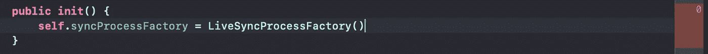
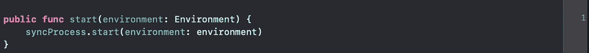
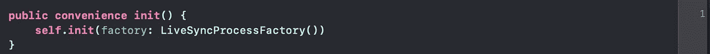

# 如何测试您的对象是否在 Swift 中正确创建

> 原文：<https://betterprogramming.pub/how-to-test-if-your-objects-are-created-correctly-in-swift-f932d33aec5f>

## 测试你作文的正确性

由[瑞安·里金斯](https://unsplash.com/@ryan_riggins?utm_source=medium&utm_medium=referral)在 [Unsplash](https://unsplash.com?utm_source=medium&utm_medium=referral) 上拍摄的照片

单元测试是检验我们的代码是否如我们编写时所预期的那样运行的规程。我们通常用单元测试来测试几个不同层次的复杂性:

1.  简单的函数通过提供一些输入并检查它们的输出是否符合我们的期望来测试。
2.  更新部分应用程序的功能通过执行它们并验证状态是否如我们预期的那样改变来进行测试。
3.  将部分工作委托给另一个组件的函数通过验证是否用正确的参数调用了另一个组件来进行测试。另一个组件有它自己的单元测试来确保它的行为，因此，只要我们检查它是用正确的参数调用的，测试就是好的。

所有这些测试都确保单个组件按照我们的要求完成工作。然而，即使有一个测试套件，其中所有的组件都被测试，所有的依赖关系都被外部化，我们仍然有一些代码部分没有被单元测试覆盖。

一个例子是预置一些工厂或属性的初始化器。这些是我们想要控制的依赖项，但是在不同的情况下，我们不想公开它们:

1.  在使用一些内部组件的库或模块中，我们希望将具体的组件作为实现细节。我们不想向调用者公开它，这样他们就可以修改它。
2.  在我们的应用程序的复合根中，我们希望使用将要创建应用程序的具体类型。

在这两种情况下，我们都想测试这些函数，以确保它们创建了正确的类型和/或确保它们正确地初始化了对象。

在今天的文章中，我想展示一个为使用一些内部组件的公共接口编写测试的逐步过程。在此过程中，我们将更新产品代码，以提高其可测试性。最后，我将向您展示如何使用 Swift 的[镜像 API](https://developer.apple.com/documentation/swift/mirror) 来实际检查我们的复合类型。

# (起始)代码

我们在本文中使用的示例是一个模块，它定期将应用程序生成的一些文件上传到远程服务。

整个模块包括一些支持类型:

1.  一个`APIManager`将文件上传到适当的服务。
2.  定义访问磁盘的接口的`StorageManager`。
3.  返回一个`Date`值的`DateProvider`。

> 注意:这些组件的实际实现超出了本文的范围。因此，我们将只关注它们的定义。

这些支持类型由一个`SyncProcess`使用:执行工作的引擎。这个组件实现超出了本文的范围，我们感兴趣的是如何声明和初始化它。

`SyncProcess`可以通过传递上述三种支持类型的具体实现来创建。我们可以通过调用接受一个`environment`参数的`start`方法来启动它。`Environemnt`是一个简单的`enum`，只有两种情况(`.production`和`.sandbox`)，可用于配置同步过程。

我们不想向最终用户公开这个对象。我们希望将它保留在模块内部，以便为将来的更改提供更大的灵活性。我们也不想将其他类型公开为公共接口，所以我们将模块隐藏在一个向外界公开的 [Facade](https://en.wikipedia.org/wiki/Facade_pattern) 后面。

在这个片段中，我们有一个公共的`protocol`，它定义了组件的行为，并允许我们的客户在他们的代码中创建测试替身。然后我们有了我们的`FileSyncer` `protocol`的实时实现:它在`init`中创建了一个`SyncProcess`，并在`start`方法中启动它。

本文的目标是编写测试来覆盖`LiveFileSyncer`组件。

# 写第一个测试…或者也许不是？

我们上面写的代码完全合法并且有效。但是，我们马上就被卡住了。

我们可能开始考虑如何测试`init`。在测试中，我们可以实例化一个`LiveFileSyncer`，但是我们不能检查我们正在创建哪种`SyncProcess`。

如果我们想测试`start`方法，我们没有办法创建一个`SyncProcess`测试 double 来检查它的`start`方法是否被正确的参数调用。

我们编写的代码可以构建和运行，但是它是不可测试的:我们不能编写任何有意义的测试来断言它的行为是正确的。这是一个缺点:当添加更多的功能时，我们不能确定以前的行为是否被保留。而且我们不能安全地重构代码，因为我们没有在犯错时会失败的测试。

你能想到的时间越早，这个代码就会变得越可怕:人们会对改变它的想法感到害怕，因为没有人想破坏正常工作的东西。

让我们看看如何转换代码以允许可测试性。

## 创建 SyncProcess 工厂

我们需要的第一个要素是在`FileSyncer`中注入自定义的`SyncProcess`实现。我们可以引入一个`Factory`对象，我们可以在测试中覆盖它来实现这一点。

让我们创建一个名为`SyncProcessFactory`的协议。该协议定义了与`SyncProcess`T5 签名相同的功能。它也返回一个`SyncProcess`。

工厂的 live 实现返回`LiveSyncProcess`。生产代码会用到这个`LiveSyncProcessFactory`。测试代码将使用不同的、可定制的`Factory`。

## 更新文件同步程序

现在我们有了自己的工厂，我们需要使用它。记住，我们不想暴露任何内部/私有对象。所以我们需要一个公共的`init`，不带参数。

这个 init 可以使用另一个内部的`init`，它实际上接受一个类型为`SyncProcessFactory`的参数。我们将使用这个内部的`init`在测试中通过一个自定义的`Factory`

这个`FileSyncer`更新是我们测试的游戏规则改变者。我们现在可以创建带有自定义工厂的`LiveFileSyncer`,该工厂可以返回我们可以模仿的`SyncProcess`。

# 测试启动方法

`LiveFileSyncer`将启动操作委托给`SyncProcess`。测试`start`方法意味着测试`SyncProcess`是用正确的参数创建的，并且它的`start`方法被调用。

执行这个测试的第一步是创建我们需要的测试替身。

## MockSyncProcess

`MockSyncProcess`是一个简单的对象，它计算 start 方法被调用的次数。我们可以定制它的行为来覆盖`startClosure`。这个实现有趣的一点是，`startClosure`是用一个闭包初始化的，这个闭包在方法被调用时会自动失败。如果在不应该的时候使用了`start`方法，这个有用的技巧会使测试失败:这是一种保护，我们可以在对象中设置它来监视它的使用位置。

## MockSyncProcessFactory

我们需要的第二个测试 double 是流程工厂的模拟。我们可以使用这个 mock 在我们的代码中注入一个定制的`SyncProcess`,并检查`SyncProcess`是用正确的参数创建的。

这个模拟遵循与前一个相同的原则。它包含一个属性来计算`makeSyncProcess`方法被调用的次数，还包含一个闭包来定制它的行为。如果工厂使用时没有定制封盖，测试将会失败。

## 测试开始

通过对`FileSyncer`的修改和这些新的模拟，我们可以创建我们的第一个测试。

测试将遵循标准的 AAA 模式: **A** rrange、 **A** ct、 **A** ssert。然而，我们在各种闭包中添加了一些断言，以检查传递的参数是否是正确的类型。

在**排列**部分，我们创建了测试所需的所有模拟对象，并声明了它们的参数:

1.  我们创建了`mockSyncProcess`，并检查当`start`被调用时，它是用正确的参数调用的。
2.  我们创建了`mockSyncProcessFactory`，并检查传递的类型是否与我们想要在生产中使用的类型相匹配。在`mockSyncProcess`闭包中，我们还返回在步骤 1 中创建的`mockSyncProcess`。
3.  我们通过传递`mockSyncProcessFactory`来创建`sut`。

> **注意**:在第 2 步中，我们不能检查`DateProvider`是否真的是`Date` init。我们有两个选择:我们可以忍受这个限制，或者我们可以创建一个`DateFactory`协议并用它替换`DateProvider`。第二个解决方案在代码库中引入了更多的实体，但是它让我们更加严谨。

在**行为**部分，我们调用 start 方法。如果我们忘记设置闭包，整个测试将会失败。这就是我们想要的:这个测试的行为是`FileSyncer`创建一个`SyncProcess`，然后它调用`start`方法。

在**断言**部分，我们检查方法被调用的次数是否正确。

现在，我们可以在启用代码覆盖率的情况下运行测试，并检查 start 方法是否被完全测试。注意屏幕左边的小`1`:这意味着 start 方法在测试代码中执行了一次。

# 测试初始化

我们可以滚动到`LiveFileSyncer`文件的顶部，看看是否有一些行没有被覆盖。如果我们这样做，我们会看到 public `init`还没有被测试。那是因为在`test_start`方法中，我们直接调用`init(factory: )`方法来传递自定义的`syncProcess`，绕过了`init()`。

我们应该测试一下`init()`。它是公共接口的一部分，我们模块的客户端将使用它。但是我们如何测试它呢？这段代码创建了一个`LiveSyncProcess`并设置了一个`private` 变量。这种行为用标准方法是观察不到的，所以看起来我们不能真正测试它。

我们可以使用`[Mirror](https://developer.apple.com/documentation/swift/mirror)` API 在`init`上编写一个测试。`Mirror`API 包括在 Swift 中编写反射代码的功能。我们可以在一种只读模式下使用这些 API 来检查类型的内容。

有了这些新知识，我们可以编写下面的测试:

这个测试没有任何**安排**的部分，因为`sut`的创作也是我们要测试的**行为**。**断言**部分是有趣的部分:我们创建了一个`Mirror`来反映我们的`sut`。`Mirror`让我们探索我们对象的属性，即使它们是私有的。API 给了我们这些属性的运行时值:我们可以检查它们是否是我们需要的具体类型。

如果我们现在检查代码覆盖率，我们有以下情况:

左边的小`1`表示我们最终在测试我们的`public init`。

# 这些测试是必需的吗？

对这些测试的反对意见可能是，它们会降低代码库的灵活性。如果明天有人想将一种类型改为另一种类型，测试将会失败，从而减慢重构过程。

这是绝对正确的，但我认为这是一个很好的功能。这些测试是防御性测试。他们阻止我们合并，并发布一个用我们不想要的东西改变类型的 PR。我们总是可以合并它，但是，至少，我们被警告了。

它们可以防止一些配置错误。例如，我们可以创建一个`DevelopmentSyncProcess`和一个`DevSyncProcessFactory`。这些在开发中可能是有用的实体，但是我们不想将它们投入生产。我们确实需要一些自动的方法来检查这一点，而单元测试在这方面做得很好:我们是人，当我们审查同事的拉请求时，我们有时会错过一些细节。

# 结论

在今天的文章中，我们讨论了如何编写测试来检查我们是否以正确的方式组成了我们的模块。

我们从一个不可测试的硬编码实现开始，并努力使其可测试:

*   我们使用工厂来分离对象的创建。
*   我们创建了测试 doubles 来编写灵活的测试，并检查代码是否传递了正确类型的参数。
*   我们探索了镜像 API 来检查被测类的私有属性
*   我们验证了`public init`的行为是正确的。

最后，我们讨论了这些测试是否过于严格，以及在我们的代码库中是否值得拥有它们。

我个人的观点是，是的，它们是一种强大的防御方法，可以保护我们在生产中不发送错误的类型。