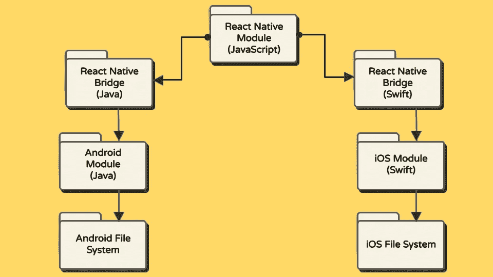
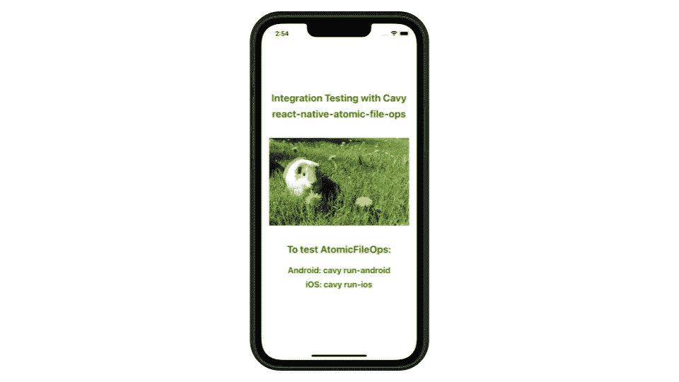
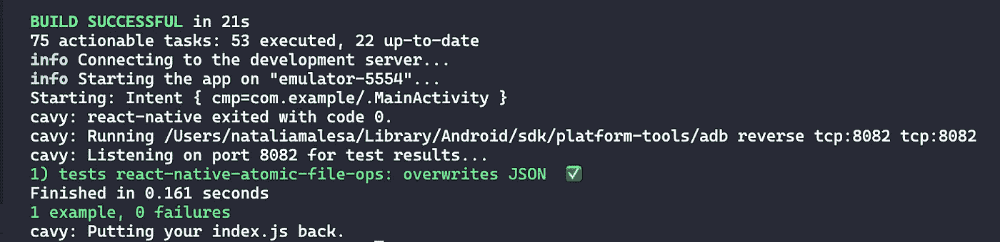

# 如何测试你的 React 原生模块是否与 Android 和 iOS 集成

> 原文：<https://betterprogramming.pub/how-to-test-if-your-react-native-module-integrates-with-android-and-ios-aa18f43f296a>

## React Native 与 Cavy 的集成测试


丹·巴瑞特在 [Unsplash](https://unsplash.com/@brandman79?utm_source=unsplash&utm_medium=referral&utm_content=creditCopyText) 上拍摄的照片

在移动应用程序中，一个功能可能包含多个必须相互通信的模块。单元测试检查各个模块是否按预期工作。端到端(E2E)测试确保该特性支持预期的用户行为。然而，集成测试介于两者之间——它测试功能模块之间的契约，并检查模块是否按计划交互。

集成测试的一个用例是验证内部模块(如 React 本地应用程序中用于进行应用内购买的 JavaScript 函数)如何与 Apple StoreKit 或 Google Play Billing Library 等本地软件交互。集成测试对于 React Native 和其他跨平台移动应用尤为重要，因为一段代码必须成功地与两个不同的操作系统通信:Android 和 iOS。

在本教程中，您将学习如何使用 [Cavy 测试框架](https://cavy.app/)在 React 本地应用中构建和运行集成测试。

# **学习成果**

*   创建一个测试助手组件，允许您使用 Cavy 进行集成测试，而无需与应用程序的 UI 进行交互
*   编写并运行 Cavy 集成测试

# 集成测试的实际用例

在我们的 React 本地应用中，我们需要测试一个文件损坏修复。Android 10 有一个已知的[错误](https://issuetracker.google.com/issues/135714729?pli=1)，在某些情况下，向现有文件写入数据可能会损坏该文件。为了解决这个问题，我们为 React Native 构建了一个原子文件编写包:[React-Native-atomic-file-ops](https://github.com/nmalesa/react-native-atomic-file-ops)。

我们想在我们的应用程序中测试这个包。测试移动操作系统操作需要本机代码在设备/仿真器/模拟器上运行。Jest 和其他 JavaScript 测试框架无法提供我们需要的覆盖范围，因为这个 bug 影响了我们的应用程序如何与特定的 Android 版本交互。我们需要测试从 React 原生应用程序写入 Android 10 文件的数据可以在不破坏文件的情况下被重写。这种通信看起来像:



React 本机和本机模块之间的通信

## 为什么是凯威？

在 Jest 中测试这种通信需要模拟函数。虽然 Jest 对于 React 本地组件和 JavaScript 方法的单元测试很有用，但是它不能访问移动操作系统。任何与操作系统的交互都必须被嘲笑。我们希望在一台设备上运行我们的 Android 代码，并测试我们的包的真实行为，而不是模仿行为。

React 原生 E2E 测试框架，如 Cavy 和 [Detox](https://github.com/wix/Detox) ，为我们确定如何运行集成测试提供了一个起点。这些框架支持在仿真器和设备上进行测试。然而，在我们的应用中测试从 React 本机模块到本机文件系统的契约不需要 UI 交互。我们不希望将文件写入模块及其测试绑定到我们应用程序中的真实用户界面上。

Cavy 的架构支持这种需求。Cavy tester 导入你的 app，并嵌入到 Cavy 的`<Tester />`组件中。这种模式是可定制的，允许您导入、嵌入和测试任何 React 本地组件。您可以导入单个组件进行测试，而不是导入整个应用程序进行 E2E 测试。当您开始使用示例应用程序时，您将会看到，该组件不一定是应用程序 UI 的一部分。

参见 Cavy 文档中的示例测试仪:“[设置 Cavy 测试仪](https://cavy.app/docs/getting-started/setting-cavy-up)”。

准备好用 Cavy 编写您的第一个集成测试了吗？我们开始吧！

# 用 Cavy 编写集成测试

您将构建一个应用程序来测试 React 本机模块与 Android 和 iOS 的集成。在本例中，您将测试 react-native-atomic-file-ops 如何与本机文件系统通信。

## G 开始设定

按照 React Native 的说明设置您的首选开发环境。使用 React Native CLI(非 Expo)确保应用程序可以访问移动操作系统。

设置好环境后，初始化 React 本机应用程序:

```
npx react-native init cavyExampleApp
```

这个集成测试不会与 UI 交互。如果你想在启动应用程序时看到一只可爱的豚鼠，请随意使用[示例](https://github.com/nmalesa/react-native-atomic-file-ops/blob/main/example/App.js) `[App.js](https://github.com/nmalesa/react-native-atomic-file-ops/blob/main/example/App.js)` [代码](https://github.com/nmalesa/react-native-atomic-file-ops/blob/main/example/App.js)和[图像](https://github.com/nmalesa/react-native-atomic-file-ops/blob/main/example/assets/guineaPig.png)作为登陆屏幕。否则，您可以保留默认的 React 本机屏幕，甚至将其简化为显示“Hello，world！”



应用程序登录屏幕示例

安装以下软件包:

```
yarn add react-native-atomic-file-opsyarn add react-native-fs
```

[react-native-fs](https://github.com/itinance/react-native-fs) 提供对 Android 和 iOS 文件系统的读取权限。您将在您的示例测试中使用它的 API。

如果您正在构建一个 iOS 应用程序，也要安装带有 [CocoaPods](https://cocoapods.org/) 的包:

```
cd iospod install
```

将 Cavy 添加到您的应用程序中。在您的本地机器上安装 Cavy CLI，以便在您的项目中快速搭建所需的脚手架，并轻松运行测试。

```
yarn add cavy --devyarn global add cavy-cli
```

一旦 Cavy 安装到您的项目中，初始化 Cavy 测试器:

```
cavy init
```

您的项目现在应该在根目录中包含一个`index.test.js`文件和一个`specs`文件夹。`specs`是您构建测试的地方。它应该包含一个`exampleSpec.js`文件。

将`exampleSpec.js`改名为`atomicFileWritingSpec.js`。

## 创建测试助手组件

在`specs`目录中，创建一个名为`fileWritingTestHelper.js`的新文件。该文件将存储可测试的 React 本地组件，Cavy 将在运行测试时引用该组件。

输入以下代码:

测试助手组件

`fileWritingTestHelper.js`创建一个可测试的 React 本地组件，您可以在集成测试中引用它，而不需要[包装](https://cavy.app/docs/getting-started/hooking-up-components#wrap-function)或将 refs 分配给 UI 组件。

要完成 Cavy 测试仪的设置，打开并配置`index.test.js`。

豚鼠试验器

## 编写集成测试

我们来写集成测试吧！你将在`atomicFileWritingSpec.js`工作。

导入以下模块:

```
// The module you are testing
import AtomicFileOps from 'react-native-atomic-file-ops';// Provides read access to the Android and iOS file systems
import RNFS from 'react-native-fs';
```

创建以下变量:

```
// You will write your data to fileName
const fileName = 'AtomicFileOpsCavy.test';

// filePath provides the absolute path to the file
const filePath = `${RNFS.DocumentDirectoryPath}/${fileName}`;
```

在运行测试之前，您应该做一些检查:

在每个测试用例之前运行检查

现在您将编写您的测试用例。您将测试当您用新数据覆盖文件上的现有数据时，文件只包含新的、未损坏的数据。

Cavy 集成测试将确保 React 本机和本机模块之间的契约按预期工作。

在`beforeEach`功能后且仍在`export default function(spec) { }`内，添加测试:

判例案件

你可以在 [GitHub](https://github.com/nmalesa/react-native-atomic-file-ops/blob/main/example/specs/atomicFileWritingSpec.js) 上完整查看`atomicFileWritingSpec.js`。

您现在已经准备好运行您的测试了。

## 运行测试

从命令行运行测试:

```
// Android
cavy run-android

// iOS
cavy run-ios
```



Android 上通过 Cavy 测试的终端输出

恭喜你！您已经成功地测试了 React 本机模块与本机模块的集成。

如果您的测试没有通过，设置一个断点或者在测试中使用 debugger 语句来暂停 Cavy 并检查测试输出是很有帮助的。

# 结论

确保您的 React 原生模块在多个平台上正常工作是构建优秀应用程序不可或缺的一部分。除了单元测试和 E2E 测试，集成测试应该是 React 本地测试策略的重要组成部分。

Cavy 提供了一个易于使用、可定制的框架，支持 React Native 上的集成测试。使用 test helper 组件模式，您可以创建可测试的组件，以便在集成测试中使用，而不必与应用程序的 UI 进行交互。

当然，您也可以使用 Cavy 进行 UI 和 E2E 测试！

感谢您的阅读，祝您测试愉快！

## 资源

*   [豚鼠](https://cavy.app/)
*   [示例 app 源代码](https://github.com/nmalesa/react-native-atomic-file-ops/tree/main/example)
*   [react-native-atomic-file-ops](https://github.com/nmalesa/react-native-atomic-file-ops)