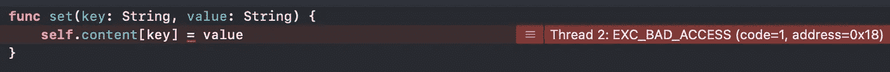
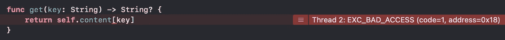
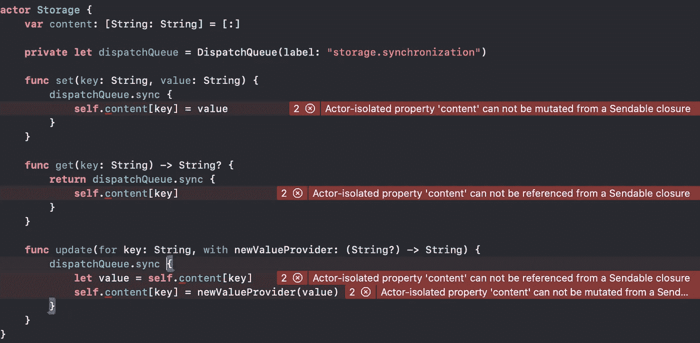

# 如何测试您的 Swift 类是否是线程安全的:Actors 之前和之后

> 原文：<https://betterprogramming.pub/how-to-test-if-your-swift-classes-are-thread-safe-before-and-after-actors-efc743f27da4>

## 线程安全资源测试和参与者

泰勒·希瑞在 [Unsplash](https://unsplash.com?utm_source=medium&utm_medium=referral) 上的照片

在开发大型应用程序时，我们经常需要在不同的组件之间共享数据。无论是模块还是屏幕，它们都需要从同一个数据源读取和写入数据。

这就引入了一个问题:如果在不同的[线程](https://en.wikipedia.org/wiki/Thread_(computing))中使用相同的日期结构，我们需要确保它们不会同时访问数据。否则，我们可能会引发不同的问题:

1.  更新可能以不同的顺序到达(只有当我们重视排序时才是一个问题)。
2.  我们可能会错过一些更新。
3.  应用程序可能会崩溃。

当一个数据结构以防止这些问题的方式实现时，我们称之为[线程安全](https://en.wikipedia.org/wiki/Thread_safety)数据结构。

在所有 iOS 版本中，都有各种方法来保证线程安全。从 Swift 5.5 开始，`actors`把这个权力直接交给编译器。然而， [actors 也将只在 iOS 13 中可用，在 Xcode 13.2 发布之后](https://www.swiftbysundell.com/special/swift-concurrency-backward-compatibility/)。

在今天的文章中，我将展示如何测试兼容所有 iOS 版本的线程安全存储。之后，我们将看到如何通过使用 actors 来简化测试和代码。

# 基本存储行为

让我们从定义基本的`Storage`接口开始。我们需要为一个键设置一个值，并检索与该键相关联的值。

我们想要应用[测试驱动开发](https://en.wikipedia.org/wiki/Test-driven_development) (TDD)方法，所以让我们开始编写我们的第一个测试:

这是我们可以为`get`操作编写的最简单的测试。

测试不会构建，因为`Storage`类还不存在。所以，还是写出来让测试通过吧。

这是通过测试所需的最少代码。记住，在 TDD 中，我们遵循三个步骤:

1.  我们创建了一个失败的测试。
2.  我们编写最少的代码来使它通过。
3.  最后，我们重构代码，使其更具可读性和可维护性。

对`get`方法的测试现在通过了。让我们为`set`方法添加一个新的测试。

这个测试不会编译，因为`Storage`没有`set`方法。让我们用运行这个类所需的最少代码来更新它。

我们正在保存一个从`nil`开始的`String`。如果我们进行测试，他们都会通过。这是一个重要的观察:使用 TDD，我们增加了功能，确保我们以前实现的功能继续工作。

在第三个测试中，我们测试我们可以添加多对<key value="">，并且我们可以为正确的键检索正确的值。</key>

在这个测试中，我们使用随机值来防止我们自己使用硬编码值。如果我们现在运行测试，它会失败，因为我们一次只记忆一个值，而第二个`set`会改变存储的值。

我们可以更新我们的类型，使用字典将值与键关联起来。

有了这个改变，所有的测试都通过了。

我们对这个班的基本表现感到满意。现在让我们检查线程安全。

# 添加线程安全

为了在测试中模拟多线程环境，我们可以在一个`[DispatchQueue](https://developer.apple.com/documentation/dispatch/dispatchqueue)`上异步调度多个作业，并使用一个`[DispatchGroup](https://developer.apple.com/documentation/dispatch/dispatchgroup)`来等待它们完成。这些 API 是名为[大中央调度](https://developer.apple.com/documentation/dispatch) (GCD)的框架的一部分。

测试看起来像这样:

该测试由以下模块组成:

1.  我们声明了`sut`、`dispatchGroup`和`expectation`。需要`expectation`等待，直到所有线程都完成。
2.  我们通过在一个循环中使用`DispatchQueue.global().async`函数来创建 100 个线程。在分派工作单元之前，我们使用`dispatchGroup.enter()`函数登记到组中。
3.  线程工作是`set`存储中的一个键值对。设置好之后，我们就`exit`离组了。
4.  最后，我们要求该组等待，直到其中的所有线程都终止它们的工作。这是使用`dispatchGroup.notify()`功能完成的。一旦发生这种情况，我们就实现了期望。
5.  在最后一步中，我们断言所有的键都已经插入到`Storage`中。

如果我们现在运行测试，它们将崩溃并显示以下错误

多个线程同时试图`set`字典**中的一个值**而 Swift 不知道怎么做。

为了解决这个问题，我们需要更新我们的存储代码。有多种方法可以实现线程安全。最简单、可读性更好的方法是通过使用私有的`DispatchQueue`来同步对资源的访问:默认情况下，调度队列一次执行一个操作，直到前一个操作结束，才会执行其他操作。采用的策略是*“先进先出”* (FIFO):首先到达的请求被服务。

代码现在看起来像这样:

在第 4 行中，我们声明了一个私有的`DispatchQueue`，并将其命名为`storage.synchronization`。我们在第 7 行使用它，将`set`主体包装到`sync`方法中。

如果我们现在运行测试，它们不会崩溃。

## 确保一致性

虽然代码现在看起来很好，很稳定，没有崩溃，但我们仍然有一个一致性问题。想象一下，我们想要:

1.  读取一个值。
2.  修改一下。
3.  再储存一次。

如果另一个线程在步骤 1 和步骤 2 之间更改了与同一个键相关联的值，会发生什么情况？第一个线程将更新旧值，而第二个线程的更新将丢失。

我们可以用下面的测试来测试这个用例:

测试有点复杂，所以我们一步一步来分析。

1.  代码的第一部分用一百个键值对准备测试变量和`Storage`。
2.  然后我们创建一个组，通过添加`_read`后缀来更新这些值。为了实现这一点，我们输入一个`dispatchGroup`，我们执行工作，然后离开。
3.  我们创建第二组线程，将后缀`_disturb`附加到同一个键值对，同时模拟一系列并发更新。
4.  我们创建一个`expectation`，然后等待`dispatchGroup`结束。
5.  最后，我们写出我们的断言。这两组线程同时运行，所以我们不知道它们将以何种顺序执行。无论我们先执行“追加`_read`”还是先执行“追加`disturb`”，断言都会通过。我们不能接受两个操作中有一个丢失。

如果我们现在运行测试，它们可能会崩溃，并出现我们在设置值时遇到的相同错误。

多个线程试图从字典中读取，而其他线程试图写入字典。斯威夫特又一次不知道如何应对。我们可以将读取操作包装在对`dispatchQueue`的`sync`调用中。

唯一的变化发生在第 13 行:我们将读取操作包装在了`sync`方法中(`sync`方法可以返回其闭包返回的相同值)。

如果我们现在运行测试，它们不会崩溃，但也不会通过。断言失败:我们正在丢失一些操作，因为来自不同组的线程读取相同的变量，然后它们试图更新它们。为了解决这个问题，我们需要引入一个不同的操作:`update`。

该操作需要一个闭包，其中`Storage`将值传递给闭包。然后，调用者可以在锁定的上下文中操作，这可以防止其他线程访问它。

让我们首先更新测试，遵循 TDD 方法:

测试完全相同，但是我们用`update`操作替换了`get`和`set`操作。

代码不会构建，因为我们在类中缺少方法。补充一下吧。

如上所述，update 函数接受我们想要更新的`key`和一个闭包，该闭包为那个键提供一个新值，传递旧值(如果存在的话)。然后，闭包的结果被设置为新值。一切都包裹在`dispatchQueue.sync`方法中，以确保线程安全。

如果我们最终现在运行测试，测试套件就通过了。

# 使用演员

从 iOS 15 开始，我们可以使用`actor` s. Actors 确保操作在其中以受控和序列化的方式运行。

让我们将`Storage`的类型从`class`改为`actor`:

编译器开始在`actor`和测试代码中抛出不同种类的错误。让我们从分析`actor`的错误开始:

一个`actor`已经在内部调度队列中运行，它不允许我们将它的操作调度给另一个。编译器建议我们移除私有的`dispatchQueue`:我们不再需要它了。

然后，我们在测试中有一堆错误。可以在[隔离上下文](https://www.avanderlee.com/swift/nonisolated-isolated/)中使用:这些是由运行时控制的异步上下文。要修复这些错误，我们必须执行以下步骤:

1.  所有的测试方法必须变成`async`。
2.  所有的`get`和`set`调用都必须以`await`为前缀。
3.  如果测试使用了一个`DispatchGroup`，那么必须使用`[withTaskGroup](https://developer.apple.com/documentation/swift/3814991-withtaskgroup)` API 将它转换成一个`[TaskGroup](https://developer.apple.com/documentation/swift/taskgroup)`。

让我们单独看看每个测试。

## 测试获取

新的测试代码如下:

我们应用了转换列表的第 1 步和第 2 步:我们将方法标记为`async`，我们将`get`提取到单独的一行中，我们在`get`调用前添加了`await`关键字。

## 测试设置和获取

该测试更新为上一个测试。我们将测试标记为`async`，并添加了`set`调用。`set`和`get`都标有`await`关键字，以使它们能够与新的并发范例一起工作。

## 测试 SetMultipleValues

这个测试和它的孪生测试非常相似:我们`set`两个不同的变量，然后我们`get`它们。正如我们之前所做的，我们将该方法标记为`async`，并将`await`关键字用于所有的`get`和`set`操作。

## 测试并发集

这个测试要求我们使用第三个转换步骤。在这个测试中，我们需要将一个`DispatchGroup`转换成一个`TaskGroup`。

新测试比原来的测试更短:只有 15 行，而原来是 22 行。我们能够丢弃`expectation`，因为我们能够`TaskGroup`完成`await`。

`withTaskGroup` API 提供了一个组来添加异步操作。这些是并发执行的，在`withTaskGroup`函数之前的`await`关键字允许我们等待它们全部执行。

## 测试并发更新

在最后一个测试中，我们并行运行了两个任务组。我们使用`async let`语法来声明我们可以并发执行的两个变量:

新的测试比原来的短:36 行对 44 行。我们既不需要`DispatchGroup`也不需要`expectation`，相反，我们使用`withTaskGroup` API 创建`TaskGroups`，并将这些组存储在一些特定的变量中。`group1`和`group2`变量是`async let`:我们将它们的评估和计算延迟到我们需要它们的时候。

在第 28 行我们`await`了由两个组组成的数组，要求系统实际执行它们。

在所有这些转变之后，所有的考验都将通过。

# 结论

在今天的文章中，我们评估了如何创建线程安全的数据结构，实现基本的读、写和更新操作。我们应用了测试驱动开发，并且我们探索了在使用线程安全数据结构时所面临的典型问题。

然后，我们探索了如何创建复杂的测试来检查多线程环境中最常见的问题:崩溃和更新丢失。一旦我们写下了这些测试，我们也有了一些防止回归的安全网。由于这些测试，类似的问题在未来不会发生。

最后，我们探索了新的`actor`类型，并分析了如何将一个测试套件从 Grand Central Dispatch (GCD)模型转换为新的 async-await 模型。更新后，代码看起来更简单、更优雅。