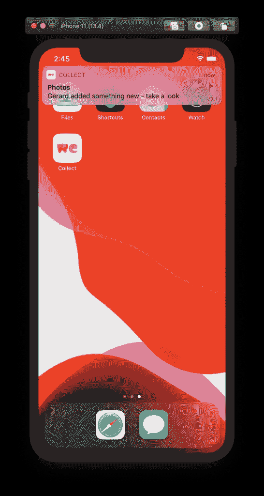

# 如何在 iOS 模拟器上测试推送通知

> 原文：<https://betterprogramming.pub/how-to-test-push-notifications-on-the-ios-simulator-9b5062519622>

## 了解如何在 iOS 模拟器中测试远程推送通知，而无需 Xcode 11.4 中的实际设备


照片由[克里斯托弗·罗宾·艾宾浩斯](https://unsplash.com/@cebbbinghaus?utm_source=medium&utm_medium=referral)在 [Unsplash](https://unsplash.com?utm_source=medium&utm_medium=referral) 拍摄。

在 iOS 模拟器中测试推送通知使得添加远程通知支持变得更加容易。您经常需要迭代很多次来验证您的代码是否按预期运行。

在 Xcode 11.4 之前，我们不得不使用第三方应用程序，如 [NWPusher](https://github.com/noodlewerk/NWPusher) 和实际设备来测试功能，如[丰富通知](https://www.avanderlee.com/swift/rich-notifications/)。尽管这样做效果很好，但在 iOS 模拟器上快速迭代总是更好。Xcode 11.4 通过新添加的`simctl`命令使这成为可能。让我们开始吧！

# 启用使用推送通知的权限

在我们开始测试远程推送通知之前，确保您获得了在 iOS 模拟器上接收通知的正确权限是很重要的。

否则，您可能最终调试出通知没有出现的原因，却发现这是因为缺少权限。

```
let center = UNUserNotificationCenter.current()
center.requestAuthorization(options: [.alert, .sound]) { granted, error in
    // If `granted` is `true`, you're good to go!
}
```

# 从终端向 iOS 模拟器发送推送通知

测试简单推送通知的最简单方法是利用 [Poes](https://github.com/AvdLee/Poes) 。这是一个简单的命令行工具，它为新的`simctl push`命令添加了一个包装器。

您可以使用 [Mint](https://github.com/yonaskolb/mint) 安装 Poe:

```
$ mint install AvdLee/Poes
```

之后，您可以轻松发送如下通知:

```
$ Poes --bundle-identifier com.wetransfer.app --verbose
Generated payload:

{
  "aps" : {
    "alert" : {
      "title" : "Default title",
      "body" : "Default body"
    },
    "mutable-content" : false
  }
}

Sending push notification...
Push notification sent successfully
```

这消除了自己创建有效负载 JSON 文件的麻烦，并允许您在应用程序中测试推送通知时快速迭代。

Poes 使用了新的`xcrun simctl push`命令，并在它周围添加了一个小包装器，以基于输入参数生成 JSON 有效负载。为了充分理解这意味着什么，我将向你解释如何在没有 Poe 的情况下测试推送通知。

# 使用 Xcode 命令行工具测试推送通知

Xcode 命令行工具允许您从终端使用模拟器。你可以启动模拟器，触发通用链接，等等。其中一个命令允许您向 iOS 模拟器发送推送通知:

```
$ xcrun simctl push --help
Send a simulated push notification
Usage: simctl push <device> [<bundle identifier>] (<json file> | -)

	bundle identifier
	     The bundle identifier of the target application
	     If the payload file contains a 'Simulator Target Bundle' top-level key this parameter may be omitted.
	     If both are provided this argument will override the value from the payload.
	json file
	     Path to a JSON payload or '-' to read from stdin. The payload must:
	       - Contain an object at the top level.
	       - Contain an 'aps' key with valid Apple Push Notification values.
	       - Be 4096 bytes or less.

Only application remote push notifications are supported. VoIP, Complication, File Provider, and other types are not supported.
```

该命令要求您传入几个参数:

*   `<device>` —只需将其设置为*启动*即可使用开放模拟器。您还可以使用通过`xcrun simctl list devices | grep Booted`命令获得的设备标识符。
*   `<bundle identifier>` **—** 将此项设置为您正在测试推送通知的应用的捆绑包标识符。
*   `<json file>` **—** 这应该指向磁盘上包含推送通知细节的 JSON 文件。您也可以使用`stdin`来提供 JSON 内容。

执行的示例可能如下所示:

```
$ xcrun simctl push booted com.wetransfer.app payload.json 
Notification sent to 'com.wetransfer.app'
```



在 iOS 模拟器上测试推送通知

在本例中，我们使用保存到`payload.json`文件中的以下 JSON:

```
{
    "aps": {
        "alert": {
            "body": "Gerard added something new - take a look",
            "title": "Photos"
        }
    }
}
```

你可以在苹果官方文档页面[阅读更多关于有效载荷 JSON 的可能性和结构，创建远程通知有效载荷](https://developer.apple.com/library/archive/documentation/NetworkingInternet/Conceptual/RemoteNotificationsPG/CreatingtheNotificationPayload.html)。

# 使用 APNS 文件测试推送通知

在 iOS 模拟器上测试推送通知的另一个选项是将 APNS 文件拖到 iOS 模拟器中。

这个 APNS 文件看起来与 JSON 有效负载文件几乎一样，但是添加了一个描述要使用的包标识符的`Simulator Target Bundle`键:

```
{
    "Simulator Target Bundle": "com.wetransfer.app",
    "aps": {
        "alert": {
            "body": "Gerard added something new - take a look",
            "title": "Photos"
        }
    }
}
```

# 共享存储库中的 APNS 文件

将 APNS 文件提交到存储库可以让您和您的同事轻松测试应用程序的常见推送通知。您可以为每种类型的通知保存一个配置。例如，我们决定为 Collect by WeTransfer 应用程序保存一个配置，以发送包含图像的推送通知:

```
{
    "Simulator Target Bundle": "com.wetransfer.app",
    "aps": {
        "alert": {
            "body": "Gerard added something new - take a look",
            "title": "Photos"
        },
        "category": "file_added",
        "mutable-content": 1
    },
    "image_url": "https://assets.website-files.com/5e1c6cdadb4d52399503394c/5e31fc43e7c7eca12dd4228d_5e1c6cdadb4d527592033a11_Hero%402x%20(1).png",
    "event_type": "file_added"
}
```

每当我们需要测试这个特定的推送通知时，我们可以简单地将 APNS 文件拖到模拟器中。请注意，我们在这里使用了丰富的通知。这些细节在这篇博文中有所解释。

# 结论

在 iOS 模拟器上测试推送通知现在已经成为一件简单的事情。有三种不同的方式触发远程推送通知:

*   使用 [Poes 命令行工具](https://github.com/AvdLee/Poes)轻松生成 JSON 有效负载
*   引用本地 JSON 有效负载文件
*   将 APNS 文件拖到模拟器中

Poes 可以非常容易地进行快速测试，而一个 APNS 文件添加到你的存储库中可以使你的应用程序很容易迭代常见的推送通知。

如果您想进一步改进您的工作流程，请查看[工作流程类别页面](https://www.avanderlee.com/category/workflow/)。请随时留下您的评论、建议或反馈。

谢谢！