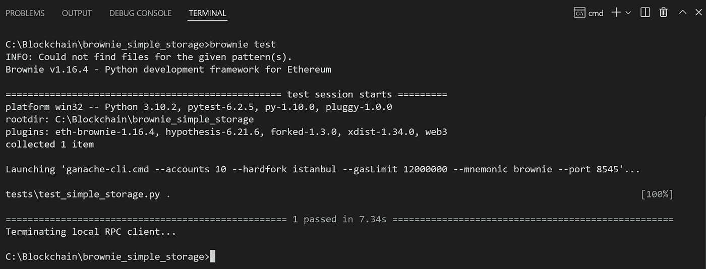

# 如何用 Python 测试 Solidity 智能合约

> 原文：<https://betterprogramming.pub/how-to-test-solidity-smart-contracts-with-python-c2b85dd37d04>

## 使用 Pytest 满怀信心地部署智能合约


图片来源:麦康夫兹([https://pixabay.com/users/maiconfz-1424200/](https://pixabay.com/users/maiconfz-1424200/))

智能合约的设计是不可变的。这意味着，一旦智能合约被部署到区块链，就不可能更新源代码。嗯，不完全是这样。智能合约可以通过一个 [OpenZeppelin](https://docs.openzeppelin.com/upgrades-plugins/1.x/) 插件转换成代理，其中原始合约指向合约的最新版本。但是，如果一开始就可以避免版本控制，不是更好吗？

Rinkeby 和 Kovan 等测试网络是在实时区块链上验证合同功能的便捷方式。但是试图手动验证每个场景既耗时又乏味。在你的[可靠性](https://soliditylang.org/)合同代码到达区块链之前发现它的问题不是很好吗？相反，我们可以用基于 Python 的开发和测试框架 [Brownie](https://github.com/eth-brownie/brownie) 来评估我们的智能合约。我们将很快对此进行深入研究！

最近我一直在学习帕特里克·柯林斯的以太坊发展课程。下面的代码片段在 [freeCodeCamp.org 的 YouTube 视频](https://youtu.be/M576WGiDBdQ?t=17208)中有深入的探讨。

让我们来看看智能合同的例子:

`**SimpleStorage**`包含一个人可以添加到合同中的功能，以及他们最喜欢的号码。

为了实现这一点，有一些功能，包括具有`store()`和`retrieve()`功能的。让我们用 Python 测试这个简单的例子。

我们可以通过在`Brownie` 框架中编写一个测试来评估智能合约在区块链上更新存储的能力。通过遵循 [pytest](https://docs.pytest.org/en/7.0.x/) 的排列、动作和断言约定，我们将编写一个测试来完成以下任务:

*   将智能联系人部署到区块链(排列)
*   将数值写入合同(act)
*   从协定(断言)中检索(相同的)数值

注意，这里的客户端帐户是由 Brownie 提供的。为了更快地执行测试，我们的测试框架使用了[以太坊虚拟机](https://docs.soliditylang.org/en/v0.6.0/introduction-to-smart-contracts.html#the-ethereum-virtual-machine)和一个本地区块链。

调用`test_updating_storage()`就像在终端上运行`brownie test` 命令一样简单:



因为测试通过了，所以我们确信我们的`SimpleStorage` 智能合同可以在几秒钟内完成部署、写入和读取。

如果我们继续在合同中添加功能，我们会马上知道上面的核心功能是否意外受损。

要详细了解如何设置 Brownie 并在框架中添加测试，请查看 YoutTube 上 Patrick 视频课程的第 5 课。

```
**Want to Connect?**I’m [Jordan](https://jordan.cassady.me), a developer based in the Bay Area, California. 🌉 I can help your team achieve their test automation goals, improve code quality and increase developer satisfaction. Check out my work, or contact me @ [jordan.cassady.me](https://jordan.cassady.me).
```