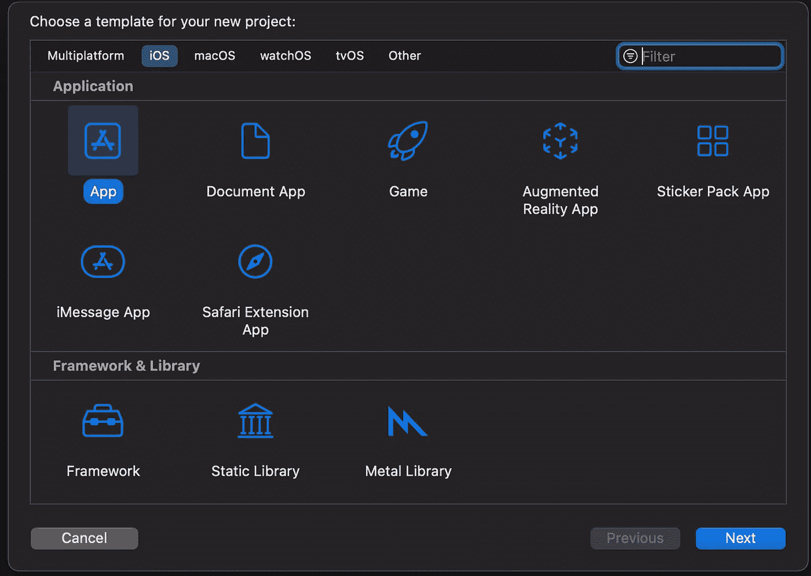
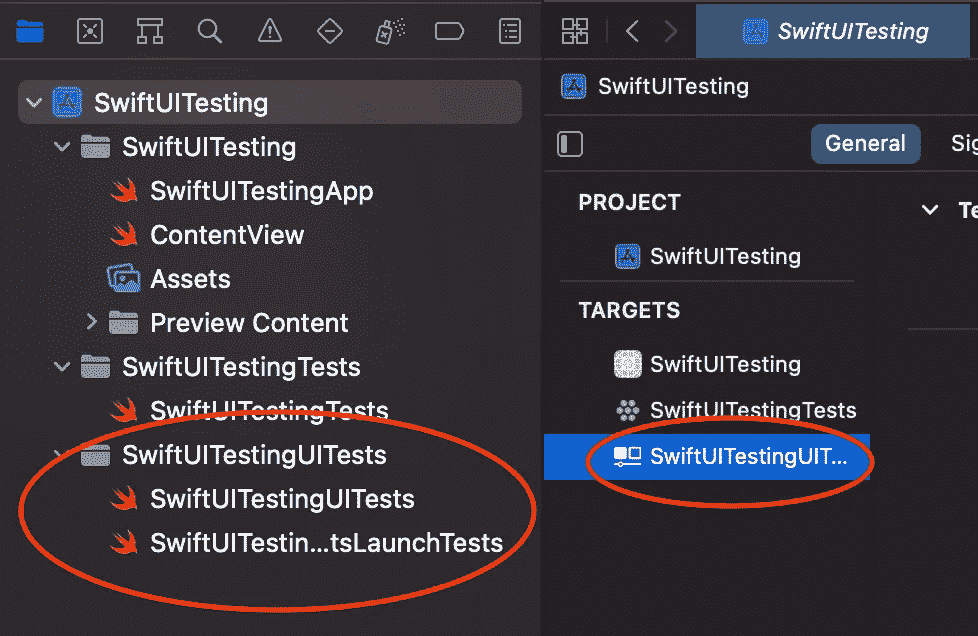
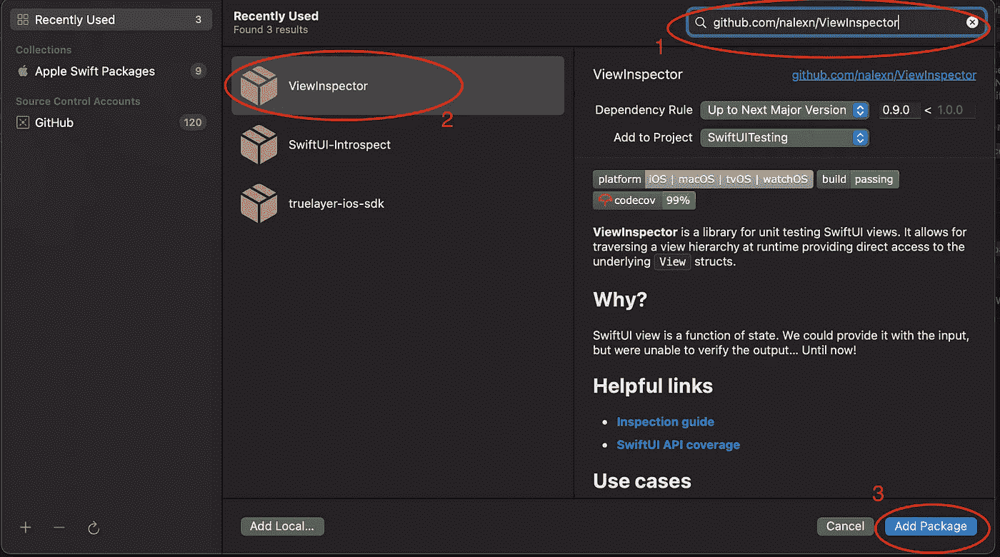
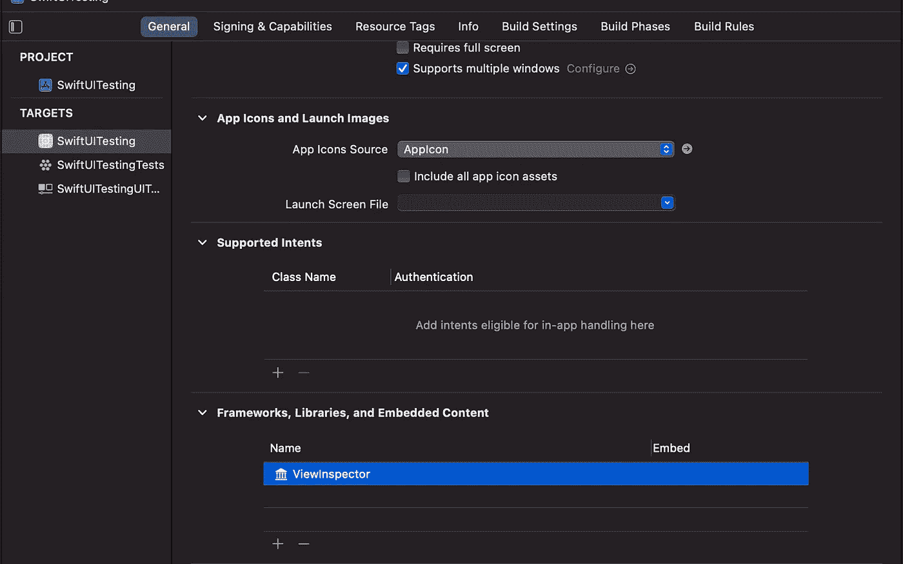
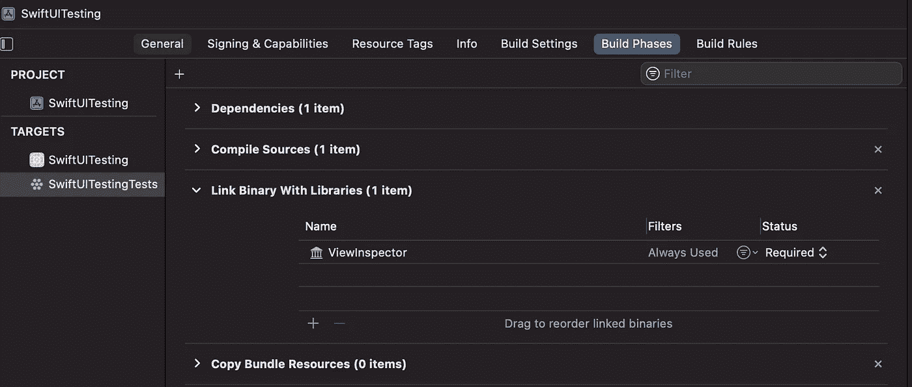
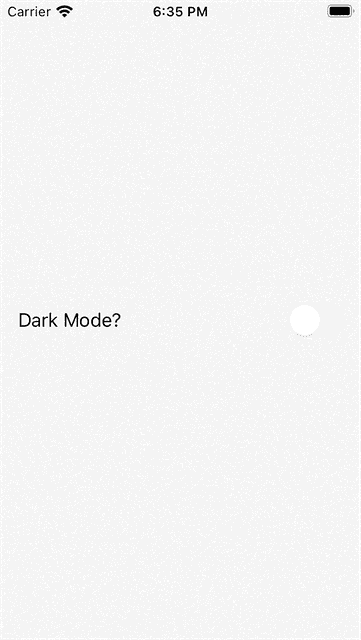
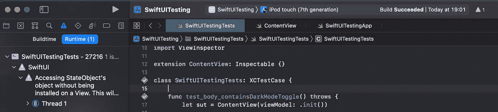

# 如何智能测试 SwiftUI 视图

> 原文：<https://betterprogramming.pub/how-to-test-swiftui-views-smartly-6c6b13f9edb1>

## 单元测试 SwiftUI 的行为和连接

照片由 [Towfiqu barbhuiya](https://unsplash.com/@towfiqu999999?utm_source=medium&utm_medium=referral) 在 [Unsplash](https://unsplash.com?utm_source=medium&utm_medium=referral) 上拍摄

正确测试 UI 是很难实现的。UI 是我们应用程序中最不稳定的部分:产品经理和他们的团队喜欢尝试它。由于技术因素也很难测试:不同的屏幕因素、方向和本地化。

测试整个 UI 也很昂贵:测试很难写，需要更多的时间来写，并且很容易因为产品的变化而失效。面对这些困难，不同于单元测试的策略诞生了:[快照测试](https://github.com/pointfreeco/swift-snapshot-testing)和[测试](https://github.com/theappbusiness/TABTestKit)。

这些策略是有效的，但仍然昂贵。它们非常适合自动化回归检查和用例测试，但是不适合支持开发周期。一个好的开发周期是快速的，只有单元测试能为我们提供这样的周期。

在今天的文章中，我想探索一种以智能方式对 SwiftUI 视图进行单元测试的方法。我们首先需要理解在一个视图中进行测试有什么意义。其次，我们将讨论一个使这成为可能的工具。最后，我们将使用[测试驱动开发](https://www.agilealliance.org/glossary/tdd/) (TDD)方法实现一个简单的视图。

# 考什么？

开发视图的一个主要目标是让逻辑远离视图。一个`View`应该只包含表示代码:所有的业务逻辑应该被移到`ViewModel`或者一个类似的组件中。

然而，有两种行为我们必须放到视图中，即使它们是由`ViewModel`控制的:

1.  视图如何对视图模型中的变化做出反应。
2.  视图何时调用视图模型的方法，以及它调用哪些方法。

事实上，我们可以有一个完全测试过的完美的`ViewModel`，但是我们想测试一下，当视图模型改变时，视图会相应地更新。

其次，我们需要验证，例如，当用户与视图交互时，调用了正确的`ViewModel`方法。否则，我们永远无法确定我们的应用程序是否如我们所愿。

# 如何测试呢？

为了在 SwiftUI 中实现这一点，我们可以利用一个名为`[ViewInspector](https://github.com/nalexn/ViewInspector)`的测试框架。`ViewInspector`使用 Swift 反射扩展 SwiftUI 视图的基本行为:我们可以轻松地在视图层次结构中搜索特定视图并断言其状态。或者，我们可以调用它的一些方法。

## 安装框架

`ViewInspector`可作为标准 Swift 包下载并安装在项目中。不过，它的配置有点棘手，因为它是一个在引擎盖下使用`XCTest`的框架。让我们通过所有的步骤将它安装到我们的项目中。

*   创建新的 iOS 应用程序项目。

*   将其命名为`SwiftUITesting`，并勾选`**Include Tests**`复选框。确保选择`**SwiftUI**` 作为**界面**:

*   从项目中移除`SwiftUITestingUITests`文件夹和目标。

右键单击 SwiftUITestingUITests，并选择 Delete。对 SwiftUITestingUITests 目标执行相同的操作。

*   使用`Swift Package Manager`添加`ViewInspector`框架

*   仅将其链接到测试。这是最棘手的部分。我们需要首先取消它与应用程序的链接，然后我们需要显式地将它添加到单元测试目标中。

第一步。通过单击底部的减号(-)按钮，从应用程序的框架、库和嵌入内容中删除 ViewInspector。

第二步。将它添加到 Build Phases 选项卡中的 Link Binary 和单元测试目标的库。

这是我们解决方案的工作设置:

*   如果我们忘记了第 1 步，应用程序将在启动时崩溃，因为它试图加载无法在运行的应用程序中加载的`XCTest`框架。
*   如果我们忘记了步骤 2，测试将不能导入`ViewInspector`。

## 在一个简单的测试中尝试 ViewInspector

正如 [ViewInspector 指南](https://github.com/nalexn/ViewInspector/blob/master/guide.md#the-basics)所述，我们只需遵循 4 个简单步骤:

1.  在我们的测试文件中导入`ViewInspector`。
2.  使 SwiftUI 视图符合`Inspectable`协议。这是`ViewInspector`用来抓取 SwiftUI 视图层次结构的协议。我们可以在测试文件中这样做。
3.  确保测试有`throws`关键字。如果所有的`ViewInspector`特性找不到我们想要的东西，它们就会抛出一个错误。
4.  使用`.inspect()`函数编写我们的测试。

`ViewInspector`让我们断言视图的状态。让我们通过在`SwiftUITestingTest.swift`文件中编写第一个测试来测试它。

我们通过在第 3 行添加`import ViewInspector`语句，直接遵循从 1 到 3 的步骤；通过在第 6 行添加协议一致性；并通过在第 9 行向方法签名添加`throws`关键字。

第 4 步是最复杂的。首先，我们需要一个内容视图来处理。我们创建它并将它存储在`sut`变量中。然后我们检查它，搜索带有标识符`“hello”`的 SwiftUI `Text`。

然后，通过使用`string()`方法，我们提取`Text`内容。在最后一行，我们断言它的内容等于`"Hello, world!"`。

如果我们运行这个测试，它将失败。该错误指出无法找到满足搜索条件的视图。这是因为没有带有`"hello"`标识符的视图。要解决这个问题，打开`ContentView.swift`文件并在`.padding()`修改器前添加`.id()`修改器。

如果我们现在运行测试(`⌘+U`)，它将会通过。

## 为什么使用标识符？

当测试 UI 的行为时，我们不关心组件在哪里呈现或者它的风格是什么。我们对它的存在和行为感兴趣。

标识符让我们对 UI 进行抽象。只要视图包含正确类型的组件，具有正确的标识符，并且以正确的方式运行，测试就会通过。

这为将来可能的 UI 更改准备了视图。此外，我们可以为我们的`UITests`利用与`AccessibilityIdentifiers`相同的标识符。

# TDD 方法

现在我们的项目已经正确配置好了，我们知道了`ViewInspector`是如何工作的。让我们尝试用 TDD 方法来使用它。

当使用 TDD 开发时，我们遵循一个简单的 3 步流程:

1.  为我们想要达到的目标写一个测试。
2.  编写通过测试所需的最少生产代码。
3.  重构代码以提高其质量。

我们一遍又一遍地重复这些步骤，直到完成我们的功能。

## 目标

我们想要实现的是一个非常简单的用户界面:它有一个开关来启用/禁用黑暗模式。启用黑暗模式时，会出现一个按钮。当它被点击时，一些逻辑被执行——目前我们不关心这个逻辑做什么。这是我们想要实现的 gif:

该应用程序显然是一个非常简单的测试应用程序，可以用来玩`ViewInspector`库。

## 断言开关的存在

我们要编写的第一个测试检查视图是否包含切换。该开关有一个带`"Dark Mode?"`文本的标签。让我们从去掉前面的`testContentView`开始，用下面的替换它:

测试遵循与前一个相同的步骤:我们创建`ContentView`，我们找到一个具有所需 id 的视图，并检查标签的内容。

然而，测试甚至不会构建。`ContentView.Identifiers`型还不存在。TDD 中失败的构建与失败的测试具有相同的重要性:使构建通过是 TDD 过程的第二步。

所以，让测试通过的第一步是:让我们添加标识符。我们用一些静态属性创建 and `enum`。通过这种方式，我们避免了生产代码和测试代码之间的错别字风险。

现在应用程序构建完成了。让我们按下`⌘+U`看看测试失败。我们的任务是让它过去。让我们通过删除旧的`ContentView`的`body`代码并用以下代码替换它来实现这一点:

这段代码在视图中引入了一个带有正确标签的`Toggle`。绑定被设置为常假。记住，我们必须做最少的事情来通过测试，这个绑定就可以了。

然后我们将`View`的 id 设置为正确的值，并添加一些填充以获得更好看的 UI。

让我们按下`⌘+U`看测试通过！

## 测试开关是否可以改变状态

下一步是让开关改变它的状态。让我们为此编写一个测试:

按下`⌘+U`查看测试是否失败。

生产代码正在为`Toggle`的`isOn`属性使用一个`.constant(false)`绑定。因为它是一个常量绑定，所以没有办法让切换改变状态。

通过测试的最少工作量是在`ContentView`中添加一个`@State`属性，并将这个变量绑定到`isOn`属性。但是，我们知道我们想要使用 MVVM 架构，所以让我们直接采用这种方式。

让我们用适当的`@Published` 属性创建一个`ViewModel`，并将`@StateObject`添加到`ContentView`中。

现在`ContentView`的`init`已经改变，因为它需要传递一个`ViewModel`给它。我们必须更新所有的通话地点。这些包括:

1.  `ContentView.swift`文件中的 SwiftUI 预览。
2.  `SwiftUITestingApp.swift`文件。
3.  测试中的两条`let sut = ContentView()`线。

让我们通过将`ContentView()`替换为`ContentView(viewModel: .init())`来更新它们，以创建一个带有默认视图模型的`ContentView`。测试将如下所示:

请注意，只有第 4 行和第 15 行发生了变化。让我们用`⌘+U`运行测试，看看它们是否通过。

Xcode 现在会在状态栏中显示紫色警告:

这是一个运行时警告:我们正在使用一个没有安装在任何层次结构中的视图。这是因为`View`不包含在任何`WindowGroup`中。这仅发生在测试环境中:在生产中，`View`被正确安装在`Window`中。有这样的警告是好的:在单元测试中，我们希望孤立地测试视图，而不是在`Window Group`中。

## 测试当开关打开时，添加按钮是否出现

下一个测试展示了如何断言视图在`ViewModel`中的一些变化之后被更新。新的测试检查当开关打开时，我们有一个`AddDetails` `Button`。

由于标识符的原因，测试不会构建，所以让我们添加新的标识符。

现在测试建立了，但是失败了。所以，让我们再一次让他们通过。

我们添加了一个`VStack`和一个条件语句，以便仅在启用黑暗模式时添加一个`Button`。注意`action`闭包是空的:记住我们必须添加最少的代码来通过测试。

## 测试按钮调用视图模型中的 AddDetails 方法

我们想要实现的最后一个测试是，当点击按钮时，它调用`ViewModel`的`addDetails`方法。让我们为此添加一个测试:

我们被困住了。我们知道如何让按钮出现，以及如何点击它。然而，我们应该断言什么呢？我们没有办法检查是否调用了`ViewModel`方法。

第一个解决方案是为`ViewModel`接口创建一个协议。然后我们可以改变`ContentView`的`viewModel`属性，这样它的类型就变成了协议。不幸的是，`ObservableObject`协议有一个`ObjectWillChangePublisher`关联类型。我们不能把它作为`Type`使用，只能作为一个约束。

另一个解决方案是创建`ViewModel`的子类，在那里我们覆盖所需的方法。多亏了里斯科夫替换原则，我们可以用子类代替超类，系统的行为不会改变。

让我们创建子类:

这个子类遵循了我喜欢的编写测试 doubles 的方式:我们在每次调用`addDetails()`方法时增加一个计数器，并且我们调用一个闭包来让测试定制行为。

有了这个子类，我们可以更新我们的测试:

测试不会建立。基类还没有任何`addDetails()`方法。让我们添加它以使构建成功。

现在测试开始了，但是他们不会通过。为了让它们通过，我们需要在`ContentView`中连接`addDetails()`方法。

请注意，只有第 10 行发生了变化，与`ViewModel`连接。如果我们现在按下`⌘+U`，测试将最终通过。

# 结论

在今天的文章中，我们探讨了几个话题。首先，我们理解了在视图中进行测试的意义。

然后，我们探索将`ViewInspector`作为编写单元测试的工具，并用它来配置我们的项目。我们只是通过这篇文章了解了图书馆的皮毛。[在这里](https://github.com/nalexn/ViewInspector/blob/master/guide.md#the-basics)，你可以找到这个库的完整指南和他们目前覆盖的 [API 表面](https://github.com/nalexn/ViewInspector/blob/master/readiness.md)。

最后，我们使用 TDD 方法创建了一个样例应用程序，测试 UI 以及它如何与视图模型相连接。记住 TDD 总是遵循三个步骤:

1.  写一个测试(失败)
2.  编写最少的代码来使它通过
3.  重构代码

我在 Github 上上传了[内容视图](https://gist.github.com/cipolleschi/ecb2efb60b73049c7c357d92f3ba726a)及其[测试](https://gist.github.com/cipolleschi/1611f55ecd4ceef5a2c1404fedac07b8)的完整代码。

您可以更进一步，添加更多的测试。例如，您应该测试如果切换已经打开会发生什么:按钮应该已经出现在屏幕上。

请随意使用这段代码并测试 TDD 方法。你练习得越多，就越擅长。