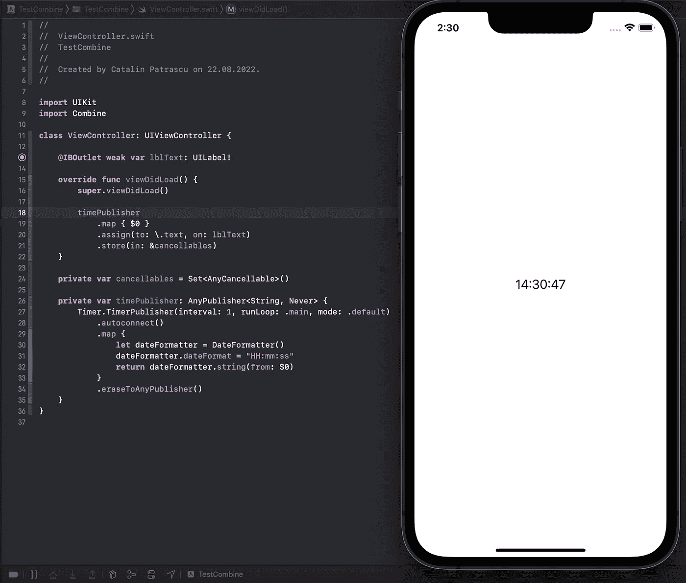
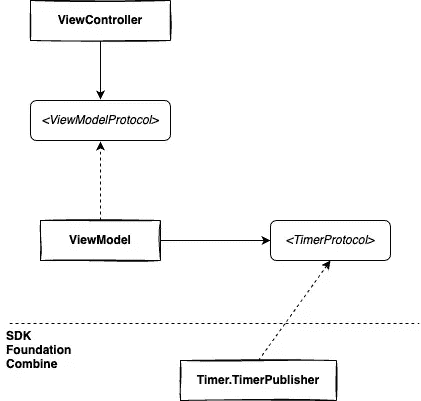
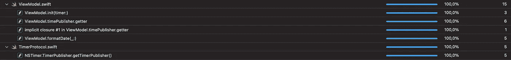

# 如何在 Combine Swift 中测试计时器发布器

> 原文：<https://betterprogramming.pub/how-to-test-the-timer-publisher-in-combine-swift-ed5cf0190402>

## 使用 MVVM、UIKit、Swift 和 Combine 对 TimerPublisher 进行单元测试的简单指南

由 [Aron 视觉效果](https://unsplash.com/@aronvisuals?utm_source=medium&utm_medium=referral)在 [Unsplash](https://unsplash.com?utm_source=medium&utm_medium=referral) 上拍摄的照片

几年前，在瑞典一家大型媒体公司的面试中，第二阶段的编码挑战是创建一个简单的计时器。

`Combine`当时没有，我就用了普通的`NSTimer`。创建一个工作 app 后，有人问我:*接下来你会怎么做？*

我对自己简单的 app 信心满满，毫不犹豫地回答:*没事！看看吧；太完美了。*

不用说，我面试没通过。

现在让我们进入 2022 年。想象你得到同样的问题，你被要求使用`Swift`和`Combine`。

任何编码/结对编程面试的第一步都是让应用程序实际工作，所以假设你从类似下面的代码开始:

Swift 中使用 Combine 的简单定时器示例

这很简单，直截了当，解决了问题，但不要只是打开香槟。

你很可能会得到后续问题:*接下来你会怎么做？*

面试官在这里寻找的微妙之处是什么？

# 代码优化

我觉得这里不应该是这样的。对于优化这个简单的任务，我们无能为力。

# 体系结构

因为每个人都喜欢`MVVM`，而且这似乎是现在最常用的软件架构模式，我们可以做下一步重构，把`lines 26–35`变成类似于`ViewControllerViewModel`的东西。也许我们也可以遵循一些协议，把它叫做。

# 代码可测试性

以下是区分中级/高级/首席工程师答案的有趣部分:

1.  测试大多数`Combine Publishers`将需要使用`expectation`和`waitForExpectations(timeout:)`，这将创建一个异步测试环境，我们应该尽可能避免这种情况，因为可能会有延迟和不可预测的行为。我们应该总是通过运行同步代码来尽可能快地保持我们的单元测试。好在 PointFree 的人为此创建了一个[库](https://github.com/pointfreeco/combine-schedulers)，我们可以使用`ImmediateScheduler`。
2.  我们如何控制时间？我们的测试必须是确定性的，基于纯粹的函数(更多关于这个主题的[在这里](https://levelup.gitconnected.com/pure-functions-in-software-development-d315a4520da1))。
3.  我们如何利用单元和快照测试的依赖注入来从上述两点中获益？

下面是我们需要做的事情的总结:

*   我们需要使用`MVVM`
*   我们需要让我们的测试代码同步
*   我们需要控制时间
*   我们需要使用依赖注入

很多事情要考虑。让我们看看如何接近他们。

在开始编写任何代码之前，让我们先从绘图板开始创建`To-Be architecture`。

未来架构和实体之间的关系

控制时间的第一步是定义我们自己的日期流，并扩展`TimerPublisher`以符合它。

为什么使用协议而不是继承？`TimerPublisher`是一个最终类(所以我们不能继承),在它上面的`Swift`是一个`Protocol Oriented Programming`语言，所以问题解决了。

第二步是`ViewModel`不依赖定时器的具体实现，而是依赖抽象协议。所有`ViewModel`需要知道的是，它依赖于某人来提供一个数据流。

剧透警告:在这个阶段，我们可以实现`ViewModel`的 100%可测试性，但让我们继续下去，看看`ViewController`现在是什么样子。

第三步是让`ViewController`使用`ViewModelProtocol`。这种方式为以后快速简单的快照测试做好了准备。

最后一步是在工厂、协调器或控制链中更高的位置创建和配置组合路径中的`ViewController`的实际实例。

最后，让我们看看`ViewModel`神奇的同步和确定性单元测试是什么样的:

代码覆盖率统计

现在想象一下如果我在面试的时候这样回答。谁知道我的职业生涯会发展到什么地步，或者这个故事会不会出版？🤯

我真的希望你喜欢这个故事，并且觉得它很有见地。

*敬请期待更多。*