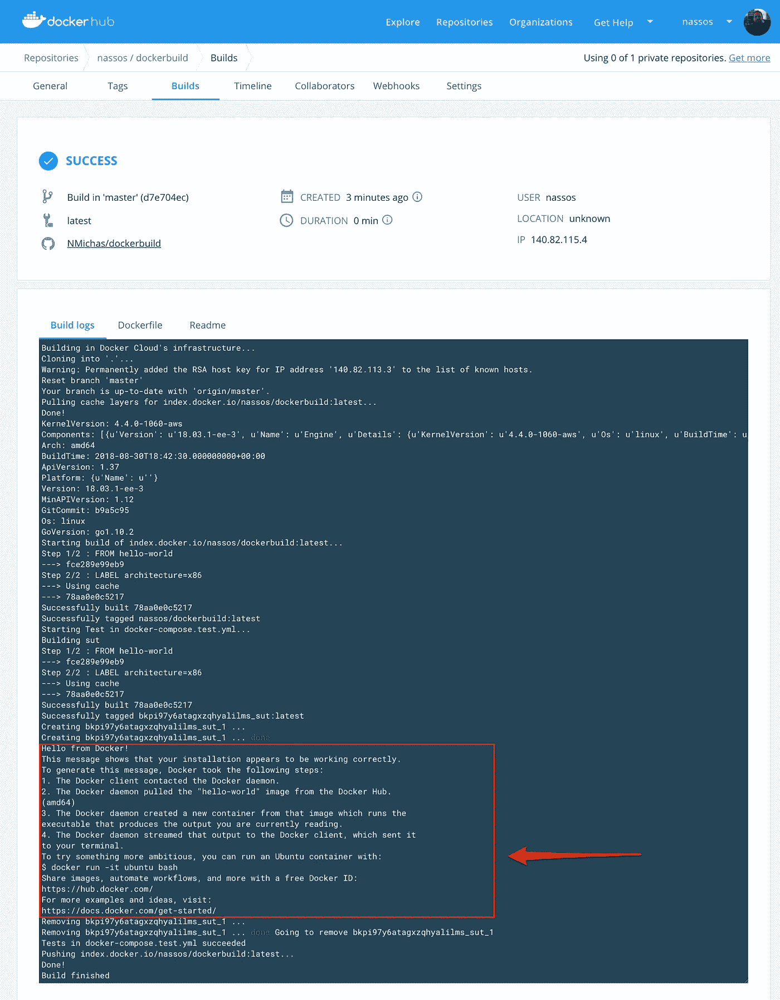
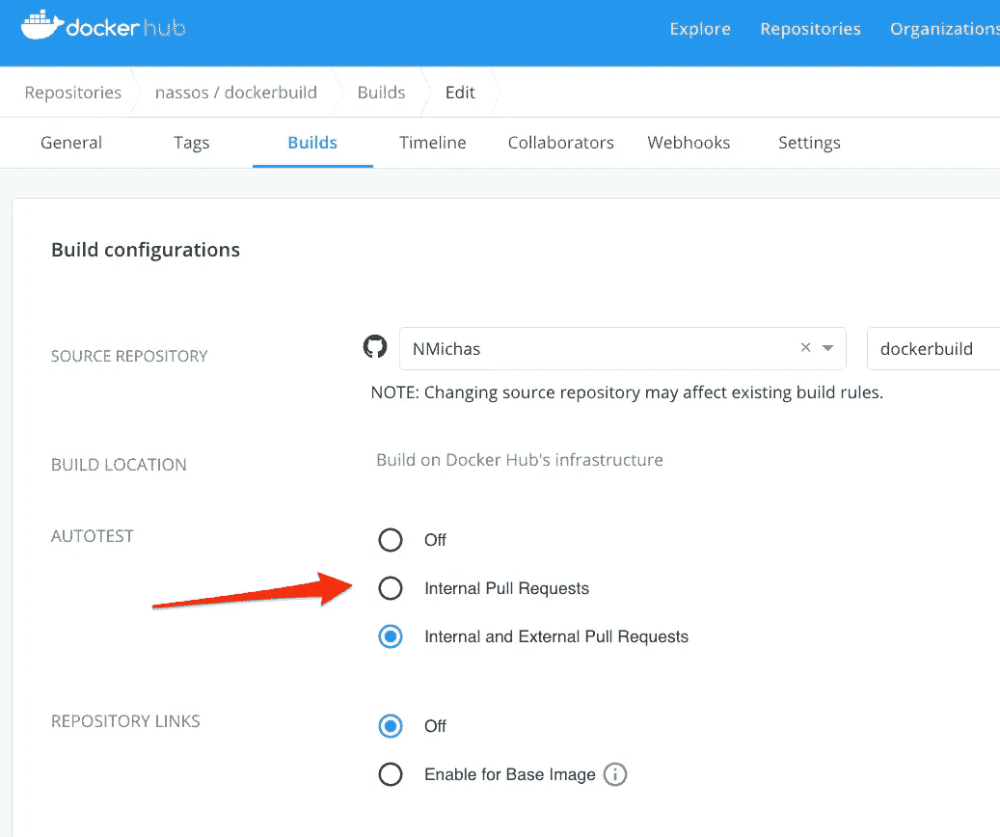

# 如何在 Docker Hub 上测试你的自动化构建

> 原文：<https://betterprogramming.pub/how-to-test-your-automated-builds-on-docker-hub-e40879f35d1e>

## 当你在 GitHub 上发布代码时，让你的测试启动起来


Tammi Baliszewski 在 [Unsplash](https://unsplash.com?utm_source=medium&utm_medium=referral) 上拍摄的照片

在[上一篇文章](https://medium.com/@NMichas/build-your-docker-images-automatically-when-you-push-on-github-18e80ece76af)中，我演示了如何快速设置 Docker Hub 工作流，以便在 GitHub 上推送代码时自动构建容器映像。

在本文中，我们将探讨如何在公开发布之前自动测试您的图像。

Docker Hub 允许您定义一系列要执行的测试。一旦它为您自动构建了一个映像(并且在这个映像被标记为可供公开下载之前)，这些测试就会发生。

根据您的测试结果，您的图像将被发布或不发布，从而确保只有有效/正确的图像被推送到您的 Docker 存储库。

# 指定您的测试

我想首先想到的问题是:“我可以执行什么样的测试？”简而言之:任何事情。但是接下来是一个更长的答案。

Docker Hub 允许您通过将一个
`docker-compose.test.yml`文件放在与您的`Dockerfile`相同的级别来指定您的测试。事实上，只要它们都以`test.yml`结尾，您可以根据需要拥有任意多的这些文件。

在 Docker 合成文件中，您应该遵循特定的结构，以便 Docker 能够使用它。模式很简单:

```
sut:
  build: .
  command: test_command
```

服务名`sut`是必需的，所以不要省略或替换它。下一个指令，`build`，实际上建立了你当前的形象。然后用一个`command`来指定您想要执行的命令来开始您的测试。

所以让我们在这里修改一下最初的问题:这些应该/可能是什么样的测试？为了回答这个问题，我们应该记住三件事:

1.  您指定的任何测试命令都在一个容器内运行，该容器从您用 Docker Hub 构建的映像实例化而来。您必须确保所有资源、外部应用程序、程序和脚本在您的容器中都可用，以便您的测试命令可以找到并使用它们。
2.  Docker Hub 自动化测试可以帮助您验证您推送的映像可以在以后成功地实例化一个容器。这很可能不是执行单元、集成、性能或其他更适合 CI/CD 管道的前一步的测试的地方。例如，如果您的单元测试失败了，您是否不想在实际将构建升级到 Docker Hub 之前知道这一点？使用适当的工具和环境来执行您的测试。
3.  Docker Hub 构建在它们可能消耗的时间和资源方面有特定的限制。拥有一个复杂的构建和测试工作流可能会让你超出那些相当宽松的限制，导致你的构建和测试失败。根据 [KB000470](https://success.docker.com/article/what-are-the-current-resource-limits-placed-on-automated-builds) ，这些限制目前为:
    -总执行时间:2 小时
    -总使用内存:2 GB
    - CPU 分配:1 个 CPU
    -总使用磁盘空间:30 GB

总之，尽可能缩短您的构建和测试，最大限度地减少资源使用，并在 CI/CD 管道的后期测试什么是合适的。

# 构建和运行测试

使用我们在[上一篇文章](https://medium.com/@NMichas/build-your-docker-images-automatically-when-you-push-on-github-18e80ece76af)中创建的[简单项目](https://github.com/NMichas/dockerbuild)，我们讨论了如何创建自动化构建，我们现在将编写一个测试作为自动化构建的一部分来执行。

## 成功的测试返回 0

这是一个非常简单的规则。

为了让 Docker Hub 意识到您的测试已经成功执行，并且您的映像现在有资格被标记并分发给他人使用，您的测试脚本应该返回一个零(0)的退出/返回代码。

任何其他代码都被视为错误，会将您的构建呈现为失败，不会对其进行标记，也不会使其在 Docker Hub 上可供下载。

## 创建`docker-compose.test.yml`文件

因为我们只有一个简单的 Hello World 项目，所以除了`hello-world`二进制文件本身之外，我们没有什么可以真正测试的。创建一个
`docker-compose.test.yml`文件，并放置以下内容:

```
sut:
  build: .
  command: /hello
```

将该文件添加到 GitHub repo 中，然后推送。如果您已经遵循了本系列中[上一篇文章](https://medium.com/@NMichas/build-your-docker-images-automatically-when-you-push-on-github-18e80ece76af)的构建规则，几分钟后您应该会有一个带有*最新*标签的新构建。通过检查这个构建的输出，您现在可以看到我们的测试命令被执行了:



测试成功执行

## 在接收拉取请求时启用自动化测试

您还可以让 Docker Hub 在您的 GitHub 存储库收到 PRs 时自动执行您的测试。登录到您的 Docker Hub 帐户，并切换到您正在使用的存储库。导航到 Builds 选项卡并单击 Configure Automated Builds 按钮:


配置您的自动化构建

要启用测试，您只需选择自动测试部分 *:* 下的一个可用选项



选择测试类型

除了关闭，这是一种不言自明的方法，其他两个选项告诉 Docker Hub 在什么情况下执行您的测试。
当 PRs 来自相同的源存储库时，内部拉请求执行测试，而内部和外部拉请求总是执行测试。

请注意，出于安全原因，接收外部 pull 请求时的测试执行只适用于公共映像(否则，任何人都可以通过发送包含一些精心制作的测试的 PR 来访问您的私有映像及其数据)。

# **本系列其他文章**

[](https://medium.com/better-programming/build-your-docker-images-automatically-when-you-push-on-github-18e80ece76af) [## 当你在 GitHub 上推送时，自动构建你的 Docker 图像

### 在 GitHub 上推送代码时，如何在 Docker Hub 上设置自动化构建。

medium.com](https://medium.com/better-programming/build-your-docker-images-automatically-when-you-push-on-github-18e80ece76af) [](https://medium.com/@NMichas/how-to-recover-from-a-failed-automated-docker-hub-build-8b6c1cc3d7d4) [## 如何从失败的自动化 Docker Hub 构建中恢复

### 你的 Docker Hub 自动化构建失败了吗？这里有一个如何恢复它的快速指南。

medium.com](https://medium.com/@NMichas/how-to-recover-from-a-failed-automated-docker-hub-build-8b6c1cc3d7d4)