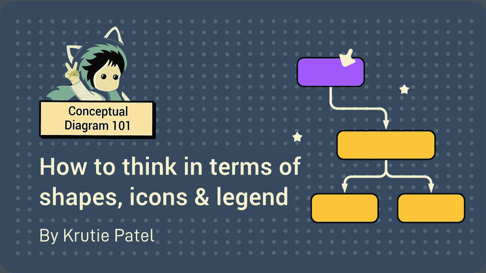
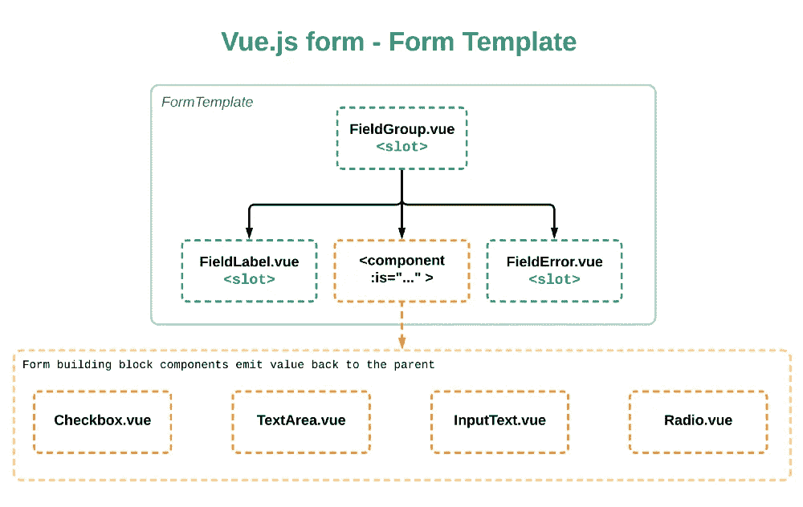
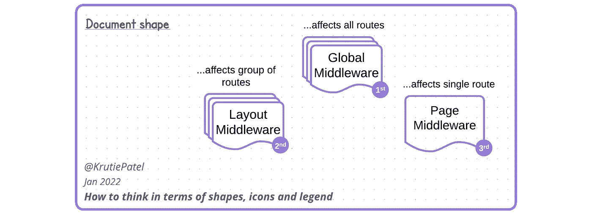
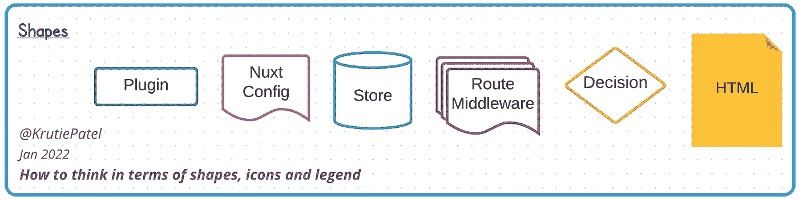
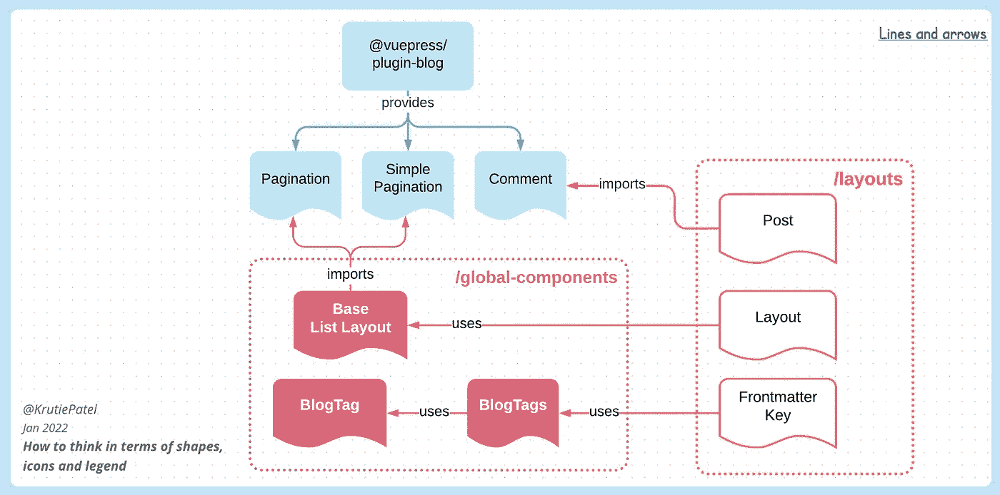
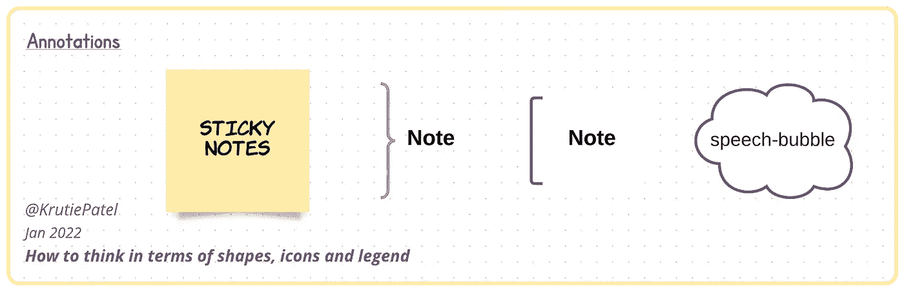
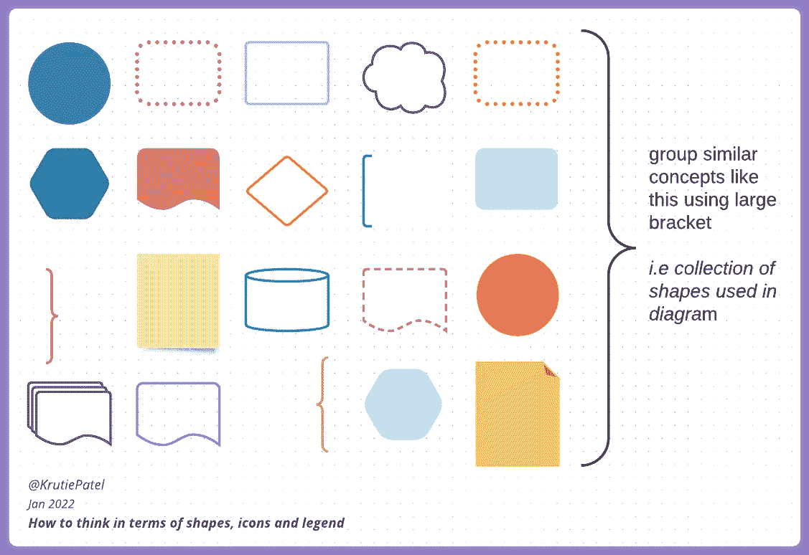
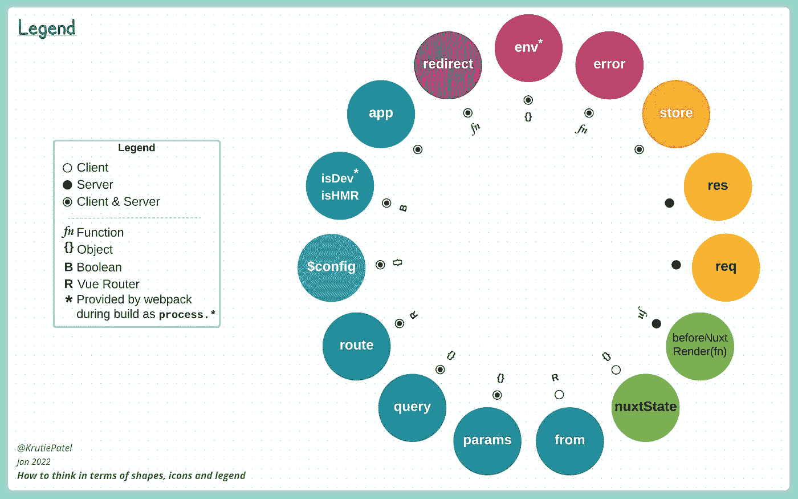

# 概念技术图:如何考虑形状、图标和图例

> 原文：<https://betterprogramming.pub/how-to-think-in-terms-of-shapes-icons-and-legend-ecd63794e8b0>

## 前端开发人员创建惊人概念图的初学者指南



概念图是展示技术事实或事物如何工作的一种可视化方式。这些图是用矩形框和连接线创建的，其中框用于容纳*概念*，线用于显示两个概念之间的*关系*。

在这篇文章中，我们将深入挖掘这些概念和关系的可视化。

本文假设您对我上一篇文章中的概念图有一个基本的了解。

> 没看过之前的文章？了解概念图的[构建模块，并逐步完成 *reduce()* 方法图的示例](https://krutiepatel.com/blog/how-to-create-technical-conceptual-diagrams)。

仅使用带有连接线的矩形框可以很好地创建有意义的图表，但是想象一下当我们在形状本身中添加一些上下文时会发生什么！

# 矩形与其余部分

在前端环境中，大多数主题可以通过以下方式表达:

*   文件和文件夹，
*   这些文件和文件夹里都有什么
*   他们之间的联系。

参见下面的组件树示例，我计划使用 Vue.js 构建一个动态的可配置表单。



表单模板组件

虚线框明确标注为`.vue`文件。在本例的上下文中，虚线用于表示**可重用组件**。框可以是实线、虚线或虚线边框。作为作者，你必须赋予这些特别呈现的形状相关的意义。

此外，图表使用两种颜色:绿色和橙色。绿色方框表示已知组件，橙色方框应该由`<component :is="...">`动态渲染。该图试图显示`:is="..."`道具的可能值，它可以是`Checkbox`、`TextArea`、`InputText`或无线电组件。

你可以看到概念通常是如何以矩形呈现的。但是，如果我们考虑背景，并增加一点点创造力，我们会找到其他方式来阐明想法。

这就是我们将从流程图符号中得到帮助的地方。我们都见过流程图，知道流程图的形状是什么样的。因此，我们将借用一些合适的形状，并将它们放入概念图中。

例如，当我们想引用单个文件而不是多个文件时，可以用*显示*。我使用了多个文档形状来表示*全局*和*布局*中间件可以影响多条路线，而*页面*中间件可以一次应用于一个页面。看到这个形状，我们的大脑会立即寻找额外的含义，即有三种类型的路由中间件，以及它们之间的区别和它们的用例。(概念参考:Nuxt-2 路由中间件)



单个和多个文档形状

对于每个概念来说，找到一个独特的形状是没有限制的。但是我们有一些流程图形状，比如数据库、决策点和不同类型的箭头，非常适合我们的用例。



图表形状

# 线条和箭头

线条和箭头是我们图表的指路明灯。它们将用户的注意力从一个概念引导到下一个概念，同时显示它们之间的关系。



线条和箭头

在上面的例子中，我们有两个文件夹:`/global-components`(粉色)和`/layouts`(橙色)。箭头的方向表明图表从右向左流动。如果我们跟随箭头和它们的连接词，它们形成简单的陈述。例如布局 ***使用*** 基本列表布局(组件)。发布 ***导入*** 评论(由`@vuepress/plugin-blog plugin`提供的组件)等等。

> *在概念图文献中，这些简单的陈述被称为*命题*。*

线条也可以是实线、虚线或虚线。作为一个作者，你应该总是用图例或注释给这些特别呈现的线条赋予相关的含义。

# 释文

视觉注释允许我们添加无法用简单形状或不太冗长的方式表达的解释或注释。



批注形状

我记得 [Lucidchart](https://www.lucidchart.com/pages/) 是第一个在最早版本中引入便利贴形状的软件之一。我瞬间爱上了它！如今，几乎所有的绘图软件都提供了添加便笺的选项。

便笺是我用来添加通常不适合图表本身的信息的工具。演讲泡泡形状也是如此。我建议使用便利贴和语音气泡将其中一个重要的“大声思考”的想法添加到图表中。

在这里，我也要感谢 Lucidchart，他向我介绍了这些大而卷曲的方括号形状。尽管它们是注释形状，但有时它们也是一种在图表中对相似概念进行分组的方式。



使用括号形状将相似的概念分组

如果这些特殊的形状在你选择的软件中不可用，你可以像上面的第一个例子一样使用我们的老式矩形盒子。

# 图标和图例

图标节省空间，不用任何文字就能表达很多意思。图标对于一个好的概念图来说是必不可少的，就像表情符号对于任何聊天应用程序一样。

图例是一小段文字或短语列表，解释图表中使用的图标或特殊字符。

图标和传奇携手并进。它们作为一种节省空间的机制，可以帮助我们为图表添加更多的含义。每当我们用一个图标来表示某个东西时，就有必要在图例部分对其进行解释。用简短的单词或短语而不是较长的语句来编写图例内容是一种很好的做法。

让我们看看如何根据传说来思考。



带图例的图表

考虑这个 Nuxt-2 `Context`的例子，它提供了一个添加图例部分的完美用例。Nuxt `Context`提供了我们在图中看到的所有键。它们是函数、对象、布尔值的组合，有些只能在客户机或服务器上使用，有时两者都有，甚至更多！现在想象一下，如果我们用文字来写这些关键属性！它会立刻使图表变得混乱，使它很难阅读。

前面我们看到了如何使用括号形状来分组相似的概念，这里有另一个例子来说明如何使用颜色来做同样的事情。看看`route`相关的按键是如何在深绿色的圆圈中组合在一起的。

通过侧面的图例和彩色编码的圆圈，我们能够节省空间，同时保持关键焦点不变。例如，参见粉色圆圈中的`env`键。我们很容易看出`env`键是 1)一个对象，2)由 Webpack 在构建期间提供，3)它在两个客户端&服务器上都可用。

这是一个传奇的极端例子。但是一般来说，当我发现自己在一个图表中重复某个东西超过两次时，我会把它放在图例部分下。

# 格式

图表的最终交付格式是您应该从一开始就考虑的。这样一来，事后要做的编辑和重新编排就更少了。我为打印和博客创建了大部分图表。

对于打印，A4 大小的文档非常适合，因为它易于打印，并且足够大，可以存储大量信息。

对于博客文章、社交媒体和一般网络，任何可访问的图像格式都是合适的。如果您的图表软件允许导出 PDF，那么 PDF 格式提供了高分辨率、微小的文件大小以及文档内可访问的超链接，以便随图表一起添加更多的参考链接。

# 包裹

如果你已经做到了这一步，非常感谢你阅读我关于这个主题的文章！

总而言之，我们有形状、线条、箭头、注释和颜色代码来创建图表。我们可能不需要每次都给代码形状添加注释和颜色，而是只在它们有意义并且有助于简化复杂主题时才使用它们。

我们在这里学到的大部分内容将取决于您选择的图表软件，但是理解这些视觉元素将帮助您:

*   添加一点视觉环境，
*   从图表的视觉构成角度考虑
*   强化关键主题的整体含义。

我希望这篇文章对你有所启发，给你一个简单的起点，让你开始考虑你的图项目。

接下来，我计划围绕工具和软件的新内容来创建图表。

# 资源

**文章:** [用 Vue](https://medium.com/vue-mastery/building-an-interactive-and-distraction-free-form-with-vue-bfe23907e981) 构建一个互动且不受干扰的形式。您还会在本文中找到其他相关图表供您参考。

**本文中提到的示例图:**

*   [Nuxt 生命周期挂钩](https://krutiepatel.com/diagrams/understanding-nuxt-js-lifecycle-hooks-1527256800)
*   [构建 VuePress 博客主题](https://krutiepatel.com/diagrams/vuepress-theme-blog-1577109600)
*   [Nuxt 上下文](https://krutiepatel.com/diagrams/nuxt-context-2-13-plus-1595599200)

*最初发表于*[*https://krutiepatel.com*](https://krutiepatel.com/blog/how-to-think-in-terms-of-shapes-icons-and-legend)

```
**Want to Connect?**Follow me at [@krutiepatel](https://twitter.com/KrutiePatel) to get notified of upcoming contents.
```