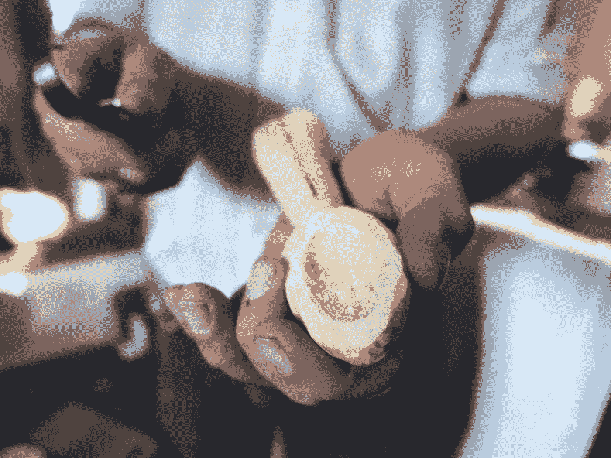
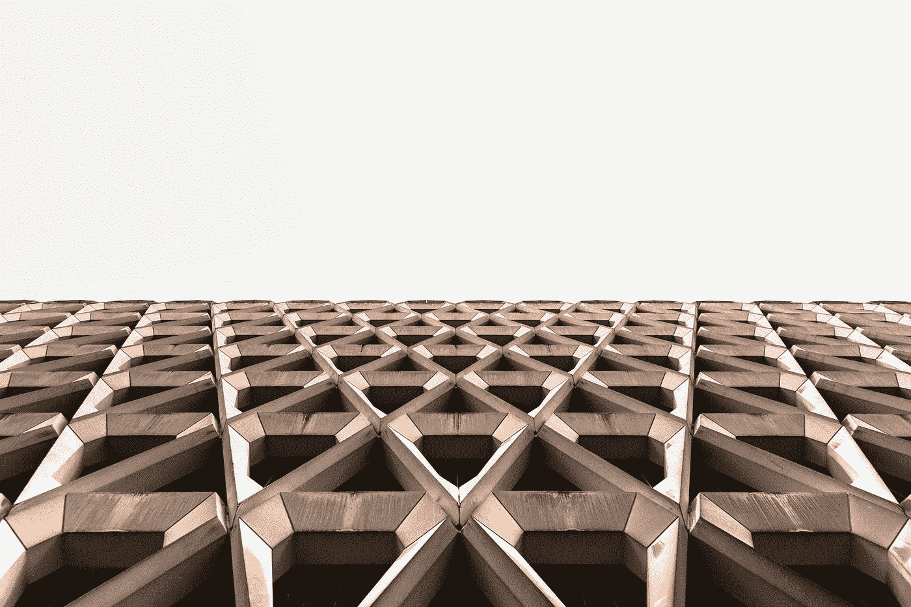

# 如何成为一名普通的程序员

> 原文：<https://betterprogramming.pub/how-to-thrive-as-an-average-programmer-1dd202540ac>

## 我们这些非天才的生存指南

费尔南多·埃尔南德斯在 [Unsplash](https://unsplash.com?utm_source=medium&utm_medium=referral) 上的照片。

这是一件很难承认的事情，也不完全是你在我的正式简历中能找到的东西:我是一个普通的程序员。我理解(大部分)代码，但我不会做梦。网芯。红宝石和宝石是我没钱买的东西，因为我写的红宝石不够多。我还没有构建自己的框架，当我在编程语言之间切换时，如果需要的话，我会伸手去拿备忘单。

这并不是说我不喜欢编码。事实上，我喜欢它，因为它让我想在几分钟内换工作。我非常讨厌敏捷方法，因为它总是被那些认为这是一个全新概念的人滔滔不绝地说出来，我们都需要为此接受过多的培训。我可以就我所在的科技世界的小角落里发生的事情咆哮几个小时——更不用说整个世界了。

然而，我上床睡觉时很高兴有一份我热爱的工作，这份工作让我保持理智和疯狂，足以让我度过一天，而不是为了感受什么而把热蜡滴在手指上。这是一种相对较好的生活，我希望在这篇文章中展示我是如何以及为什么学会享受这种生活，并在我所做的事情上变得相当出色。

# 从不讨厌自己的工作开始

喜欢甚至热爱你所做的事情并不是一个简单的精神开关就能做到的，但是你可以停止讨厌它。我从事编码工作更多是出于偶然。我擅长计算机，所以我发出了一些申请，尽管对编码一点都不了解，但不知何故还是获得了一份学徒资格。我和一大群选择这份工作的人一起做学徒，努力学习让雇主感兴趣的技能。说到裸编码，他们过去和现在都比我的技能超前好几光年。

程序员生活中还有其他领域。我们一会儿会谈到这个问题，但是现在，让我总结一下，你的工作中有一些很小的地方是可爱的，古怪的，令人愉快的。

即使在我实习期间，我也有相当广泛的数据库访问权，因为我经常独自漫游，所以我开始钻研统计数据。我们有多少顾客有这个，那个，或者又是这个？一般客户写多少封邮件？联系我们最常见的原因是什么？

最后，我成了一名数据库侦探，每当有人需要统计数据或运行大量更新以节省我们客户支持人员的时间时，我都会迅速深入研究。这从来都不是我正式工作描述的一部分，但是当你利用可利用的时间去帮助别人时，没有人会抱怨。

与我平常的工作不同，我不讨厌这样。事实上，这很有趣，有时，我会在桌子上发现一块巧克力作为对帮助的感谢。顺便说一下，这是让你的代码猴子喜欢你的一个简单方法——尽管我不喜欢巧克力，只把它送给有需要的同事。

# “Git Gud”在你做什么

在 [Unsplash](https://unsplash.com?utm_source=medium&utm_medium=referral) 上由[àlex Rodriguez](https://unsplash.com/@alexabad?utm_source=medium&utm_medium=referral)拍摄的照片。

我一直遵循一条普遍的原则，即精通一个领域不如精通几件事更令人向往——在编程领域，这一点更是如此。

做好你的工作有很多种方法，要么通过努力工作，要么仅仅通过经验，快速修复别人要花很长时间才能修复的错误。如果你设法让自己的头露出水面一段时间，你会开始看到地平线上的光，开始理解系统如何工作，你会找到自己的小解决办法，解决那些可能让别人担心的问题，而他们却在想象所有可能出错的事情。

我工作的一部分包含诸如“生产数据库测试”之类的暴行，其中我绕过、欺骗、反转并编辑实时数据库，以修复我无法测试的关键错误，因为测试数据库每周只克隆一次，而且从不在您需要时克隆。“祈祷和承诺，”我喜欢说。最坏的情况会是什么？

这可能会导致纯粹主义者在工作中遇到一个小的身份危机，特别是考虑到没有办法对这种东西进行单元测试，我直接提交到主分支，因为我是唯一一个在这个系统上工作的人，没有人批准我的拉请求。我花了一些时间来绕过那些愚蠢的规则，以允许主分支机构的检查，我对此感到自豪。非常时期需要非常手段。

所有这些都是为了说明在编程的世界里有许多“gud”的影子。即使这仅仅意味着当事情以惊人的方式发生时在那里，成为那种承认自己的错误并在事后拖地板的人。

我深深陷入了“混乱的好”的角落，但正如我在那里找到了我的位置一样，你可以在相反的地方找到你的位置，你的整个系统井然有序，任务的格式非常好，即使没有编码技能的人也可以在需要时接管你的工作，他们都有适量的故事点分配给他们。精心制作的用户故事，在一个没有法律和秩序的世界里优雅地展示法律和秩序——这就是让你的团队领导在梦里看到你的脸的东西。

# 用你的技能做一些有趣的事情(并学习新的技能)

杰玛·埃文斯在 [Unsplash](https://unsplash.com?utm_source=medium&utm_medium=referral) 上拍摄的照片。

编程是一项工作，它给你带来挑战的同时也给你带来了能力。如今，几乎任何东西都可以用开源工具和语言来构建。有一个指南，几乎涵盖了你在爱好范围内可能遇到的所有事情。

所以发挥你的技能，从那里开始。建立一些愚蠢的东西，比如随机报价生成器，或者一些实用的东西，比如为人们解决问题并通过订阅费让你变得富有的网站。或者只是做任何看起来有趣的项目。有一次，我花了大量的时间用 PHP 构建了一个性爱故事生成器，因为我喜欢痛苦，而且在讨厌 PHP 太久太久之后，我想理解它。现在我想，这个项目可能需要一篇自己的文章。这已经够古怪的了。

这里的要点是，大多数时候，你只需要花时间——而不是钱——有大量的教程可以帮助你。

# 认识到编程不仅仅是写代码

由[布鲁克·卡吉尔](https://unsplash.com/@brookecagle?utm_source=medium&utm_medium=referral)在 [Unsplash](https://unsplash.com?utm_source=medium&utm_medium=referral) 上拍摄。

我花了一段时间才意识到，也花了一段时间人们才开始信任我的责任，但渐渐地，我把我的整个工作变成了与开始时完全不同的东西。这些天来，我写的代码相对较少——真的，只够我继续称自己为程序员。

相反，我最终成了公司里一个相当复杂、相当关键的系统的唯一维护者。我组织我的工作，与我的团队和同事交流，参加会议以提供我的专业知识和意见，尽我所能将所有事情从头到尾做好。

虽然压力很大，但我非常喜欢这种工作方式。没有一天是一成不变的，因为我是所有烦人事情的接收端——从引起大事件的小虫子到我宁愿跳过的会议——我总是很高兴地获得办公室戏剧来让自己有事可做。

我也开始享受和其他工作狂一起在办公室工作到深夜的时光，那些令人惊叹的放松但专注的工作时光，来自不同部门的人聚集在一个房间里，手牵手工作，因为最后期限很快就要到了。我喜欢呆在一个每个人都尽职尽责的房间里——在那里被接受，被欢迎。当你旁边的人不得不与他们自己的恶魔斗争时，两个小时后在一个连接的 SQL 查询中找到一个丢失的空格就不那么可怕了。

# 了解您公司的架构和生态系统

戴夫·马伦在 [Unsplash](https://unsplash.com?utm_source=medium&utm_medium=referral) 上拍摄的照片。

前几周，我们遇到了一个严重的系统故障——我不负责维护，但维护者、他的假期替代者和另一个可能知道一些事情的人生病或出国了。

我大概了解了这个程序的工作原理，开始着手这个案子，最终有两个和我一样一无所知的人加入了进来。但最终，我们设法将错误缩小到服务器故障，并与卖给我们系统的第三方公司合作，我们最终设法在周六早上恢复了一切工作。

当然，这是公司一半人虚度的一天，但也可能是两三天。这很容易就是我们各自一年的工资储蓄，因为我们对系统如何协同工作以查明错误和挖掘日志文件有一个大致的了解。

老实说，这是近年来最疯狂的一次，也是最有趣的一次。我甚至收到了部门老板发来的一封“工作不错”的邮件，当我在地板上碰到他时，他很快就知道我是谁了。幸运的是，那永远不会持续，我可以回到虚空的匿名状态。感谢上帝。

# 沟通

我在我的公司经历了一段差一点被解雇的时间——如果你读到这里，就很容易理解为什么会被解雇——因为我最近因为同样的工作而受到表扬。那完全是另外一个故事了，但是让我总结一下，交流让我的工作被人所认知。

做所有无用的事情，比如每当有人通知你一个错误时写一封感谢邮件，当错误被修复时回复，不管他们是否关心，写一个简短的一分钟解释为什么错误首先发生以及你如何修复它。我不仅了解到很多人喜欢你告诉他们这些事情，而且事情会自然发展，最终会回到你的身边。回应，回答，预测，准备，每天花一个小时和人交谈。

在这件事的过程中，我得到了一个我这些天来赖以生存的座右铭:向白痴解释事情，看着他们成为人。

# 结论

我希望你喜欢这篇文章，甚至觉得它很有用。它确实让我免于被解雇或辞职，并在森林里买了一个小木屋来远离所有的技术。这些想法现在保留到周三下午。

感谢阅读！