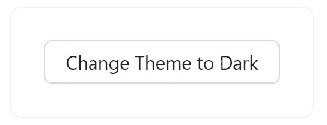
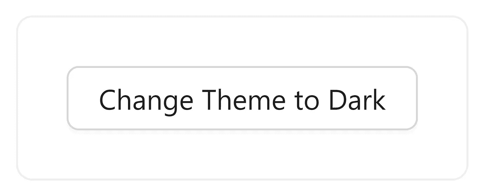
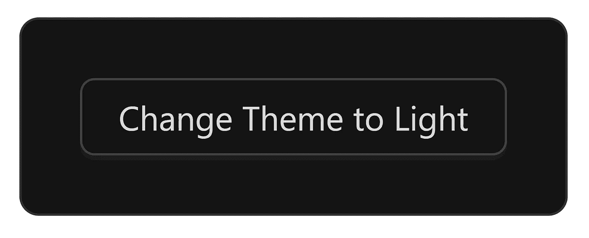
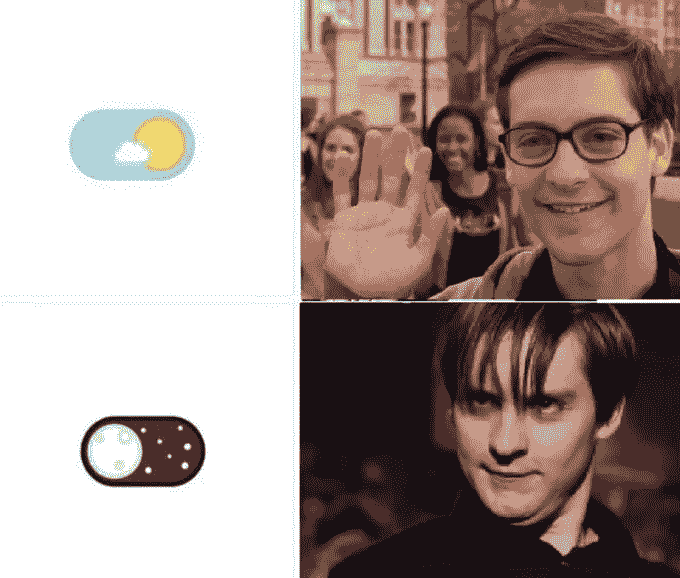

# 如何用蚂蚁设计 5.0 切换黑暗主题

> 原文：<https://betterprogramming.pub/how-to-toggle-dark-theme-with-ant-design-5-0-eb68552f62b8>

## 通过这一简单的切换提升您的用户体验


Oleksandr Kuzmin 在 [Unsplash](https://unsplash.com?utm_source=medium&utm_medium=referral) 上拍摄的照片

Ant Design 支持深色主题已经有一段时间了，在浅色和深色主题之间切换并不容易。您将有一些现成的组件支持，并且您必须使用像[@ call stack/react-theme-provider](https://www.npmjs.com/package/@callstack/react-theme-provider)这样的库来在不同的 CSS 文件之间切换。幸运的是，Design 5 让生活变得简单多了。

# 我们开始吧

## 第一步

您将需要一个运行 Ant Design 5.0.0 或更高版本的 react 应用程序。

要安装 antd，请使用`npm i antd`。

## 第二步

转到 React 应用程序中的`App.js`文件，导入以下内容:

```
import { useState } from "react";
import { ConfigProvider, theme, Button, Card } from "antd";
```

## 第三步

使用 AntD 提供的`theme`来解构和使用 AntD 提供的不同主题算法。AntD 提供了`darkAlgorithm`、`compactAlgorithm`和`defaultAlgorithm`，但是对于我们的用例，我们将只使用`darkAlgorithm`和`defaultAlgorithm`。

```
const { defaultAlgorithm, darkAlgorithm } = theme;
```

## 第四步

创建一个状态来跟踪我们当前使用的主题和切换主题。理想情况下，您应该为此使用一些状态管理，但是对于我们的用例来说，`useState()`完成了这项工作。

```
const [isDarkMode, setIsDarkMode] = useState(false);
```

## 第五步

用我们从 AntD 导入的`ConfigProvider`包装您的应用程序组件。这允许我们选择使用哪种算法，并根据自己的喜好定制主题。

```
return (
  <ConfigProvider>
    ...
  </ConfigProvider>
);
```

## 第六步

让我们创建一个组件，通过添加一个切换按钮来改变它的主题。

```
return (
  <ConfigProvider>
    <Card style={{ width: "max-content" }}>
      <Button>
        Change Theme to {isDarkMode ? "Light" : "Dark"}
      </Button>
    </Card>
  </ConfigProvider>
);
```



带有改变主题按钮的卡片

大家可以看到，Antd 的`ConfigProvider`用的是`defaultAlgorithm`，是光主题。

## 第七步

我们现在可以使用`ConfigProvider`提供的选项在主题之间切换。

```
return (
  <ConfigProvider
    theme={{
      algorithm: isDarkMode ? darkAlgorithm : defaultAlgorithm,
    }}>
    <Card style={{ width: "max-content" }}>
      <Button>
        Change Theme to {isDarkMode ? "Light" : "Dark"}
      </Button>
    </Card>
  </ConfigProvider>
);
```

我们将根据`isDarkMode`是`true`还是`false`来改变主题。

## 第八步

虽然我们创建了一个状态来跟踪主题，但是我们没有办法改变这个状态，所以让我们创建一个`onClick`处理程序来处理这个问题。

```
const handleClick = () => {
  setIsDarkMode((previousValue) => !previousValue);
 };
```

然后将处理程序添加到`Button`的`onClick`中。

```
return (
  <ConfigProvider
    theme={{
      algorithm: isDarkMode ? darkAlgorithm : defaultAlgorithm,
    }}>
    <Card style={{ width: "max-content" }}>
      <Button onClick={handleClick}>
        Change Theme to {isDarkMode ? "Light" : "Dark"}
      </Button>
    </Card>
  </ConfigProvider>
);
```

现在你完了！

# 最终结果

最后，你的`App.js`应该是这样的:

```
import { useState } from "react";
import { ConfigProvider, theme, Button, Card } from "antd";

function App() {
 const { defaultAlgorithm, darkAlgorithm } = theme;
 const [isDarkMode, setIsDarkMode] = useState(false);

 const handleClick = () => {
  setIsDarkMode((previousValue) => !previousValue);
 };

 return (
  <ConfigProvider
   theme={{
    algorithm: isDarkMode ? darkAlgorithm : defaultAlgorithm,
   }}>
   <Card style={{ width: "max-content" }}>
    <Button onClick={handleClick}>
     Change Theme to {isDarkMode ? "Light" : "Dark"}
    </Button>
   </Card>
  </ConfigProvider>
 );
}

export default App;
```

现在，每当你点击`Button`，你应该能够在亮暗主题之间切换。



轻音乐主题



黑暗主题

多年来，我一直是 Ant Design 的粉丝，但直到现在我才真正喜欢上他们处理主题切换的方式。Ant Design 5 让切换主题和定制主题变得超级简单。

要阅读更多关于定制的内容，请查看[文档](https://ant.design/docs/react/customize-theme)。

希望这有帮助！



彼得·帕克开关