# 如何用 API、Node.js 和 FastifyJS 跟踪求职申请

> 原文：<https://betterprogramming.pub/how-to-track-job-applications-with-notion-api-node-js-and-fastifyjs-26e070c92d7a>

## 了解如何在 Node.js 和 FastifyJS 中使用新的概念 API


马库斯·温克勒在 [Unsplash](https://unsplash.com?utm_source=medium&utm_medium=referral) 上的照片

概念是一个生产力软件，允许你创建知识管理、项目管理和笔记系统。

他们最近向公众发布了他们的 API。您可以使用 API 将您的概念数据集成到您想要的任何应用程序中。

因此，本文将向您展示:

*   用概念构建 Node.js API
*   使用 FastifyJS 创建 API

事不宜迟，让我们开始配置您的概念工作空间。

# 在观念上创造整合

转到您的[概念整合](https://www.notion.com/my-integrations)，点击“+新整合”按钮创建一个新的整合。之后，系统会提示您填写三个字段:

*   您的项目的名称
*   项目的标志
*   选择关联的工作空间

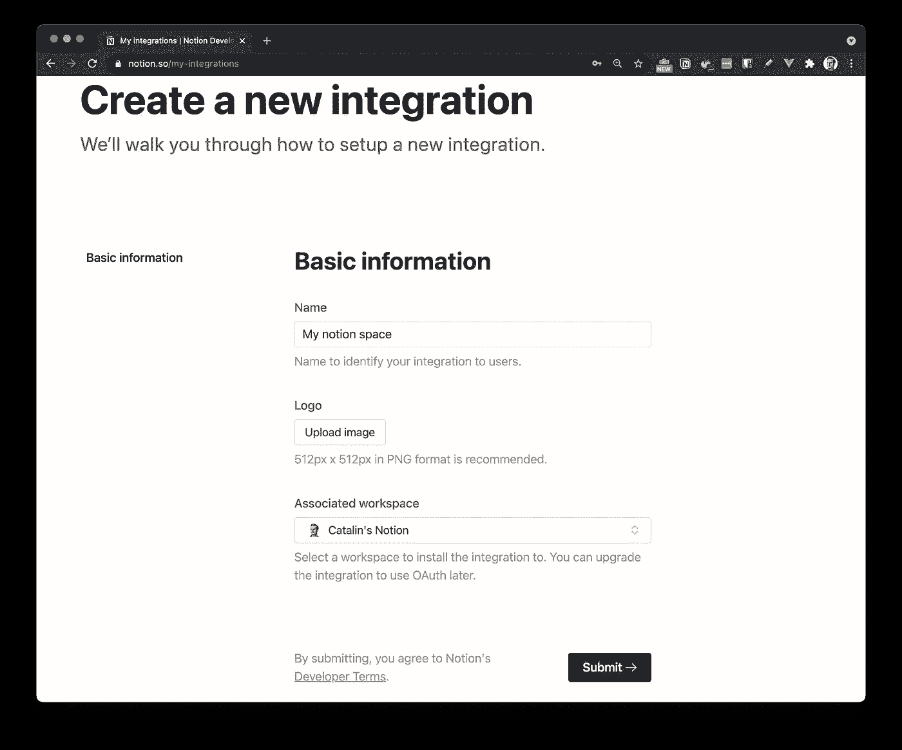

图一。

上面的图 1 说明了设置过程。填写完所有字段后，单击“提交”按钮创建集成。

单击 submit 按钮后，您的集成就应该创建好了。您将被重定向到另一个页面，在那里您可以获取“**内部集成令牌* *”。图 2 显示了这一点。

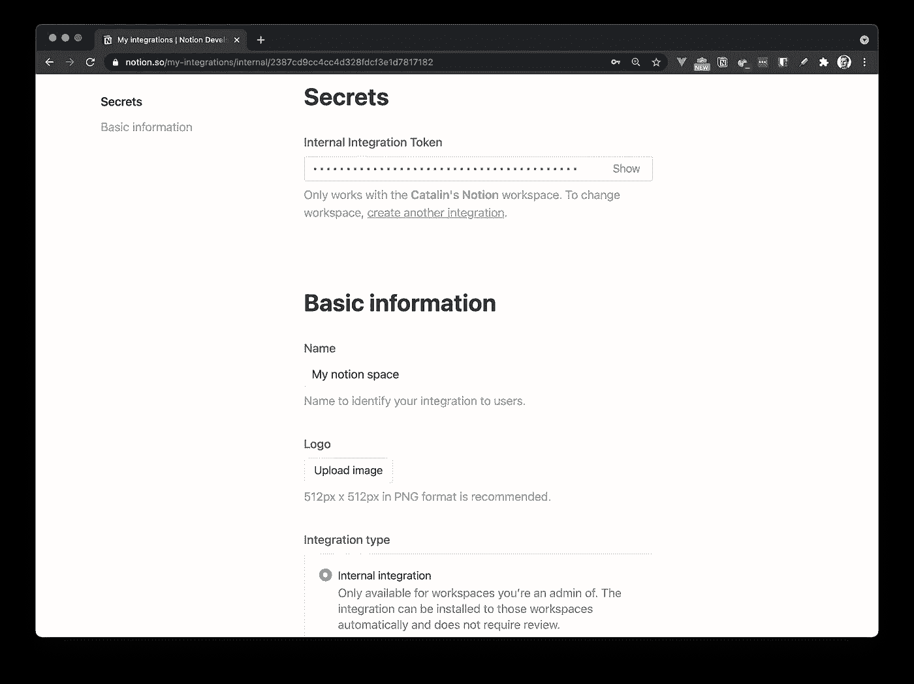

图二。

在继续之前，需要注意的是，您需要选中“**内部集成**”，如图 2 所示。

关于创建概念集成的更深入的教程，我推荐查看他们的官方文档。

# 分享您的想法页面

最后一步是与新创建的集成共享您想要的任何页面。转到您的概念帐户，选择您想要的任何页面。

页面打开后，点击“共享”按钮，然后点击“添加人员、电子邮件、群组或集成”字段

下面的图 3 说明了这一点。

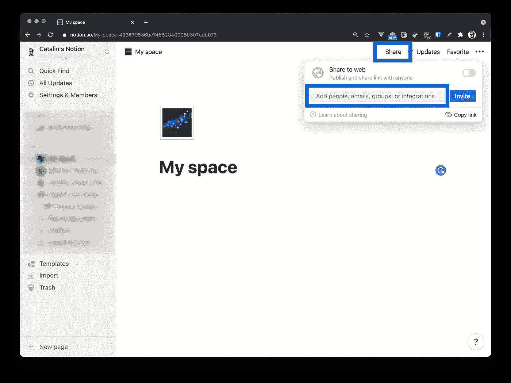

图 3。

单击该字段后，系统会提示您选择希望与谁共享页面。选择您的集成。在我的例子中，我与我的集成共享“我的空间”页面，称为“我的概念空间”

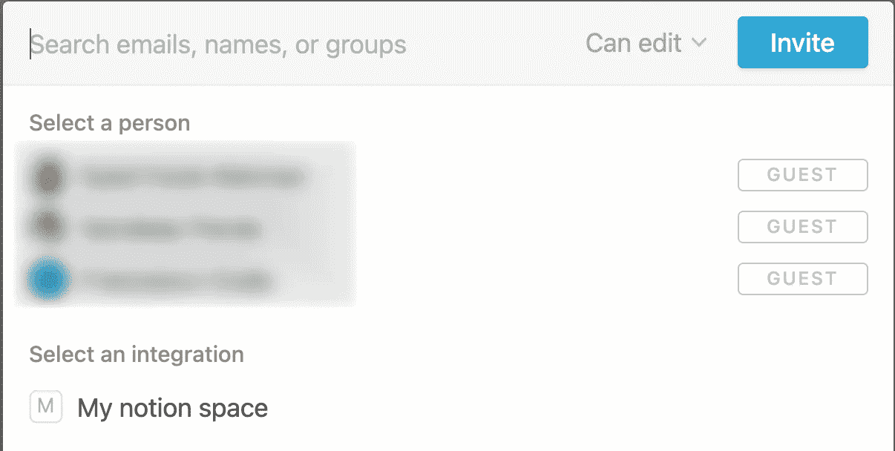

图 4。

这就是你在配置概念时需要做的一切，做得很好！您已经完成了概念配置，并准备好使用概念 API。

**注**:如果你想和我用同一个文档，可以复制这个[求职模板](https://www.notion.so/6c73f893f4c74718982504d36a6c43bb?v=345b93c08725486097551607ef394b8c)。在您复制它之后，与您的集成共享它(参见上面的过程)并使用您的数据库 ID(稍后您将看到如何获得数据库 ID)。

# 配置 Node.js 项目

您需要使用 JavaScript 的概念 SDK 来与 Node.js 应用程序中的概念 API 进行交互。观念 SDK 是观念 API 的一个客户端，你可以在它的 [GitHub 库](https://github.com/makenotion/notion-sdk-js)上找到更多关于它的信息。

第一步是创建应用程序结构。创建一个新文件夹并初始化应用程序，如下所示:

```
mkdir notion-api-app

cd notion-api-app

npm init -y
```

命令`npm init -y`创建 package.json 文件并用默认值初始化它。如果您想要手动填充字段，请移除-y 标志并按照说明进行操作。

下一步是安装创建应用程序所需的包。您将使用以下软件包:

*   **概念 SDK** —与概念 API 交互。
*   **FastifyJS** —构建 Node.js API。
*   **dotenv**——管理环境变量。

因此，您可以按如下方式安装软件包:

```
npm install @notionhq/client fastify dotenv
```

一旦安装了包，您需要创建一个文件来存储环境变量。您将在`.env`文件中存储概念秘密令牌和数据库 ID。因此，创建如下的`.env`文件:

```
touch .env
```

现在转到[你的概念整合](https://notion.so/my-integrations)并点击你的整合。您应该看到一个名为**内部集成令牌**的字段(参见图 2)。单击“显示”按钮并复制令牌。

下一步是转到您的`.env`文件并添加令牌:

```
NOTION_TOKEN=<your_token>
```

**注**:用你之前复制的令牌替换`<your_token>`。

在继续之前，您还需要为应用程序创建文件夹结构。您需要创建以下文件夹:

*   **app.js** —您的服务器配置之家。
*   src —它托管所有其他文件夹。
*   **路线** —您的路线的主文件夹。
*   观念 —观念客户端驻留在这里。
*   **控制器** —您的业务逻辑的主文件夹。

您可以从命令行创建所有文件夹和文件，如下所示:

```
touch app.js
mkdir src
mkdir src/routes src/notion src/controllers
touch src/routes/routes.js
touch src/notion/client.js
touch src/controllers/controllers.js
```

到目前为止，应用程序的结构应该是这样的:

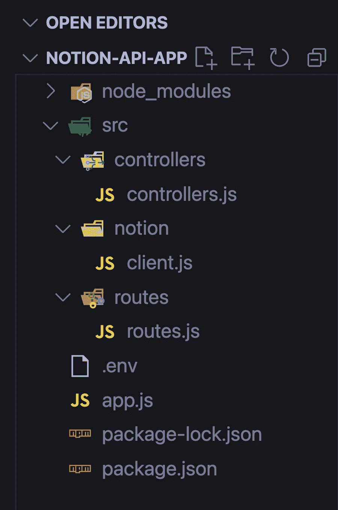

现在您已经准备好构建应用程序了！

# 在应用程序中配置概念

是时候配置概念客户机了，这样您就可以用它来操作数据。进入以下文件`src/notion/client.js`并添加以下代码:

```
const { Client } = require('@notionhq/client');

require('dotenv').config();
```

在第一行中，您导入了概念客户端，在第二行中，您导入了`dotenv`包。这些导入的目的是允许您使用概念客户端和环境变量。

下一步是创建一个新的概念客户端。在同一个文件中，导入后，编写以下代码:

```
const notion = new Client({
    auth: process.env.NOTION_TOKEN
});
```

使用上面的代码，您创建了一个新的概念客户端实例，并传递了您的秘密令牌。最后，将它存储在`notion`常量中，这样就可以重用客户端。

在继续之前，您需要导出`notion`常量，这样您就可以在编写业务逻辑时使用它。在同一个文件- `src/notion/client.js` -的末尾，写下如下代码:

```
module.exports = {
    notion
};
```

现在，您已经准备好使用概念客户机了。

检查[这个要点](https://gist.github.com/catalinpit/1cd4f8973fa6604fe2c856a3c939ec87)看看你的文件`client.js`应该如何查找到这一点。

## 如何获得数据库 ID

在构建路线之前还有一个步骤。您需要数据库 ID，以便执行以下操作:

*   创建、读取和修改数据

您可以通过两种方式获得数据库 ID。您可以从浏览器或通过编程来**完成。**

如果您喜欢从浏览器中完成，请在浏览器中打开概念文档并复制 ID，如图 5 所示。

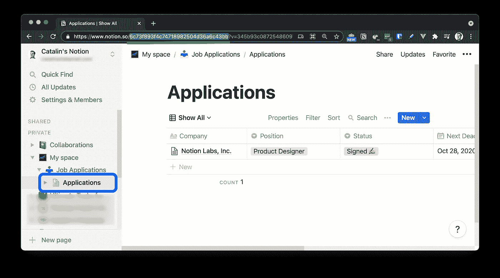

图 5。

或者，您可以通过编程方式获取数据库 ID，如下面的代码片段所示:

```
const getDatabases = async () => {
    const databases = await notion.databases.list();

    console.log(databases);
};
```

上面的代码片段列出了您所有的数据库以及关于它们的信息。有关可视化表示，请参见下面的图 6。

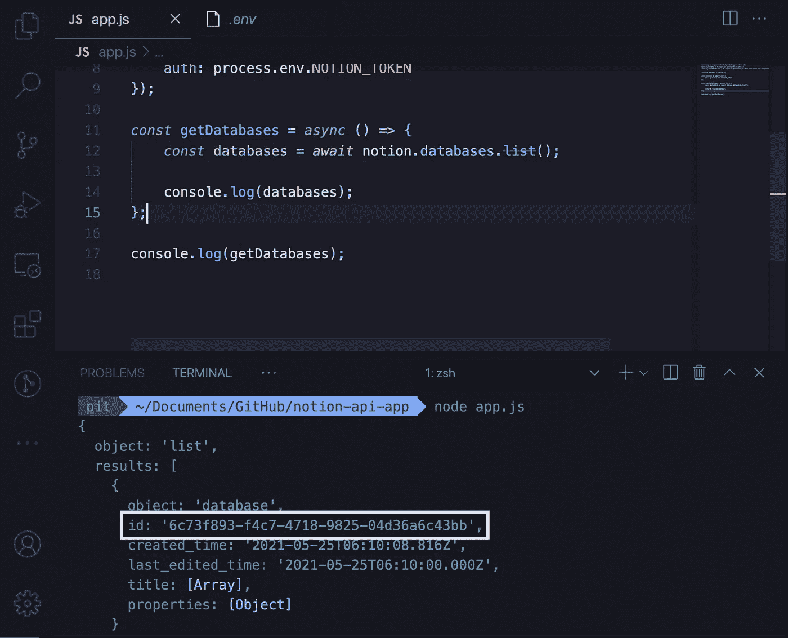

图 6。

无论您最终使用哪个选项，复制数据库 ID 并将其添加到您的`.env`文件中。此时，您的`.env`文件应该如下所示:

```
NOTION_TOKEN=<your_token>
DB_ID=<your_DB_ID>
```

您已经完成了项目中概念客户端的配置。下一步是创建路线和业务逻辑。

# 添加 FastifyJS

打开文件`app.js`，在文件顶部导入 FastifyJS。

```
const app = require('fastify')({ logger: true });
```

之后，再次导入“dotenv”包，这样就可以使用在`.env.`文件中定义的端口。

```
require('dotenv').config();
```

下一步是注册路由，即使您还没有编写它们。在导入之后，添加以下行:

```
app.register(require('./src/routes/routes'));
```

使用上面的代码行，您注册了所有的路由。也就是说，您使路线可用，以便用户可以访问它们。

最后，监听一个端口，以便运行应用程序。在文件底部添加以下代码:

```
app.listen(process.env.PORT, (err, addr) => {
    if (err) {
        app.log.error(err);
        process.exit(1);
    }

    app.log.info(`Your server is listening on port ${process.env.PORT} 🧨`);
});
```

应用程序监听您在`.env`文件中定义的端口。如果有错误，它会记录错误。否则，它会在控制台中输出服务器正在运行以及运行在哪个端口上。

因此，在您的`.env`文件中添加端口号— 3333。这个端口号只是一个例子；您可以使用任何想要的端口号。至此，您的`.env`文件应该如下所示:

```
NOTION_TOKEN=<your_token>
DB_ID=<your_DB_ID>
PORT=3333
```

检查[这个要点](https://gist.github.com/catalinpit/e63824b86d13a736fd8efa6cccadde15)看看你的文件`app.js`应该如何查找到这一点。

# 建造路线

下一步是创建路线。它们的目的是允许人们执行 CRUD 操作(*除了在本教程中删除数据*)。

首先，转到`src/routes/routes.js`，在文件顶部导入控制器。

```
const controller = require('../controllers/controllers');
```

即使您还没有编写业务逻辑，您也会需要它。之后，创建`routes`函数并将其导出:

```
async function routes(app, opts) {
    // the code for routes go here
};

module.exports = routes;
```

在`routes`方法中，您配置应用程序的端点。对于每条路线，您至少要指定:

*   **HTTP 方法** —例如，使用`GET` HTTP 动词返回数据库中的所有项目。
*   **URL** —例如，您可以使用端点`/job/applications`返回所有的工作申请。
*   **处理程序** —代表业务逻辑。例如，当人们访问端点`/job/applications`时会发生什么。

现在您已经理解了 FastifyJS 中的路由是如何工作的，让我们来构建第一条路由。

## 显示所有工作申请

当用户向端点`/job/applications`发出`GET`请求时，第一条路由显示所有的工作申请。

```
app.route({
    method: 'GET',
    url: '/job/applications',
    handler: controller.getAllApplications
});
```

## 获得特定的工作申请

第二条路线只显示了一份工作申请。当用户向`/job/applications/:id`路由发出`GET`请求时，它只显示其 ID 与 URL 中提供的 ID 相匹配的作业应用程序。

在第一条路线后编写以下代码:

```
app.route({
    method: 'GET',
    url: '/job/applications/:id',
    handler: controller.getApplication
});
```

## 筛选工作申请

第三种方法允许用户按公司名称过滤工作申请。用户可以使用名为`company`的查询参数来过滤结果。

URL 的一个例子是`/job/applications/filter?company="CatalinSoft"`。因此，通过向该 URL 发出一个`GET`请求，应用程序只返回“CatalinSoft”公司的工作申请。

在`routes.js`中编写以下代码:

```
app.route({
    method: 'GET',
    url: '/job/applications/filter',
    handler: controller.filterApplications
});
```

## 添加新的工作申请

第四种方法允许用户发出`POST`请求，将工作申请添加到文档中。当您使用适当的主体向端点`'/job/applications'`发出`POST`请求时，它会将工作申请添加到概念文档中。

编写以下代码:

```
app.route({
    method: 'POST',
    url: '/job/applications',
    handler: controller.addApplication
});
```

## 更新现有应用程序

最后，您有一个允许人们更新现有工作申请的途径。用适当的主体向`/job/applications/:id`发出一个`PATCH`请求，您将更新记录。

```
app.route({
    method: 'PATCH',
    url: '/job/applications/:id',
    handler: controller.updateApplication
});
```

这些是所有的路线。如你所见，它们遵循相同的模式:

1.  您指定 HTTP 方法。
2.  您可以添加人们可以提出请求的 URL。
3.  您提供了处理程序，当向该路由发出请求时会触发该处理程序。

此外，您可能已经注意到没有“删除”路径。这是因为概念 API 不允许你删除资源。

检查此要点[以查看完整的`routes.js`文件。](https://gist.github.com/catalinpit/c865810e9a5c4d2261e1fa3133bd143b)

# 添加业务逻辑

教程的最后一步是构建业务逻辑。业务逻辑指定当向特定端点发出特定 HTTP 请求时会发生什么。

让我们从在`controllers.js`文件中导入概念客户端开始。打开文件，在文档顶部添加以下行:

```
const { notion } = require('../notion/client');
```

现在，您可以使用客户机来操作数据。

## 检索所有工作申请

您编写的第一个方法是返回所有工作申请的方法。在`controllers.js`中编写以下代码:

```
const getAllApplications = async (req, res) => {
    const data = await notion.databases.query({
        database_id: process.env.DB_ID
    });
}
```

到目前为止，您使用概念客户机来查询数据库。上面这段代码返回一个对象，该对象又包含一个数组，该数组包含数据库中的所有页面。

这是您运行上述代码后得到的结果:

从这个响应中，字段`results`是您感兴趣的字段。这是包含数据库中所有页面的数组。

因为您有一个数组，所以您需要循环遍历它并只返回页面。回到方法`getAllApplications`并添加剩余的代码:

在代码的第二部分，映射到`results`数组并返回一个自定义对象数组。这些自定义对象包含以下信息:

*   身份证
*   当它被创造的时候
*   上次更新的时间
*   公司名称
*   你申请的职位
*   应用程序的状态
*   申请截止日期
*   职位描述
*   附加注释

让我们向`localhost:3333/job/applications`发出一个`GET`请求，看看会发生什么。

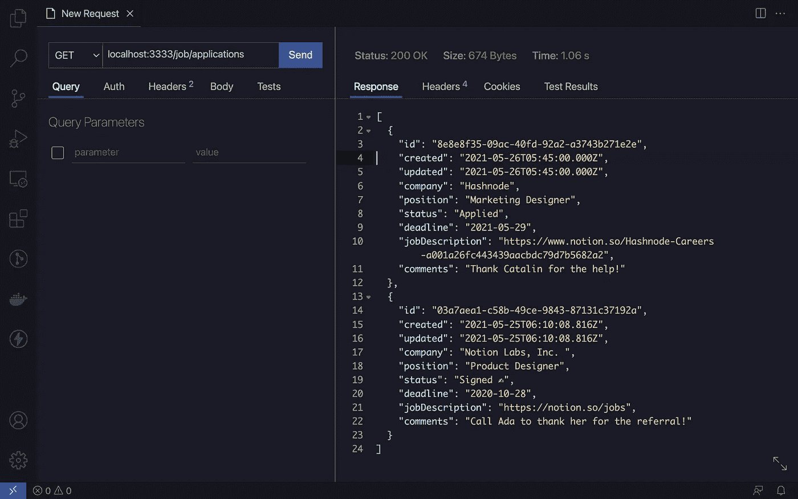

图 7。

图 7 展示了发出请求后会发生什么。您可以看到它返回了一个对象数组，这正是您在方法`getAllApplications`中构造它们的方式。

## 获取特定的应用程序

下一步是添加仅检索特定工作申请的业务逻辑。这一次，你用不同的方法。不是查询数据库，而是检索特定的页面。

在你的文件`controllers.js`中写下下面的方法:

该方法从 URL 获取页面的 ID。因此，如果您向 URL `http://localhost:3333/job/applications/8e8e8f35-09ac-40fd-92a2-a3743b271e2e`发出一个`GET`请求，该方法将从中获取页面 ID。

之后，它返回其 ID 与 URL 中提供的 ID 相匹配的页面。让我们提出一个请求，看看会发生什么。

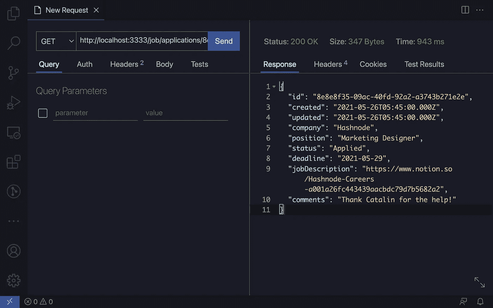

图 8。

图 8 展示了它返回您在方法`getApplication`中定义的定制页面对象。

## 过滤应用

概念客户端还允许您过滤数据。例如，您可能希望按公司名称过滤结果。因此，您可以在 URL 中传递公司名称，它将只返回该公司的工作申请。

在`controllers.js`中编写以下代码:

这种方法类似于第一种方法— `getAllApplications`。唯一的区别是，当您查询概念数据库时，您还传递了`filter`属性。

查询数据库返回一个 list 对象，该对象也包含一个名为`results`的数组。`results`数组包含所有匹配的记录。因此，您映射到`results`数组并返回一个带有自定义对象的数组。

如前所述，您按公司名称过滤结果。如果你向 URL `http://localhost:3333/job/applications/filter?company=Notion`发出一个`GET`请求，你只会得到一个职位申请的概念。


图 9。

图 9 说明了对`http://localhost:3333/job/applications/filter?company=Notion`的一个`GET`请求。您可以看到它只返回匹配`?company=Notion`的记录。这就是求职申请的全部概念。

## 添加新应用程序

到目前为止，您可以:

*   检索并显示所有工作申请
*   访问特定的职务申请
*   按公司名称过滤数据

但是你也需要添加新的工作申请，对吗？因此，在本步骤中，您将创建添加新职务申请的路线。

首先，在`controllers.js`中编写以下代码，然后我将解释它的作用:

在上面的代码片段中，您使用概念客户端调用了`create`方法，并传递了两件事情:

1.  **数据库父级** —传递数据库父级。您可以通过使用来自`.env`文件的数据库 ID 来实现。
2.  **属性** —这些属性表示概念文档字段。

之后，对于每个属性，添加在请求体中传递的属性。使用以下数据发出`POST`请求:

```
{
    "company": "CatalinsTech",
    "position": "Technical Writer",
    "status": "Applied",
    "deadline": "2021-12-12",
    "url": "https://catalins.tech",
    "comments": "I hope to get the job"
}
```

向概念文档添加新的职务申请。通过检查[此链接](https://www.notion.so/6c73f893f4c74718982504d36a6c43bb?v=345b93c08725486097551607ef394b8c)可以看到工作申请已被添加。

图 10 展示了对 URL `[http://localhost:3333/job/applications](http://localhost:3333/job/applications.)` [的 POST 请求。](http://localhost:3333/job/applications.)

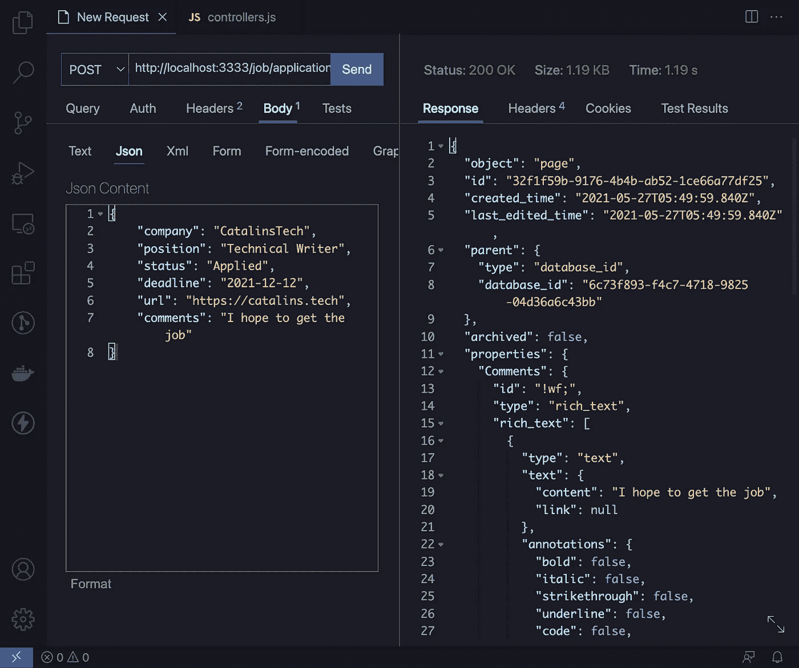

图 10。

## 更新现有应用程序

更新现有的工作申请与添加新的工作申请非常相似。有两个主要区别:

*   你使用**更新**的方法
*   您传递的是页面 ID 而不是数据库 ID

您在 URL 中传递页面 ID。例如，您将向`/job/applications/:id` URL 发出一个`PATCH`请求，在那里用文档的实际 ID 替换`:id`。您可以从请求参数- `req.params.id`中的 URL 访问 ID。

在`controllers.js`文件中写入以下代码:

让我们修改添加到公司`CatalinsTech`的最后一份工作申请。更新以下字段:

*   状态—将其更新为**已签署**
*   截止日期—将其更新为**2021–05–27**
*   评论—更新为**我得到了工作**

因此，用下面的 JSON 数据向`http://localhost:3333/job/applications/32f1f59b-9176-4b4b-ab52-1ce66a77df25`发出一个`PATCH`请求:

```
{
    "company": "CatalinsTech",
    "position": "Technical Writer",
    "status": "Signed",
    "deadline": "2021-05-27",
    "url": "https://catalins.tech",
    "comments": "I got the job"
}
```

图 11 显示了请求成功。工作申请更新了，你可以在这里查看[。](https://www.notion.so/6c73f893f4c74718982504d36a6c43bb?v=345b93c08725486097551607ef394b8c)

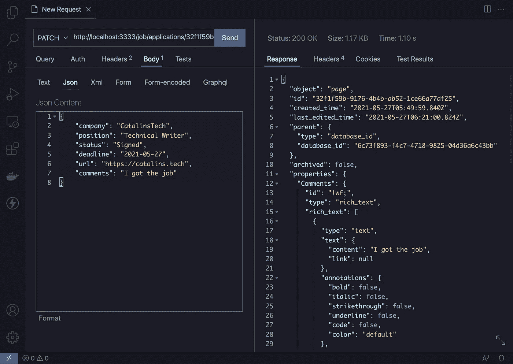

图 11。

因此，这就是如何以编程方式更新您现有的职务申请。

## 导出控制器

在使用控制器之前，您需要导出它们。您需要导出它们的原因是您在`routes.js`文件中使用它们。

因此，在名为`controllers.js`的文件的末尾添加以下代码:

```
module.exports = {
    getAllApplications,
    getApplication,
    addApplication,
    updateApplication,
    filterApplications
};
```

现在，您可以运行应用程序并使用它了！

检查[此要点](https://gist.github.com/catalinpit/5f419e72a6b56bf0bd51e1f1b700f1c0)以查看完整的`controllers.js`文件。

# 如何运行应用程序

您可以通过运行根文件夹中的`node app.js`来启动应用程序。

一旦运行了，应用程序应该会启动，您就可以发出 HTTP 请求了。但是，如果您从 GitHub 克隆应用程序，您需要首先安装依赖项。您可以通过运行以下命令来实现:

```
npm install
node app.js
```

# 结论

教程到此结束！您构建了一个 Node.js API，它允许您:

1.  创建和更新工作申请
2.  检索所有工作申请
3.  仅访问特定的职务申请
4.  按公司名称过滤求职申请

不幸的是，概念 API 不允许我们删除资源。这就是为什么没有`DELETE`端点的原因。

**查看** [**GitHub 资源库**](https://github.com/catalinpit/notion-nodejs-api) **上的完整应用代码。**