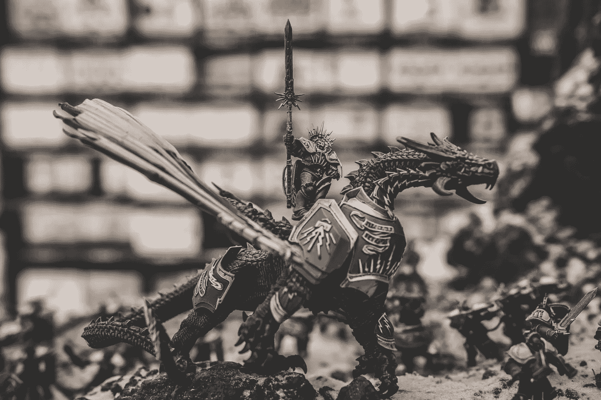
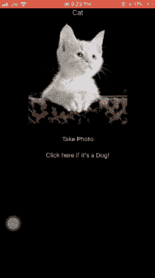
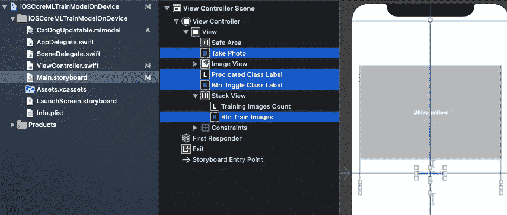

# 如何在你的 iOS 应用中训练一个核心 ML 模型

> 原文：<https://betterprogramming.pub/how-to-train-a-core-ml-model-on-your-device-cccd0bee19d>

## “如何使用 Core ML 3 创建可更新的模型”的续篇



[千斤顶 B](https://unsplash.com/@nervum?utm_source=unsplash&utm_medium=referral&utm_content=creditCopyText) 在[防溅器](https://unsplash.com/s/photos/dragon?utm_source=unsplash&utm_medium=referral&utm_content=creditCopyText)上拍照

这是上一篇文章[如何使用 Core ML 3](https://medium.com/better-programming/how-to-create-updatable-models-using-core-ml-3-cc7decd517d5) 创建可更新模型的续篇。

有了 [Core ML 3](https://developer.apple.com/machine-learning/core-ml/) ，在一个设备上训练一个 Core ML 模型比驯服一条龙容易多了！

先决条件:

*   从[之前的](https://medium.com/better-programming/how-to-create-updatable-models-using-core-ml-3-cc7decd517d5)帖子中获取可更新的`mlmodel`。
*   只需将`mlmodel`拖到您的 [Xcode](https://developer.apple.com/xcode/) 项目中。

# 行动（或活动、袭击）计划

*   通过用相反的标签重新标记预测的图像，在设备上重新训练猫与狗分类器核心 ML 模型。
*   用我们的可更新模型在设备上训练这批重新标记的图像。
*   将新的更新模型保存在设备上应用程序的文档目录中，并使用该新模型进行未来预测或重新训练。

# 最终目的地

一幅图像胜过千言万语。GIF 由成千上万的图片组成。这是本文结束时您将得到的最终结果。



输出屏幕记录

正如你在屏幕截图中看到的，我们允许用反向标签重新训练预测图像。

重新标记和重新训练模型并不总是保证不同的预测。

现在我们知道了最终结果，让我们开始在设备上训练您的 ML 模型的旅程。在我们深入研究代码之前，让我们先了解一下我们将要使用的核心 ML 类和 API。

# 简要了解核心 ML API

`MLModel`是封装模型的类。

我们将在接下来的章节中讨论以下重要的类和协议:

*   `MLFeatureValue`
*   `MLImageConstraints`
*   `MLFeatureProvider`
*   `MLBatchProvider`
*   `MLUpdateTask`

## MLFeatureValue

`MLFeatureValue`充当数据的包装器。核心 ML 模型以`MLFeatureValue`的形式接受输入和输出。

`MLFeatureValue`让我们直接使用一个`CGImage`。与此同时，我们可以传递模型的图像约束。它从`CGImage`中为您创建了`CVPixelBuffer`，从而避免了编写助手方法的需要。

下面这段代码从图像中创建了一个`MLFeatureValue`实例。

```
let featureValue = try MLFeatureValue(cgImage: image.cgImage!, constraint: imageConstraint, options: nil)
```

现在我们来看看`MLImageConstraints`。

## MLImageConstraints

`MLImageConstraints`负责向模型输入正确尺寸的图像。它包含输入信息。在我们的例子中，这就是图像大小和图像格式。

我们可以使用下面这段代码轻松地从模型中检索图像约束对象:

```
let imageConstraint = model?.modelDescription.inputDescriptionsByName["image"]!.imageConstraint!
```

我们只需要将输入名称(`“image”`，在我们的例子中)传递给模型描述。

## MLFeatureProvider

一个`MLFeatureValue`没有直接传入模型。需要包裹在`MLFeatureProvider`里面。

如果您检查`mlmodel` Swift 文件，该模型实现了`MLFeatureProvider`协议。为了从`MLFeatureProvider`访问`MLFeatureValue`，有一个`featureValue`访问器方法。

`MLDictionaryFeatureProvider`是一个方便的包装器，以字典格式保存数据。它需要输入名称(在我们的例子中是`"image"`作为键，需要`MLFeatureValue`作为值。

如果输入超过，只需将它们添加到同一个字典中。

## MLBatchProvider

这保存了用于批处理的`MLFeatureProviders`的集合。

因此，我们可以预测多个特性提供者，或者训练一批封装在`MLBatchProvider`中的训练输入。在本文中，我们将采用后者。

一个`MLArrayBatchProviders`包含一组批处理提供者。

## MLUpdateTask

一个`MLUpdateTask`负责用新的训练输入更新模型。

## **所需参数**

*   模型 URL —编译模型的位置(`mlmodelc`扩展名)。
*   训练数据— `MLArrayBatchProviders`。
*   车型配置——这里我们通过`MLModelConfiguration`。我们可以使用现有模型的配置或对其进行定制。例如，我们可以强制模型在 CPU 和/或 GPU 和/或神经引擎上运行。
*   完成处理程序——它返回`context`,从中我们可以访问更新后的模型。然后我们可以将模型写回文档目录。

## **可选参数**

*   `progressHandlers` —这里您通过`MLUpdateProgressHandlers`传递您想要收听的一系列事件，例如纪元开始/结束、训练开始/结束。
*   `progressHandler` —每当第一个案例中定义的任何事件被触发时，就会调用这个函数。

要开始训练，只需调用`updateTask`实例上的`resume()`函数。

下面是一个在设备上训练数据的伪代码:

```
let updateTask = try MLUpdateTask(forModelAt: updatableModelURL, trainingData: trainingData, configuration: model.configuration, completionHandler: { context in } updateTask.resume()
```

现在我们已经对不同的组件及其角色有了一个概念，让我们构建我们的 iOS 应用程序，在设备上训练模型。

# 密码

## 我们的故事板



## 从 URL 加载模型

首先，让我们尝试将我们的`mlmodel`加载到一个单独的 URL 上的 documents 目录中:

```
private func loadModel(url: URL) -> MLModel? {
      do {
        let config = MLModelConfiguration()
        config.computeUnits = .all
        return try MLModel(contentsOf: url, configuration: config)
      } catch {
        print("Error loading model: \(error)")
        return nil
      }
}let modelURL = Bundle.main.url(forResource: "CatDogUpdatable", withExtension: "mlmodelc")
let updatableModel = loadModel(url: modelURL)
```

## 使用 MLModel 预测图像

既然我们已经从 URL 中获得了`MLModel`，我们将运行预测代码，假设我们已经从`ImagePickerController`中获得了图像。

```
func predict(image: UIImage) -> Animal? {
        let imageConstraint = model.modelDescription.inputDescriptionsByName["image"]!.imageConstraint! 

        do{

            let imageOptions: [MLFeatureValue.ImageOption: Any] = [
                .cropAndScale: VNImageCropAndScaleOption.scaleFill.rawValue
            ]

            let featureValue = try MLFeatureValue(cgImage: image.cgImage!, constraint: imageConstraint, options: imageOptions)
            let featureProviderDict = try MLDictionaryFeatureProvider(dictionary: ["image" : featureValue])
            let prediction = try updatableModel?.prediction(from: featureProviderDict)
            let value = prediction?.featureValue(for: "classLabel")?.stringValue
            if value == "Dog"{
                return .dog
            }
            else{
                return .cat
            }
        }catch(let error){
            print("error is \(error.localizedDescription)")
        }
        return nil
}
```

我们只是将`UIImage`作为`CGImage`传递给带有模型输入的`MLImageConstraints`的`MLFeatureValue`，然后`MLDictionaryFeatureProvider`在`MLModel`上运行预测。

`featureValue`返回一组`featureNames`。在我们的例子中，`classLabel`包含标签`cat`或`dog`。

我们有一个`UIImage`和`Label`的查找字典，称为`imageLabelDictionary`。如果我们想要将图像添加到训练输入，我们在字典中设置图像和预测输出(猫/狗)的逆。

接下来，我们从`imageLabelDictionary`中创建一个批处理提供者。

## 创建批处理提供程序

我们的批处理提供者从需要`image`作为`CVPixelBuffer`和`classLabel`作为猫或狗的`TrainingInput`实例中创建了一个`MLArrayBatchProvider`。

```
private func batchProvider() -> MLArrayBatchProvider
    {var batchInputs: [MLFeatureProvider] = []
        let imageOptions: [MLFeatureValue.ImageOption: Any] = [
          .cropAndScale: VNImageCropAndScaleOption.scaleFill.rawValue
        ]
        for (image,label) in imageLabelDictionary {

            do{
                let featureValue = try MLFeatureValue(cgImage: image.cgImage!, constraint: imageConstraint, options: imageOptions)

                if let pixelBuffer = featureValue.imageBufferValue{
                    let x = CatDogUpdatableTrainingInput(image: pixelBuffer, classLabel: label)
                    batchInputs.append(x)
                }
            }
            catch(let error){
                print("error description is \(error.localizedDescription)")
            }
        }
     return MLArrayBatchProvider(array: batchInputs)
}
```

多亏了`MLFeatureValue`，我们可以很容易地从`featureValue`函数中检索到`pixelBuffer`。

## 检索 MLModel 的 URL

我们需要将模型 URL 传递给`MLUpdateTask`。为此，我们需要从应用程序的文档目录中检索 URL。我们需要使用`FileManager`。

代码很简单:

```
let fileManager = FileManager.defaultlet documentDirectory = try fileManager.url(for: .documentDirectory, in: .userDomainMask, appropriateFor:nil, create:true)let modelURL = documentDirectory.appendingPathComponent("CatDog.mlmodelc")
```

现在，我们准备用新图像再次训练我们的模型。

`finalContext.model.write(to: fileURL)`覆盖文档目录中 URL 处的模型。这个核心 ML 模型被设置为只运行一个时期。

# **完整源代码**

核心的 ML 设备上培训到此结束。下面的完整源代码将上述所有概念合并到一个可行的 iOS 应用程序中。除此之外，模型和 Python 脚本也可以在 [GitHub 仓库](https://github.com/anupamchugh/iowncode/tree/master/iOSCoreMLOnDeviceTraining)中获得。

[](https://github.com/anupamchugh/iowncode/tree/master/iOSCoreMLOnDeviceTraining) [## anupamchugh/iowncode

### 此时您不能执行该操作。您已使用另一个标签页或窗口登录。您已在另一个选项卡中注销，或者…

github.com](https://github.com/anupamchugh/iowncode/tree/master/iOSCoreMLOnDeviceTraining)