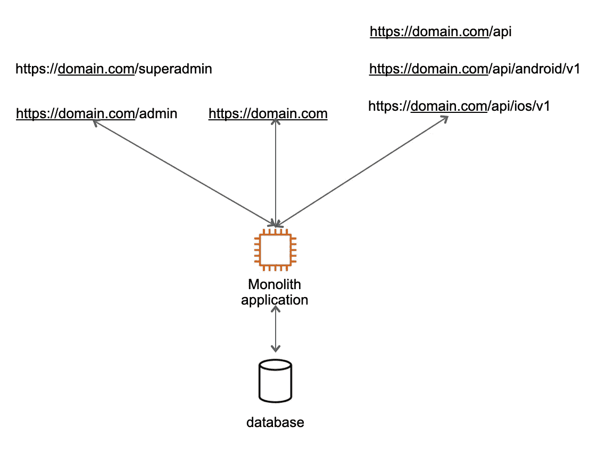
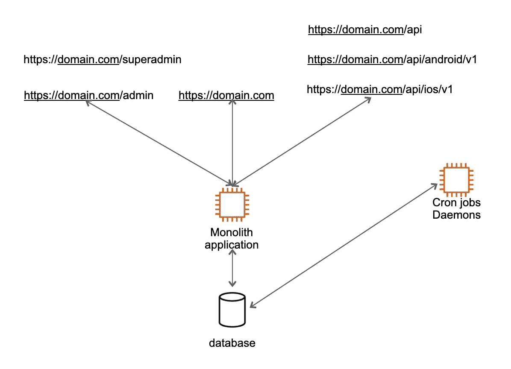
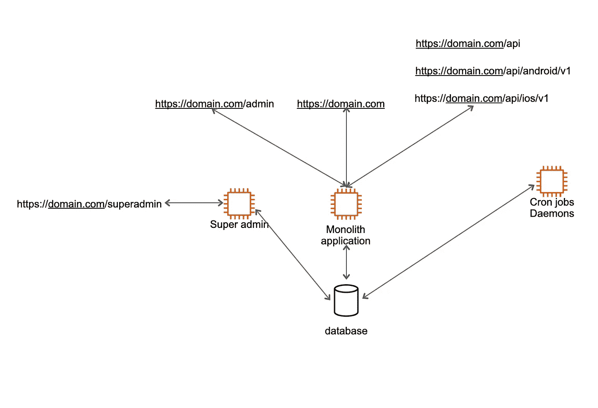
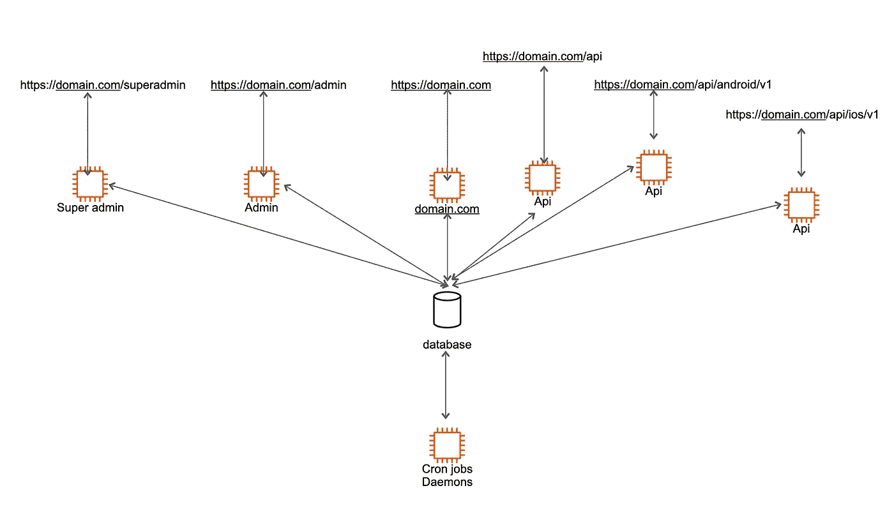
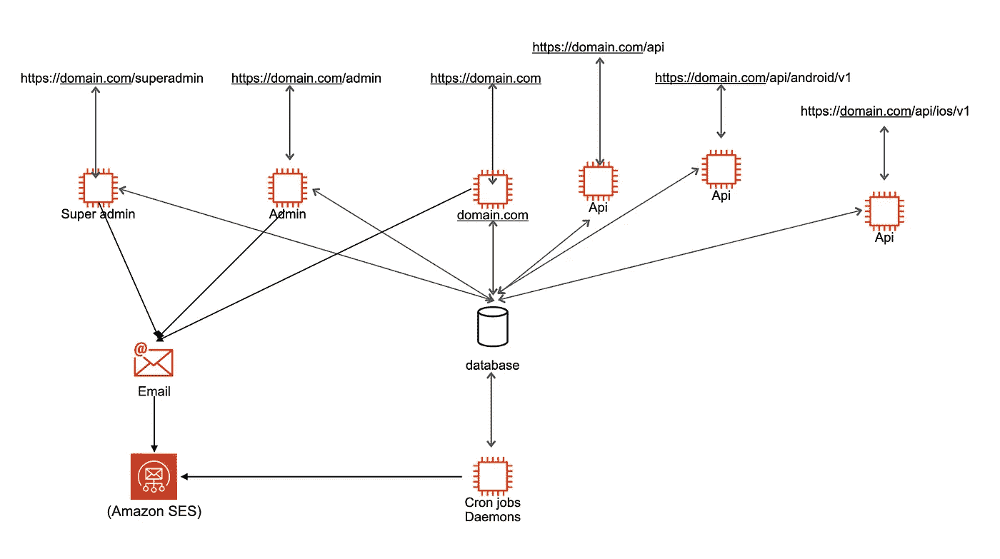
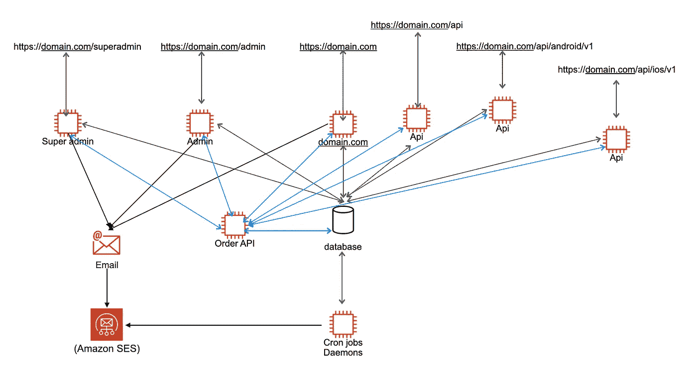
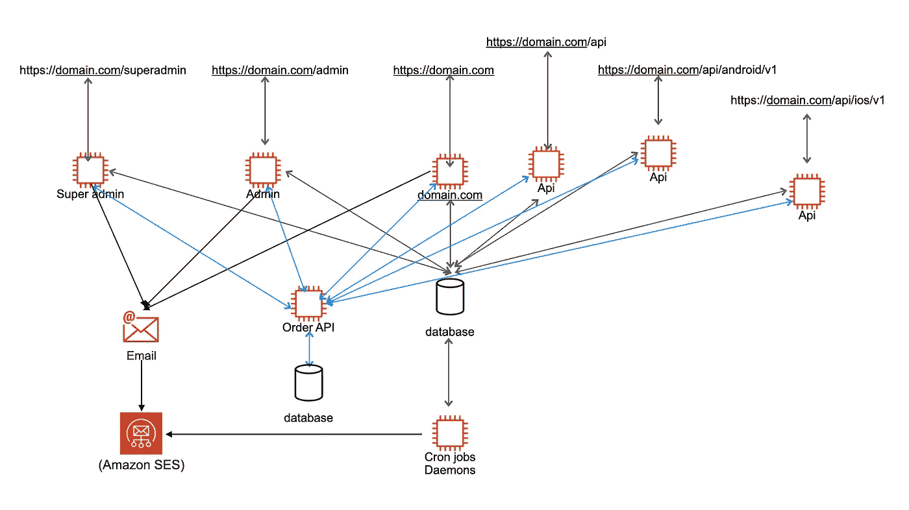

# 如何将整体应用程序转变为微服务架构

> 原文：<https://betterprogramming.pub/how-to-transform-a-monolith-application-into-a-microservices-architecture-1e00363a03ba>

## 将 monolith 应用程序迁移到微服务架构的分步指南


安德斯·吉尔登在 [Unsplash](https://unsplash.com?utm_source=medium&utm_medium=referral) 上拍摄的照片|所有其他图片由作者提供

我们以一家运营多年的创业公司为例。他们的主要目标是建立平台和扩大公司。

开发团队继续在相同的代码基础上添加新的特性和服务。经过几年的不断扩张，他们的代码库变得太大，并显示出局限性。

以下问题开始出现:

*   不可能运行主测试服，因为它太大了。此外，运行和验证代码需要太多时间。
*   因为单个应用程序处理每个请求，所以伸缩是困难的。
*   太多的依赖项必须在上线前更新和全面测试，这使得升级框架、语言版本或操作系统变得不可能。
*   难以在截止日期前完成，因为开发人员无法理解产品。
*   开发速度变得非常慢，不能处理所有的依赖。
*   团队有太多的开发人员，没有一台开发机器可以处理产品。

为了演示如何将单片应用程序转换为微服务架构，我构建了如下所示的示例架构:



虽然应用程序可以提供多种服务，但是为了这篇文章，我们必须限制我们的范围。

# 这个不可思议的旅程的开始

在第一阶段，您可以将您的应用程序分成多个项目，而无需重写代码库，最重要的是，不会打扰您的客户/用户。

在我们开始迁移到新的应用程序之前。记住下面这句话:

> 停止给巨石柱喂食

如果你不明白它的意思，请继续读下去。

下一次，每当你添加一个新的代码到你的 monolith，提醒你自己和你的团队避免喂养你的 monolith。

如果你准备好了，我们开始吧。

例如，您在 monolith 服务器上使用了一个名为“monolith-repo”的代码存储库，在这里您可以处理所有类型的请求并运行后端作业。

# 步骤 1:将 Cron 作业和守护进程移动到新的服务器上

我选择这个是因为它是内部的，如果我们把所有的后端工作转移到新的服务器上，没有人会受到干扰。

转到您的项目目录。

```
cd monolith-repo
```

从“主”分支创建一个分支，并将其命名为“cron-jobs-and-daemons”

```
git branch cron-jobs-and-daemons
```

您应该在项目中看到两个分支:

```
git branch
main
cron-jobs-and-daemons
```

看看这个新的分支。

```
git checkout cron-jobs-and-daemons
```

是时候将代码库从“整体回购”中分离出来了为此，在 GitHub 中创建一个新的私有存储库，并给出自己选择的名称。我称之为“后端工作”

一旦有了新的存储库，就将“cron-jobs-and-daemons”分支从“monolith-repo”推到这个新的存储库。

```
git push [https://github.com/tanvir/backend-jobs.git](https://github.com/tanvir/backend-jobs.git) cron-jobs-and-daemons:cron-jobs-and-daemons
```

上面的命令在新的存储库中创建了一个新的分支“cron-jobs-and-daemons”，并推送其中的所有代码。

git 创建“main”作为默认分支，其中没有任何内容。将“cron-jobs-and-daemon”分支合并到主分支中。

在你的开发机器上创建一个“monolith-repo”项目的副本，命名为“backend-jobs”

```
cp -R monolith-repo backend-jobs
```

在这一点上，两个存储库是相同的，并且代码没有区别。

转到您的新项目。

```
cd backend-jobs
```

这个项目连接到您旧的 monolith 存储库，但是我们可以在`.git/config`文件中将其更改为一个新的存储库。

```
vi .git/config
```

将 GitHub 的来源从旧的存储库更改为新的存储库。一旦项目与一个新的源连接起来，您就可以使用这个新的存储库了。

移除“主”分支并再次获取它，以查看它是否已连接。如果你的主分支是空的，那么你是连通的。否则，您可能需要进行一些配置。

```
git branch -D main
git fetch origin main:main
git checkout main
```

现在，将您的“cron-jobs-and-daemon”合并到新存储库的“main”分支中。

现在您已经对这个概念有了更好的理解，我们已经创建了一个流畅的工作流来将我们的代码从一个存储库合并到另一个存储库。如果随后需要合并任何内容，我们可以轻松完成。

请确保“monolith-repo”和“backend-jobs”的“主要”分支在这一点上是相同的，因为这两个项目现在将采取不同的开发路径。

我知道这感觉很奇怪，但请记住，我们的目标是“停止喂养巨石”

如果你成功地建立了这个工作流程，你就向停止整块石头的进给迈出了一步。

所有后端作业都将被添加到“后端作业”存储库中，现在您将继续在“monolith-repo”中添加其他功能。

一旦准备就绪，下一个挑战就是在生产环境中进行部署，并将所有作业转移到这台新服务器上，而不会造成干扰或停机。

如果您使用云，创建 monolith 应用程序的映像来启动新的服务器。此过程将为您提供 100%相同的配置，您可以信赖。

一旦后端作业服务器启动并运行，您可能需要修复数据库安全组。但是在此之前，停止新服务器上的所有 cron 作业和守护进程，因为它们运行在旧服务器上。修复数据库连接后，它将开始执行任务。

现在，您可以完全控制您的新服务器。什么都没有运行，但是你已经准备好开始移动你的第一份工作。万岁！

**建议**:休息一下，保持对一切事物的新鲜感。

是时候了。从最简单的工作开始。停用旧服务器上的第一个作业，并在新服务器上启动。

在确认第一个工单之前，不要移动第二个工单。即使是同一个服务器，也不要相信它在工作。进行适当的测试，确认搬运工作正常。

一旦您的第一个任务开始工作，您就可以继续下一个任务，以此类推，直到您的所有作业都被迁移。

恭喜你！通过这样做，您已经在您的组织中建立了一个迁移到微服务架构的工作流。我知道这不是一个微服务，但离迁移到那里又近了一步。

完成这一转换后，应用程序架构将如下所示:



应用服务器和后端作业服务器

我们已经转移到两个不同的应用程序，而没有创建新的代码，也没有向团队添加新的专业知识或技术。

庆祝的时间到了！

在我们进入下一个应用程序之前，还有一件事要讨论。

假设您切换到了一台新的服务器，但仍有一些作业等待部署。问题是，在开发这些工作的旧“整体回购”上发出了拉取请求。

记住我们在上面建立的工作流程。一旦主分支中合并了 pull 请求，您就可以将主分支合并到“cron-jobs-and-daemons”分支，并将其推送到新的存储库，就像我们之前所做的那样。

一旦您的代码被推送到一个新的存储库，您就可以创建一个新的临时分支“merge-main-and-cron-jobs-and-daemon”来创建一个稳定的状态。一旦成功合并，您就可以在您的主分支中合并它，并在生产中部署它。

你看这个工作流程有多灵活。您可以开始开发新的特性，也可以合并旧分支的代码，而无需停止持续的开发和部署。

# 步骤 2:将您的超级管理员功能转移到新的应用程序/服务器

这个应用程序是内部的，因为如果出现问题，不会对我们的客户造成伤害。内部用户可能会受到影响，但是让我们信守承诺，在不干扰工作流的情况下将这个应用程序迁移到新的服务器上。

我们需要遵循与上面相同的步骤，但是有额外的步骤，因为这个 web 应用程序有到所有其他应用程序的路由。在这一点上，我强烈建议删除路由定义，以访问除超级管理员以外的其他应用程序路由。

完成这一转换后，应用程序架构将如下所示:



如果您已经到了这一步，我假设您理解这种划分应用服务器的方法背后的原因，这样我们就可以停止向我们的 monolith 应用程序添加新代码。

# 步骤 3:现在是时候将所有其他用户应用程序转移到他们自己的存储库和服务器中了

前两步是为了让您在接触比其他应用程序更关键的特定于用户的应用程序之前获得经验。

现在，按照上面学到的所有步骤，为每个应用程序创建额外的域。

例如:

`domain.com`
`admin.domain.com`
`api.domain.com`

当然，您会非常小心地逐一准备和推出这些应用程序。

如果您认为您的用户在管理员和其他应用程序之间是共享的，那么在应用程序之间使用共享的登录 cookie。这样，您的用户只需登录一次就可以访问其他应用程序。

在我们开始构建真正的微服务之前，您的应用的最终架构将如下所示。



在这之后，你的 monolith-repo 就不再被使用了，你可以在你的 GitHub 账户中存档或者设置为只读。

恭喜你！你已经成功地“停止给巨石柱喂食”

你现在有几个选择。每种选择都各有利弊。

# (可选)步骤 4:清理所有存储库

至此，您已经在所有专用存储库中复制了 monolith 应用程序。现在您可以在您的开发工作流程中创建一个计划来分配一定数量的资源，并删除所有与应用程序无关的额外代码。

您的 monolith 应用程序现在已经在所有特定的存储库中复制了。现在可以删除应用程序中不必要的代码了，您可以在开发工作流中建立一个计划来分配特定数量的资源。

例如，管理存储库不需要 API、超级管理和后端作业的代码。慢慢地删除所有这些，并将其部署在生产服务器上。

您可以对所有其他应用程序执行相同的步骤，以保留它所需要的内容。

因为您只添加了必要的代码，所以这一步将帮助您提高应用程序的性能并简化开发。

# (可选)步骤 5:将应用程序升级到最新的框架、编程语言版本和 Linux 发行版

现在所有的应用程序都很小巧，易于升级。测试套装运行速度更快，因为它更小，可以快速测试相关的应用程序。

以上五个步骤可能会花费你的开发团队很多时间；然而，它发生在你开发产品的其他功能和不断发展业务的时候。

此时，您已经建立了一个良好的开发工作流，可以导致独立的微服务，因为您可以看到数据库是架构的瓶颈。如果业务增长过快，它就无法扩展。

根据你的资源和公司增长率，你可以做第 4 步和第 5 步。否则，您可以直接转到第 6 步，我们将在架构中引入独立的微服务。

# 步骤 6:微服务架构之路

大多数应用都有一些通用的功能，这些功能很容易被识别并转移到独立的微服务中。

我总是把微服务分为两类:外部和内部。

外部:与外部服务通信以执行特定任务的微服务，如发送电子邮件、支付网关、视频编码等。

内部:第二类微服务在平台内部执行任务，如用户 API、订单 API、玩家 API 等。

关于哪种类型的微服务易于构建并与平台集成，一直存在争议。我总是说外部服务很容易成为目标。

例如，电子邮件服务是第一个，因为它不依赖于数据库或其他任何东西。我将称之为“消息 API”

您可以将其构建为 REST API 或无服务器应用程序。您可以将发送电子邮件的逻辑移到这个 API 中，并将其与所有向用户发送电子邮件的应用程序集成在一起。

该微服务将与外部电子邮件服务进行通信，如 AWS SES、邮戳或您使用的任何其他服务。它将帮助您封装对其自身微服务的依赖。

第一次微服务后，您的应用架构将如下所示:



当第一个微服务上线时，你应该和你的团队一起庆祝，因为你已经建立了一个工作流程，开始将你的整体架构转变为真正的微服务。

现在遵循同样的路径，构建其他外部微服务，并将它们集成到您的应用程序中。

内部微服务总是需要额外的工作，因为我们必须拆分数据库并解决其他依赖关系。在这里，我可以推荐两种分割数据库及其相关 API 的方法。

这取决于你的团队决定走哪条路。我将在本文中向您解释这两个问题:

1.  首先是 API，然后是数据库
2.  API 和数据库同时分离

这个练习的目标是所有的应用程序都将作为前端应用程序运行，所有的一切都将通过一个 API 来完成。

为此，我们需要拆分数据库并构建新的 API 来支持前端应用程序。

# 解决方案 1:先有 API，后有数据库

我们需要找到一种不依赖其他东西而能独立生存的商业模式。例如，具有从系统添加、更新和删除订单的基本订单 API。

因为我们已经将 monolith 应用程序分成了多个应用程序，订单功能可能会在多个应用程序中复制。这意味着我们有许多重复的代码来执行相同的任务。现在是时候解决这个问题了。

我们将引入订单 API，并将所有逻辑移入应用程序。将大量代码复制粘贴到新的 API 中。

以下是订单 API 的端点:

*   `POST /orders`
*   `GET /orders/{order-key}`
*   `DELETE /orders/{order-key}`

现在，您可以将订单 API 集成到发生这些操作的所有应用程序中，并删除重复的代码。



如你所见，架构正在成长，API 也开始有所回报。尽管订单 API 与 monolith 数据库的通信必须被修复。让我们马上解决这个问题。

我们正在尝试分离关系数据库，它很难从活动的应用程序中分离出来，并且可能在多个表中具有作为外键的顺序关系。

目前没有与订单表的直接连接，因为所有订单都通过新的订单 API。为了防止对订单表的直接查询，在将订单数据移动到单独的数据库之前，我们必须确保所有关系都通过订单 API 端点检索数据。

# 订单数据库作为独立的微服务

我们需要创建一个新的数据库，并将您现有的所有订单迁移到其中。

由于它是一个订单不断到来的生产应用程序，如何将所有最新的订单同步到一个新的数据库而不丢失它们呢？

你可以通过 AWS 出色的[数据迁移服务](https://aws.amazon.com/dms/)来实现这个目标。创建在新数据库和 monolith 之间持续同步数据的数据迁移任务。

您的`Order`表现在在新数据库和 monolith 之间是相同的。

最后一步是连接到新的数据库，并断开您的 API 与 monolith 的连接。

一旦订单 API 开始使用新的数据库，所有即将到来的订单将被添加到新的数据库，而不是 monolith。

庆祝的时间到了！

您的平台上运行了第一个独立的微服务。



每个微服务可能需要一些额外的步骤，但如果你遵循我的基本准则，你可以实现你的目标。

# 解决方案 2: API 和数据库同时拆分

如果你觉得方案 1 太慢，可以一气呵成，那就开发你的微服务 API，同时拆分数据库。

## 下一步是什么？

您可以继续创建新的微服务，并将它们与前端应用程序集成，直到您完成为止。

一旦您的前端应用程序不再直接与数据库和来自 API 的一切进行通信，您就可以计划在最新的框架中开发您的现代前端。

感谢您阅读这篇文章。

我希望你从这篇文章中学到了一些东西。如果你有问题，请随时提问。