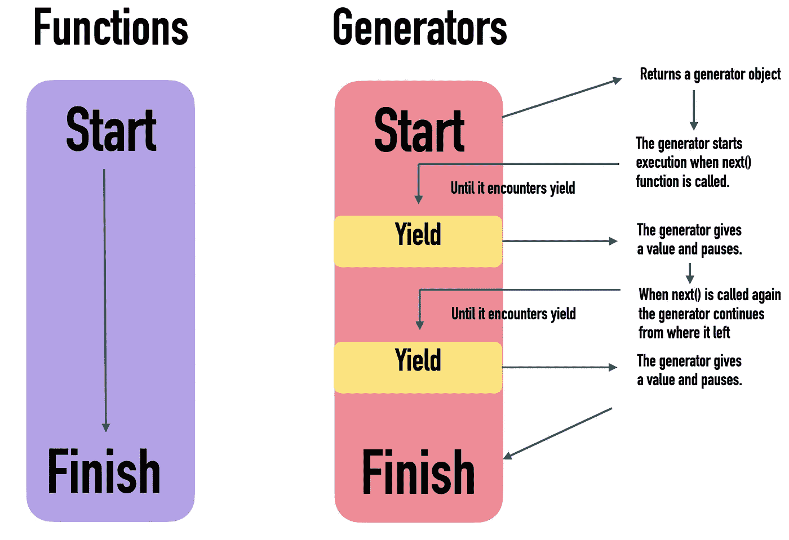

# 如何将 JavaScript 函数转换成节省内存的生成器

> 原文：<https://betterprogramming.pub/how-to-transform-javascript-functions-into-memory-efficient-generators-e402af77cdc4>

## 开始在 JavaScript 中使用 yield


[Ricardo Rocha](https://unsplash.com/@rcrazy?utm_source=medium&utm_medium=referral) 在 [Unsplash](https://unsplash.com?utm_source=medium&utm_medium=referral) 上拍照。

在 JavaScript 中，`yield`用于暂停函数的执行。当再次调用该函数时，从最后一条`yield`语句继续执行。

产生值的函数是生成器。下面是运行函数与运行生成器函数的对比图:



JavaScript 中的函数与生成器

生成器返回一个生成器对象，它是一个迭代器。该对象一次生成一个值，然后暂停执行。它不存储值，所以它的内存效率很高。

# 如何将一个函数变成一个生成器

要将函数转换为生成器:

*   在`function`关键字后添加一个星号(`*`)。
*   用`yield`代替`return`。

## 例子

让我们创建一个普通函数`square()`，它对一个数字数组求平方:

结果:

```
[1, 4, 9, 16, 25]
```

让我们把这个函数变成一个生成器。

`yield`不是将方块加入一个数组，而是一次一个:

输出:

```
**: [object Generator]**
```

你还没有得到一个平方数的数组。这是因为结果`squared_numbers`是一个生成器对象。这个生成器对象还没有进行任何计算。

让我们看看如何从生成器对象中获得平方数。

## next()方法

生成器不会在内存中存储数字。相反，它一次一个地计算并产生。生成一个值后，生成器对象暂停，直到被要求生成下一个值。

要获得上例中的平方数，您需要使用`next()`方法向 generator 对象请求下一个平方值。

让生成器计算第一个平方数:

```
console.log(squared_numbers.next())
```

结果:

```
{
  value:1,
  done:false
}
```

这个结果对象有两个属性:

*   `value`—数字数组中第一个数字的平方结果。
*   `done`—这表示发电机功能是否已经结束。

此时，生成器对象在生成第一个平方数后暂停了执行。

让我们通过再调用四次`next()`让生成器计算其余的数字:

```
console.log(squared_numbers.next().value)
console.log(squared_numbers.next().value)
console.log(squared_numbers.next().value)
console.log(squared_numbers.next().value)
```

输出:

```
4
9
16
25
```

现在生成器已经将所有的数字平方。如果你再叫一次`next()`:

```
console.log(squared_numbers.next())
```

你得到一个对象，其中`value`是`undefined`，`done`是`true`。

```
{
  value: **undefined**,
  done: **true**
}
```

这是因为生成器已到达数组的末尾。这样，发电机就耗尽了。

现在您了解了生成器是如何工作的，以及如何让它计算值。

让我们看看如何在不使用烦人的`next()`方法的情况下循环遍历这些值。

## 去掉 next()

使用`next()`函数演示了生成器如何工作，但是您不需要调用它来处理生成器对象。相反，你可以使用一个`for-of`循环——就像你如何遍历一个数字数组一样。

例如，让我们使用一个`for-of`循环重复上面的生成器示例:

结果:

```
1
4
9
16
25
```

从语法上来说，这看起来就像是在一个常规的数字数组中循环。

这也很方便，因为你不需要自己调用`next()`。`for-of`循环知道如何为你做。它还负责当没有更多的值需要平方时，生成器不调用`next()`。

# 生成器与数组—运行时比较

让我们对生成器和函数进行运行时比较。

在这个例子中，有一个由十个数字和两个函数组成的数组:

*   从数组*中随机选择一个数字 n 次的`data_array()`函数。*
*   一个生成器函数`data_generator()`，它也从数组*中随机选择一个数字 n 次*。

这段代码比较了使用这些函数构建一个 1M 随机选择数的集合的运行时。请不要担心实现细节:

结果:

```
Array creation took 121.39999997615814 milli seconds
Generator creation took 0.10000002384185791 milli seconds
The generator is **1213.9997103214955** times faster
```

创建一个生成器比创建一组数字要快得多。这是因为数组必须在内存中存储所有 1M 的数字。生成器不会在内存中存储任何东西。在对它调用`next()`方法之前，它甚至没有开始挑选数字。

**注意**这个例子是有偏差的。发电机不使用****使用******数据**。因此，性能方面的比较是没有意义的。但是它很好地展示了如何创建一个生成器几乎不需要时间和内存。****

# ****JavaScript 中生成器的用例示例****

## ****无限的溪流****

****生成器对象(迭代器)不存储值。因此，使用生成器创建无限的价值流是可能的。****

****例如，让我们创建一个无限生成器，它生成一个起点之后的所有数字:****

****该发生器产生从`start`到无穷大的值。****

****让我们从`10`开始运行:****

****结果是源源不断的数字从`10`上来:****

```
**10
11
12
13
14
15
.
.
.**
```

****从语法上看，似乎`infinite_nums`真的是一个无限的数字数组。实际上，它只不过是一个无限循环的生成器。****

## ****简化迭代器的创建****

****如果你熟悉编写自己的迭代器，你就知道这是一团糟。****

****例如，让我们创建一个输出三个字符串的迭代器:****

****输出:****

```
**Hello
World
Its me**
```

****为了使它更清晰，您可以使用一个生成器函数:****

****输出:****

```
**Hello
World
Its me**
```

# ****结论****

****在 JavaScript 中，`yield`是一个将函数变成生成器的关键字。****

****与数组不同，生成器不存储值。相反，它知道当前值以及如何获得下一个值。这使得生成器的内存效率更高。****

****每当您循环访问一大组项目，并且不需要一次存储所有项目时，使用生成器非常有用。****

****感谢阅读。编码快乐！****

# ****进一步阅读****

****[](/10-javascript-snippets-for-cleaner-looking-code-76f6e2cf6fc4) [## 10 个 JavaScript 代码片段让代码看起来更整洁

### JavaScript 简化使你的代码简洁明了

better 编程. pub](/10-javascript-snippets-for-cleaner-looking-code-76f6e2cf6fc4) [](https://www.codingem.com/50-buzzwords-of-web-development-and-design-in-2021/) [## 2021 年网络开发和设计的 50 多个流行语

### 学习创业公司使用的网页开发和网页设计语言。这篇文章是关于…的很好的入门读物

www.codingem.com](https://www.codingem.com/50-buzzwords-of-web-development-and-design-in-2021/)****