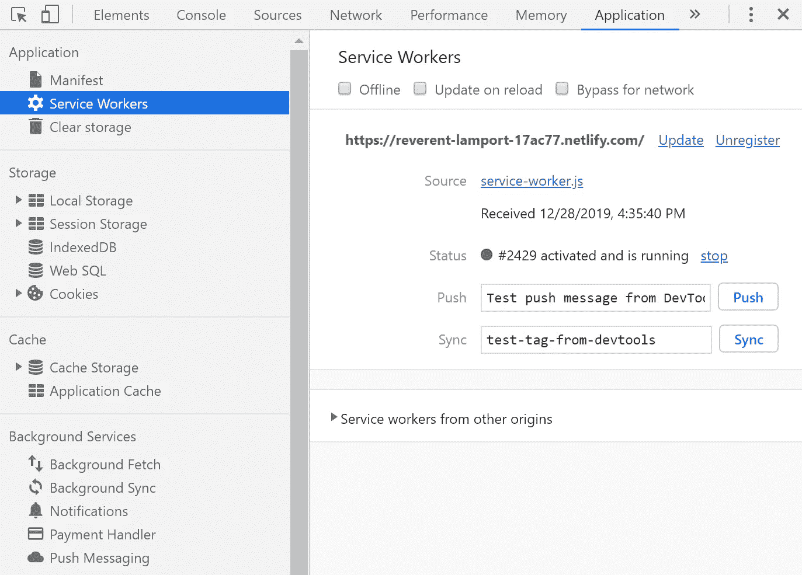
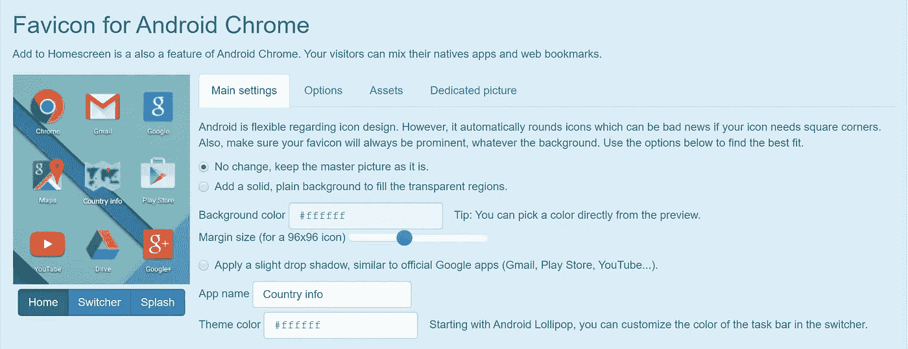
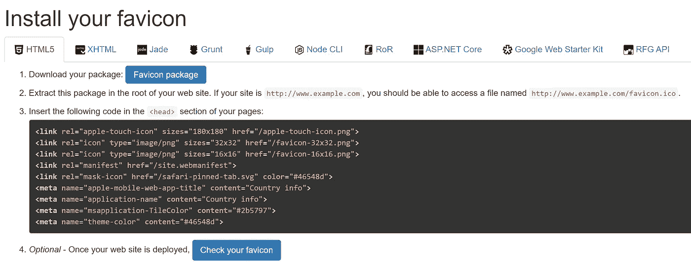

# 如何将你的网站转变成一个进步的网络应用程序，并抓住它的好处

> 原文：<https://betterprogramming.pub/how-to-transform-your-website-into-a-progressive-web-app-and-grasp-its-benefits-177a076a76d6>

## 通过几个步骤了解 PWAs

Rami Al-zayat 在 [Unsplash](https://unsplash.com?utm_source=medium&utm_medium=referral) 上拍摄的照片

如今，要想获得成功，每个网站都必须非常容易进入。

这是因为用户希望随时随地通过任何设备访问你的网站。无论他们所在地区的网络覆盖范围有多广，或者他们依赖的网络速度有多快，他们都不愿意等待页面加载。

对他们来说，没有什么比直接从智能手机的主仪表板上启动最喜欢的本地应用程序更容易的了。但另一方面，他们对不断收到的应用程序更新通知感到恼火。

他们也懒得每次都启动网络浏览器，他们希望访问应用程序，并希望在需要时收到推送通知。

似乎要满足今天的用户很复杂。

乍一看，这似乎是 web 开发的死胡同，因为每个网站都只能在 web 浏览器中运行。但幸运的是，进步网络应用程序(PWA)来拯救我们了。

我会告诉你什么是你真正需要了解的 PWA，并演示一个基本的例子，如何在你的网站上实现 PWA。这相当容易。

你可以在这里查看整个 GitHub 回购。

# 你应该知道的关于艾滋病毒/艾滋病的知识

正如我在上面指出的，PWA 提高了网站的可访问性。实施 PWA 的主要好处是:

*   无论使用何种操作系统(类似于 Android/iOS 应用程序)，都可以直接从主页仪表盘访问网站。
*   它使用网络浏览器的内存缓存来存储数据。这大大缩短了加载时间。
*   有一些限制，它也可以在离线模式下工作。
*   支持推送通知(iOS 除外)。
*   pwa 有 URL，因此被 Google 索引。这意味着客户可以使用搜索引擎轻松找到 PWA。

第一次听说 PWAs 的时候，真的是印象深刻。它们可能是真正的游戏规则改变者，是 Android 和 iOS 应用程序(或所谓的原生应用程序)以及桌面应用程序的激烈竞争。

以下是您应该了解的关于 pwa 的一些要点:

## **原生 app 和 PWAs 有什么区别？**

主要区别在于，用户不需要访问 Play Store/Apple Store 来下载应用及其更新。一旦有新版本，它将自动更新到最新版本。

然而，与原生应用相比，也有一些你应该知道的缺点，例如没有室内地理定位，有限的 iOS 功能，或者没有消费者数据。

## **PWAs 跑哪去了？**

PWAs 使用网络浏览器启动和操作应用程序。它以独立模式运行，隐藏浏览器元素。

## **它是否兼容所有的网络浏览器？**

该解决方案还处于开发的早期阶段，因此在[网络浏览器兼容性](https://www.goodbarber.com/blog/progressive-web-apps-browser-support-compatibility-a883/)方面仍有一些限制。

## **如何在任何设备上安装 PWA？**

用户只要访问网站，就会被提示直接从那里下载。也可以把它上传到谷歌 Play 商店，但问题是这是否真的有必要。这取决于你的项目。

# 不可避免的要求

如果你想把你的网站转变成 PWA，有三个要求你必须遵守:

*   网站必须部署 HTTPS 协议。如果你没有太多的部署经验，我可以推荐一个简单的解决方案。
*   *维修工人*必须在场。它是你的浏览器在后台运行的脚本，独立于网页，为不需要网页或用户交互的功能打开了大门。
*   必须配置*清单*文件。这是一个简单的 JSON 文件，它告诉浏览器您的 web 应用程序，以及当它“安装”在用户的移动设备或桌面上时应该如何运行。

# 怎么做

我将在一个简单的 React 应用程序中演示 PWA 的实现，您可以从 GitHub repo 中克隆它。

首先，正如我前面提到的，我们的应用程序必须部署。由于这不是本文的主题，所以我不会详细介绍部署的每一步。你可以按照[教程学习如何将 React 应用部署到 Netlify](https://www.freecodecamp.org/news/how-to-deploy-a-react-application-to-netlify-363b8a98a985/) 。

部署后，您应该有自己的网站 URL，该网站自动配置了 HTTPS。

# 服务人员

现在，我们需要激活服务人员来配置 PWA。如果你正在使用 [Create React App](https://github.com/facebook/create-react-app) ，你已经在`serviceWorker.js`中实现了这个脚本。

您可以浏览整个文件来探究这里发生了什么。它基本上包括几个功能。例如，如果第一次访问某个网站，功能`register()`会在用户浏览器中启动服务人员。

在我们的应用程序中，您可以在`index.js`的根文件夹中注册服务人员:

你只需要将 9 号线从`serviceWorker.unregister()`换乘`serviceWorker.register()`。如果您再次部署此应用程序，您可以通过在 web 浏览器的 DevTools 中检查来检查服务人员是否正在工作。

在 Chrome 中，打开 DevTools，点击标签*应用* - >服务人员:

您应该会看到您的服务人员处于*激活和运行*状态。

现在，您的文件存储在浏览器的内存缓存中，当用户再次访问网站时，加载速度会更快。当然，这也意味着你的应用可以在离线模式下工作，但有一些限制。

## 更新公共工程评估

就更新您的 web 应用程序而言，默认设置是服务人员将已安装的版本与最新版本进行比较。如果它们不相等，则安装新版本。

但是，当用户再次启动或刷新 web 应用程序时，他们会意识到这些变化。

我们已经完成了向 PWA 成功转型的三分之二。为了完成它，我们仍然需要创建/更新清单文件和适当的应用程序设计。

# 清单

如前所述，这只是一个 JSON 格式的配置文件，它影响 web 应用程序在 web 浏览器中的行为。浏览器需要清单来显示*添加到主屏幕*提示。

如果你的应用基于 Create React App，这个文件已经在`public`文件夹中实现了，否则，你必须创建一个新的。您可以查看[清单文件的基本示例](https://github.com/Dromediansk/countries-app-blog/blob/pwa/public/manifest.json)。

但是，我们需要更新该文件，以提供与 web 浏览器的完全兼容性。我将使用工具 [RealFaviconGenerator](https://realfavicongenerator.net/) ，在这里我们可以设置我们需要的一切:

*   各种屏幕分辨率的图标。
*   主题设计。
*   闪屏。

## 生成收藏夹图标

首先，你应该为你的网络应用选择一个合适的图标。收藏夹图标是与您的 web 应用程序相关联的快捷方式、网站或标签图标。你可以试试 [Flaticon](https://www.flaticon.com/) 来选择正确的。

在选择一个合适的图标后，你可以把它上传到 RealFaviconGenerator 并开始设置。

**注意**:我建议下载 SVG 文件，以便在任何尺寸的屏幕上都能保持良好的质量。

在 Android 上改变应用程序的视图

正如你所看到的，使用这个工具你可以改变图标和颜色主题在特定操作系统上的外观。有很多选项，所以你可以玩它，并决定最合适的设置。

如果你对你的设置满意，你可以继续生成图标。它将为您提供以下屏幕:

只需按照说明，你的图标将为你的项目设置。

你可以在 [GitHub repo](https://github.com/Dromediansk/countries-app-blog/tree/pwa) 中查看整个设置的示例。

# 测试

在你的项目中安装 favicons 后，你只需要再次部署 web 应用程序，你就有了 PWA！

你可以通过在智能手机上观看来测试这款应用。您应该会注意到关于在设备上安装应用程序的提示。在个人电脑上，你应该在你的地址栏的右上角有一个带有 *+* 符号的按钮。

我通过使用一种叫做*代码分割*的技术提高了应用程序的性能。你可以在下面的故事中读到它:

 [## React 中的路由和代码拆分

### 用 React.lazy()和悬念正确实现 React 路由器

medium.com](https://medium.com/better-programming/routing-and-code-splitting-in-react-fc7315f0bde4) 

感谢您的阅读！