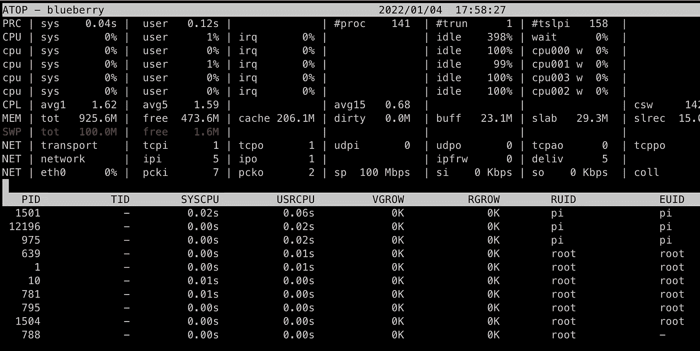
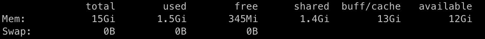
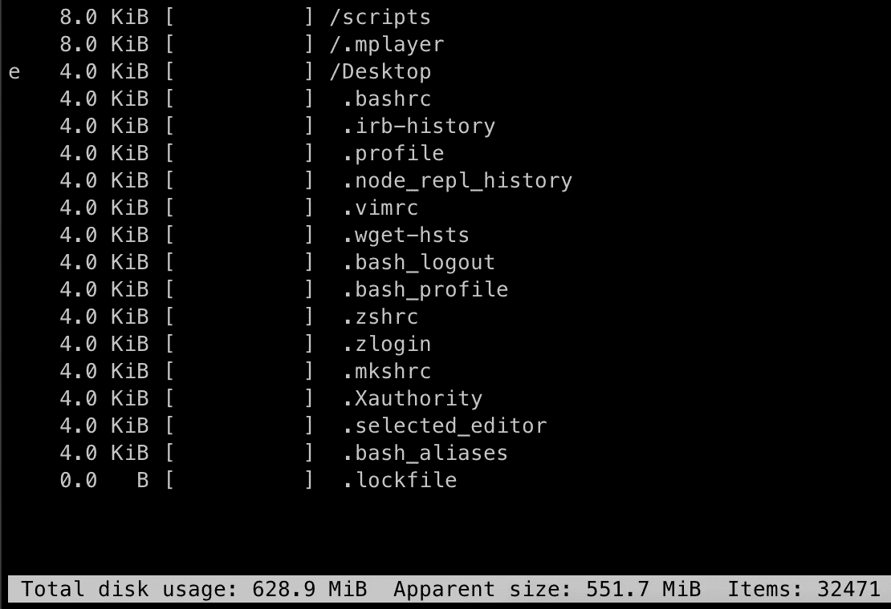
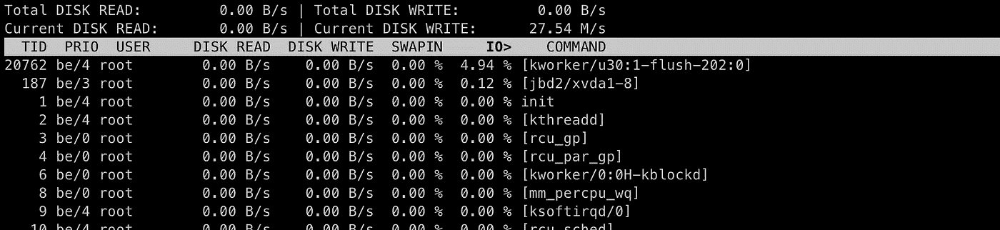
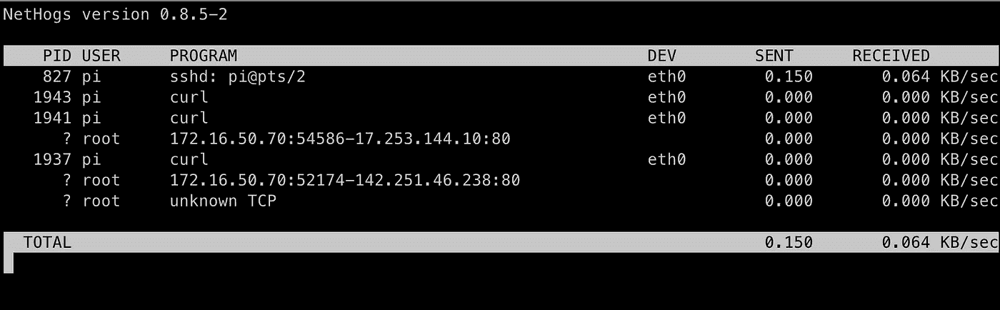

# 如何解决 Linux 服务器运行缓慢的问题

> 原文：<https://betterprogramming.pub/how-to-troubleshoot-slow-linux-servers-20a4e2843131>

## 快速查明膨胀的资源猪


照片由 [Patrik Kernstock](https://unsplash.com/@pkernstock?utm_source=unsplash&utm_medium=referral&utm_content=creditCopyText) 在 [Unsplash](https://unsplash.com/s/photos/servers?utm_source=unsplash&utm_medium=referral&utm_content=creditCopyText) 上拍摄

请求时间太长了。等待时间正在迅速增加。警报被一遍又一遍地发送。它正在发生…

你的一台 Linux 机器正在缓慢而痛苦地死去。

我们都经历过。这是一个令人伤脑筋的情况。

诊断缓慢的 Linux 服务器可能是一个棘手的过程。如果您正在运行大量的生产服务，潜在的问题领域会越来越大。是 CPU 吗？记忆？磁盘 I/O？

在本文中，我们将看看您可以用来了解落后主机的工具库。找到那些贪婪的资源猪，恢复你的服务器领地的和平与繁荣。

# 使用 atop 时的 CPU 使用情况

想尽可能地了解您的系统随时间推移的使用情况吗？想要将所有数据都塞进一个大窗口中吗？`atop`计划是为你准备的。



用在覆盆子酱上。Swap 不开心。

使用 atop 的众多好处之一是它可以记录主机随时间的性能。默认情况下，它会向您显示 10 秒钟的使用情况，您可以在时间上向前或向后移动，以查看哪里出现了峰值。这有助于您深入了解瞬态使用情况，这种情况有时会避开常规监控。

默认情况下，atop 将历史数据存储在`/var/log/atop`中，因此您可以通过执行以下命令来查看每日快照:

```
atop -r /var/log/atop/atop_<timestamp>
```

一旦你到了`atop`，你可以分别使用`t`和`T`在时间上向前或向后移动。

如果你觉得默认情况下显示器上的所有数据有点拥挤，试着通过`-l`标志来限制信息量。

使用 atop 是一回事，理解它完全是另一回事。一如既往，查看[手册](https://linux.die.net/man/1/atop)了解更多信息。

# 免费时的基本内存使用

记忆问题往往是相当老生常谈的。通常情况下，如果你有一个消耗大量内存的进程，你的机器会很快降级，直到它完全耗尽(如果没有设置限制)。如果发生这种情况，您可能根本无法登录到机器，并可能被迫重新启动它。

如果您设法在主机耗尽内存之前获得了访问权限，请通过执行以下命令快速查看发生了什么:

```
free -h
```

这应该显示整体内存使用情况，如下所示:



使用 free 显示内存使用情况。

如果您需要查看一段时间内和各个进程的内存使用情况，atop 仍然是一个可靠的选择。您可以使用以下命令在 atop 中查看内存统计信息:

```
atop -m
```

# ncdu 的磁盘使用可视化

可怕的磁盘空间问题。通常情况下，您会为磁盘使用率的上升设置警报，并在它变得危险之前发现它，但有时事情会被忽略。日志不会旋转，临时目录会膨胀。当你正在努力确定是什么占据了你所有的空间时，可视化工具可能会有所帮助。

Ncurses Disk Usage(或 [ncdu](https://linux.die.net/man/1/ncdu) )实用程序在寻找臃肿的路径时是一个令人头疼的问题。



显示文件、目录和总体使用情况的 ncdu 示例。

这个方便的小工具将分析你的文件和目录，然后显示一个用户友好的窗口，突出所有的重量级人物。

一旦进入该实用程序，您就可以深入到任何大型目录，以了解是什么在占用磁盘空间。使用箭头键上下移动，并按 enter 键切换到该目录。

你甚至可以在任何选择上点击`d`键，直接从`ncdu`控制台删除文件(小心！).

# iotop 的 I/O 指标

I/O 是一个经常被忽视的性能瓶颈。有时我们会专注于 CPU、内存或磁盘使用情况，而实际上是磁盘*吞吐量*受到了冲击。虽然您可以使用非常灵活的 atop 查看 I/O 统计数据，但我喜欢利用一个不同的实用程序，名为`[iotop](https://linux.die.net/man/1/iotop)`。



使用 iotop 的磁盘 I/O。

使用`iotop`,您可以获得一个简单、清晰的磁盘 I/O 图片，没有任何花哨的东西。这可能是所有需要赶上什么是通过你的宝贝 IOPS 咀嚼了。执行以下命令，仅查看使用磁盘 I/O 的顶级进程:

```
sudo iotop -o
```

# 网络使用与网络猪

经过一些令人厌烦的故障排除后，您可能会发现这个问题甚至与耗尽的主机资源无关。如果您正在调查处理大量网络流量的应用服务器或主机，您可能会遇到饱和、带宽限制或更糟的情况:恶意活动。

查看进程网络使用情况的最简单方法之一是使用 [NetHogs](https://github.com/raboof/nethogs) 实用程序。



显示进程及其网络使用情况的 NetHogs。

当你运行 NetHogs 时，它会给你一个发送或接收网络流量的所有进程的细目分类。您可以看到哪个应用程序正在建立连接，甚至可以看到它所连接的主机。

NetHogs 不仅可以方便地排除失控网络进程的故障，还可以保证安全性。使用该实用程序，您可以快速了解您的机器正在建立的连接以及它们使用了多少数据。例如，看到某些 SSH 会话传输大量数据可能是可疑的。

感谢阅读！如果你喜欢这篇文章，看看我的另一篇文章:

*   [*你应该知道的 5 个基本 Linux 磁盘管理命令*](/5-basic-linux-disk-management-commands-you-should-know-ee47c49ce6e6)