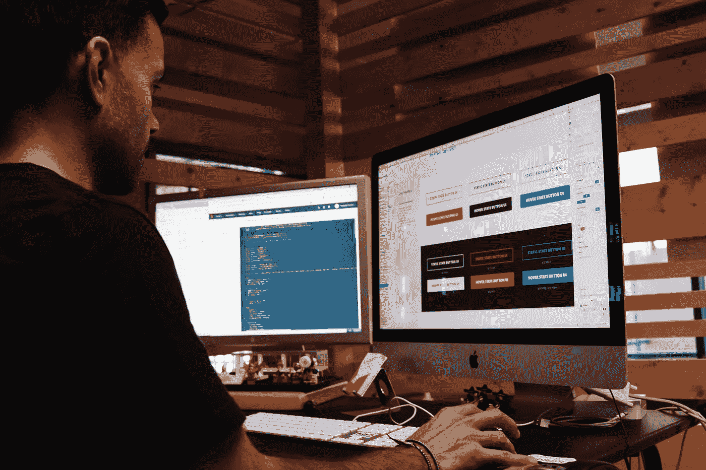
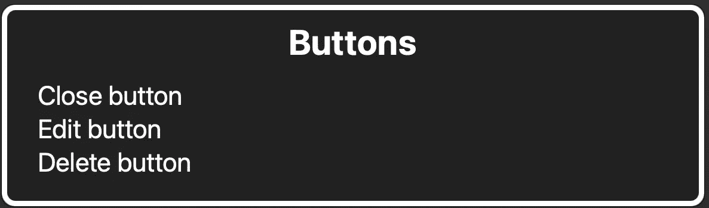

# 如何在 React 中将 div 变成可访问的按钮

> 原文：<https://betterprogramming.pub/how-to-turn-a-div-into-an-accessible-button-in-react-fbf236283d6d>

## 创建辅助按钮

[活动创建者](https://unsplash.com/@campaign_creators?utm_source=medium&utm_medium=referral)在 [Unsplash](https://unsplash.com?utm_source=medium&utm_medium=referral) 上拍摄的照片

在 React 中，通过向不是`<button>`的元素添加`onClick`事件来制作按钮是很常见的。

创建按钮时偷工减料会损害用户体验，尤其是在可访问性方面。使用键盘、屏幕阅读器或其他辅助技术的用户可能无法与该按钮进行交互。

本文将分解非语义按钮产生的问题，并一步一步地解释如何创建一个功能性和可访问的按钮。

不是可访问的按钮

# 是什么让按钮变得容易操作？

可访问按钮具有焦点，可以通过空格键和回车键激活。此外，该按钮具有`'button'`的作用，并且具有可访问的名称。

示例中的按钮可能看起来像按钮，但它是不可访问的。屏幕阅读器不会将元素识别为按钮，因此屏幕阅读器不会将元素作为按钮呈现给用户。用键盘浏览网页的人将不能与该元素交互。只有用鼠标浏览网页的人才能激活这个按钮。

# 把`div`变成按钮的最好方法

理想情况下，你可以通过交换`
`和`<button>`来实现这个按钮。

开箱即用，更新的按钮是键盘可访问的，有一个可见的焦点状态，并可以由屏幕阅读器宣布。

# 如何移除默认按钮样式

`<button>`元素包含默认样式，所以这个按钮看起来与第一个例子中的按钮有点不同。我们可以从按钮中删除一些默认样式。

我不建议从按钮样式中删除`outline`属性。

属性为按钮提供可见的焦点状态。 [WCAG 成功标准 2.4.7](https://www.w3.org/TR/WCAG21/#focus-visible) 规定交互元素必须有一个可见的焦点指示器。焦点状态突出显示交互元素。它帮助用键盘浏览页面的人找到他们在页面上的位置。

您可以依赖浏览器获得默认的焦点轮廓，也可以自行设计。如果您自己设计，为了使样式符合 [WCAG 成功标准 1.4.11](https://www.w3.org/TR/WCAG21/#non-text-contrast) ，请确保元素的焦点轮廓与背景颜色的对比度至少为 3:1。

# 为什么用 div 代替按钮？

同样，我建议尽可能使用 HTML `<button>`元素，不要创建自己的按钮。然而，有时由于约束，您不得不用一个`
`或另一个非按钮元素来凑合。例如，如果您使用的应用程序使用的 UI 库不使用语义按钮元素作为按钮，您可能需要向该元素添加属性，以便可以访问它。

# 如何将 div 转换成可访问的按钮？

## 1.添加角色='button '

有必要添加`role='button'`，以便辅助技术可以将元素作为按钮呈现给用户。

角色为“button”的不可访问按钮

尽管[按钮角色](https://developer.mozilla.org/en-US/docs/Web/Accessibility/ARIA/Roles/button_role)允许屏幕阅读器将元素识别为按钮，但是该角色并没有赋予元素按钮功能。

VoiceOver 显示带有 role =“button”的元素列表

按钮是一种交互式 HTML 元素，用户可以用鼠标、手指、键盘、语音命令或其他辅助技术来触发它。对于按钮角色，元素现在被屏幕阅读器识别为按钮；但是，它不能通过键盘访问。

## 2.添加 tabIndex='0 '

[Tabindex](https://developer.mozilla.org/en-US/docs/Web/HTML/Global_attributes/tabindex) 使一个元素可通过键盘聚焦。通过添加`tabIndex='0'`，按钮可通过键盘操作。

tabIndex =“0”的不可访问按钮

现在，该按钮具有焦点状态，但是键盘不能激活该按钮。键盘事件处理程序必须添加到元素中。

## 3.添加键盘事件处理程序

因为 Enter 和 Space 键预计会触发可访问按钮的`onClick`事件，所以我们需要添加一个功能，即点击任意一个键都会触发按钮。我们可以通过向按钮添加事件`onKeyDown`来做到这一点。当按下任何键时，但在浏览器处理该键之前，触发`onKeyDown`事件。由于空格键默认触发页面滚动，我们需要使用`onKeyDown`函数中的`preventDefault`方法。`preventDefault`方法取消被触发的键，这是可能的，因为`onKeyDown`事件在浏览器处理被触发的键之前被触发。

易操作的按钮

## 4.禁用状态

当按钮的操作不可用时，您可能想要禁用它，这样用户就不能与它交互。当`<button>`元素具有属性`disabled=true`时，`<button>`在键盘上是不可聚焦的，并且被不透明度覆盖。

重要的是要注意到[禁用的按钮有缺点](https://www.smashingmagazine.com/2021/08/frustrating-design-patterns-disabled-buttons/#the-downsides-of-disabled-buttons)，例如不通知用户为什么按钮被禁用，并且键盘不可聚焦。但是，有些情况下包含一个禁用按钮也可以，比如防止用户意外提交表单两次。

对于我们已经变成可访问按钮的`
`,在视觉上，它可以通过样式设置为禁用状态。

添加`pointer-events: none;`使按钮不可点击。但是，该按钮仍然具有焦点状态。为了使键盘不可聚焦，需要将`tabIndex`从 0 改为-1。最后，我们需要添加属性`aria-disabled='true'`，以便屏幕阅读器向用户显示按钮被禁用。

禁用按钮

这些步骤使元素的禁用状态类似于`<button>`元素的`disabled`状态。然而，有一些方法可以让[被禁用的按钮更具包容性](https://css-tricks.com/making-disabled-buttons-more-inclusive/)，比如让按钮成为可聚焦的，并显示帮助文本解释为什么按钮被禁用。

# 结论

创建可访问的按钮可以确保所有用户都可以与按钮进行交互，而不管他们的能力如何。重要的是，该按钮可以用键盘激活，并且辅助技术可以将该元素识别为按钮。

我希望，在读完这篇文章后，你能检查一下你网站上的按钮是否是可访问的。如果它们缺少属性，如屏幕阅读器无法识别或需要可见的焦点状态，请确保进行适当的更改，以便可以访问它们。当你使你的网站可访问时，它改善了每个人的用户体验。

# 资源

*   [ARIA 创作实践指南:按钮](https://www.w3.org/WAI/ARIA/apg/patterns/button/)
*   [WCAG 成功准则 2.4.7 重点可见 2.4.7](https://www.w3.org/TR/WCAG21/#focus-visible)
*   [WCAG 成功准则 1.4.11 非文本对比](https://www.w3.org/TR/WCAG21/#non-text-contrast)
*   [ARIA 上的 MDN 文档:按钮角色](https://developer.mozilla.org/en-US/docs/Web/Accessibility/ARIA/Roles/button_role)
*   [关于<按钮>的 MDN 文档:按钮元素](https://developer.mozilla.org/en-US/docs/Web/HTML/Element/button)
*   [按钮与分区的可访问性](https://www.yanandcoffee.com/2020/08/10/button-vs-div/)
*   [令人沮丧的设计模式:禁用的按钮](https://www.smashingmagazine.com/2021/08/frustrating-design-patterns-disabled-buttons/)
*   [使禁用的按钮更具包容性](https://css-tricks.com/making-disabled-buttons-more-inclusive/)
*   [设计 CSS 按钮:技术和资源](https://www.smashingmagazine.com/2009/11/designing-css-buttons-techniques-and-resources/)
*   [7 按钮设计的基本规则](https://uxplanet.org/7-basic-rules-for-button-design-63dcdf5676b4)