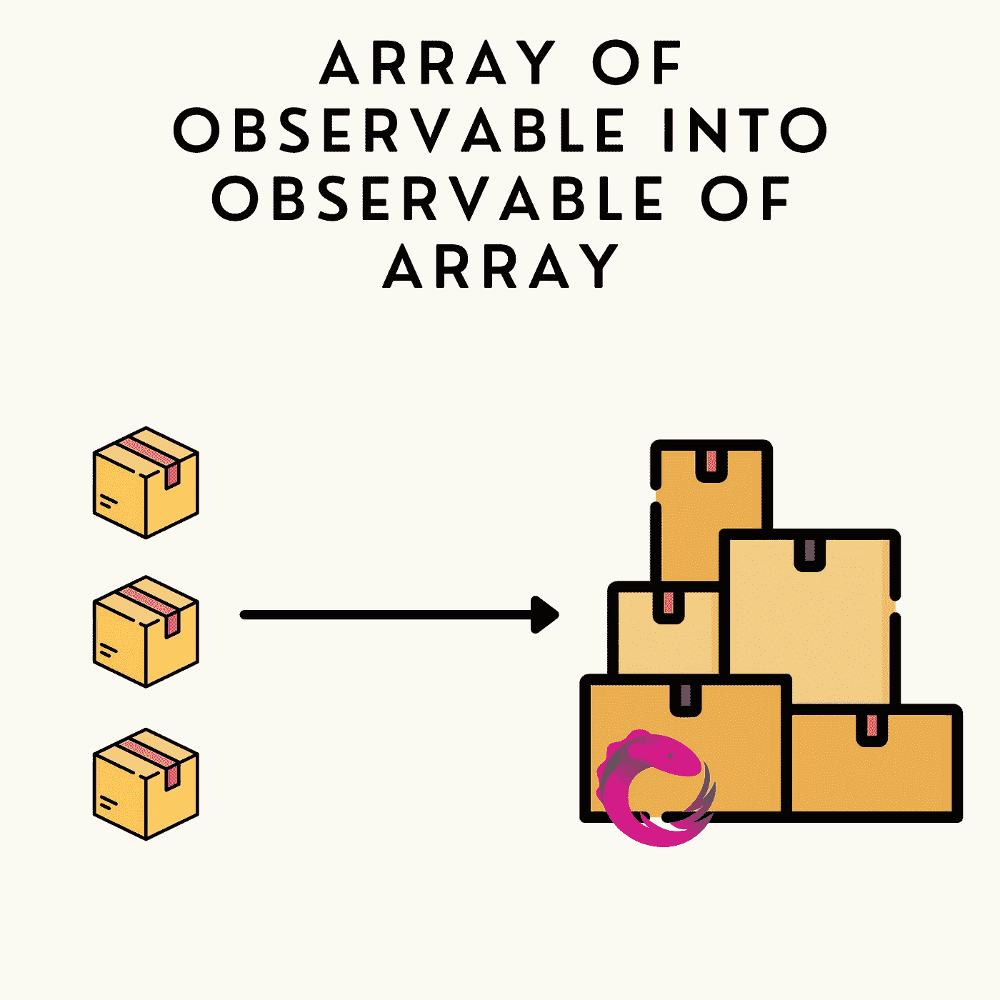

# 如何将一个可观测数组转化为一个角度可观测数组

> 原文：<https://betterprogramming.pub/how-to-turn-an-array-of-observable-into-an-observable-of-array-in-angular-d6cfe42a72d4>

## 把可观察的 []变成可观察的

在角度应用中，拥有一组可观测数据很容易。如果处理不当，可能会导致一些可怕的代码。

这是一个发生这种问题的真实例子。考虑以下服务:

我们有一个通过 HTTP GET 获取用户的方法。另一个方法也使用 HTTP GET 获取所有用户的订单，但这次使用用户的 id 作为参数。

现在，我们需要设置一个组件来显示所有用户以及每个用户的所有订单。

# 丑陋的解决方案:链接订阅

让我们来看看最糟糕的方法。

在我们开始讨论这个解决方案之前，让我们澄清一件事，这个解决方案非常适合我们需要做的事情。我知道我可能应该取消订阅，我可以创建一个更好的“用户/订单”数据模型。但是除此之外，我们可以在模板中使用`orders` 和`users`对象，这样就可以了。

## 那么，它有什么问题呢？

1.  很难读。对象在不同的地方被定义和编辑。随着我们的组件变得越来越大，这可能会导致混乱。
2.  使用 subscribe 使得无法使用异步管道
3.  这很难维护，想象一下，如果我们需要为每个`order`添加另一个请求，或者需要从用户那里获取更多的数据。有可能，但是有很多工作要做。

# 一个更好的解决方案:结合可观察的

下一个解决方案是使用一种更具反应性的方法，更接近 RxJS 和 Angular 最佳实践。

我们定义了一个“结果”可观察对象`usersWithOrders$`，它意味着包含最终数据。

为了获得这些数据，我们通过管道传输以下操作:

1.  获取所有用户。
2.  将每个用户转换成一个可观察对象，该对象将检索他的订单并将用户和他的订单存储在一个对象中。
3.  我们使用`forkJoin` ( `combineLatest`在这种情况下也能很好地工作)将可观察的数组转化为可观察的数组。
4.  最后，我们只需要使用`switchMap`来订阅下一个可观察对象并发送订单请求。

## 这个解决方案怎么样比较好？

1.  更容易阅读。好吧，也许不是，如果你是新的角度。但除此之外，我们的 IDE 可以很容易地理解管道中每一步的类型，使代码可读和可理解。
2.  因为我们没有订阅，所以它与异步管道兼容。
3.  我们可以在不完全重构的情况下向它添加特性。我们可以简单地在管道中添加另一个步骤。

# 另一种解决方案:重构后端

在您复制粘贴这些代码并继续您的生活之前，还有最后一件事需要考虑。

我们在本文中使用的例子是非常现实的。在微服务时代，弄个`UserService`再弄个`OrderService`其实并不了解对方是很常见的。然而，如果每个用户总是被他的订单所获取，那么将结果和两者结合起来直接发送回去可能是一个好主意。

非常感谢你把这篇文章看完！如果你喜欢这篇文章，请考虑订阅更多像这样的内容。

# TL；速度三角形定位法(dead reckoning)

要将一个可观察的数组转换成一个数组的可观察对象，使用一个组合运算符，如`forkJoin`或`combineLatest`

完整源代码:[https://stack blitz . com/edit/rxjs-array-of-observables-to-observable](https://stackblitz.com/edit/rxjs-array-of-observables-to-observable)