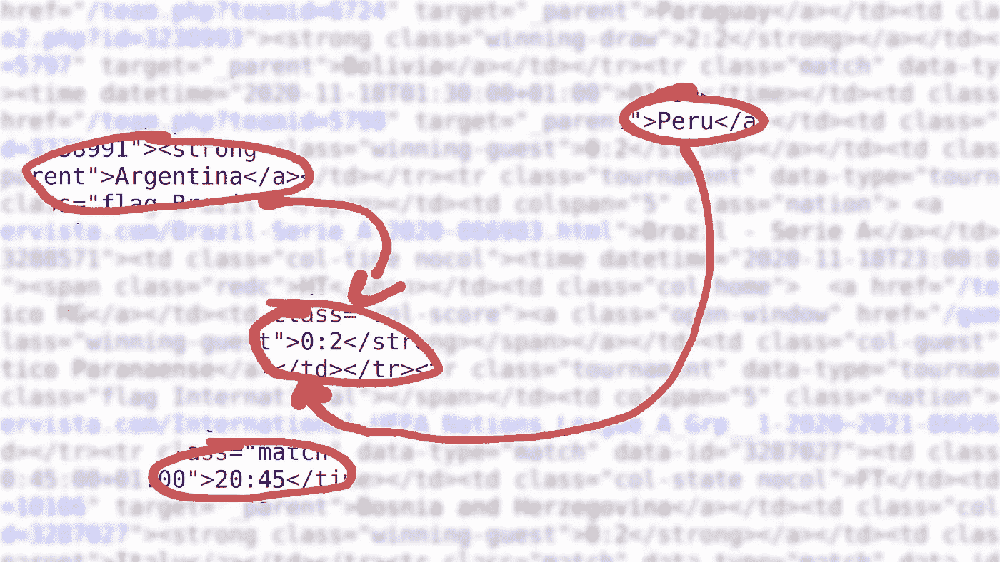
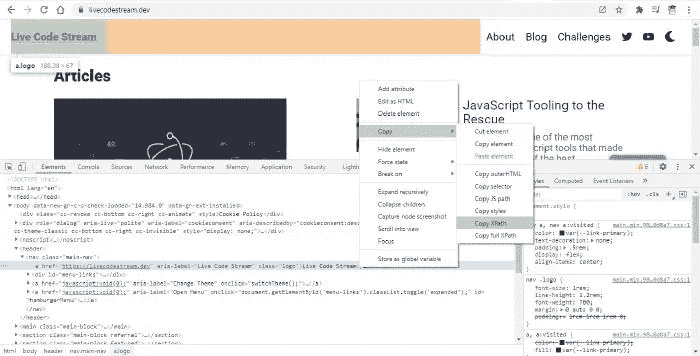

# 如何用 Python 和 Scrapy 把 Web 变成数据

> 原文：<https://betterprogramming.pub/how-to-turn-the-web-into-data-with-python-and-scrapy-7bad725cf5a>

## Python 和 Scrapy 支持的网络抓取指南



作者图片

本教程将是你学习使用 Python 进行 web 抓取的终极指南。首先，我会带你看一些基本的例子，让你熟悉网页抓取。稍后，我们将使用这些知识从 [Livescore](https://www.livescore.cz/) 中提取足球比赛数据。

事不宜迟，我们开始吧

# 入门指南

为了让我们开始，您需要启动一个新的 Python3 项目并安装[Scrapy](https://scrapy.org/)(Python 的一个网络抓取和网络爬行库)。我在本教程中使用 Pipenv，但是您也可以使用 pip 和 venv——或者 conda。

```
pipenv install scrapy
```

在这一点上，你有 Scrapy，但你仍然需要创建一个新的网络抓取项目，为此，Scrapy 为我们提供了一个命令行，为我们做工作。

现在让我们使用 Scrapy CLI 创建一个名为`web_scraper`的新项目。

如果您像我一样使用 Pipenv，请使用:

```
pipenv run scrapy startproject web_scraper .
```

否则，使用以下命令从虚拟环境启动:

```
scrapy startproject web_scraper .
```

这将在当前目录中创建一个具有以下结构的基本项目:

```
scrapy.cfg
web_scraper/
    __init__.py
    items.py
    middlewares.py
    pipelines.py
    settings.py
    spiders/
        __init__.py
```

# 用 XPath 查询构建我们的第一个蜘蛛

我们将从一个非常简单的例子开始我们的 web 抓取教程。首先，我们将在网站的 HTML 中定位[实时代码流](https://livecodestream.dev/)标志。正如我们所知，它只是一个文本而不是图像，所以我们将简单地提取这个文本。

## 代码

首先，我们需要为这个项目创建一个新的蜘蛛。我们可以通过创建新文件或使用 CLI 来实现。

因为我们已经知道我们需要的代码，我们将在这个路径`/web_scraper/spiders/live_code_stream.py`创建一个新的 Python 文件。

以下是该文件的内容:

```
import scrapyclass LiveCodeStreamSpider(scrapy.Spider):
    name = "lcs" start_urls = [
        "https://livecodestream.dev/"
    ] def parse(self, response):
        yield {
            'logo': response.xpath("/html/body/header/nav/a[1]/text()").get()
        }
```

## 代码解释

1.  首先，我们导入了 Scrapy 库。我们需要它的功能来创建一个 Python 网络蜘蛛。然后这个蜘蛛将被用来抓取指定的网站，并从中提取有用的信息。
2.  我们创建了一个类，并命名为`LiveCodeStreamSpider`。基本上，它继承自`scrapy.Spider`——这就是我们将它作为参数传递的原因。
3.  现在，重要的一步是使用一个名为`name`的变量为你的蜘蛛定义一个唯一的名字。请记住，您不允许使用现有蜘蛛的名称。同样，你也不能用这个名字去创造新的蜘蛛。它必须在整个项目中是唯一的。
4.  之后，我们使用`start_urls`列表传递网站 URL。
5.  最后，我们创建了一个名为`parse()`的方法，它将在 HTML 代码中定位徽标并提取其文本。在 Scrapy 中，有两种方法可以找到源代码中的 HTML 元素:CSS 和 XPath。

您甚至可以使用一些外部库，如 [BeautifulSoup](https://pypi.org/project/beautifulsoup4/) 和 [lxml](https://lxml.de/) ，但是对于这个例子，我们使用了 XPath。

确定任何 HTML 元素的 XPath 的一个快速方法是在 Chrome DevTools 中打开它。现在，只需右键单击该元素的 HTML 代码，并将鼠标光标悬停在弹出菜单中的“Copy”上。最后，单击“复制 XPath”菜单项。

看看下面的截图可以更好地理解它。



使用 Chrome DevTools 查找 XPath

顺便说一下，我在元素的实际 XPath 后面使用了`/text()`,只从该元素中检索文本，而不是完整的元素代码。

**注意:**不允许对上述变量、列表或函数使用任何其他名称。这些名称是在 Scrapy 库中预先定义的。所以你必须照原样使用它们。否则，程序将无法正常运行。

## 跑蜘蛛

由于我们已经在命令提示符下的`web_scraper`文件夹中，让我们执行我们的蜘蛛，并使用下面的代码将结果填充到一个新文件`lcs.json`中。是的，使用 JSON 格式，我们得到的结果将是结构良好的。

```
pipenv run scrapy crawl lcs -o lcs.json 
```

或者

```
scrapy crawl lcs -o lcs.json
```

## 结果

当上面的代码执行时，我们会在项目文件夹中看到一个新文件`lcs.json`。

以下是该文件的内容:

```
[
{"logo": "Live Code Stream"}
]
```

# 另一个带有 CSS 查询选择器的蜘蛛

我们大多数人都热爱运动，说到足球，这是我个人的最爱。

世界各地经常组织足球比赛。有几个网站在比赛进行的时候提供比赛结果的直播。但这些网站大多不提供官方 API。

反过来，它为我们创造了一个机会，通过直接抓取他们的网站，使用我们的网络抓取技能来提取有意义的信息。

比如我们来看看 [Livescore](https://www.livescore.cz/) 网站。

在他们的主页上，他们很好地展示了今天(你访问网站的日期)将要进行的锦标赛和比赛。

我们可以检索如下信息:

*   锦标赛名称
*   比赛时间
*   团队 1 名称(例如，国家、足球俱乐部等。)
*   团队 1 目标
*   团队 2 名称(例如，国家、足球俱乐部等。)
*   团队 2 目标
*   等等。

在我们的代码示例中，我们将提取今天匹配的锦标赛名称。

## 代码

让我们在项目中创建一个新的蜘蛛来检索锦标赛名称。我将这个文件命名为`livescore_t.py`。

以下是您需要在`/web_scraper/web_scraper/spiders/livescore_t.py`中输入的代码:

```
import scrapyclass LiveScoreT(scrapy.Spider):
    name = "LiveScoreT" start_urls = [
        "https://livescore.cz/"
    ] def parse(self, response):
        for ls in response.css('#soccer_livescore .tournament'):
            yield {
                'tournament': ls.css('.nation a::text').get()
            }
```

## 代码解释

1.  像往常一样，进口刺痒。
2.  创建一个继承`scrapy.Spider`属性和功能的类。
3.  给我们的蜘蛛起一个独特的名字。在这里，我使用了`LiveScoreT`，因为我们将只提取锦标赛名称。
4.  下一步是提供`livescore.cz`的网址。
5.  最后，运行`parse()`函数循环遍历所有包含锦标赛名称的匹配元素，并使用`yield`将其连接在一起。最后，我们将收到今天所有匹配的锦标赛名称。
6.  需要注意的一点是，这次我使用了 CSS 选择器，而不是 XPath。

## 运行新创建的蜘蛛

是时候看看我们的蜘蛛在行动了。运行下面的命令让蜘蛛抓取 Livescore 网站的主页。web 抓取的结果将被添加到一个名为`ls_t.json`的 JSON 格式的新文件中。

```
pipenv run scrapy crawl LiveScoreT -o ls_t.json
```

现在，你知道该怎么做了。

## 结果

这是我们的网络蜘蛛在 11 月 18 日从`[livescore.cz](https://www.livescore.cz/)`中提取的。请记住，输出可能每天都在变化。

```
[
{"tournament": "International - World Cup Qualification CONMEBOL"},
{"tournament": "Brazil - Serie A"},
{"tournament": "International - UEFA Nations League A Grp. 3"},
{"tournament": "International - UEFA Nations League A Grp. 4"},
{"tournament": "International - UEFA Nations League C Grp. 1"},
{"tournament": "International - UEFA Nations League D Grp. 1"},
{"tournament": "International - UEFA Nations League D Grp. 2"},
{"tournament": "..."}
]
```

# 更高级的用例

在这一节中，我们不仅要检索锦标赛名称，还要进一步获取锦标赛及其比赛的完整详细信息。

在`/web_scraper/web_scraper/spiders/`里面新建一个文件，命名为`livescore.py`。现在，输入下面的代码。

```
import scrapyclass LiveScore(scrapy.Spider):
    name = "LiveScore" start_urls = [
        "https://www.livescore.cz/yesterday.php"
    ] def parse(self, response):
        table_tr = response.css('tr')

        tournaments = [] for tr in table_tr:
          if tr.css('.tournament'):
            tournaments.append({
                    'name': tr.css('.nation a::text').get(),
                    'matches': []
                })
          elif tr.css('.match'):
            team_score = tr.css('.col-score strong::text').get() if team_score is not None:
                team_1_score = team_score.split(':')[0]
                team_2_score = team_score.split(':')[1]
            else:
                team_1_score = None
                team_2_score = None tournaments[-1]['matches'].append({
                'time': tr.css('.match .col-time time::attr(datetime)').get(),
                'state': tr.css('.match .col-state span::text').get(),
                'team_1_name': tr.css('.col-home a::text').get(),
                'team_1_score': team_1_score,
                'team_2_name': tr.css('.col-guest a::text').get(),
                'team_2_score': team_2_score
            })

        for t in tournaments:
            yield {
                'tournament': t
            }
```

## 代码解释

这个文件的代码结构与我们前面的例子相同。这里，我们刚刚用新功能更新了`parse()`方法。

基本上，我们从页面中提取了所有的 HTML `<tr></tr>`元素。然后，我们循环浏览它们，找出每一个是锦标赛还是比赛。如果是锦标赛，我们提取它的名字。在匹配的情况下，我们提取其`time`、`state`，以及两个队的`name`和`score`。

## 运行示例

在控制台中键入以下命令，并执行它。

```
pipenv run scrapy crawl LiveScore -o ls.json
```

## 结果

以下是检索内容的示例:

```
[{
    "tournament": {
        "name": "International - World Cup Qualification CONMEBOL",
        "matches": [{
            "time": "2020-11-18T00:00:00+01:00",
            "state": null,
            "team_1_name": "Uruguay",
            "team_1_score": "0",
            "team_2_name": "Brazil",
            "team_2_score": "2"
        }, {
            "time": "2020-11-18T00:00:00+01:00",
            "state": null,
            "team_1_name": "Paraguay",
            "team_1_score": "2",
            "team_2_name": "Bolivia",
            "team_2_score": "2"
        }, {
            "time": "2020-11-18T01:30:00+01:00",
            "state": null,
            "team_1_name": "Peru",
            "team_1_score": "0",
            "team_2_name": "Argentina",
            "team_2_score": "2"
        }]
    }
}]
```

现在有了这些数据，我们可以做任何我们想做的事情，比如用它来训练我们自己的神经网络来预测未来的游戏。

# 结论

数据分析师经常使用网络抓取，因为这有助于他们收集数据来预测未来。同样，企业使用它来从网页中提取电子邮件，因为这是一种有效的方法来产生线索。我们甚至可以用它来监控产品的价格。

换句话说，web 抓取有很多用例，Python 完全有能力做到。

你还在等什么？现在尝试抓取您最喜爱的网站。

感谢阅读！