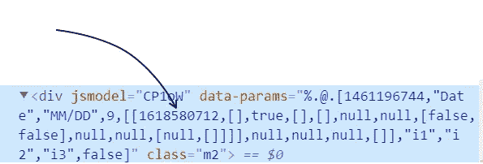

# 如何把你的谷歌表单变成一个电报机器人

> 原文：<https://betterprogramming.pub/how-to-turn-your-google-form-into-a-telegram-bot-108ac382c58a>

## 制作一个电报机器人，它会提出问题，并在谷歌表单中填写答案

就像工业机器人曾经承担日常工作一样，将一些谷歌表单转换成机器人有助于自动提交报告，从而让人类有更多时间来完成创造性任务。由[大卫·莱维克](https://unsplash.com/@davidleveque?utm_source=unsplash&utm_medium=referral&utm_content=creditCopyText)在 [Unsplash](https://unsplash.com/s/photos/industrial-robot?utm_source=unsplash&utm_medium=referral&utm_content=creditCopyText) 上拍摄的照片

案例是这样的:有一家公司要求其员工每天填写一份谷歌表格。对于必须每天执行的操作，该表单不是最友好的界面，因此大多数员工跳过它，在每个月底多次填写表单，这是不可接受的。所以我是这么做的。

我做了一个电报机器人，每天向所有工人提问，然后把答案填入表格并提交。有些字段是自动填写的，比如提交日期和用户名。

# 发送 HTTP 请求

要自动化的表单看起来像[这个](https://docs.google.com/forms/d/e/1FAIpQLScTYOs-Z7qggWYZoldE-pA7zWMHqh1svjLhtTVu7b_V4mwNkw/viewform)。

让我们编写一个脚本，自动提交带有如下信息的表单:10/10 雇员 1 的状态为 2，注释为“自动提交”每次提交表单时，web 浏览器都会向服务器发送一个 HTTP 请求。脚本必须发送这样的请求，而不是浏览器。

首先，我们需要弄清楚表单中每个字段的 id。为此，右键单击每个字段上的“inspect element ”,并查找如下所示的数字:

记住有两个数字，你需要第二个

现在，我们可以使用下面的代码发送请求了:

form_data 字典中的键包含字段的 id

运行脚本后，我们得到:<response>。这意味着请求被成功执行。现在是在请求中插入用户数据的时候了。</response>

# 创建一个电报机器人

## 入职

首先，我们需要处理好`/start`命令，记住用户。首先，bot 解析初始表单并获取所有可能的名称，如下所示:

这段代码利用了这样一个事实，即表单中的所有名称都有两个单词

得到名字后，我们向用户发送一条消息，要求他们从列表中选择自己的名字。这些名字会被记住并自动填写。

函数`insert_name()`用于在 SQLite 数据库中添加一行。每行包含一个电报 id 和一个用户名。当机器人收到一条消息时，它可以很容易地在给出电报 id 的数据库中查找名字。

## 询问用户

为了创建 ask 消息，机器人首先解析表单以获得所有可能的状态，然后创建一个内嵌键盘将其嵌入到消息中，以便用户可以按下与他们今天的状态相对应的按钮。

现在棘手的部分:评论部分是不必要的，所以我们需要问用户是否想添加评论。

因此，在获得响应后，我们首先需要确定是否会有注释，并将状态存储在一个全局字典中，以便能够从另一个函数中访问它，该函数在用户回答第二个问题后被调用。

`insert_report`函数看起来像这样:

看起来很眼熟，不是吗？它与本文第一部分中的脚本相同，但是它使用用户的答案，而不是硬编码的答案。响应也根据用户是否想要添加评论而变化。

每天，在同一时间，所有注册用户都应该收到这条消息，并有问题要回答。为了调度消息传递，我使用了`aioschedule`库，它允许我在 Python 中异步调度作业。

剩下的唯一一件事就是启动 bot，我们将使用以下代码来完成:

所以，就这样了！您可以在 GitHub 资源库中查看全部代码:

 [## GitHub-mega chell/Google _ form _ Bot:Bot 自动定期提交 Google 表单。

### 机器人自动定期提交谷歌表格。-GitHub-mega chell/Google _ form _ Bot:Bot 自动化期刊…

github.com](https://github.com/Megachell/Google_form_bot)