# 如何把你的 Ruby on Rails 项目变成一个 Shopify 应用

> 原文：<https://betterprogramming.pub/how-to-turn-your-ruby-on-rails-project-into-a-shopify-app-c39db39985b1>

## 我遇到的所有问题的解决方案


照片由[科里·卡尔](https://unsplash.com/@korie?utm_source=medium&utm_medium=referral)在 [Unsplash](https://unsplash.com?utm_source=medium&utm_medium=referral) 拍摄

在过去的几周里，我花时间把一个 Rails 项目变成了一个 Shopify 应用，这可能是一件痛苦的事情。因此，我记录了哪些有效，哪些无效，我希望这个指南能让你对 Shopify 应用程序开发的介绍至少简单一点。

# 准备

当然，你不能马上开始编码，但幸运的是，只需要做三件事:

1.  Shopify 合作伙伴帐户
2.  开发商店
3.  ngrok 帐户

## Shopify 合作伙伴帐户

如果你想为 Shopify 开发一款应用，你需要创建一个 [Shopify 合作伙伴账户](https://www.shopify.com/partners)。真的很简单，你只需要注册一下，然后就搞定了。另外，它是免费的！

## 开发商店

创建合作伙伴帐户后，您需要创建一个商店。否则，你将无法在商店内测试你的应用。

1.  进入您的 Shopify 合作伙伴帐户，点击左侧菜单上的*商店*。

2.点击*添加商店*并选择选项*开发商店*。

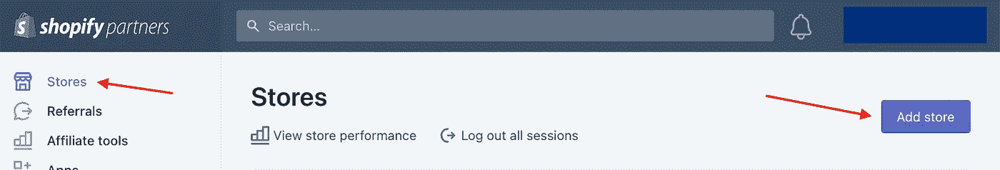

3.填写所有必要的信息和完成！

它应该会将您重定向到商店的仪表板。

## ngrok 帐户

你还需要一个 [ngrok](https://ngrok.com/) 账户。只需注册并下载适合您笔记本电脑的正确版本，然后按照网站上的说明进行操作。如果 *Setup & Installation* 上的命令对您不起作用，您也可以按照 *Your Authtoken* 一节中的描述手动执行。

如果您不知道 ngrok 是什么，ngrok 会创建一个到您的本地主机的安全隧道。您需要这样一个隧道，因为 Shopify 不能(显然)直接访问您的本地主机，但是为了测试您的 Rails Shopify 应用程序并进行更改和调整，您需要在本地运行它。使用 ngrok，您的本地应用程序更改将在您的 Shopify 商店中可见。简单来说就是这样工作的:你的本地主机服务器→ ngrok → Shopify store。

打开一个终端，用`ngrok http 3000`启动服务器。您的终端应该如下所示:

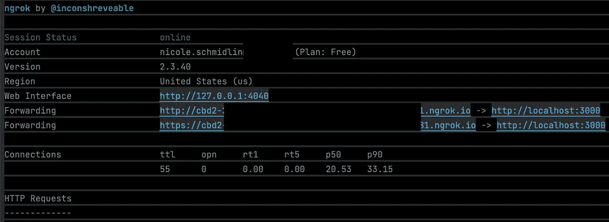

如果它不起作用，并且您得到 ERR_NGROK_108，您可能需要终止当前的 NGROK 会话，然后重新启动它。

```
# kill and restart$ kill `pgrep ngrok`
$ ngrok http 3000
```

保持终端打开并运行。

# 创建应用程序

## 在合作伙伴的仪表板中创建应用程序

1.  与开发商店一样，点击左侧菜单上的*应用*，然后点击*创建应用*。

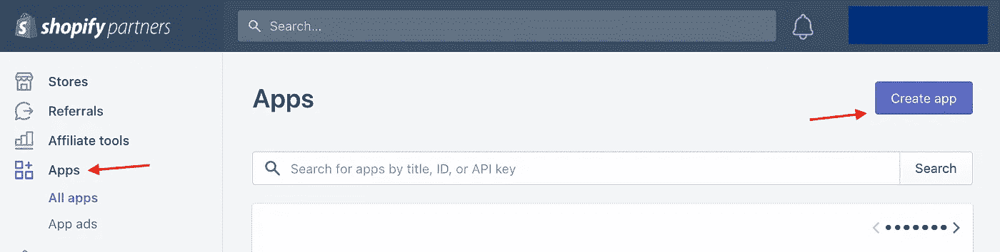

2.选择要创建自定义还是公共 app，我会选择公共 app。

3.之后，输入所有必要的信息。

对于*应用程序 URL* ,使用 ngrok 提供的 URL。在我上面的例子中，应该是`[http**s**://cbd2-somemorestuff.ngrok.io](https://cbd2-somemorestuff.ngrok.io)`。对于*允许的重定向 URL*，放入相同的 ngrok URL，但是在末尾加上`/auth/shopify/callback`。这样，当您将应用程序安装到商店时，Shopify 将能够验证您的应用程序。

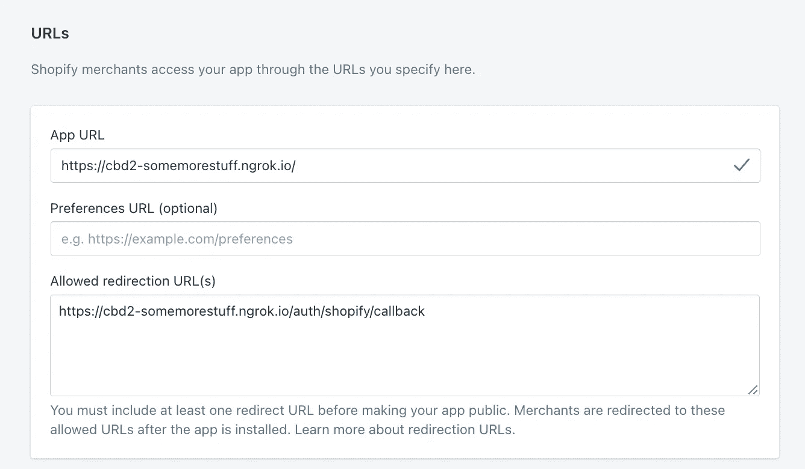

> 必须是 https，输入 http 网址就不行了。

4.最后，点击创建应用程序。

搞定了。现在，您应该可以看到您的应用程序 API 密钥和密钥。

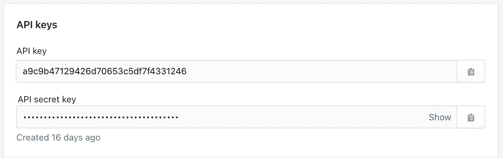

默认情况下，*嵌入式 app* 应被启用，但仍需检查是否被确认。为此，点击*应用程序设置。*

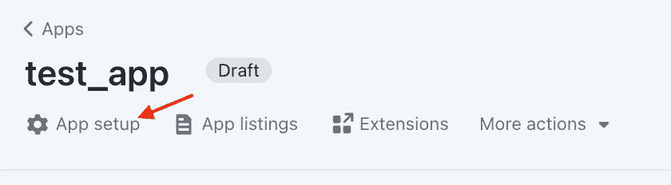

向下滚动直至到达*嵌入式应用*部分，并点击*管理*按钮。启用*在 Shopify 管理中嵌入您的应用程序*(如果当前已禁用)。

## 添加 shopify_app gem

1.  获取一个现有项目或创建一个新项目，并将其放入 cd 目录中:

```
$ rails new shopify_rails_app_name
$ cd shopify_rails_app_name
```

2.手动添加 gem 或在终端中运行以下命令:

```
$ bundle add shopify_app
```

3.用你自己的 api 密匙、secret 和 ngrok 重定向 URL(末尾有`/auth/shopify/callback`的那个)安装生成器。

```
$ rails generate shopify_app:install -api_key=your_api_key 
-secret=your_app_secret -redirect_uri=your_redirect_uri
```

您可能会收到和我一样长的错误消息，如下所示:

```
in `method_missing': undefined method `assets' for #<Rails::Application::Configuration:0x000000010c7d75a0...
```

如果这样做，那么您需要在 config 文件夹中的`application.rb`顶部添加`require “sprockets/railtie”`，并在`app > assets > config`中创建一个`manifest.js`文件。再次运行该命令。

4.生成家庭控制器和商店模型

```
$ rails generate shopify_app:home_controller
$ rails generate shopify_app:shop_model
```

5.运行挂起的迁移

在执行命令之前，转到您的`routes.rb`文件，检查您是否定义了一个或两个`root`。通过运行步骤 4 中的 home controller 命令，Shopify 将添加`root :to => ‘home#index’`。保留它并注释掉另一个根声明。否则，安装将无法运行(您可以在以后将其改回来)。

当您只定义了一个根时，运行迁移:

```
$ rails db:migrate
```

6.将 API 密钥和机密添加到。包封/包围（动词 envelop 的简写）

打开`.env`文件或在项目的根目录下创建一个文件，并如下定义您的 API 密钥和秘密:

```
SHOPIFY_API_KEY=Your Shopify API key
SHOPIFY_API_SECRET=Your Shopify API secret
```

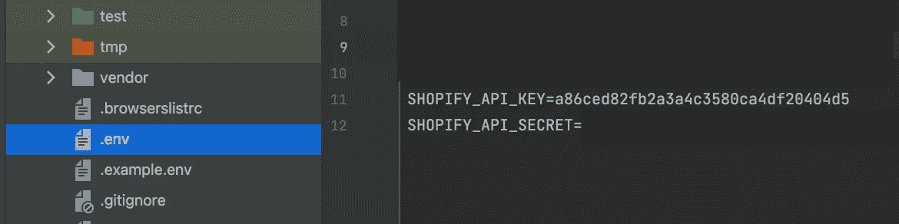

最后，没有必要，但我仍然认为你应该这样做:检查 gem 所做的所有更改(HomeController、ProductsController、migration 等。).

## 将应用连接到商店

1.  启动 rails 服务器

```
$ rails s
```

2.访问您定义为应用程序 URL 的 ngrok URL。

3.您现在应该看到一个输入字段，要求您输入您的商店域名。输入并点击安装应用程序。

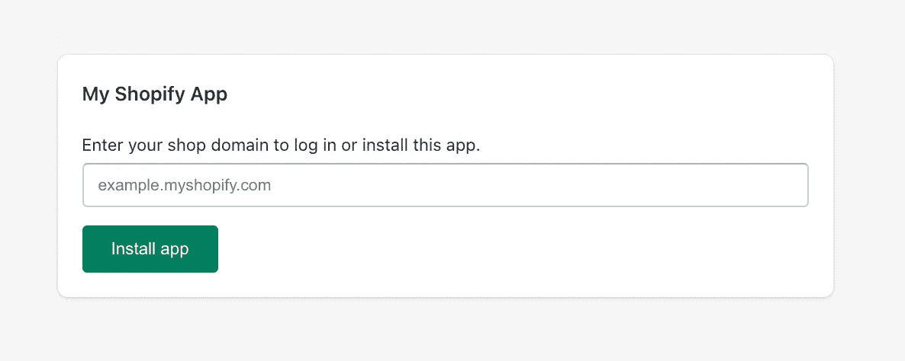

如果您忘记了您的商店域名，只需在您的合作伙伴仪表板中点击您的商店，它就会显示在右侧。

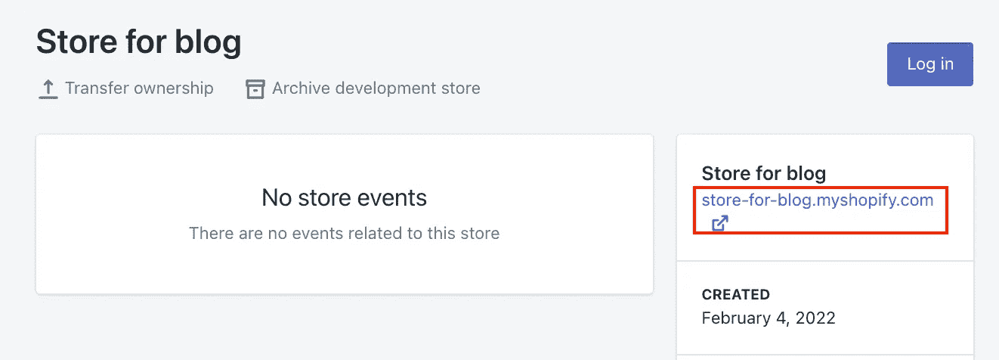

4.它应该会连接到您的商店，您应该会看到“您即将安装[您的应用程序名称]”消息。点击“安装未列出的应用程序”按钮。

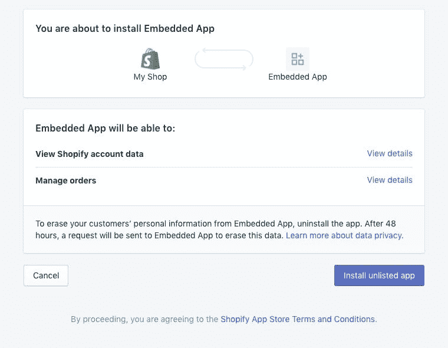

您的应用程序现已安装！

点击你的商店仪表盘(不是你的合作伙伴仪表盘)上的*应用*，你会看到你的应用列在*已安装应用*下。

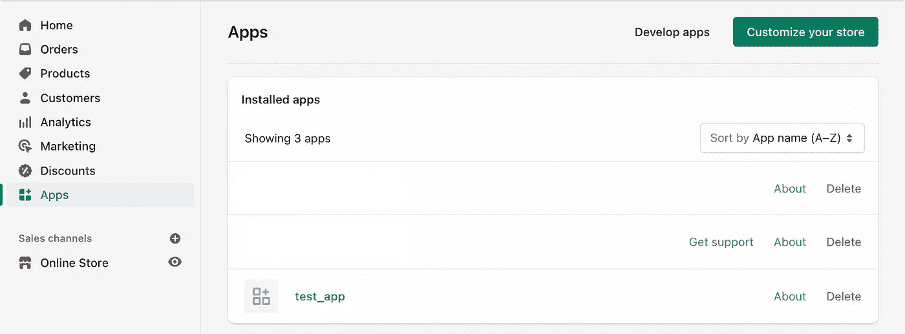

点击您的应用程序，查看它的运行情况！

如果它没有运行，确保 ngrok 隧道和 rails 服务器都在运行。此外，如果您取消 ngrok 隧道并重新启动它，您将获得不同的 URL，因此您需要更改您的应用程序的 URL，并在合作伙伴的仪表板中重定向 URL。

## 让它*工作*

当你点击你的应用时，你会看到一个 Shopify 应用的默认页面。它将显示如下内容:

```
Products
Loading...There are currently no webhooks
```

你可以在`app/views/home/index.html.erb`中找到它，以防你想把它用作你的起始页或者编辑它或者只是随便玩玩。

如果你想改变你的`root`并且你简单地在`routes.rb`文件中改变它，你会看到它仍然加载，但是它不工作*。如果您点击一个导航项目(例如进入*关于*页面)，什么也不会发生。这是因为对于我们在 Shopify 应用程序中访问的每个控制器，我们需要包括以下内容:*

```
include ShopifyApp::EmbeddedApp
```

如果您将鼠标悬停在导航中关于项目的*上，您会看到它会将您重定向到 Shopify 无法访问的`localhost:3000/about`。通过包含上面的代码，它将其更改为您的 ngrok URL ( `[https://cbd2-somemorestuff.ngrok.io](https://cbd2-somemorestuff.ngrok.io)/about`)，使 Shopify 可以访问。*

感谢你阅读所有这些，我希望我能够给你一个比我以前更容易的开始来创建一个 Shopify 应用程序。