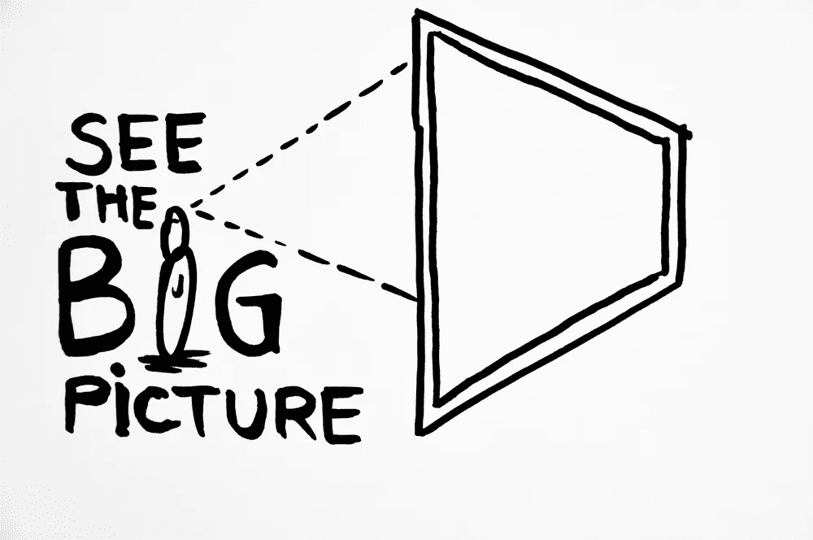

# 如何“超级学习”数据科学—第 1 部分

> 原文：<https://betterprogramming.pub/how-to-ultralearn-data-science-part-1-92e143b7257b>

## 这是一个简短的指南，基于应用于数据科学的书“ [Ultralearning](https://www.scotthyoung.com/blog/ultralearning/)


照片由[肖恩·林](https://unsplash.com/@seanlimm?utm_source=medium&utm_medium=referral)在 [Unsplash](https://unsplash.com?utm_source=medium&utm_medium=referral) 上拍摄

```
Welcome back to the Ultralearning Data Science series - Introduction on Ultralearning & Metalearning[Part 2](https://medium.com/better-programming/how-to-ultralearn-data-science-part-2-9138f5f73456) - On removing distractions and finding focus[Part 3](https://medium.com/better-programming/how-to-ultralearn-data-science-part-3-ea337ee05b2) - On optimization learning[Part 4](https://medium.com/better-programming/how-to-ultralearn-data-science-part-4-6b2d79072a47) - On deep understanding and experimentation[Summary](https://medium.com/better-programming/summary-of-the-how-to-ultralearn-data-science-series-c2a24d9946fd) - For those in a hurry
```

埃隆·马斯克、比尔·盖茨、沃伦·巴菲特和马克·库班。所有这些超级成功人士的一个共同点是什么？

他们都是超能人士。

埃隆·马斯克是一个如饥似渴的学习者，他利用语义树来记住他读过的所有东西。而且他可以从别人那里吸收信息。

尽管他取得的成功和突破看起来不可能，但我们也可以将他的框架应用到我们的个人生活中，实现梦想。

> “一点建议:将知识视为一棵语义树很重要——在你进入树叶/细节之前，确保你理解了基本原则，即主干和大树枝，否则就没有什么可以抓住它们了。”——埃隆·马斯克

比尔·盖茨和沃伦·巴菲特都有着难以置信的好奇心和永不满足的求知欲。

股神巴菲特在职业生涯中 80%的时间都投入在阅读和思考上。比尔·盖茨每周读一本书，两周的假期只是为了读书。

> "智力资本将永远胜过金融资本."—保罗·都铎·琼斯，白手起家的亿万富翁企业家、投资者和慈善家。

# 超级学习入门

## 什么是超学习？

超学习是一种充满活力、自我激励的学习方法，使人们能够快速有效地掌握困难的技能。

凭借一种结构化的学习方法，他们成为了超级学习者，并取得了非凡的成就，这些成就起初似乎难以置信，但事实上，任何人都可以采用这种超级学习策略，实现不切实际的想法和梦想。

# 超学习的原则

## 元学习

元学习——学习如何学习的过程。

说到学习，元学习是一个必不可少的概念。这是每个人在开始学习过程之前必须迈出的第一步。

学习比听起来更难，许多人认为学习只是随机吸收信息，然后在考试中吐出来。

但在现实中，学习是艰难的。我这样说是因为学校和大学已经变成了一种商业，学习已经成为一种失传的艺术。学生们仅仅是为了通过考试而学习，而不再是为了学习而学习。问学生“为什么”,而不是“什么”,他们可能会纠结。

关于数据科学，光是看几个小时的 YouTube 视频、阅读几十本编程书籍和在网上注册昂贵的课程都不是学习。需要一个结构化的框架。

需要对基本原理有深刻的理解。以及对该领域的整体理解。

# 大局理解

元学习就是寻找全局，然后用它来设计你的最佳学习策略



大局思维本质上意味着完整的、总体的故事或想法。这个短语通常意味着一个人应该想到未来，或者想到其他平行的因素，而不是强调小的细节。

为了掌握大局理解的概念，让我们将这个概念应用于数据科学。数据科学是 21 世纪最性感的工作。但是大多数数据科学家在没有想清楚数据科学到底是什么的情况下就进入了这个领域。

简而言之，数据科学正在揭示数据的隐藏价值

数据呈指数级增长，数据科学家必须利用所有这些数据。从基于直觉的决策，我们正在过渡到基于事实的决策。

数据科学家的艰巨任务是利用他们从数据中收集的见解帮助组织做出正确的决策。

因此，使用正确的技能和正确的数据集，数据科学家创造了一个数据驱动的世界。

# 元学习数据科学的策略


由 [Unsplash](https://unsplash.com?utm_source=medium&utm_medium=referral) 上的 [Tabea Damm](https://unsplash.com/@tabeadamm?utm_source=medium&utm_medium=referral) 拍摄的照片

## 1.创建元学习地图

将你的话题分成三类:

*   概念
*   事实
*   程序

## 概念

数据科学中的概念是培训和教育，这是数据科学的先决条件。

其中包括扎实的数学基础(统计学、概率、线性代数和微积分)、编程、机器学习、人工智能和商业分析。

## 事实

数据科学中的事实将成为数据科学中涉及的教科书内容，例如数学和机器学习中的事实，你必须深刻理解到可以教给其他人的程度。

所涉及的事实不应该像正规教育给我们洗脑那样去记忆，而应该在原子水平上去理解，在那里你可以把行话翻译成大众更容易理解的语言。

## 程序

所涉及的过程是数据科学的基础——业务理解、数据获取和准备(挖掘和清理)、部署、建模和可视化。

这些基础知识也有子领域，每个子领域在发现数据价值的过程中都是至关重要的。

## 2.识别学习中具有挑战性的方面

数据科学不是一个容易的领域。一个人必须有商业头脑和良好的沟通能力，才能将数据转化为人们能够很好理解和领会的东西。做一个数据科学家，几乎就像是世界上杂乱数据的翻译者。

少数具有挑战性的学习方面是数学，尤其是在数据科学中发挥巨大作用的统计学，机器学习概念(通常需要硕士和博士学位)，以及优秀的沟通。

这一部分是模糊和武断的，因为每个人都在为不同的事情而奋斗。所以，以上只是我的看法，并不适用于其他所有人。

## 3.克服它们的技巧

在学习像数据科学这样庞大而复杂的东西时，费曼技巧非常有效。数学中的机器学习概念和事实可以通过这种技术轻松地存储在你的大脑中。

对于沟通来说，没有一个简单的方法可以让你突然变得更擅长沟通，成为世界级的沟通者。我们中的一些人有天生的能力用我们的语言说服别人，而我们中的一些人一生都在学习。

和知识一样，交流是我们在经历生活的潮起潮落时积累的一种技能。交流的一个建议是只使用简单的词语而不是行话，这样所有人都能理解你的数据结果。

此外，确保根据受众个性化您的演示，因为与经理或利益相关者相比，数据工程师对数据科学有更好的理解。

## 一个可以用来交流数据的框架

1.  你对商业问题的理解。
2.  如何衡量业务影响—您的模型结果符合哪些业务指标？
3.  哪些数据现在可用或曾经可用——如果合适，请注明哪些数据有助于收集。
4.  初始解假设。
5.  解决方案/模型——使用示例和可视化。
6.  解决方案的业务影响和利益相关者的明确行动项目。

## 4.建立你的学习方法

有了互联网，学习数据科学不再昂贵和受限。有大量的资源为各种各样的人普及了数据科学。

类似于学习时面临的问题，这部分也依赖于个人。有些人可能更喜欢通过 YouTube 上的视频学习，而其他人则喜欢通过 Udemy 和 Coursera 等在线课程学习。

尽管如此，拥有一套学习方法是必要的，这样你就可以根据你的喜好和能力个性化你的学习方式。

学习数据科学的一个好建议是从动手项目开始，如线性回归、逻辑回归、决策树等。

这是因为许多人错误地把注意力集中在数学上，接受了大量的事实，却没有从最重要的开始就获得动手能力。

# 行动计划

现在，您已经简要了解了超学习、元学习和宏观理解。花 5-10 分钟思考你是否已经记住了这些概念。如果没有，现在是改变的最佳时机。按照下面的 4 个步骤制定你的元学习策略，从今天开始以正确的方式学习吧！

感谢阅读，请阅读下面的第二部分！

[](https://medium.com/better-programming/how-to-ultralearn-data-science-part-2-9138f5f73456) [## 如何“超级学习”数据科学—第 2 部分

### 第 2 部分关于超学习数据科学，强调重点

medium.com](https://medium.com/better-programming/how-to-ultralearn-data-science-part-2-9138f5f73456) 

在 [LinkedIn](https://www.linkedin.com/in/benthecoder/) 和 [Twitter](https://twitter.com/benthecoder1) 上与我联系。

点击这里查看我的其他文章！

## 数据科学工具箱—数据科学入门系列

[](https://towardsdatascience.com/the-data-scientists-toolbox-part-1-c214adcc859f) [## 数据科学简介

### 关于什么是数据科学、大数据、数据和数据科学过程及其应用。

towardsdatascience.com](https://towardsdatascience.com/the-data-scientists-toolbox-part-1-c214adcc859f) 

## 这里有一些很棒的数据科学资源！

[](https://medium.com/swlh/top-20-websites-for-machine-learning-and-data-science-d0b113130068) [## 机器学习和数据科学的 20 大网站

### 这里是我列出的最好的 ML 和数据科学网站，可以提供有价值的资源和新闻。

medium.com](https://medium.com/swlh/top-20-websites-for-machine-learning-and-data-science-d0b113130068) [](https://towardsdatascience.com/top-20-free-data-science-ml-and-ai-moocs-on-the-internet-4036bd0aac12) [## 互联网上 20 大免费数据科学、ML 和 AI MOOCs

### 以下是关于数据科学、机器学习、深度学习和人工智能的最佳在线课程列表

towardsdatascience.com](https://towardsdatascience.com/top-20-free-data-science-ml-and-ai-moocs-on-the-internet-4036bd0aac12) [](https://towardsdatascience.com/the-best-book-to-start-your-data-science-journey-f457b0994160) [## 开始数据科学之旅的最佳书籍

### 这是你从头开始学习数据科学应该读的书。

towardsdatascience.com](https://towardsdatascience.com/the-best-book-to-start-your-data-science-journey-f457b0994160) [](https://towardsdatascience.com/top-20-podcasts-for-data-science-83dc9e07448e) [## 数据科学 20 大播客

### 面向数据爱好者的最佳数据科学播客列表。

towardsdatascience.com](https://towardsdatascience.com/top-20-podcasts-for-data-science-83dc9e07448e) [](https://towardsdatascience.com/10-data-science-competitions-for-you-to-hone-your-skills-for-2020-32d87ee19cc9) [## 10 场数据科学竞赛让你磨练 2020 年的技能

### 这里有一个网站列表，供您练习数据科学技能，参加在线黑客马拉松和…

towardsdatascience.com](https://towardsdatascience.com/10-data-science-competitions-for-you-to-hone-your-skills-for-2020-32d87ee19cc9)