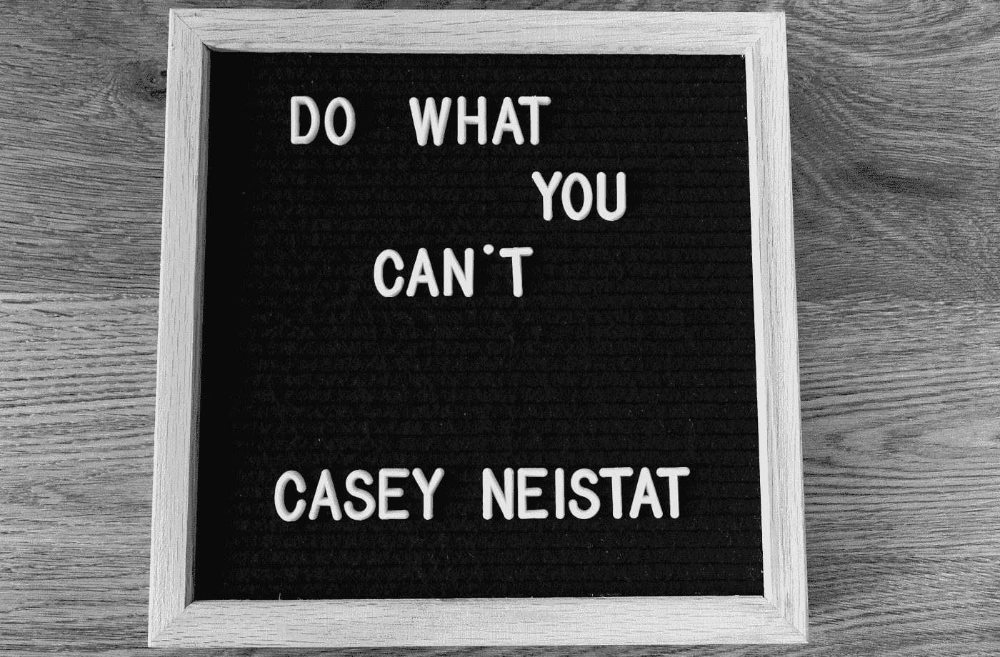

# 如何“超学习”数据科学—第 3 部分

> 原文：<https://betterprogramming.pub/how-to-ultralearn-data-science-part-3-ea337ee05b2>

## 我们谈论最优化学习的地方


萨法尔·萨法罗夫在 [Unsplash](https://unsplash.com?utm_source=medium&utm_medium=referral) 上拍摄的照片

```
Welcome back to the Ultralearning Data Science series - Introduction on Ultralearning & Metalearning[Part 2](https://medium.com/better-programming/how-to-ultralearn-data-science-part-2-9138f5f73456) - On removing distractions and finding focus[Part 3](https://medium.com/better-programming/how-to-ultralearn-data-science-part-3-ea337ee05b2) - On optimization learning[Part 4](https://medium.com/better-programming/how-to-ultralearn-data-science-part-4-6b2d79072a47) - On deep understanding and experimentation[Summary](https://medium.com/better-programming/summary-of-the-how-to-ultralearn-data-science-series-c2a24d9946fd) - For those in a hurry
```

# 最佳化

我希望到现在为止，你已经在超学习和学习如何学习方面有了坚实的基础，以及深入工作和集中学习的技巧。这样，现在你就可以开始学习了。但是正如一个人可以[优化](https://towardsdatascience.com/demystifying-optimizations-for-machine-learning-c6c6405d3eea)一个机器学习模型使其变得更好一样，有一些方法可以优化你的学习方法来构建一个有效的学习系统。

在这一部分，一切都是为了优化数据科学的学习流程。主要重点将放在直接性、训练、检索、反馈和保留上。

> 智力的发展应该从出生就开始，只有在死亡时才会停止——阿尔伯特·爱因斯坦

# **1。直接**



照片由[莫里茨·门格斯](https://unsplash.com/@mphotographym?utm_source=medium&utm_medium=referral)在 [Unsplash](https://unsplash.com?utm_source=medium&utm_medium=referral) 上拍摄

数据科学是一个包含许多子领域的广阔领域。仅仅通过正规教育来学习所有必要的技能是难以置信的。想象一下，当你获得数据科学学士学位后，你去找实习甚至工作，却没有任何市场经验。想象一下，过去四年你在大学里所学的一切并没有为你进入现实世界做好准备。这就是为什么有些数据科学家拥有理论物理博士学位或统计学硕士学位。在投入现实世界之前，他们还有几年时间。这是一种常见的情况，它也适用于几乎所有其他专业，这被称为失败转移。

迁移是在一个情境(统计学和编程)中学习一些东西，然后转移到另一个情境(预测未来 20 年地球温度上升)的过程。尽管正规教育很重要，但它往往不能优化迁移。讽刺的是，这种迁移学习的概念也存在于深度学习领域。

正规教育的问题在于，它在学习环境和目标环境之间建立了一条间接的路径——学习的技能和知识被应用的环境。例如，你在大学学习线性代数。你在练习题和去年的卷子上花了几个小时。然而，当涉及到在数据科学中应用它时，您无法将它转移到应用程序中，因为您对概念(如行列式、可逆矩阵、特征向量、Gram-Schmidt 过程等)的实际含义没有潜在的认知。换句话说，你没有抓住线性代数的精髓。(查看 [3blue1brown](https://www.youtube.com/playlist?list=PLZHQObOWTQDPD3MizzM2xVFitgF8hE_ab) 的《线性代数的本质》YouTube 播放列表。)

在大学课堂上死记硬背统计和概率与在现实世界中应用它们相去甚远，例如使用统计方法在面对不确定性时做出正确的决策。

超学习者知道尽可能直接地保持学习环境和目标环境之间的联系。通过这样做，他们培养了一种叫做直接的超级学习品质。

学习一件事最直接的方法就是去做。学习编码最有效的方法就是写代码。学习数据科学最有效的方法是参与数据科学项目，解决现实世界的问题。

> **“对于我们在做之前必须学习的东西，我们通过做来学习。”**――亚里士多德

这种边做边学的方法被称为基于项目的学习。

它将您正在学习的技能直接置于您的目标环境中——无需转移！

基于项目的学习的最极端但有效的模式之一是沉浸式学习:完全沉浸在目标环境中。应用于数据科学，这可能意味着三个月的实习、数据科学竞赛、100 天的数据科学等。

当然，并不是每个人都有时间进行沉浸式学习。此外，有些技能不适合这种方法。见习飞行员在训练的第一天不沉浸在驾驶波音飞机中是有原因的。相反，他们在飞行模拟器中学习。

如果沉浸式学习不是你力所能及的，使用飞行模拟器方法，尽可能地复制目标环境的条件和压力。

如果你不能获得实习机会，参加数据科学竞赛或在你的数据科学项目上创新，解决你热衷的问题。为了复制数据科学的条件和压力，你可以为你的项目设定一个时间限制，甚至将数据呈现给你的朋友和家人(确保他们理解)。

无论你在学什么，在你的学习环境和你的目标环境之间建立一条直接的路径。

一旦你做到了这一点，是时候深入并完善你的技术了。

# **2。钻孔**


由[马特·安东尼奥利](https://unsplash.com/@antoniolio?utm_source=medium&utm_medium=referral)在 [Unsplash](https://unsplash.com?utm_source=medium&utm_medium=referral) 上拍摄的照片

优秀运动员、钢琴神童和成功的超能力者有什么共同点？他们都依靠钻孔来完善他们的技术并保持他们的竞争优势。那么，你如何有策略地进行训练以达到最佳效果呢？

至关重要的是，你永远不应该通过钻探来开始你的项目。相反，使用直接钻探法。要做到这一点，从直接实践开始，无论你是写代码还是解决业务问题。使用此直接练习来确定您希望钻孔的区域。钻孔后，回到直接练习，直到有必要再次钻孔。

为了最大限度地利用你的训练，把它应用到决定速度的步骤中。

在化学中，决定速率的步骤是促进连锁反应的过程的一部分；在超学习中，这是开启下一个知识层次或最广泛应用的一步。

例如，您可能已经很好地掌握了机器学习的概念，但缺乏将这些概念付诸实践的编程专业知识。在这种情况下，学习 Python 将是你的决定性步骤，所以你应该把你的训练集中在这个领域。

你应该如何设计你的训练？那要看你想钻的区域。它能很容易地从你的项目中分离出来吗？如果是这样的话，尝试时间切片，在一个更复杂的过程中分离出一个步骤，并重复这个步骤，直到你完善它。例如，如果您想完善您的数据争论，您可以通过训练您的代码清理能力来进行时间切片。或者，把你想要的技能分成不同的认知部分，分别练习。例如，在 Python 编程中，您可以演练 Pandas、scikit-learn 或 PyTorch。

如果你正在做一个更有创造性或更复杂的项目，你可能会发现孤立地练习很有挑战性——例如，很难练习解决问题。在这种情况下，尝试模仿的方法。选择一个你钦佩的成功人士，无论是亿万富翁投资者沃伦·巴菲特还是天才企业家比尔·盖茨，尽可能地模仿他们解决问题的方式。

突击测验！迁移学习为什么重要？什么是直接？决定利率的集合是什么？如果你在回答这些问题时有困难，你可能需要在下一个主题检索上努力。

# **3。检索**


戴维·特拉维斯在 [Unsplash](https://unsplash.com?utm_source=medium&utm_medium=referral) 上拍摄的照片

学习统计学是提高你解决问题能力的好方法——但前提是当你坐在画架前时，你来之不易的知识不会抛弃你。如果你不能快速有效地获取新的技能、概念和程序，那么学习它们是没有意义的。作为一名数据科学家，您必须具备理解数据(下至基础层面)的能力，并以正确的形式清理、建模和呈现数据。之后，你必须讲述一个关于你的数据的故事，将你巧妙的分析转换成通俗的术语。也就是说，为了确保你随时准备好处理数据，有两种方法可以提高你的检索率。

第一是复习:回顾刚刚学过的材料。

第二种是回忆:试图从记忆中回忆事实和概念。

普渡大学(Purdue University)2011 年的一项研究显示，回忆对长期学习记忆明显更有效，但大多数学习者在试图巩固他们的学习时，会选择复习策略而不是回忆策略。

我们更喜欢回顾而不是回忆的原因可以归结为一个叫做学习判断的概念。本质上，我们人类认为，当我们能够毫无困难地处理一个概念时，我们就已经学会了这个概念。在大学里，学生们一遍又一遍地阅读他们的笔记，制造一种他们已经掌握了信息的印象。这就是我们倾向于被动复习策略的原因:它们证实了我们正在成功学习的看法。

但是感知不是一切。努力在短期内回忆某件事意味着你更有可能在长期内记住它。专家称这种困难为理想的困难——回忆造成的困难最终是理想的，因为它最大化了我们保留所学知识的机会。

要在学习中运用主动回忆策略，这里有三种方法。

## I)提出问题

例如，在你学习神经网络的过程中，提出一些迫使你回忆答案的问题。写“神经网络在现实生活中是如何应用的？”而不是“神经网络用于图像分类、物体检测……”每次你复习笔记时，你都会被迫回忆你所学的内容。

> “对年轻人来说，保持好奇心并不断问为什么非常重要。”— **史蒂芬·霍金**

## II)自由召回

学习结束后，坐在一张白纸上，尽可能详细地写下你所能记起的一切。

## III)测试你所学的一切

最后，对于一个更具体的基于回忆的挑战，给自己设定一个任务，测试你到目前为止在数据科学项目中学到的所有东西。这种方法的优点是，你不需要浪费时间回忆你的主题的一般方面，这些方面不直接适用于你的计划项目；相反，当你需要使用它们时，你会有针对性地回忆起特定的技能和概念。

精通检索？是时候诚恳地提供反馈了。

# **4。反馈**


照片由[亚当·张](https://unsplash.com/@adamjang?utm_source=medium&utm_medium=referral)在 [Unsplash](https://unsplash.com?utm_source=medium&utm_medium=referral) 上拍摄

无论你的专业水平如何，如果你想提高的话，你都需要寻求进步的反馈。此外，你需要学会如何区分不同层次的反馈，并获得获得反馈的策略。

几乎所有的反馈都是有用的，但并不是所有的反馈都是平等的。将反馈分成三个不同的类别很有帮助。

## O **最终反馈**

这个反馈证明你已经达到了预期的结果。想象一下，你正在演示你的数据，你的客户完全理解结果，并为你的工作鼓掌。这就是结果反馈。这可能是令人鼓舞的，但很难从这种类型的反馈中收集更多的信息。

## **信息反馈**

这种反馈让你有更多的工作要做，因为它会提醒你所犯的错误。想象一下，如果你犯了一个错误，你的数据是完全错误的。然后，首席数据科学家将您从项目中撤出，并将其移交给其他人。这种反馈对于突出问题区域和隔离您的错误非常有用。

## **纠正反馈**

这是最好的反馈，因为它会告诉你哪里做错了，以及如何改正。在这里，首席数据科学家会给你一些建议，告诉你哪些做得好，哪些做得不好，以及你应该如何改进。在这种情况下，你会得到建设性的纠正性反馈，帮助你发展和成长。

> “我会接受每一个建设性的批评，把它变成我自己的，从我的错误中吸取教训，继续前进。”——朱莉·帕耶特

在整理您的反馈时，重点关注纠正性反馈而非信息性反馈，信息性反馈而非结果性反馈。

首先，您如何确保收到足够的反馈？首先，记住不要寻求反馈。如果你没有把自己扩展到失败的程度，你就阻止了自己获得有用的信息或纠正性反馈。超越你的极限会得到有益的反馈。根据反馈采取行动，反过来会拓展你的极限。

也不要忽视寻求元反馈。就你的学习方法的效果寻求反馈是很重要的。测试你的学习方法的一个简单方法是跟踪你的学习速度——例如，试着计时你花了多长时间清理你的数据。如果你的学习率没有上升，通过重新审视你的学习方法来回应这个负面反馈。

通过获得反馈和优先考虑纠正性和信息性反馈，你可以不断调整和提高你的表现。

# **5。保留时间**


由 [Robina Weermeijer](https://unsplash.com/@averey?utm_source=medium&utm_medium=referral) 在 [Unsplash](https://unsplash.com?utm_source=medium&utm_medium=referral) 上拍摄的照片

你成为数据科学家的超学习之旅可能不需要太多的记忆，因为现在一切都可以通过谷歌搜索，但你需要记住一些事实、公式或程序，以加快你的工作过程，使其更有效。

因此，要想记住一些东西，你可以采用的最有效的策略是建立一个记忆系统，并在你的旅程中有规律地、间隔紧密地融入其中。关键是使用一个既容易融入你的项目又非常适合项目类型的记忆系统。例如，最好有一个语义网络类型的数据科学记忆系统，因为它是一个非常多样化的领域，需要记忆来自不同学科的许多概念。它为每个复杂的主题建立了基础，并允许您在学习时添加新的信息。这证实了你的记忆能力，因为基础就在那里。

# 行动计划

1.  通过实践和沉浸在学习过程中，快速从理论到实践。
2.  用训练来完善你的技能，或者用模仿的方法向最好的人学习。
3.  在整个超级学习的旅程中，通过不断地提出问题和自我测试，使用回忆策略来检索你所学的信息。
4.  关注有助于您识别弱点并提高绩效的纠正性反馈。
5.  使用语义记忆网络，运用聪明的、有策略地间隔的记忆会话，确保你所学的东西不被遗忘。

在下一部分，我们将看看如何把事情带到下一个层次，培养直觉，并深入实验。

感谢阅读，期待本系列的最后一部分！

在这里阅读第四部分！

[](https://medium.com/better-programming/how-to-ultralearn-data-science-part-4-6b2d79072a47) [## 如何“超学习”数据科学—第 4 部分

### 超学习数据科学系列的最后一部分

medium.com](https://medium.com/better-programming/how-to-ultralearn-data-science-part-4-6b2d79072a47)