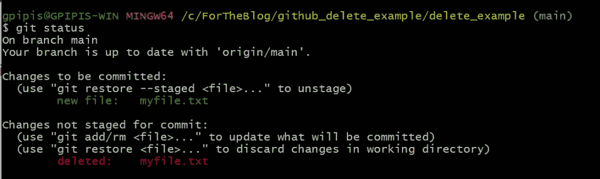
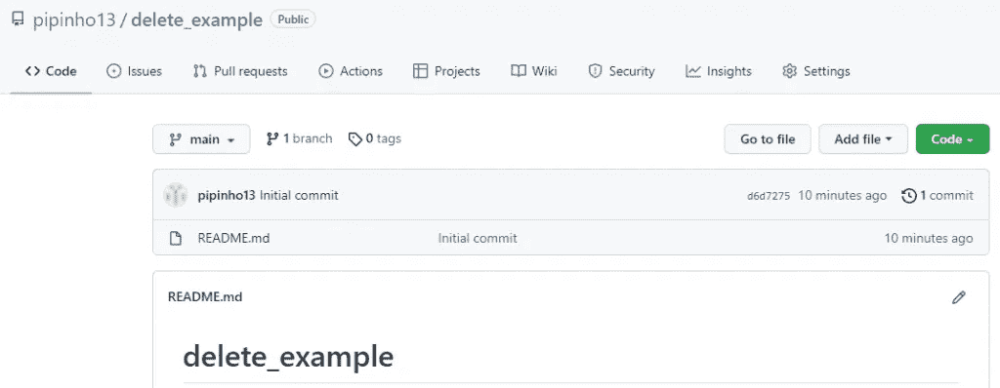
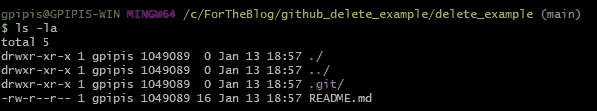
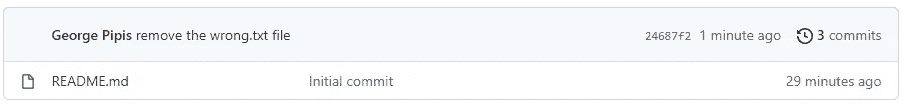
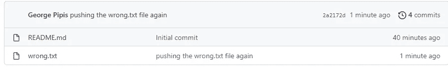
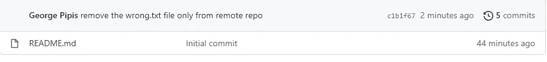

# 如何撤销 Git 中的更改

> 原文：<https://betterprogramming.pub/how-to-undo-changes-in-git-e98351edc132>

## Git 世界中的 CMD+Z 或 CTR+Z 及实例


Photo by [愚木混株 cdd20](https://unsplash.com/@cdd20?utm_source=medium&utm_medium=referral) on [Unsplash](https://unsplash.com?utm_source=medium&utm_medium=referral)

[](https://jorgepit-14189.medium.com/membership) [## 用我的推荐链接加入媒体-乔治皮皮斯

### 阅读乔治·皮皮斯(以及媒体上成千上万的其他作家)的每一个故事。您的会员费直接支持…

jorgepit-14189.medium.com](https://jorgepit-14189.medium.com/membership) 

在本教程中，我们将通过演练示例向您展示如何“撤销”Git 中的更改。

# 如何撤销已删除的文件

假设我们不小心删除了一个文件。让我们删除“ **myfile.txt**

```
git rm myfile.txt
git status
```



因此，如果我们想要恢复文件，我们可以运行:

```
git restore myfile.txt
```


# 如何卸载文件

假设您通过运行命令“git add myfilename”意外地暂存了一个文件，并且您想要卸载该文件。然后，您可以简单地运行:

```
git reset HEAD myfilename
```

# 如何检索旧版本

假设我们想要检索一个文件的旧版本。让我们看看我们如何能做它。我们必须通过运行“git log”命令转到日志历史，并选择旧版本的 SHA 代码(前几个字符就足够了)。然后运行命令“git checkout <sha>”。例如:</sha>

```
git checkout 0dd6680
```

您将收到以下消息:

```
Note: switching to '0dd6680'.You are in 'detached HEAD' state. You can look around, make experimental changes and commit them, and you can discard any commits you make in this state without impacting any branches by switching back to a branch.If you want to create a new branch to retain commits you create, you may do so (now or later) by using -c with the switch command. Example:git switch -c <new-branch-name>Or undo this operation with:git switch -Turn off this advice by setting config variable advice.detachedHead to falseHEAD is now at 0dd6680 another change
```

如果我们运行该命令:

```
cat myfile.txt
```

你会看到我们在一个旧版本中。上面的 checkout 输出命令解释了这种情况。如果我们创建一个新的分支，这些更改可以保留。

你会看到你处于一种“脱离头”的状态，你可能会因为在主分支中不能回到你的最新版本而抓狂。让我们看看我们如何能回去。

```
git checkout main
```

我们得到的信息是:

```
Previous HEAD position was 0dd6680 another change
Switched to branch 'main'
Your branch is up to date with 'origin/main'.
```

# 如何恢复提交

我们可以通过运行以下命令来恢复过去的提交

```
git revert <SHA>
```

# 如何删除未跟踪的文件

假设您添加了一些不应该被跟踪的文件，并且您想删除它们，那么您可以运行:

```
git clean -n
```

这是一个“预演”,向您显示哪些文件将被删除，一旦您确定，您可以运行:

```
git clean -f
```

# 如何撤销 Git 初始化

如果您使用 git，并且您已经使用`git init`命令启动了一个项目，并且您想要“撤销”，那么您可以简单地从您的文件夹中删除`.git`文件。

```
rm -rf .git
```

# 额外部分:如何从远程 Git 存储库中删除文件

当我们使用 Git 和 GitHub/GitLab 时，我们可能会意外地将一个文件推送到一个远程 Git 存储库，因此需要删除它。像往常一样，我们将使用走查示例。我们将创建一个远程 GitHub repo，然后在本地克隆它。



```
$ git clone https://github.com/pipinho13/delete_example.git
```

然后，我们将工作目录更改为克隆的存储库，如我们所见，这里有 **README.md** 和**。git** 文件



现在，我们将创建一个名为“error . txt”的文件，并将其推送到远程 repo。

```
ls -ltra
```

我们得到:

```
total 6
drwxr-xr-x 1 gpipis 1049089  0 Jan 13 18:57 ../
-rw-r--r-- 1 gpipis 1049089 16 Jan 13 18:57 README.md
drwxr-xr-x 1 gpipis 1049089  0 Jan 13 18:57 .git/
drwxr-xr-x 1 gpipis 1049089  0 Jan 13 19:12 ./
-rw-r--r-- 1 gpipis 1049089 21 Jan 13 19:12 wrong.txt
```

我们来推一下“错了. txt”。

```
git add wrong.txt
git commit -m "pushing the wrong.txt file"
git push origin main
```


“error . txt”文件已添加到远程存储库中。

## 如何删除文件

现在，假设我们想从远程目录和本地文件系统中删除该文件。那么我们应该运行以下命令。

```
git rm wrong.txt
git commit -m "remove the wrong.txt file"
git push origin main
```

正如我们所看到的，该文件已经从本地文件系统和远程存储库中删除。



```
ls -ltratotal 5
drwxr-xr-x 1 gpipis 1049089  0 Jan 13 18:57 ../
-rw-r--r-- 1 gpipis 1049089 16 Jan 13 18:57 README.md
drwxr-xr-x 1 gpipis 1049089  0 Jan 13 19:23 ./
drwxr-xr-x 1 gpipis 1049089  0 Jan 13 19:24 .git/
```

## 如何从远程 Git Repo 中删除文件，但将其保留在本地

我们将通过创建“**error . txt**”文件再次重复该过程，此时我们将仅从远程回购中删除它。

```
ls -ltratotal 6
drwxr-xr-x 1 gpipis 1049089  0 Jan 13 18:57 ../
-rw-r--r-- 1 gpipis 1049089 16 Jan 13 18:57 README.md
drwxr-xr-x 1 gpipis 1049089  0 Jan 13 19:24 .git/
drwxr-xr-x 1 gpipis 1049089  0 Jan 13 19:33 ./
-rw-r--r-- 1 gpipis 1049089 13 Jan 13 19:33 wrong.txt
```

我们来推送错误的. txt 文件。

```
git add wrong.txt
git commit -m "pushing the wrong.txt file again"
git push origin main
```



现在，让我们从远程回购中删除“错误. txt”文件【仅 。对于这个任务，我们必须使用标签“**缓存**

```
git rm --cached wrong.txt
git commit -m "remove the wrong.txt file only from remote repo"
git push origin main
```

让我们看看我们的本地存储库

```
$ ls -ltratotal 6
drwxr-xr-x 1 gpipis 1049089  0 Jan 13 18:57 ../
-rw-r--r-- 1 gpipis 1049089 16 Jan 13 18:57 README.md
drwxr-xr-x 1 gpipis 1049089  0 Jan 13 19:33 ./
-rw-r--r-- 1 gpipis 1049089 13 Jan 13 19:33 wrong.txt
drwxr-xr-x 1 gpipis 1049089  0 Jan 13 19:38 .git/
```

让我们看看远程目录。



瞧，我们只从远程回购中删除了“错误的. txt ”!

你可能会对一个 [Git 和 GitHub 备忘单](https://predictivehacks.com/?all-tips=git-and-github-cheat-sheet)感兴趣

最初由[预测黑客](https://predictivehacks.com/?all-tips=how-to-undo-changes-in-git)发布

# 参考

[1] [如何撤销 Git 中的更改](https://predictivehacks.com/?all-tips=how-to-undo-changes-in-git)

[2] [如何从远程 Git 存储库中删除文件](https://predictivehacks.com/?all-tips=how-to-delete-a-file-from-a-remote-git-repository)

[3] [如何撤销 Git 初始化](https://predictivehacks.com/tips/)