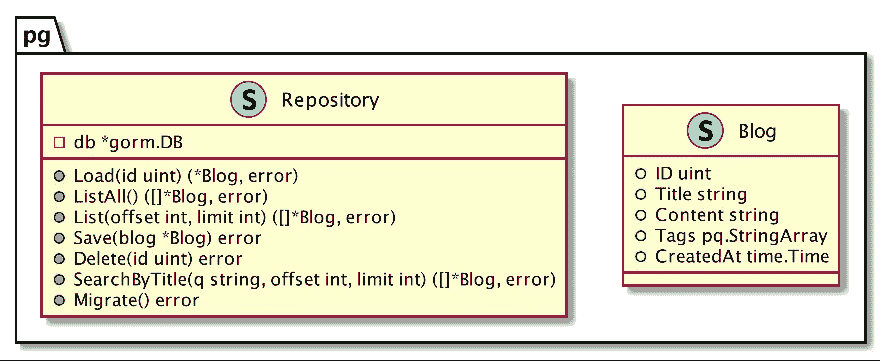

# 如何用 Sqlmock 对 GORM 应用程序进行单元测试

> 原文：<https://betterprogramming.pub/how-to-unit-test-a-gorm-application-with-sqlmock-97ee73e36526>

## 使用 GROM 和 PostgreSQL 的提示和技巧

尼古拉斯·托马斯在 [Unsplash](https://unsplash.com?utm_source=medium&utm_medium=referral) 上拍摄的照片。

更新于 2022.07:在过去的两年里，我的观点发生了一些变化，如果你感兴趣的话，也可以看看我关于这个话题的最新[文章](/unit-testing-a-grom-application-with-a-real-db-server-81a1b95ad473)。

对 DB-interactive 代码进行单元测试并不容易。当涉及到像 [GORM](https://github.com/jinzhu/gorm) 这样的 ORM 库时，就变得更加困难了。

理论上，我们可以用伟大的模仿工具 [GoMock](https://medium.com/better-programming/a-gomock-quick-start-guide-71bee4b3a6f1) 来模仿`database/sql/driver`的所有接口(比如 Conn 和 Driver)。然而，即使在 GoMock 的帮助下，我们仍然需要大量的手工工作来完成这种测试。

好消息是 [Sqlmock](https://github.com/DATA-DOG/go-sqlmock) 可以解决上述问题。正如其官方网站所宣称的，这是一个“golang 测试数据库交互的 Sql 模拟驱动程序。”

本文将向您展示如何用 Sqlmock 对一个简单的博客应用程序进行单元测试。该应用程序由 PostgreSQL 支持，并使用 GORM 来简化 O-R 映射。

我们将使用 BDD 测试框架 [Ginkgo](https://onsi.github.io/ginkgo/) 编写测试用例，但是您可以更改为您喜欢的任何其他测试库。

我们的博客应用程序将包含一个博客数据模型和一个存储库结构来处理数据库操作。

# 定义 GORM 数据模型和存储库

让我们首先定义博客数据模型和存储库结构:

注意`Blog.Tags`的类型是`pq.StringArray`，代表 PostgreSQL 中的字符串数组。

我们的`Repository`结构非常简单。它有一个字段`*gorm.DB` ，所有的数据库操作都依赖于这个字段。为了简洁起见，我省略了一些代码。除了`Load`和`ListAll`之外，`Repository`结构中还声明了其他几个方法，如`Save`、`Delete`、`SearchByTitle`等。这些方法将在本文后面解释。

# 设置测试用例

要在 GORM 中使用 Sqlmock，我们需要在`BeforeEach`中做一些准备，以确保每个测试规范都可以获得一个全新的`Repository`实例，然后在`AfterEach`中断言期望。

在`BeforeEach`中有三个步骤来建立这个测试用例:

1.  创建一个`*sql.DB`的模拟实例和一个带有`sqlmock.New()`的模拟控制器。
2.  通过`gorm.Open(“postgres”, db)`打开 GORM(带 PostgreSQL 方言)。
3.  创建一个新的`Repository`实例。

在`AfterEach`中，我们调用`mock.ExpectationsWereMet()`来确保所有的期望都得到满足。

现在让我们从最简单的场景开始写一个规范。

# 测试 ListAll 方法

如上面的代码片段所示，`ListAll`查找 DB 中的所有记录，并将它们映射到`*Blog`的一个切片中。

测试规格是直的。我们将预期的查询设置为`SELECT * FROM “blogs”`，并返回一个空的结果集。

然后运行所有测试:

您可能会惊讶于这个简单的测试用例可能会失败。但是控制台日志给了我们线索:“无法将实际的 sql 与预期的 regexp 相匹配。”

原来 Sqlmock 使用`sqlmock.QueryMatcherRegex`作为默认的 SQL 匹配器。在这种情况下，方法`sqlmock.ExpectQuery`将一个正则表达式字符串作为其参数，而不是普通的 SQL 字符串。

我们有两个选择来解决这个问题:

1.  用方法`regexp.QuoteMeta`转义 SQL 字符串中的所有正则表达式元字符。所以我们可以把`ExcectQuery`改成`mock.ExpectQuery(**regexp.QuoteMeta(*sqlSelectAll*)**)...`。
2.  更改默认的 SQL 匹配器。我们可以在创建模拟实例时提供一个匹配器选项:`sqlmock.New(**sqlmock.QueryMatcherOption(sqlmock.QueryMatcherEqual)**)`。

一般来说，正则表达式匹配器比等价匹配器更灵活(这就是为什么 Sqlmock 使用它作为缺省值)。

提示:默认情况下，Sqlmock 使用正则表达式匹配 SQL。

接下来，让我们测试将单个 DB 记录加载到数据模型中的方法。

# 测试加载方法

方法`Load`将一个博客 id 作为参数，然后查找具有该 id 的第一条记录。

我们将测试这种方法的两个场景。

在第一个规范(名为“found”)中，我们构建了一个博客实例，并将其转换为一个`sql.Row`。然后我们调用`ExpectQuery`来定义期望。在这个规范的最后，我们断言加载的博客实例等于原始实例。

注意:如果你不确定 GORM 将产生什么 SQL，你可以用`gorm.DB`的`Debug()`方法打开调试标志。

另一个规范涵盖了“未找到”的场景。它还演示了当我们不关心 SQL 输入时，如何用正则表达式简化 SQL 匹配(我们使用`.+`作为可以匹配任何内容的输入字符串)。

在这种情况下，我们所关心的是当`Load`方法找不到博客时，应该返回一个`gorm.ErrRecordNotFound`错误。

提示:使用正则表达式来简化 SQL 匹配。

在下一节中，我们将通过 GORM 进行插入记录的单元测试——这是最棘手的部分。

# 测试保存方法

当数据模型有主键时，方法`Save`将更新 DB 记录。当它没有记录时，该方法会在 DB 中插入一条新记录。

上面的代码片段显示了后一种情况。

我们创建了一个新的 blog 实例，但没有设置它的主键。然后用`mock.ExpectQuery`定义期望。事务在查询之前启动，在查询之后提交。

一般来说，非查询 SQL 期望(例如`Insert/Update`)应该由`mock.ExpectExec`定义，但这是一个特例。出于某种原因，GROM 对`postgres`方言使用了`QueryRow`而不是`Exec`(更多详情请咨询[本期](https://github.com/DATA-DOG/go-sqlmock/issues/118))。

最后，我们用`Expect(blog.ID).Should(BeEquivalentTo(*newId*))` 来断言`blog.ID` 是在`Save`方法之后设置的。

提示:如果您使用 PostgreSQL，请使用`mock.ExpectQuery`插入 GORM 模型。

你可能会建议没有必要对单元测试进行简单的`Insert/Update` 操作。在实践中，是的，这是不必要的。这里我们想给大家展示的是，GORM 可能会做一些你之前没有注意到的隐式操作。

# 结论

Sqlmock 是对 DB-interactive 代码进行单元测试的一个很好的工具，但是在使用 GORM 和 PostgreSQL 时会遇到一些问题。

在本文中，我们构建了一个简单的博客应用程序，并用 Sqlmock 对其进行了单元测试。我相信你可以在这个例子的帮助下开始你的单元测试。

完整的源代码，请访问它的[库](https://github.com/dche423/dbtest)。

干杯！