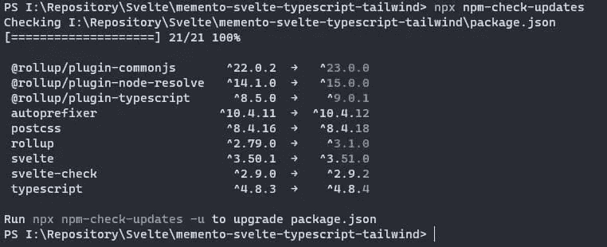
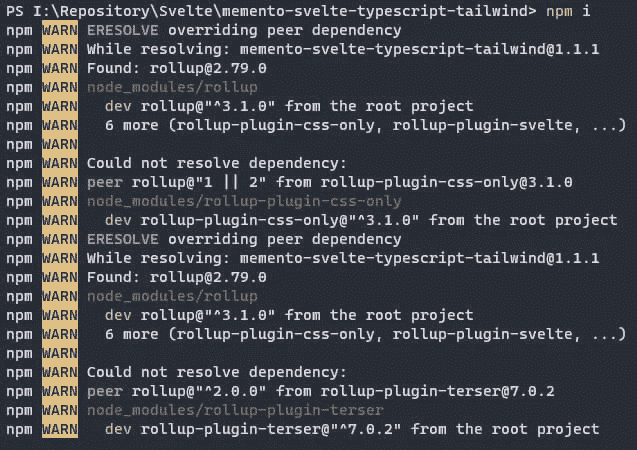
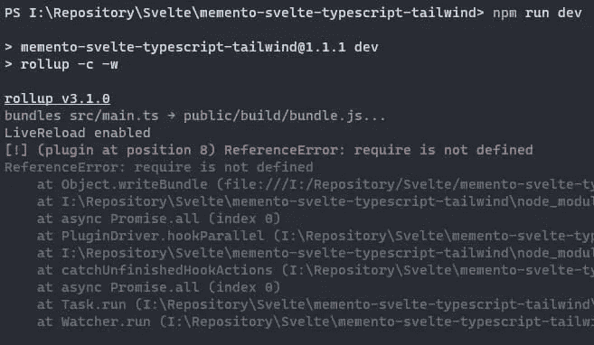

# 如何将汇总更新到版本 3

> 原文：<https://betterprogramming.pub/how-to-update-rollup-to-version-3-10c59139cbeb>

## 一个简短的指南，节省你的时间和挫折


照片由 [Max Chen](https://unsplash.com/@maxchen2k?utm_source=medium&utm_medium=referral) 在 [Unsplash](https://unsplash.com?utm_source=medium&utm_medium=referral) 上拍摄

前几天， [Rollup](https://rollupjs.org/guide/en/) 到了 3 版。我更新了我的一些项目，但这不是一个无痛的操作。代码有一些改动，还有一些插件要更新。在本文中，我报告了我遵循的步骤，希望它们也能对其他人有用。

在本文中，我使用我的存储库 [MEMENTO — Svelte，Typescript & TailwindCSS](https://github.com/el3um4s/memento-svelte-typescript-tailwind) 作为例子，但是这个过程对于所有的项目都是一样的。

首先，我用这个命令检查哪些包需要更新:

```
npx npm-check-updates
```

这样，我得到了要升级的包的列表。



现在，我用这个命令更新包:

```
npx npm-check-updates -u
npm install
```

问题现在开始了。我得到以下错误消息:

*   `ERESOLVE overriding peer dependency`
*   `peer rollup@"1 || 2" from rollup-plugin-css-only@3.1.0`
*   `peer rollup@"^2.0.0" from rollup-plugin-terser@7.0.2`



它们是链接在一起的，因为我有两个包有版本 1 或版本 2 `rollup`的依赖关系。为了解决这个问题，我需要更新这两个包。问题是，目前这两个资料库似乎已经过时了。我为他们两个提出了一个可能的解决方案。希望他们快点更新。

与此同时，我创建了两个包含两个包的 forks 来解决这个问题:

*   [@ el3um 4s/roll up-plugin-CSS-only](https://www.npmjs.com/package/@el3um4s/rollup-plugin-css-only)
*   [@ el3um 4s/roll up-plugin-terser](https://www.npmjs.com/package/@el3um4s/rollup-plugin-terser)

所以，我卸载了两个有问题的插件:

```
npm uninstall rollup-plugin-css-only rollup-plugin-terser
```

我把它们换成了我的叉子:

```
npm install @el3um4s/rollup-plugin-css-only @el3um4s/rollup-plugin-terser
```

我还需要更改`rollup.config.js`文件中的引用:

代替`import css from "rollup-plugin-css-only";`和`import { terser } from "rollup-plugin-terser";`

现在，如果我尝试运行`npm run dev`命令，我会得到另一个错误:

```
[!] (plugin at position 8) ReferenceError: require is not defined
ReferenceError: require is not defined
```



在这种情况下，问题与`serve`功能有关。代码如下:

我需要用`import { spawn } from "child_process"`替换`require("child_process")`:

之后，我可以使用`npm run dev`和`npm run build`。

感谢阅读！敬请关注更多内容。

***不要错过我的下一篇文章—报名我的*** [***中邮箱列表***](https://medium.com/subscribe/@el3um4s)

[](https://el3um4s.medium.com/membership) [## 通过我的推荐链接加入 Medium—Samuele

### 阅读萨缪尔的每一个故事(以及媒体上成千上万的其他作家)。不是中等会员？在这里加入一块…

el3um4s.medium.com](https://el3um4s.medium.com/membership) 

*原载于 2022 年 10 月 14 日 https://blog.stranianelli.com*[](https://blog.stranianelli.com/how-to-update-rollup-to-version-3/)**。**