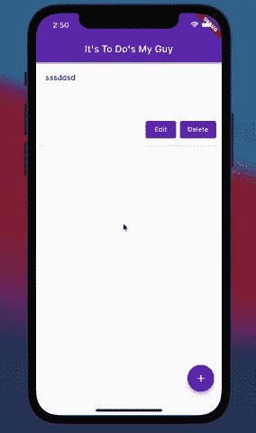
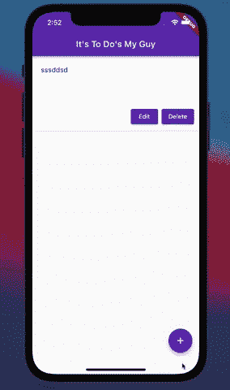

# 如何在 Flutter 中从另一个小部件更新一个小部件的状态

> 原文：<https://betterprogramming.pub/how-to-update-the-state-of-a-widget-from-another-widget-in-flutter-25922ca5dd78>

## 让我们在 Flutter 的底层设置状态管理


照片由 [Joy Real](https://unsplash.com/@joyreal328?utm_source=medium&utm_medium=referral) 在 [Unsplash](https://unsplash.com?utm_source=medium&utm_medium=referral) 上拍摄

我正在开发一个 Flutter to do 应用程序，这时我意识到我想把我的`NewToDo`小部件移到一个`[showModalBottomSheet](https://api.flutter.dev/flutter/material/showModalBottomSheet.html)`中。下面是当前 UI 的 gif。



理想情况下，当用户在`title`字段中输入任何内容时,“添加到待办事项”按钮应该被激活。

我遇到的问题是`title`的状态值是在`MyApp`小部件中管理的(因为我也允许编辑功能，而编辑按钮不是我的`NewToDo`的一部分)，由于某种原因`NewToDo`没有获得更新后的状态。我在 StackOverflow 上询问了这个问题，得到了一个非常简洁的解决方案。

下面是`MyApp`中`FloatingActionButton`的代码:

```
floatingActionButton: FloatingActionButton(
  onPressed: () {
    showModalBottomSheet<void>(
      context: context,
      builder: (BuildContext context) {
        return NewToDo(titleController, contentController, _addTodo, _clear, _todo);
      });
    }
  },
  child: const Icon(Icons.add),
  backgroundColor: Colors.deepPurple,
),
```

所以基本上发生的事情是`NewToDo`能够知道状态何时改变，因为它正在被传递。

我知道这一点，因为当你在标题文本输入中输入一些东西时，按钮不会激活，如果我输入一些东西，然后关闭模态并重新打开它，按钮就会被激活。

问题是`NewToDo`不知道重新渲染，因为它被包裹在`showModalBottomSheet`的`builder`中。

`[builder](https://api.flutter.dev/flutter/widgets/Builder-class.html)`是一个回调函数，主要用于获取或构建一个子部件。您可以在许多小部件上看到这个属性，它可以用来返回子小部件，而不必导入和实例化无状态小部件。

由于`NewToDo`被包装在另一个构建器中，并且具有与父小部件不同的上下文，因此当状态被更新时，`NewToDo`不会重新构建。

那么，我是如何解决这个问题的呢？嗯，有一件事需要提及，在我的`NewToDo`小部件中，我使用了一个`[TextField](https://api.flutter.dev/flutter/material/TextField-class.html)`来捕获标题数据。

在我的`TextField`小部件中，使用一个`[TextEditingController](https://api.flutter.dev/flutter/widgets/TextEditingController-class.html)`来跟踪放入标题`TextField`中的值。这个控制器是 *listenable* ，这意味着它可以用来告诉客户端一个对象被更新了(即状态)。

> 关于`TextField`和`TextEditingController`以及状态管理的更多信息，请查看我之前的[博文](https://levelup.gitconnected.com/text-input-with-flutter-3a395c70c2e8)。

所以我需要做的就是包装`NewToDo`就是所谓的`[ValueListenableBuilder](https://api.flutter.dev/flutter/widgets/ValueListenableBuilder-class.html)`。这意味着如果它正在监听的值发生变化，这个`builder`可以重建它的子节点(在本例中为`NewToDo`)。

这是我们更新后的`[FloatingActionButton](https://api.flutter.dev/flutter/material/FloatingActionButton-class.html)`的样子:

```
floatingActionButton: FloatingActionButton(
  onPressed: () {
    showModalBottomSheet<void>(
      context: context,
      builder: (BuildContext context) {
        **return ValueListenableBuilder(
          valueListenable: titleController,
          builder: (context, _content, child) {**
            return NewToDo(titleController, contentController, _addTodo, _clear, _todo);
          **});**
      });
  },
  child: const Icon(Icons.add),
  backgroundColor: Colors.deepPurple,
),
```

我们的`FloatingActionButton`的这个更新部分将我们的`NewToDo`小部件包装在一个`ValueListenableBuilder`中，该小部件将`titleController`作为`[valueListenable](https://api.flutter.dev/flutter/widgets/ValueListenableBuilder/valueListenable.html)`属性的值。

这意味着我们的构建器将专门监听我们的`titleController`的更新，它是分配给标题`TextField`的`TextEditingController`实例。

我还有另一个`builder`属性，它允许我们在`ValueListenableBuilder`中构建一个封装在监听器中的子部件。在我们的例子中，子部件是`NewToDo`。

现在让我们看看我们的应用程序是如何工作的，我已经使用了一个`ValueListenableBuilder`:



现在我们有了一个构建器，它监听一个要更新的特定值，`NewToDo`随着`MyApp`的`title`状态值一起更新。完美！

你看到了我是如何为待办事项应用解决其中一个问题的。请继续关注我的下一篇帖子，关于我遇到的其他一些问题以及我是如何解决它们的！

本教程的所有代码都在 [GitHub](https://github.com/macro6461/flutter_to_do) 上。

[***升级您的免费 Medium 会员资格***](https://matt-croak.medium.com/membership) *并接收各种出版物上数千名作家的无限量、无广告的故事。这是一个附属链接，你的会员资格的一部分帮助我为我创造的内容获得奖励。*

*你也可以* [***通过电子邮件***](https://matt-croak.medium.com/subscribe) *订阅，当我发布新内容时，你会收到通知！*

谢谢你！

# API 参考

1.  [显示模型底部表 API](https://api.flutter.dev/flutter/material/showModalBottomSheet.html)
2.  [TextField 类](https://api.flutter.dev/flutter/material/TextField-class.html)
3.  [TextEditingController 类](https://api.flutter.dev/flutter/widgets/TextEditingController-class.html)
4.  [ValueListenableBuilder 类](https://api.flutter.dev/flutter/widgets/ValueListenableBuilder-class.html)
5.  [浮动操作按钮类](https://api.flutter.dev/flutter/material/FloatingActionButton-class.html)
6.  [valuelistanable 属性](https://api.flutter.dev/flutter/widgets/ValueListenableBuilder/valueListenable.html)