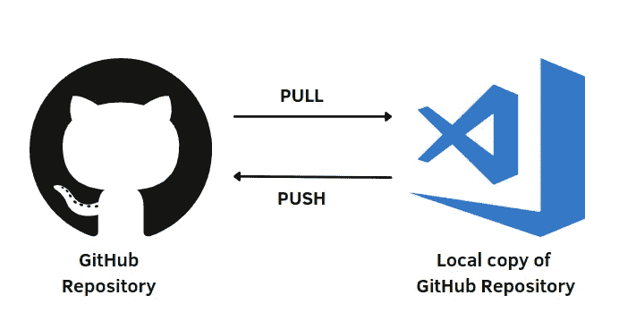
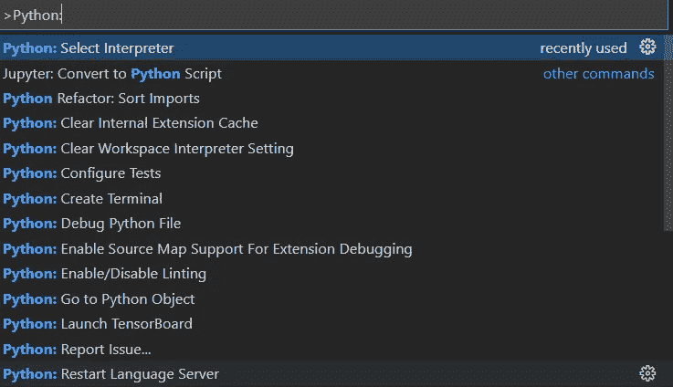
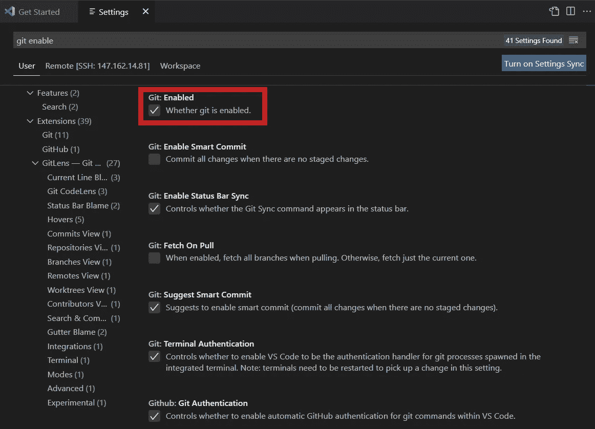
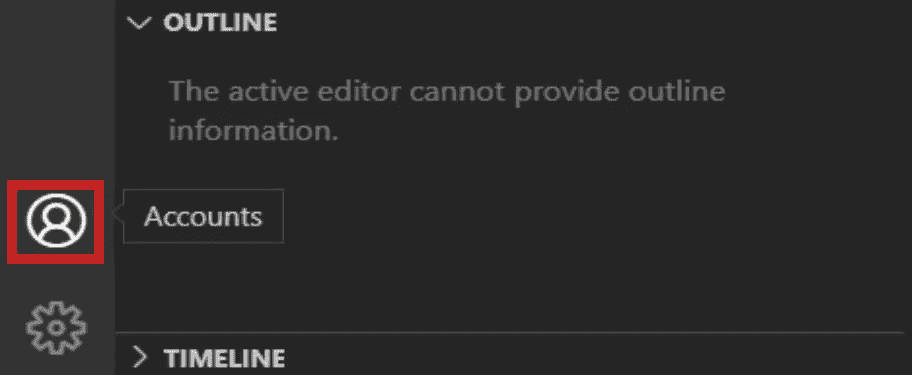
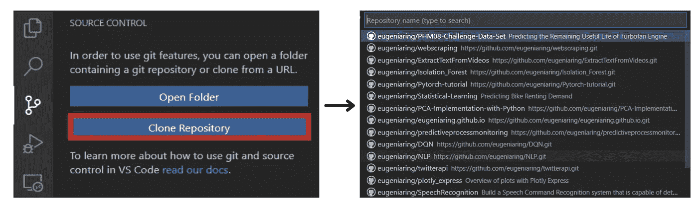
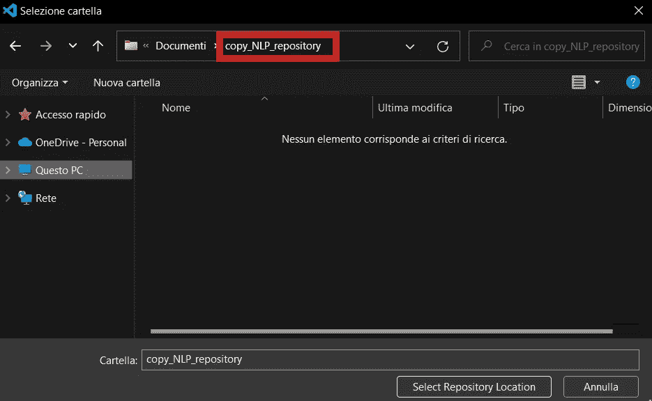
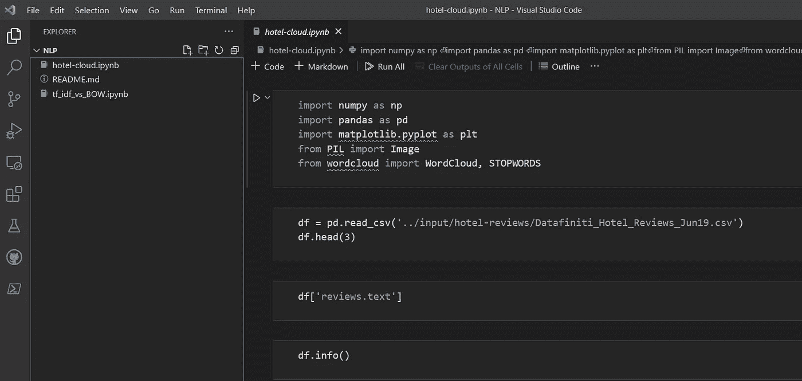
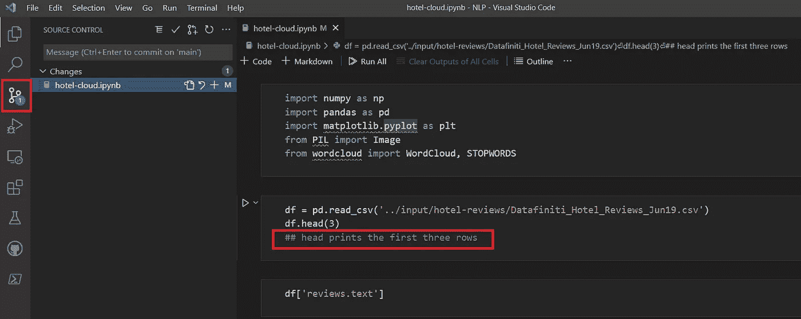
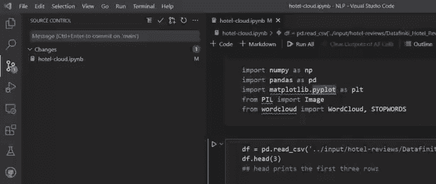
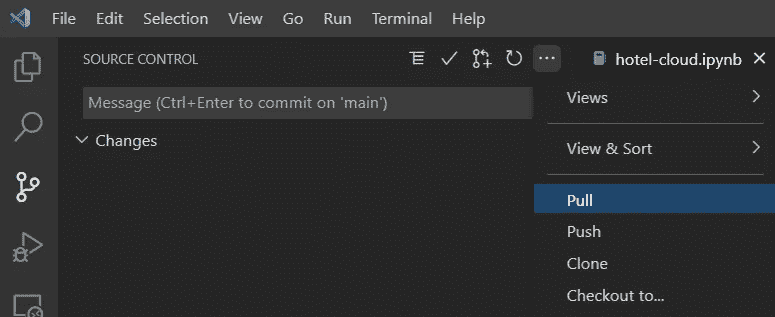

# 如何在 Visual Studio 代码中更新 GitHub 库

> 原文：<https://betterprogramming.pub/how-to-update-your-github-repository-in-visual-studio-code-7bb9e8549cea>

## 概述了如何在 VS 代码中克隆一个存储库，推送变更，以及发出拉取请求


照片由 [ick Morrison](https://unsplash.com/@nickmorrison) 在 [Unsplash](https://unsplash.com/photos/FHnnjk1Yj7Y) 上拍摄

很多时候，我通过简单地插入文件来更新我的 GitHub 库。但是当您不得不多次重复相同的操作时，以及当您与该存储库中的其他人一起工作时，这样做可能会浪费很多时间。

最近在 Jupyter 笔记本上工作，编辑`file .py`的时候开始使用 Visual Studio 代码。这是一个非常有效的 IDE，支持多种语言，并允许您通过安装扩展来提供额外的功能。

在这篇文章中，我将展示如何在 Visual Studio 代码上工作和更新你的 GitHub 库。步骤如下:

1.  **先决条件**
2.  [**克隆 GitHub 库**](#8aee)
3.  [**提交并推送变更**](#13bf)
4.  [**提出拉取请求**](#b123)

# 1.先决条件



作者插图

在 Visual Studio 代码上开始使用 GitHub 之前，您需要了解一些以前的要求。首先需要安装 Visual Studio 代码、 [Python](https://www.python.org/downloads/) (至少 Python 3.6)、和 [Git](https://git-scm.com/downloads) 。一旦安装了它们，您就可以进入 Visual Studio 代码，并从命令面板中选择 Python 解释器，它将显示键盘快捷键`Ctrl+Shift+P`。



作者插图

之后，我们需要在 VS 代码中安装以下扩展:

*   Python 扩展
*   GitLens 扩展
*   GitHub 拉请求和问题

让我们检查一下 Visual Studio 代码，看看设置中是否启用了 Git:



作者插图

最后也是最重要的一步是点击位于 VS 代码面板左下角的 Account 按钮，用 GitHub 登录:



作者插图

如果这些步骤都满足了，我们终于可以开始这个教程了！

# 2.克隆 GitHub 存储库

第一个操作是使用 Visual Studio 代码在本地计算机上克隆 GitHub 存储库。这样，您在本地 PC 上就有了一个完整的存储库副本，并且您可以直接使用 Visual Studio 代码轻松地添加、删除和更新 GitHub 上的文件。

要克隆 GitHub 存储库，您需要已经有一个 GitHub 存储库。如果你在 GitHub 上没有任何存储库，我建议你创建一个新的存储库，上传 Python 文件，稍后会更新。

克隆 GitHub 资源库有三种不同的方法:

*   从终端`git clone <repository.git>`
*   使用命令面板中的`Git:Clone`命令
*   使用位于左侧面板的源代码控制选项卡中的`Clone Repository`按钮

在这篇文章中，我将向您展示如何使用 Source Control 选项卡来克隆存储库。首先，你点击`Clone Repository`，然后，一个你的账户的 GitHub 库下拉列表将会出现(如果你已经登录了 GitHub，正如我在先决条件一节中展示的)。它看起来是这样的:



作者插图

选择一个存储库，然后选择存储库位置，它必须是一个文件夹。一旦你选择了文件夹，你点击`Select Repository Location`按钮。



作者插图

现在，您应该看到在 Visual Studio 代码上打开了本地存储库，如下所示:



作者插图

之后，我们需要在终端上用`git config`命令设置 Git 用户名和电子邮件地址。然后，让我们打开终端并编写命令。您只需用您的 GitHub 用户名和电子邮件替换“您的姓名”和“您的电子邮件@您的域. com”。

```
git config --global user.email "Your Name"
git config --global user.name "youremail@yourdomain.com"
```

瞧啊！现在我们终于在本地计算机上有了 GitHub 库的副本，并且我们完成了大部分配置！

# 3.提交和推送更改



作者插图

拥有 GitHub 库的本地副本的最大好处是可以轻松地更新文件。例如，让我们在 Jupyter 笔记本中添加一个简单的注释，然后保存文件。这样，您就可以在源代码控制图标上看到本地 GitHub 存储库的变化。

在 GitHub 存储库上添加本地修改有三个步骤:

1.  点击修改文件旁边的`+`图标。

2.添加文件后，按下`v`按钮，并写入一条信息。比如我写了“评论已添加”，按了`Enter`。

3.选择`...`图标后，选择`Push`选项。



推动变革的三个步骤。作者插图

如果我们在 GitHub 存储库上检查已更改的文件，您会看到修改，如下所示:


对官方 GitHub 库的修改。作者插图

太好了！我们仅使用 Visual Studio 代码更新了 Jupyter 笔记本！

# 4.提出拉取请求



作者插图

pull 请求对于获得最新版本的 GitHub 资源库非常有用。如果您在存储库中与经常更新文件的其他合作者一起工作，那么如果不进行 pull 请求，就无法在 VS 代码的本地副本上看到这些更改。

别担心，拉请求很快就能完成。选择`...`图标后，只需选择`Pull`选项。

# **最后的想法**

我希望这篇教程对你在 Visual Studio 上开始使用 Git 和 GitHub 有用。当我发现它时，我从未停止使用它，因为它帮助我避免浪费时间。有了更多的时间，我可以专注于其他事情。

感谢阅读！祝您愉快！

## 其他相关文章

[](/how-to-manage-branches-in-your-github-repository-a620128ded45) [## 如何管理 GitHub 存储库中的分支

### 创建、切换和删除分支的概述

better 编程. pub](/how-to-manage-branches-in-your-github-repository-a620128ded45) 

## 有用的参考资料

*   【http://rogerdudler.github.io/git-guide/ 
*   [https://docs.github.com/en](https://docs.github.com/en)

你喜欢我的文章吗？ [*成为会员*](https://eugenia-anello.medium.com/membership) *每天无限获取数据科学新帖！这是一种间接的支持我的方式，不会给你带来任何额外的费用。如果您已经是会员，* [*订阅*](https://eugenia-anello.medium.com/subscribe) *每当我发布新的数据科学和 python 指南时，您都会收到电子邮件！*