# 如何升级包中的依赖项

> 原文：<https://betterprogramming.pub/how-to-upgrade-dependencies-in-package-json-e5546804187f>

## 检查过期的软件包并正确更新它们


照片由[奥斯汀·迪斯特尔](https://unsplash.com/@austindistel?utm_source=unsplash&utm_medium=referral&utm_content=creditCopyText)在 [Unsplash](https://unsplash.com/s/photos/program?utm_source=unsplash&utm_medium=referral&utm_content=creditCopyText) 上拍摄

Npm(节点包管理器)是 JavaScript 编程语言的包管理器。它是 JavaScript 运行时环境 Node.js 的默认包管理器。

项目将其包依赖列表保存在`package.json`中。对于每个已安装的软件包，都会分配一个版本。通常，一个版本由三部分组成:major.minor.patch

*   主要是针对不兼容的 API 修改。
*   Minor 用于向后兼容的功能。
*   补丁是为了向后兼容的错误修复。

默认情况下，npm 会安装最新版本，并在前面添加一个插入符号，如“^15.2.0".”脱字符号依赖关系表明至少应该安装 15.2.0。

当存在更高的次要版本时，将使用它。如果目前的最高次要版本是 15.6.2，这个特定版本 15.6.2 将升级到。

如果您想保守一点，波浪号依赖项“~15.2.0”会建议只使用更高的补丁版本。当然，简单的“15.2.0”将保证只使用精确的版本。语义版本化的细节由 [SemVer](https://semver.org/) 定义。

到目前为止，一切顺利。

# **问题**

随着时间的推移，你的`package.json`中的依赖关系已经发生了变化。您可能希望升级所有软件包以跟上新功能或修复漏洞。你该怎么办？

首先，您需要确定最新版本是什么。这里有一个关于 GitHub 的例子。

如果您在 Visual Studio 代码上安装了[版本镜头](https://marketplace.visualstudio.com/items?itemName=pflannery.vscode-versionlens)，它会显示所有软件包的最新版本。

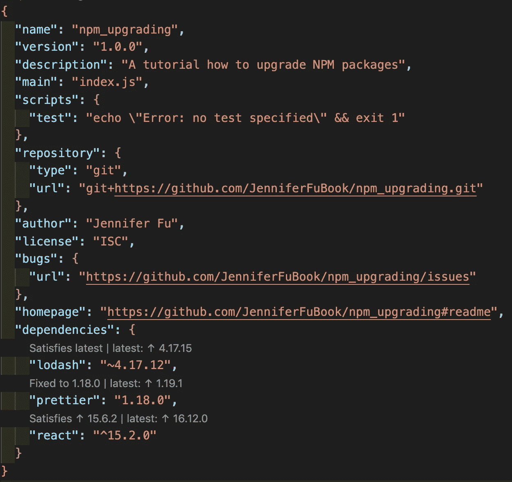

或者，您可以使用 npm 命令行界面:`npm outdated`。

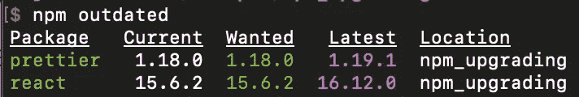

*   *当前*是当前安装的版本。
*   *Wanted* 是满足`package.json`中指定的 SemVer 范围的软件包的最高版本。
*   *Latest* 是在注册表中标记为最新的软件包版本。
*   *位置*是包在依赖关系树中的位置。

CLI 输出中的包颜色表示过期的级别。红色表示有符合`package.json`中定义的 SemVer 要求的更新版本。黄色表示有一个高于 SemVer 要求的新版本。

在我们的例子中， [Lodash](https://lodash.com/) 并没有过时。因此，不在此列。同时，[beautiful](https://prettier.io/)在小版本后面，React 在大版本后面。

如果依赖项修改为以下内容:

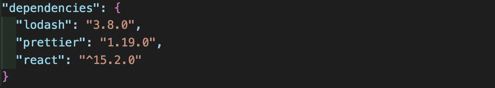

红旗将会为 Lodash 和 beauty 而闪烁。

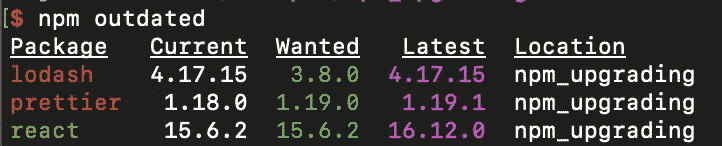

# **解决方案**

在识别出过时的包之后，我们相应地修正了`package.json`中的版本规范。然后我们可以运行`npm install`或者`npm update`来升级。

*   `[npm install](https://docs.npmjs.com/cli/install)`安装一个软件包和它依赖的任何软件包。如果包有一个包锁或包膜文件，依赖项的安装将由此驱动，如果两个文件都存在，则`npm-shrinkwrap.json`优先。
*   `[npm update](https://docs.npmjs.com/cli/update)`将列出的所有软件包更新到最新的指定版本。它还会安装缺失的软件包。

`npm install`和`npm update`有什么区别？

*   `npm install`忽略已经安装的模糊版本模块，而`npm update`更新它。

另外，`devDependencies`的处理方式也不同:

*   `npm install`安装或更新`devDependencies`，除非添加了`--`生产标志。
*   除非添加了`--` dev 标志，否则`npm update`将忽略`devDependencies`。

是不是太概念化了？让我们看一个例子。在我们的例子中，我们将漂亮器的版本从“1.18.0”更改为“~1.18.0”:

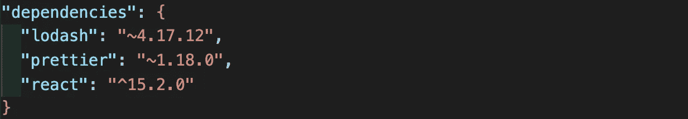

如果我们运行`npm install`，Prettier 的版本足够模糊，可以保留为`package-lock.json`中原来的“1.18.0”。

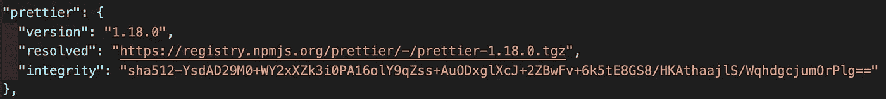

您也可以使用`npm ls`查看。

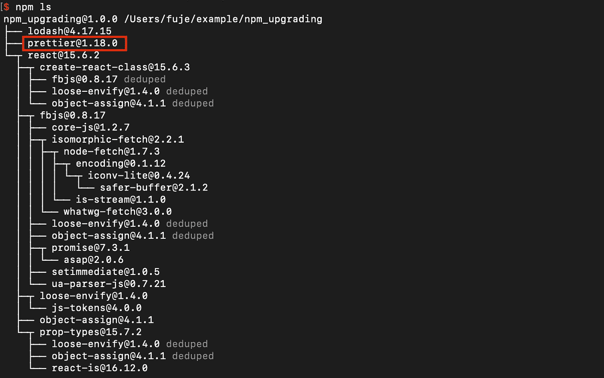

但是如果我们运行`npm update`，Prettier 的版本在`package-lock.json`升级为“1.8.2”。


`npm ls`输出也被更新。

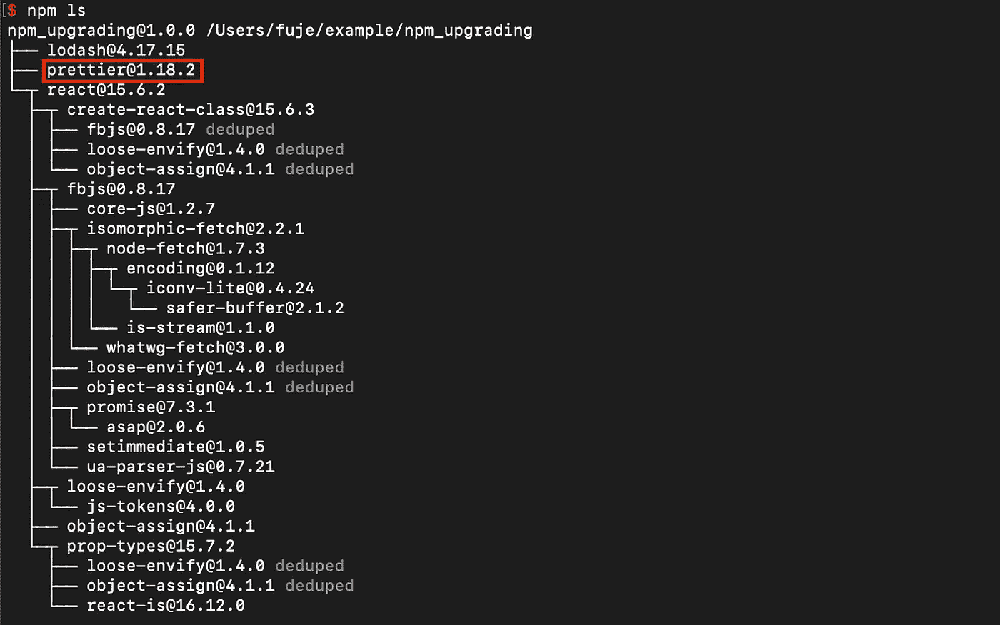

此外，更漂亮的波浪号依赖关系改为插入符号依赖关系！

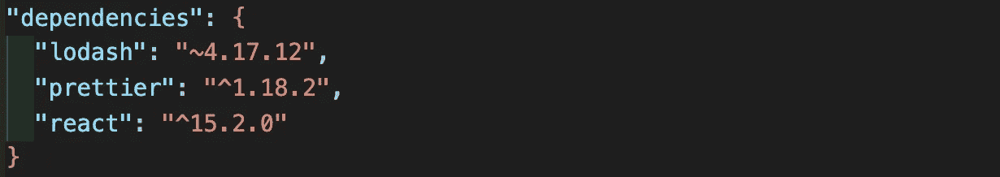

# **强大的解决方案**

正如我们所观察到的，`npm update`不会升级到最新的主版本。这是有意义的，因为主要版本经常引入突破性的变化，需要谨慎处理。

那么，如何才能升级各大版本呢？

在 Visual Studio 代码中使用 Version Lens 的提示，我们可以手动将包升级到主要版本。此外，还有一个强大的工具，`[npm-check-updates](https://www.npmjs.com/package/npm-check-updates)`，可以自动做到这一点。npm 工具可以在全球范围内安装:

```
npm install -g npm-check-updates
```

然后，我们运行这个强大的命令:`ncu -u`。

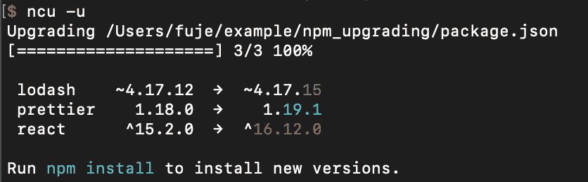

现在，`package.json`中的依赖项升级到了最新版本，包括主要版本:

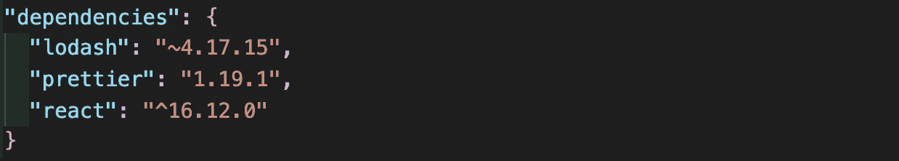

剩下的都是小事。运行`npm install`或`npm update`完成升级。

只是要小心`npm-check-updates`:权力越大，责任越大。

感谢阅读。我希望这有所帮助。如果你有任何问题，请随时回复。你可以在这里看到我的其他媒体出版物。