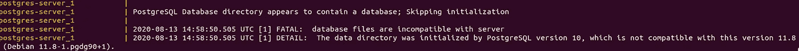

# 如何使用 Docker 升级您的 PostgreSQL 版本

> 原文：<https://betterprogramming.pub/how-to-upgrade-your-postgresql-version-using-docker-d1e81dbbbdf9>

## 升级您的 PostgreSQL 版本并使用 Docker 迁移您的数据


[活动发起人](https://unsplash.com/@campaign_creators?utm_source=medium&utm_medium=referral)在 [Unsplash](https://unsplash.com?utm_source=medium&utm_medium=referral) 上的照片。

最近，我不得不将我的本地 [PostgreSQL](https://www.postgresql.org/) 版本从 10.10 升级到 11.8，以镜像生产环境中存在的相同版本。我原本认为升级会很简单:关闭容器，更新 docker-compose 服务以引用新版本，然后旋转容器。

然而，当容器上升时，一个错误开始在 logs:‌出现



错误非常明显:因为它是由早期版本创建的，所以我的数据与新版本不兼容。当我搜索这个问题的可能解决方案时，我只能找到与 macOS 相关的内容，并依赖于使用 Brew 来执行一些 shell 命令，这些命令将负责升级数据并使其与新版本兼容。

问题是我用 Docker 做这个(好吧，所有和 web 相关的东西，真的)，既然用 Linux Ubuntu，就不能用 Brew(只针对 macOS)。所以我需要一个快速、可靠的解决方案，并且(最好)利用 Docker，这样我就不需要在我的本地机器上安装东西了。

经过大量的搜索和我自己的一些发现，我想出了以下简单的三步解决方案。

# 第一步:备份你当前的数据

在旧的 PostgreSQL 服务仍在运行的情况下，在 docker-compose 文件所在的目录中执行以下命令:

```
docker-compose exec {service_name} pg_dumpall -U {postgres_user} > dump.sql
```

该命令生成一个 SQL 文件，其中包含来自每个数据库、角色等的所有当前数据。稍后，当我们将它导入到新的 PostgreSQL 版本时，我们将使用它。

如果您想在不依赖 docker-compose 文件配置的情况下完成这项工作，可以使用以下命令启动一个专用于该流程的容器:

```
docker run --rm -v ${CWD}:/tmp -v {local_postgres_data_folder}:/var/lib/postgresql/data -w /tmp {postgres_image}:{current_version_tag} pg_dumpall -U {postgres_user} > dump.sql
```

# 步骤 2:删除当前服务的映射卷

我们不能使用旧的数据结构，因为它与新版本的不兼容。除了删除我们的旧 PostgreSQL 服务使用的卷，我们没有其他选择，这样我们可以在以后更新版本标记，并让服务创建基本文件夹/文件，就像它是第一次干净运行一样。

让我们找到该卷映射到的位置，打开一个终端，转到该位置，运行命令将其完全删除:

```
sudo rm -rf {postgres_volume_directory}
```

# 步骤 3:更新 PostgreSQL 版本

有了当前数据的备份，我们现在可以关闭旧的 PostgreSQL 服务容器，更新 docker-compose 配置以引用新的版本标记，并重新启动该服务。

服务启动完成后，它应该引用一个新卷，其中包含新版本支持的新创建的文件。我们只需要启动导入过程，这样我们的备份也可以被这个新版本使用。我们可以通过使用内部 bash 终端，用下面的命令来实现:

```
# Connect to the container's bash terminal
docker-compose exec {service_name} bash# Now we run the import command
psql -U {postgres_user} -d {default_postgres_database} < {mapped_volume_folder_path}/dump.sql
```

*注意:只有在 docker-compose 文件的容器中映射了一个卷时，这个命令才有效。*

如果您喜欢使用一次性命令来运行此导入，您可以使用:

```
docker run --rm -v ${CWD}:/tmp -v {local_postgres_data_folder}:/var/lib/postgresql/data -w /tmp {postgres_image}:{new_version_tag} psql -U {postgres_user} -d {default_postgres_database}  < dump.sql
```

就是这样！我们现在有一个新版本的 PostgreSQL 正在运行，我们保持所有的数据都与该版本兼容。