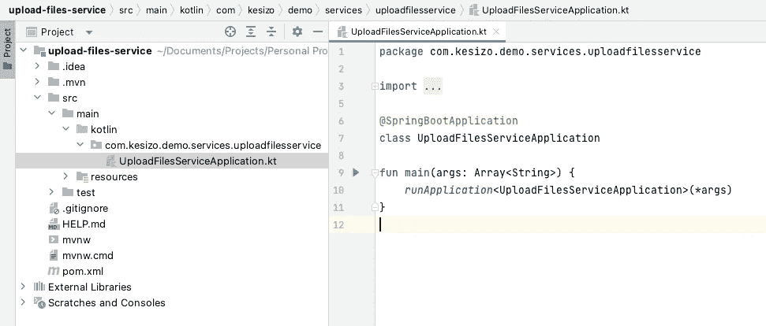
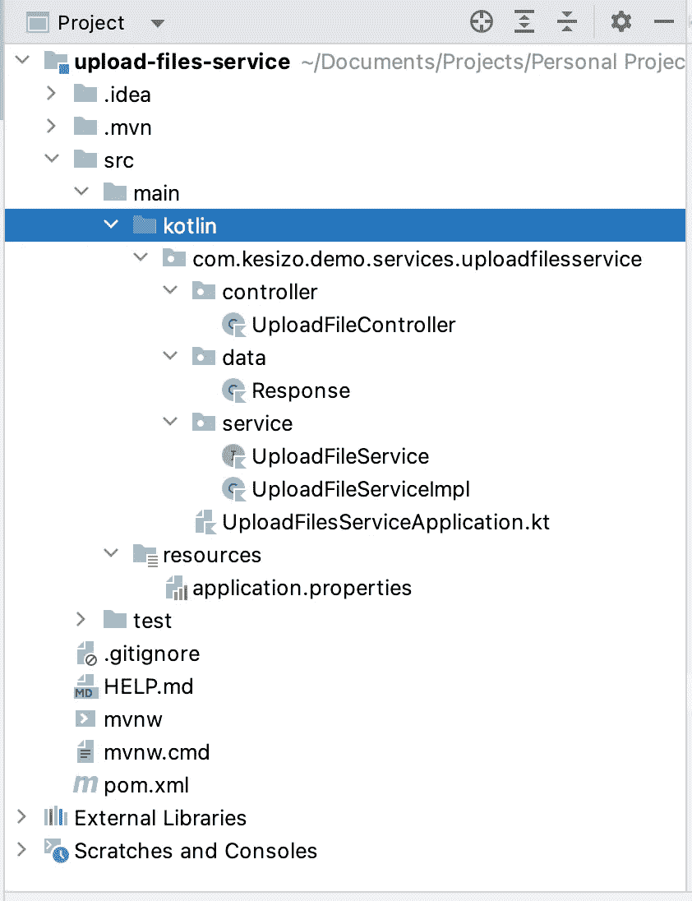
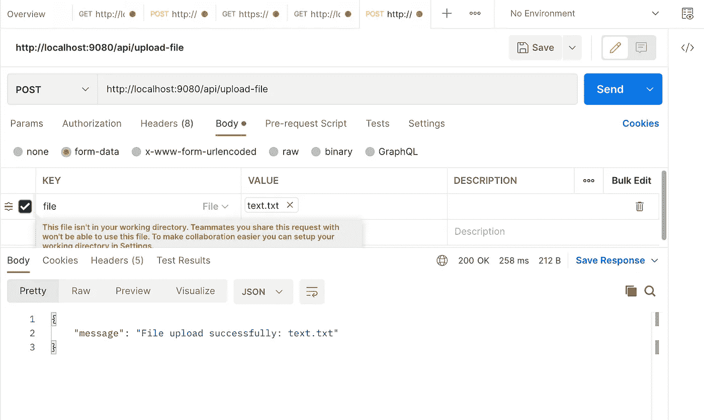
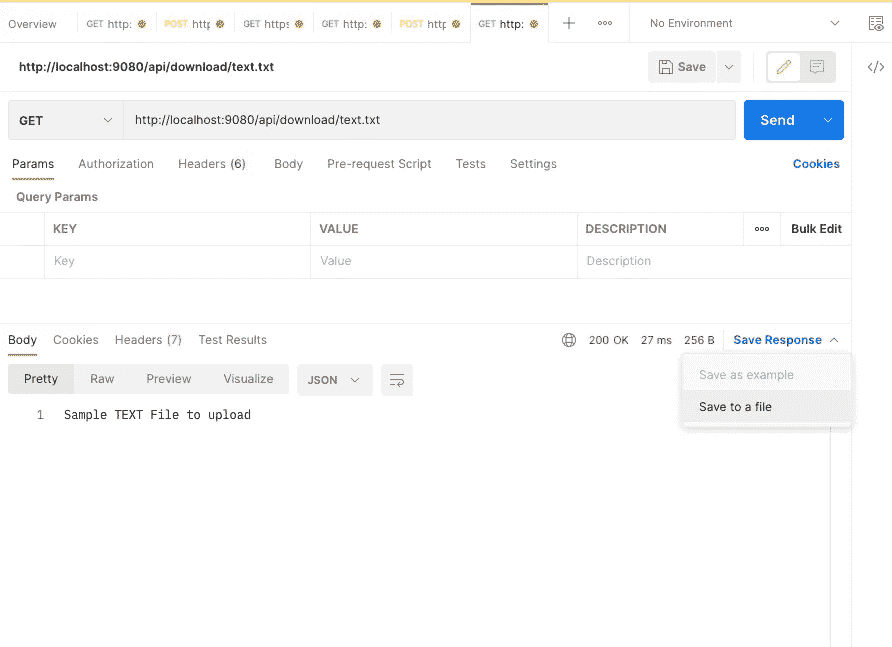
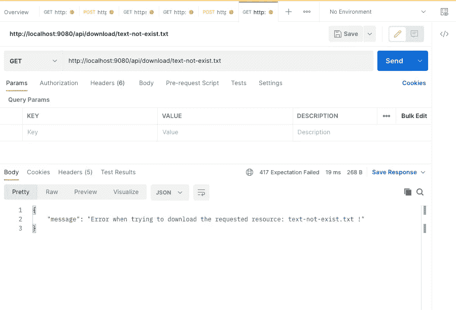

# 如何用 Spring Boot 和科特林上传或下载文件

> 原文：<https://betterprogramming.pub/how-to-upload-download-files-with-spring-boot-and-kotlin-da95bb9d1842>

## 这篇文章旨在描述科特林和 Spring Boot 如何合作创建一个能够使用 Spring Web `MultipartFile`接口上传/下载文件的服务。


图片由 Karolina Grabowska(Pexels.com)提供

# 环境

本分步指南是根据以下要求编写的:

*   操作系统:macOS Catalina 10.15.7
*   Java 版本:OpenJDK 版本“11.0.16”
*   IntelliJ IDEA: 2022.2.2(社区版)
*   科特林:1.7.10

**是一个用于创建微服务的开源框架。它是由 Pivotal 团队开发的，用于构建独立的和生产就绪的 Spring 应用程序。它已经成为在基于 JVM 的技术中开发 REST APIs 的标准方法。Spring Boot 通过删除大量样板代码来帮助开发人员，并支持各种组件的自动配置。**

**[Kotlin](https://kotlinlang.org/) 是由 [JetBrains](https://www.jetbrains.com/) 创建的一种通用、免费、开源、静态类型的“实用”编程语言。Kotlin 结合了面向对象和函数式编程特性，它被设计成完全与 Java 互操作，并且 Kotlin 标准库的 JVM 版本依赖于 Java 类库。**

# **目标**

**本教程旨在提供一个创建 REST 服务的快速实践参考，以方便上传/下载文件。**

**我们基于科特林的 Spring Boot 服务将提供以下 API 端点:**

*   **将文件上传到服务器内的文件夹。**
*   **通过链接从服务器下载文件。**

# **步骤 1:创建项目**

**创建 spring boot 项目最简单的方法是从[https://start/spring . io](https://start/spring.io)配置并下载它**

****

**使用 start.spring.io 创建 spring boot 项目(图片由作者提供)**

****

**将项目导入 IDE(图片由作者提供)**

**一旦项目被导入到您的 IDE 中，我们就可以更新`pom.xml`文件。也就是说，我们需要添加以下依赖项来为我们的项目提供 web 功能。**

```
<dependency>
   <groupId>org.springframework.boot</groupId>
   <artifactId>spring-boot-starter-web</artifactId>
</dependency>
```

**此外，我们还包含了另一个依赖项，以简化应用程序中日志功能的配置和使用。**

```
*<!-- To use Kotlin logger. The level is configured in applications.properties -->* <dependency>
   <groupId>io.github.microutils</groupId>
   <artifactId>kotlin-logging-jvm</artifactId>
   <version>3.0.0</version>
</dependency>
```

# **步骤 2:服务开发**

## **项目结构**

**由于我们正在开发一个旨在可伸缩和可维护的服务，我们决定将源代码组织到不同的层中。如下所示，显示层(`controller`、`service`和`data`文件夹)以及每个文件夹中包含的源代码文件。**

****

**项目结构(图片由作者提供)**

## **数据层**

**这一层包含所有用于存储相关可交换信息的类。对于这个特定的项目，我们创建了[数据类](https://kotlinlang.org/docs/data-classes.html) `Response`，它封装了在调用任何 API 操作后发送给用户的消息。**

**响应数据类**

## **服务层**

**服务层将负责我们应用程序的业务逻辑。它由两个文件组成。**

*   **`UploadFileService`:定义所需方法的界面。**
*   **`UploadFileServiceImpl`:实现接口中定义的方法的类。按照 Spring 的建议，服务的实现必须用`@Service`注释。**

**下面显示了服务接口和实现的源代码。**

**上传文件服务接口定义**

> ***注意:为了学习和简单起见，我们决定在这个示例项目中使用* `[*runCatching*](https://kotlinlang.org/api/latest/jvm/stdlib/kotlin/run-catching.html)` *作为处理异常的函数方法。然而，在决定将这段代码用于您的项目之前，我建议检查 runCatching 限制和用例。***

**上传文件服务实现**

## **控制器层**

**一旦定义了应用程序的业务逻辑，我们需要通过 REST 端点向用户公开我们的 API。控制器层允许我们以简单的方式提供这样的端点。我们的项目定义了两个操作:**

```
| Operation     | Url                | Method | 
| ------------- | ------------------ |--------|
| upload file   | /api/upload-file   | POST   |
| download file | /api/download      | GET    |
```

**下面描述了`UploadFileController.kt`文件的源代码。**

**上传文件控制器实现**

## **应用程序入口点**

**定义了 REST 端点之后，我们只需要更新应用的入口点，文件`UploadFilesServiceApplication.kt` *。***

**因为我们需要在服务第一次启动时执行一些动作，所以我们创建了这个类来实现`CommandLineRunner`接口。结果，我们被迫实现 run 方法，由此调用服务中的方法`init`。这将创建存储上传文件的文件夹。**

**入口点应用程序**

## **微服务配置**

**最后，我们需要通过编辑`application.properties` 文件来定义一些属性。如下所示，我们将使用该文件来定义属性，如服务器将运行的端口、日志记录级别以及一些与上传相关的参数(最大文件大小、最大请求大小和启用的多部分支持)**

**应用程序.属性**

**所以唯一缺少的任务是运行服务。为了做到这一点，只需到您的终端并从您的项目文件夹运行以下。**

```
> mvn spring-boot:run
```

# **步骤 3:使用 Postman 测试服务**

**一旦服务启动并运行，我们将使用 [Postman](https://www.postman.com/) 来验证我们的 spring boot 服务器是否按预期工作。**

**首先，我们将上传一个文件，如下图所示。**

****

**上传后-文件端点**

**成功上传文件后，我们将使用下面显示的 url 调用 HTTP GET 方法来下载它。如果一切正常，Postman 应该会显示文件的内容(如果是 txt 文件),或者它会通过点击*保存到文件*按钮为您提供下载文件的选项。**

****

**下载现有文件**

**最后，我们测试当请求的文件不可下载时服务器如何响应。因此，如下所示，用户会收到一个 417 错误和一条 JSON 消息，指出请求的文件不存在。**

****

**尝试下载不存在的文件时的响应**

# **结论**

**仅此而已，这篇文章旨在成为关于如何使用科特林和 Spring Boot 管理文件上传/下载的入门教程。关于这个主题还有很多功能和高级特性(比如数据库文件存储，或者如何处理多个并发上传)。如果你想看这篇文章的第二部分解释任何特定的主题，请留下评论。**

**如果您有任何意见或建议，或者如果您发现有什么不对的地方，我将非常感谢您的反馈。否则，我希望这篇教程能帮助你开始使用 Kotlin 和 SpringBoot 处理文件。**

# **参考**

*   **[https://maven.apache.org/](https://maven.apache.org/)**
*   **[https://www.w3.org/Protocols/rfc1341/7_2_Multipart.html](https://www.w3.org/Protocols/rfc1341/7_2_Multipart.html)**
*   **[https://spring.io/guides/tutorials/spring-boot-kotlin/](https://spring.io/guides/tutorials/spring-boot-kotlin/)**
*   **[https://www . jetbrains . com/idea/guide/tutorials/working-with-maven/creating-a-project/](https://www.jetbrains.com/idea/guide/tutorials/working-with-maven/creating-a-project/)**
*   **[https://kot linlang . org/API/latest/JVM/stdlib/kot Lin/run-catching . html](https://kotlinlang.org/api/latest/jvm/stdlib/kotlin/run-catching.html)**
*   **[https://www.bezkoder.com/spring-boot-upload-multiple-files/](https://www.bezkoder.com/spring-boot-upload-multiple-files/)**
*   **[https://Eliza ROV . medium . com/kot Lin-and-exceptions-8062 f 589d 07](https://elizarov.medium.com/kotlin-and-exceptions-8062f589d07)**