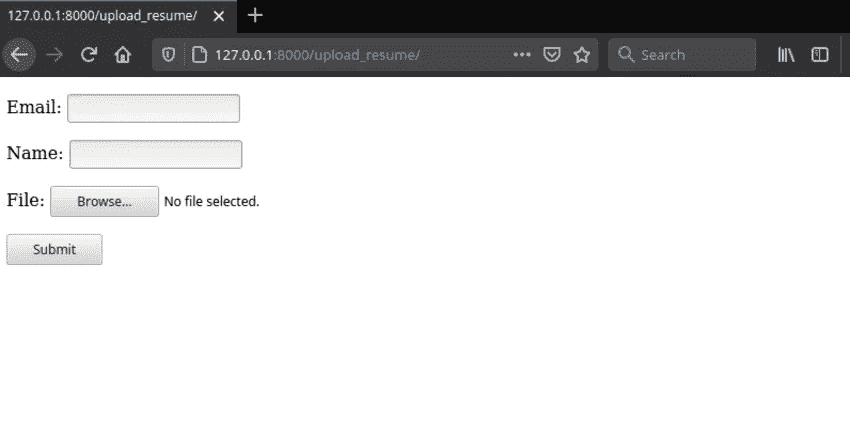
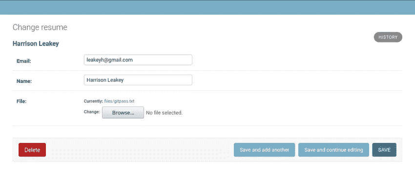

# 如何在 Django 应用程序中上传文件和图像

> 原文：<https://betterprogramming.pub/how-to-upload-files-and-images-in-your-django-application-f4d086890e53>

## Django 文件和图像上传


**照片由:**马太·亨利

上传文件和图像每天都在发生，无论您是向工作同事发送文档，还是将媒体上传到您最喜爱的社交媒体平台。

在本指南中，您将学习在 Django 应用程序中上传文件和图像。您还将学习如何从您的 Django 应用程序中提供文件。

# 项目设置

我们将从创建一个目录开始，我们的项目和虚拟环境将存放在这个目录中。

创建一个目录，cd 到该目录并创建一个虚拟环境:

```
mkdir filesDjango
cd  filesDjango
python3.8 -m venv env
```

建议使用虚拟环境来保持项目依赖关系独立于操作系统。激活虚拟环境并在虚拟环境中安装 Django:

```
source env/bin/activatepip install Django
```

创建一个名为 file uploads 的新 Django 项目:

```
django-admin startproject fileuploads
```

在 Django 项目目录中，创建一个名为 files 的应用程序。Django 中的应用程序用于分离不同的组件，对于扩展应用程序至关重要。

应用程序也是可移动的部分，可以在不破坏代码的情况下移动到另一个 Django 项目。

```
django-admin startapp files
```

将应用程序文件添加到`settings.py`文件中的已安装应用程序列表

```
INSTALLED_APPS = ['django.contrib.admin','django.contrib.auth','django.contrib.contenttypes','django.contrib.sessions','django.contrib.messages','django.contrib.staticfiles','files',]
```

Django 使用 MEDIA_ROOT 和 MEDIA_URL 设置在本地存储文件。让我们在 settings.py 中定义这些常量

```
import osMEDIA_URL = "/media/"MEDIA_ROOT = os.path.join(BASE_DIR, 'media')
```

MEDIA_ROOT 将用于管理我们存储的文件，而 MEDIA_URL 将是所提供的媒体的 URL

# 上传文件

用 FileFields 模型字段上传文件是最容易上传文件的。让我们首先在 models.py 中创建一个简单的模型类，如下所示:

我们的模型有 3 个字段，即电子邮件、姓名和要上传的文件。文件字段中的 upload_to 属性指向文件在应用程序中的存储位置

## 运行迁移

迁移将在数据库中创建实际的表。

```
python3.8 manage.py migrate
```

## 形式

Django 附带了一个内置的 ModelForm 类，使得从模型字段创建表单变得很容易。创建一个名为 forms.py 的新文件，并添加以下代码

一旦我们定义了上面的表单，我们将使用视图中的 POST 请求使用`request.FILES`从表单中获取数据。
让我们编写视图来获取表单中包含的数据。打开 view.py，编写以下代码。

在上面的代码中，我们首先检查方法是否是 POST，然后从表单中获取数据，验证它并保存到数据库中。如果方法是 GET，我们在模板中呈现表单。

我们还没有创建用于呈现表单的`upload.html`模板，所以让我们开始吧。Django 自动在模板目录中查找模板，因此创建如下文件

```
templates/
       files/
         -upload.html
```

要在模板中提供表单，表单必须有属性`enctype=”multipart/form-data`。“否则，`request.FILES`将返回空值

```

<form method = "post", enctype="multipart/form-data">
   
   {{ form.as_p }}
   <button type="submit"> Submit</button>
</form>

```

csrf_token 标记将保护表单免受恶意数据的攻击，而 form.as_p 将字段显示为段落。

# 注册 URL 路径

第一步是创建一个 urls.py 文件来注册用于显示表单的 URL。创建一个文件`urls.py`，并添加以下代码

接下来，在根`url.py`文件中注册文件 URL，如下所示

现在，如果您运行 server 并导航到[http://127 . 0 . 0 . 1:8000/upload _ resume/](http://127.0.0.1:8000/upload_resume/)，您应该会看到如下所示的表单



## Django 管理

Django 附带了 Django admin，这是一个强大的接口，允许开发人员添加数据。让我们在 admin.py 中注册简历模型，如下所示:

```
from django.contrib import adminfrom .models import Resume # Register your models here.admin.site.register(Resume)
```

## 创建超级用户

超级用户将允许你执行管理工作

```
python3.8 manage.py createsuperuser
Username (leave blank to use 'earthtoast'): 
Email address: 
Password: 
Password (again): 
Superuser created successfully.
```

现在导航到[http://127 . 0 . 0 . 1:8000/admin/](http://127.0.0.1:8000/admin/)用我们上面创建的超级用户登录，就可以查看提交的数据了。



正如您在上面看到的，文件已经存储在 files 目录中。

## 在 Django 应用程序中上传图片

我们已经看到了如何使用 FileField 上传文件；图像呢？。为了上传图像，我们将使用 am ImageField。转到模型并添加图像字段，如下所示。

我们上面定义的`imageField`需要 [pillow](https://pypi.org/project/Pillow/) 库，所以让我们用 pip 安装`pillow`。

```
pip install Pillow
```

应用迁移来实现对我们的模型所做的更改。

```
python3.8 manage.py makemigrations files
Migrations for 'files':
  files/migrations/0002_image.py
    - Create model Image 
```

运行迁移命令

```
python3.8 manage.py migrate 
Operations to perform:
  Apply all migrations: admin, auth, contenttypes, files, sessions
Running migrations:
  Applying files.0002_image... OK
```

接下来，我们将创建一个表单，就像前面创建简历表单一样。

接下来，让我们创建用于呈现图像上传表单的视图。在 views.py 中，添加以下代码。

在 templates 文件夹中创建文件`image.html`,并添加以下代码。

接下来，将`upload_imge`视图挂接到 URL。打开 urls.py 并添加以下代码。

您的图像上传表格可在[http://127 . 0 . 0 . 1:8000/upload _ images/](http://127.0.0.1:8000/upload_images/)找到

## 提供文件

第一步是在`settings.py`文件的`TEMPLATES`的`context_processors`选项中添加`django.template.context_processors.media`，
设置这个选项将允许我们在模板中使用`{{ MEDIA_URL }}`。

接下来，更新视图以从数据库中获取我们的图像。

更新`image.html`模板以显示我们的图像

我们可以在开发期间使用`[django.views.static.serve()](https://docs.djangoproject.com/en/dev/ref/views/#django.views.static.serve)`视图从媒体路径提供上传的文件。让我们将下面的路径添加到根 URL 文件中。

现在，如果您导航到[http://127 . 0 . 0 . 1:8000/upload _ images/](http://127.0.0.1:8000/upload_images/)，图像将按预期显示。


# 结论

本教程涵盖了在 Django 项目中开始处理文件和媒体所需的一切。Pillow library 还提供了许多功能，用于打开、操作和保存许多不同的图像文件格式。

[](/build-a-personal-journal-with-django-and-python-f4835d27368c) [## 用 Django 和 Python 创建个人日志

### 构建 Django web 应用程序

better 编程. pub](/build-a-personal-journal-with-django-and-python-f4835d27368c)