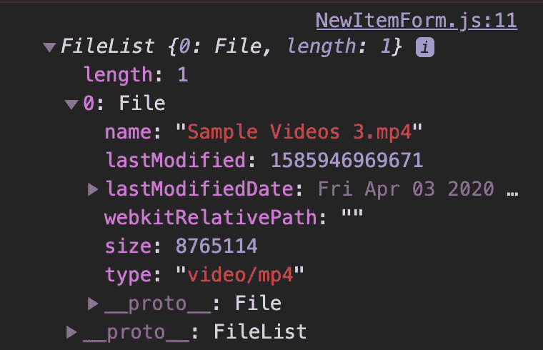

# 如何在 React 和 Rails 应用中上传文件

> 原文：<https://betterprogramming.pub/how-to-upload-files-in-a-react-and-rails-app-69c31a9cf9b7>

## 使用 Cloudinary 上传图像和视频


照片由 [Pero Kalimero](https://unsplash.com/@pericakalimerica) 拍摄(Unsplash)

在本指南中，我们将介绍如何在 React 应用程序中上传图像/视频。

对于服务器，我们将建立一个 Rails API 来存储图像/视频的信息。对于图像/视频的实际存储，我们将包括一个名为 [Cloudinary](https://cloudinary.com/) 的第三方服务。这是一个基于云的图像和视频管理平台。

让我们从在 Cloudinary 注册一个帐户开始，因为我们需要凭据来集成到 Rails API 中。

# 云端设置

如果您还没有 Cloudinary 的帐户，请在此注册一个:

 [## Cloudinary 帐户注册

### 编辑描述

cloudinary.com](https://cloudinary.com/users/register/free) 

注册后，您应该会被重定向到顶部包含帐户详细信息的仪表板。

对于我们的 Rails API，我们需要“云名称”、“API 密钥”和“API 秘密”。现在，我们实际上已经完成了 Cloudinary 的设置。让我们继续设置我们的 Rails API。

# Rails API 设置

让我们首先用以下代码生成一个 Rails 应用程序:

```
rails new rails-file-upload-template --database=postgresql --api
```

在`Gemfile`中，我们需要包含一个 gem 来集成 Cloudinary。添加`gem 'cloudinary'`，取消`gem 'rack-cors'`的注释，运行`bundle install`。

## 生成模型和控制器

我们将需要为`Item`生成模型，它具有图像和视频的属性，这将代表与 Cloudinary 中上传的图像或视频相关的 URL 链接。

```
rails g model Item image:string video:string
```

理想情况下，我们还将生成控制器:

```
rails g controller items
```

一旦我们生成了控制器和模型，让我们创建数据库并使用以下内容进行迁移:

```
rails db:create && db:migrate
```

## 配置文件

让我们导航到`config/initializers/cors.rb`。在文件中，用`*`替换`example.com`，并取消注释:

在`config/initializers`下，我们创建一个名为`cloudinary.rb`的新文件。在该文件中，我们复制以下配置:

在`cloud_name`、`api_key`和`api_secret`字段中，将它们替换为您在 Cloudinary 账户详情中的信息。一定要用绳子把它们包起来！

导航到`config/routes.rb`并为`Item`设置`create`路线:

```
Rails.application.routes.draw do resources :items, only: [:create]end
```

对于本指南，我们将只关注于实现一个`Item`的创建。让我们将注意力转移到`ItemsController`上，并为`create`定义方法。

## 项目控制器

在`ItemsController`的`create`方法中，我们要做的是将客户端发送的实际图像和视频上传到 Cloudinary。

一旦我们上传成功，Cloudinary 将分别发送包含图像和视频的 URL 字符串的响应。我们将在 Rails 数据库中存储的不是实际的图像或视频，而是存储在 Cloudinary 中的 URL 字符串。

让我们首先设置将照片和图像上传到 Cloudinary 的方法。当我们在`Gemfile`中安装 Cloudinary 时，我们继承了 Cloudinary 的方法。我们将使用的一种方法是`Cloudinary::Uploader.upload`。

如果只是一幅图像，`Cloudinary::Uploader.upload()`可以将图像数据作为一个参数。

如果是视频，它将视频数据作为第一个参数，将`:resource_type => :video`作为第二个参数，表示您正在上传视频。

我建议在方法中放置一个`byebug`来检查响应到底返回了什么。

```
image = Cloudinary::Uploader.upload(params[:image])video = Cloudinary::Uploader.upload(params[:video], :resource_type => :video)
```

大多数图片都可以上传，但是关于视频，我相信它必须是`.mp4`的格式，并且也有大小限制。如果您想了解有关上传视频的更多信息，请参阅:

[](https://cloudinary.com/documentation/upload_videos) [## 视频上传-面向开发人员的视频管理| Cloudinary

### Cloudinary 是一种基于云的服务，为图像和视频提供端到端的媒体管理解决方案…

cloudinary.com](https://cloudinary.com/documentation/upload_videos) 

如上所述，如果图像和视频上传成功，响应将是包含不同类型信息的对象。但是我们想要的是可以通过`“url”`键访问的 URL 字符串。

创建项目实例时:

```
item = Item.create(image: image["url"], video: video["url"])
```

一旦我们创建了`Item`实例并将其存储在数据库中，我们就可以将其呈现为 JSON。

项目控制器创建方法

# **奖金**

假设我们想从数据库中删除 item 实例。我们可能还想删除 Cloudinary 上与之相关的图片和视频。

要删除一个图像，我们调用 Cloudinary 的另一个方法，`Cloudinary::Uploader.destroy(id)`。例如，图像 URL 应该作为字符串存储在数据中。

```
"[http://res.cloudinary.com/dv4i7ebnk/image/upload/v1586048935/znb3ns5mujg08fifm2uh.png](http://res.cloudinary.com/dv4i7ebnk/image/upload/v1586048935/znb3ns5mujg08fifm2uh.png)"
```

我们的 ID 将代表`.png`之前的标识符。

对于删除视频，我们调用相同的方法，但是传入第二个参数来指示它是一个视频:

```
Cloudinary::Uploader.destroy(id, :resource_type => :video)
```

如果您在上传到 Cloudinary 后收到错误响应，请考虑您没有传入图像或视频数据的可能性。你可能会传入一个字符串。

我们将把重点转移到客户端 React，以确保当您提交请求时，您传递的是正确的数据类型。

# 反应表单设置

对于这一部分，我们将不会关注从零开始设置 React 应用程序。

相反，假设您已经构建了一个 React 组件，我们将重点创建一个表单组件，它将处理向 Rails API 提交图像和视频数据。

用于处理图像和视频上传的 React 表单

在`NewItemForm`组件中，我们将拥有图像和视频的属性。在`render()`里面，我们将返回一个里面有`form`的`div`元素。

在`form`中，我们为图像和视频添加了两个输入字段，类型设置为“文件”。我们还为每个属性分配了一个名称属性，用于负责设置状态的`onChange`函数。

当我们在`onChange`内部设置状态时，我们正在访问`e`(事件)上的一个非常具体的属性。

因为我们将`input`字段的类型指定为“文件”，所以我们可以从`e.target.files`访问数据。如果我们进行`console.log(e.target.files)`，我们将得到下面的数据结构:



电子目标文件

它是一个只有一个键 0 的对象，带有一个上载文件的值。我们希望将该值发送给 Rails API，由它转发给 Cloudinary。我们通过`e.target.files[0]`访问该值。

在将信息发送到 Rails API 之前，我们还需要设置一件事。

在表单 submit 的事件处理程序中，`onSubmit`，除了使用`e.preventDefault`来防止页面刷新和丢失数据，我们还需要创建一个新的`FormData`实例。

在这种情况下，我们将该实例存储在变量`form`中。我们使用`.append`方法将我们需要的信息添加到`form`变量中。

`.append`需要的第一个参数是键名`image`和`video`。第二个参数是值，它将是`image`和`video`的文件数据。

现在我们准备向 Rails API 提交一个请求。

在`fetch`请求中，我们需要定义方法，该方法是“POST”并传入数据，`form`作为键 body 的值。我们已经以一种能够与 Rails API 设置协同工作的方式构建了表单中的数据。

# 结束语

Cloudinary 是一种高效的云存储服务，在几个服务器端框架中实现起来相当简单。

本指南涵盖了如何为 Rails API 的照片和视频存储设置 Cloudinary，以及如何正确地从 React 表单组件发送请求。感谢您的阅读！

供参考， [Rails API 回购](https://github.com/reireynoso/rails-cloudinary-template)和 [React 回购](https://github.com/reireynoso/react-cloudinary-template)。