# 如何从 NextJS 应用程序上传文件到 AWS S3

> 原文：<https://betterprogramming.pub/how-to-upload-files-to-amazon-s3-from-nextjs-app-b7ef1909976b>

## 没有与 CORS 政策的斗争。

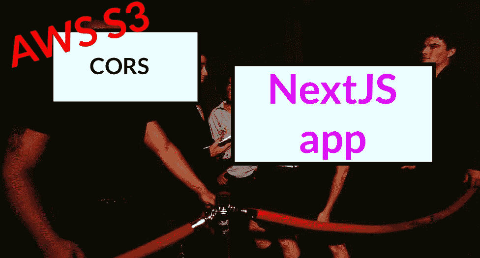

试图到达不同原点的请求

NextJS 是一个前端框架，由于 [CORS](https://developer.mozilla.org/en-US/docs/Web/HTTP/CORS/Errors) 策略，前端不能访问不同的源，如果你以错误的方式实现它，实现起来会很乏味。当然，您可以在 next.config.js 文件中通过从 API 路由重定向来改变发出的请求，但是使用 NextJS 无服务器 API 会失去它的好处。在这篇“快速，切中要点”的文章中，我们将回顾使其工作所需的步骤。

顺便说一句，如果你喜欢使用现成的代码，你可以在这里找到:

[](https://github.com/kolberszymon/NextJS-AWSS3) [## GitHub-kolberszymon/NextJS-AWS S3

### 此时您不能执行该操作。您已使用另一个标签页或窗口登录。您已在另一个选项卡中注销，或者…

github.com](https://github.com/kolberszymon/NextJS-AWSS3) 

# AWS S3

如果你不知道 AWS S3 是什么，S3 主张简单的存储服务，它正是如此。它允许你在亚马逊服务器上在线存储所有不同的文件，并快速安全地检索它们。一个额外的好处是“按规模付费”的商业模式，它让你可以尝试这项服务，如果你的需求不是很大，甚至可以在生产中免费使用。说了这么多，现在让我们来关注为了在我们的 web 应用程序中使用它，我们必须做些什么。

## **1。创建一个 AWS 账户**

你可以在控制台[那里](https://signin.aws.amazon.com/signin?redirect_uri=https%3A%2F%2Fus-east-1.console.aws.amazon.com%2Fconsole%2Fhome%3Ffromtb%3Dtrue%26hashArgs%3D%2523%26isauthcode%3Dtrue%26nc2%3Dh_ct%26region%3Dus-east-1%26skipRegion%3Dtrue%26src%3Dheader-signin%26state%3DhashArgsFromTB_us-east-1_03b40cbc55de739a&client_id=arn%3Aaws%3Asignin%3A%3A%3Aconsole%2Fcanvas&forceMobileApp=0&code_challenge=8TAMgn_aIbyPEHRJdjifEzBL81i23mtVKH-MdAuWjqc&code_challenge_method=SHA-256)签到。根用户和 IAM 用户之间的区别在于，根用户的凭据是您注册时使用的凭据，提供了您的卡和帐单详细信息。IAM 用户帐户是您为单个 AWS 服务创建的帐户。总而言之，您希望在那里创建一个 root 用户。

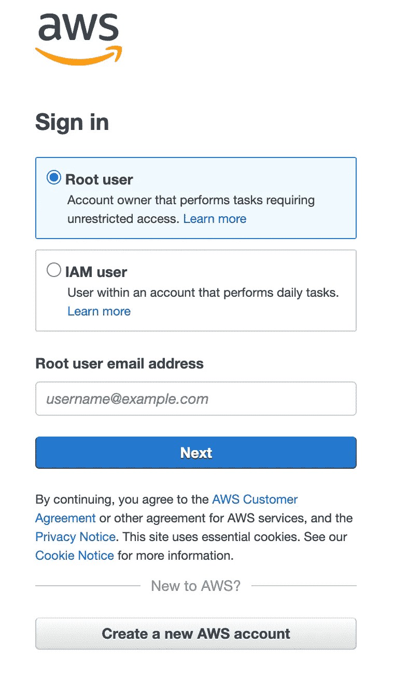

Amazon 登录到控制台页面

## **2。导航到 S3 / IAM 服务**

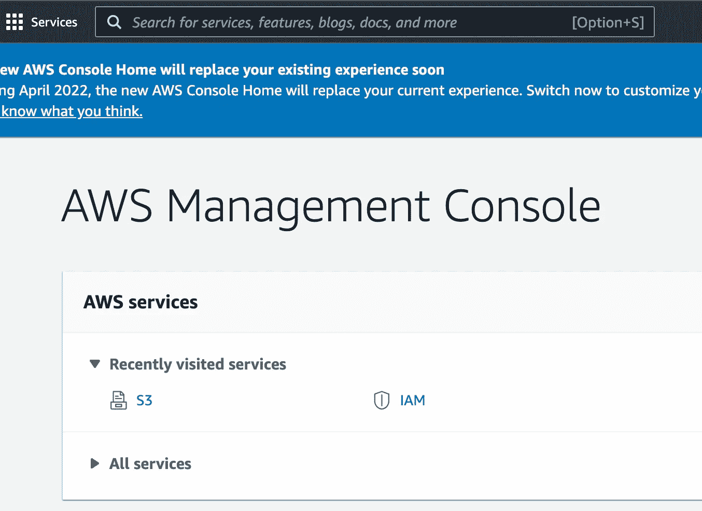

登录后的 AWS 屏幕

如果是第一次使用 AWS，不用担心，很直观。基本上，您可以从一个帐户访问所有服务，您可以从最近访问的服务部分或搜索栏中搜索它们。在本教程中，我们只需要两个服务——S3 将为我们提供存储功能，而我将在这里创建访问策略。

# **S3 又名简单存储服务**

## **1。创建存储桶**

我们首先要配置的是 S3。正如你在下图中看到的，S3 致力于“木桶”哲学。你创建一个存储文件的桶。

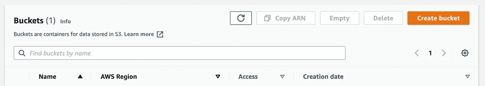

桶页

创建 bucket 时，您可能希望几乎所有内容都保持原样，只有“阻止所有公共访问”选项除外。因为我们希望允许我们的用户公开上传，所以我们将让它空着。

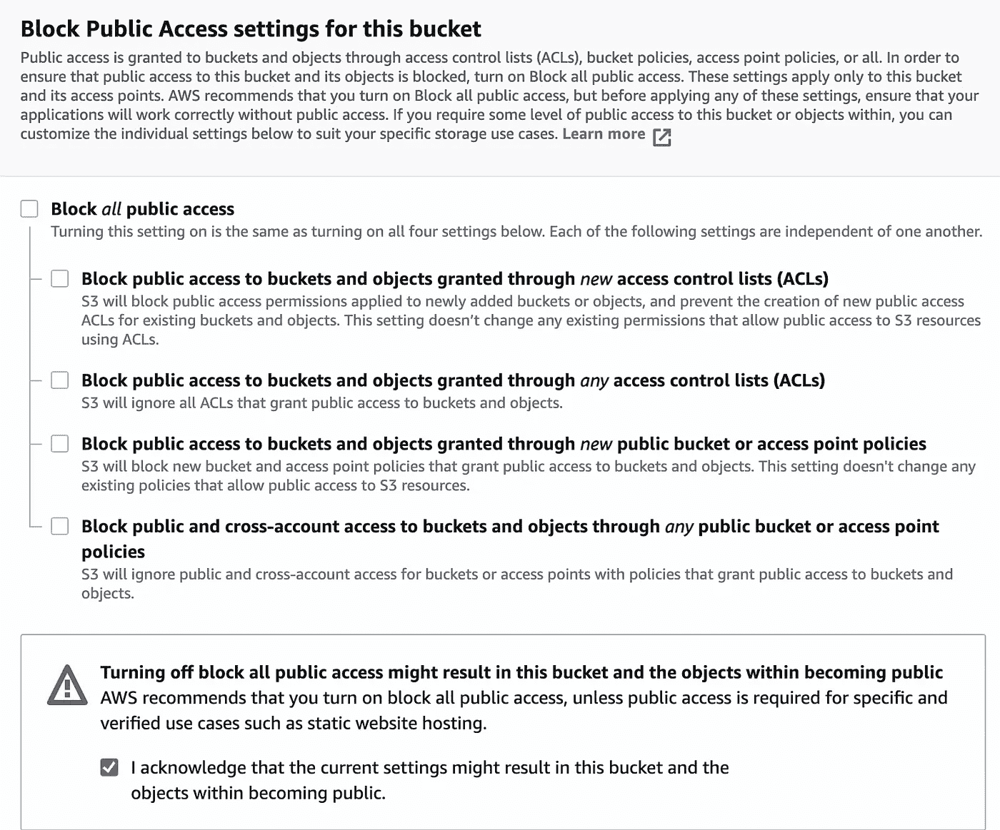

将“阻止所有公共访问”选项留空

## **2。桶属性配置**

**存储桶策略** —负责管理访问。为了简单起见，我们将它设置为 public，这样我们就可以在以后访问资源，而不需要任何不必要的身份验证。配置相当标准。如果你是复制粘贴的话，记得在`YOUR_BUCKET_NAME_HERE`的位置插入你的 bucket 名称(当然你是，我们都是程序员)。

```
{
    "Version": "2012-10-17",
    "Statement": [
        {
            "Sid": "PublicListGet",
            "Effect": "Allow",
            "Principal": "*",
            "Action": [
                "s3:List*",
                "s3:Get*"
            ],
            "Resource": [
                "arn:aws:s3:::YOUR_BUCKET_NAME_HERE",
                "arn:aws:s3:::YOUR_BUCKET_NAME_HERE/*"
            ]
        }
    ]
}
```

**CORS —** Cors 属性也可以在“权限”选项卡中设置。请随意复制粘贴我的配置，正如您所见，这并不疯狂。我们基本上允许所有的原点访问我们的桶。

```
[
    {
        "AllowedHeaders": [
            "*"
        ],
        "AllowedMethods": [
            "PUT",
            "POST",
            "GET"
        ],
        "AllowedOrigins": [
            "*"
        ],
        "ExposeHeaders": [
            "ETag"
        ]
    }
]
```

## IAM 又名 API 密钥

因为我们要连接亚马逊，我们需要某种认证。我们可以从 IAM 部分开始。如您所见，我已经创建了一个用户组

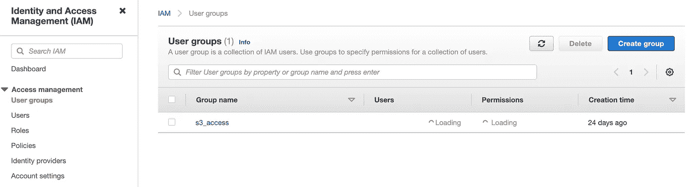

用户组页面

点击创建群组，您将能够选择适当的权限。只需选择 AmazonS3FullAccess。

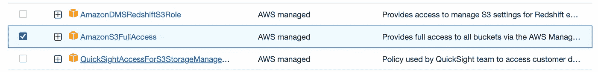

设置组权限

之后，您应该会在面板中看到刚刚创建的群组。

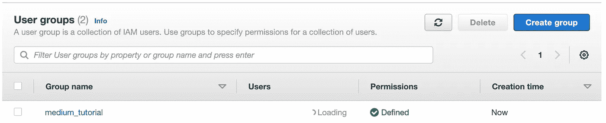

创建的组

然后，我们希望创建一个用户，并为其分配一个刚刚创建的访问组。

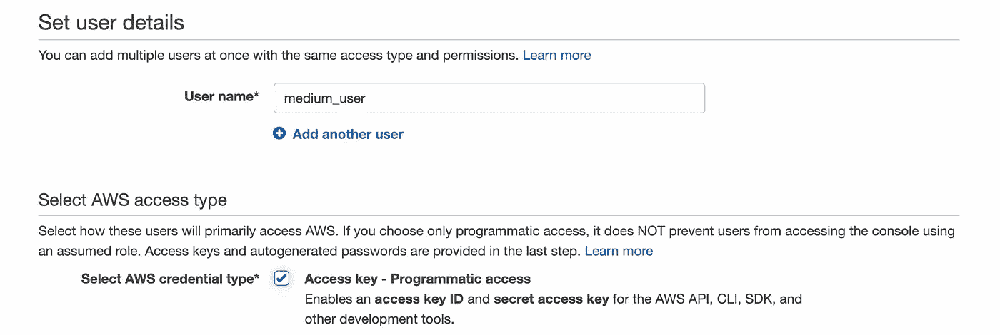

创建 IAM 用户

选择编程访问，因为我们希望使用 API 提升 AWS SDK，为此，我们需要 API 凭证。成功创建用户后，您将能够获取其访问密钥 ID 和秘密访问密钥。你想要抓住这些，我们将在下一个与下一个 JS 相关的章节中使用它们。

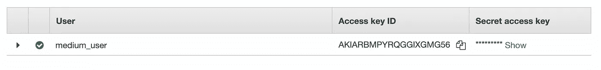

用户凭据

# 下一个 JS /前端部分

唷，我们做了最没意思的工作(对不起 AWS 管理员，这只是我个人的看法)。现在我们可以回答如何使用前端框架上传文件的问题了。

首先也是最重要的是，不要全部是前端。由于我们不能在前端真正拥有环境变量(因为它们都被编译成 Javascript 代码，并且最终都将在浏览器中可见)，我们将提升 NextJS API 路由。这基本上是一个简单直观的无服务器解决方案。

# **工作流程**

那么，我们将如何解决这个问题呢？我们将创建一个 API route，它将为我们创建 signedUrl，然后我们将向它发出一个 PUT 请求，传递文件；我们想作为一个主体上传。如果听起来很复杂，只要浏览一下代码，一会儿就会明白得多。

## **1。安装 NextJS 以及 Tailwind CSS 和 Typescript**

我不知道你怎么想，但是我更喜欢用 Typescript 和 Tailwind CSS 来处理 NextJS。Typescript 给了我类型检查，而 tailwind 让我可以超快地编写 CSS，就像服用了类固醇一样。为了省去设置它的麻烦，这里有一个预配置了 Typescript 和 Tailwind 的模板，您可以使用:

[](https://github.com/vuongddang/nextjs-tailwindcss-typescript-starter) [## GitHub-vuongddang/NextJS-tailwindcss-Typescript-starter:NextJS，TailwindCSS 和 Typescript…

### 这是一个 Next.js 12.x，TailwindCSS 3.x，和 TypeScript 4.x 的入门模板更多细节请看我的博文。Nextjs…

github.com](https://github.com/vuongddang/nextjs-tailwindcss-typescript-starter) 

## **2。安装必要的库**

为此，我们只需要两个库:

*   `axios`:允许我们发出 HTTP 请求，
*   `aws-sdk` **:** 允许我们使用 AWS 服务

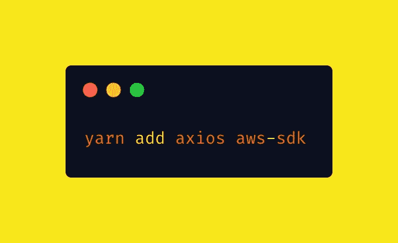

用 yarn 安装所需的库

## **3。创建文件输入**

下面的代码创建了一个简单的 file 类型的输入，它允许我们获取一个已经输入的文件。

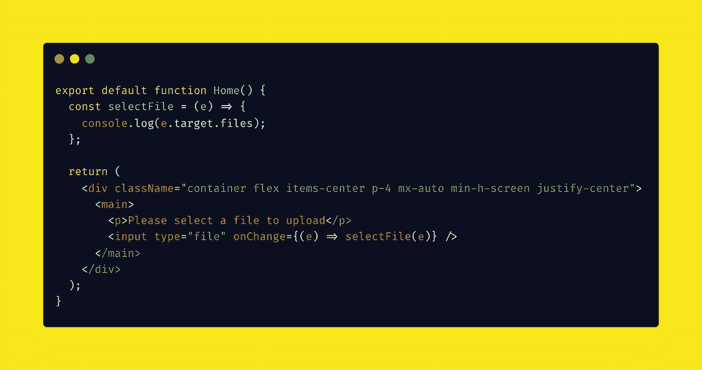

用于创建简单 HTML 输入的代码

如果您是第一次这么做，这就是文件信息在 javascript 中的存储方式。

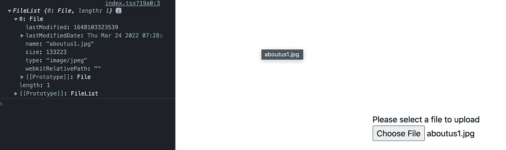

输入类型文件输出信息

让我们把它存放在`useState`吧。

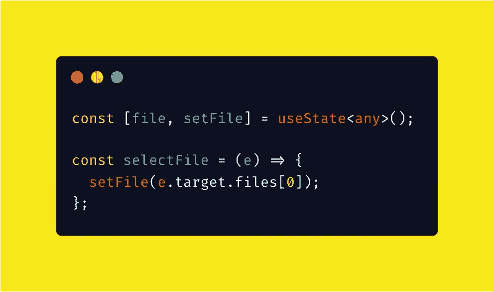

文件使用状态挂钩

## **4。将 AWS 中的 API 密钥存储在. env.local 文件中**

还记得我告诉过你，在前端并没有真正安全的存储环境变量吗？我是认真的。但是由于 Next JS API 是无服务器的，它是我们的后端，我们可以在这里安全地使用它们。任何没有前缀`NEXT_PUBLIC_`的环境变量都不会暴露给浏览器。在. env.local 文件中创建**三个**变量`ACCESS_KEY`、`SECRET_KEY`和桶名:

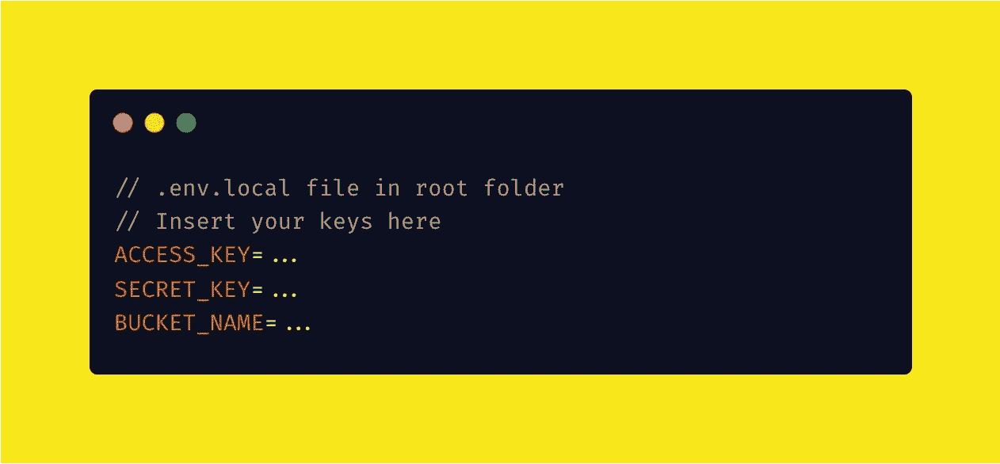

## **5。设置 S3 实例和配置属性**

重要的事情先来。您必须导入 S3 并创建它的一个新实例。如您所见，属性是不言自明的，您必须指定一个区域，传递一个访问密钥和秘密密钥，以及我们将设置为 v4 的签名版本。在 NextJS 中，如果你想指定任何不同于默认的主体解析属性，你可以在你必须导出的配置变量中这样做。我们将最大上传文件大小设置为 8mb。

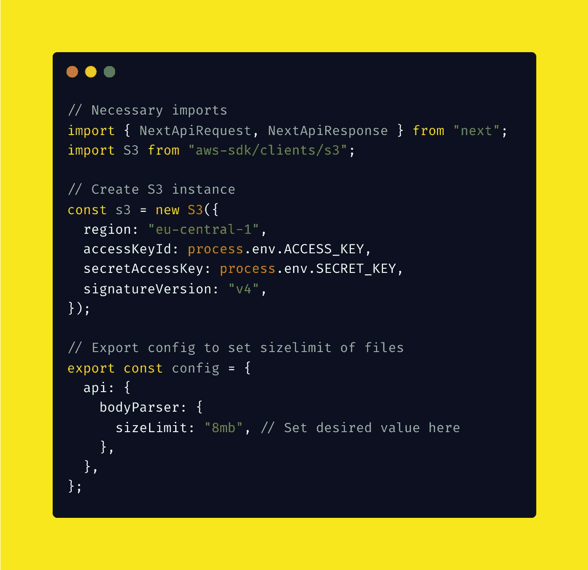

创建 S3 实例并导出配置

## 6。创建一个 API 路由逻辑

首先，我们排除除 POST 之外的任何其他 HTTP 方法，然后我们创建 s3 所需的文件参数来为我们生成一个 signedUrl。如你所见，需要一些选项。在 POST 主体中，我们发送一个名称和我们想要上传的文件的类型。我们还将“expires”时间设置为 600 秒，并将 ACL 设置为“public-read ”,这将使该资产可以公开访问。

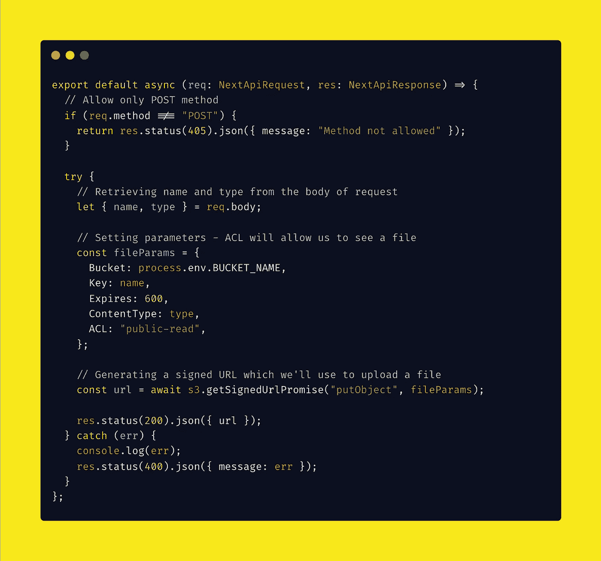

API 端点配置

## **7。上传文件到 AWS S3 桶**

*提示:如果您已经添加了您的。env 变量用 yarn dev 启动一个应用程序后，记得重启它，因为 env 变量是在应用程序启动时获取的。*

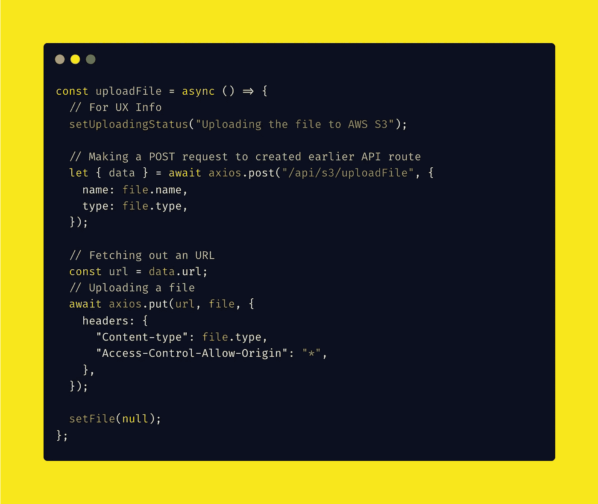

上传文件并使用先前创建的 API 端点

我们首先利用先前创建的`uploadFile`端点，向其发送所选文件的名称和类型。然后我们获取允许我们上传文件到 AWS 的 URL。网址看起来像下面的截图。之后，我们向接收到的 URL 发送一个包含文件的 PUT 请求。

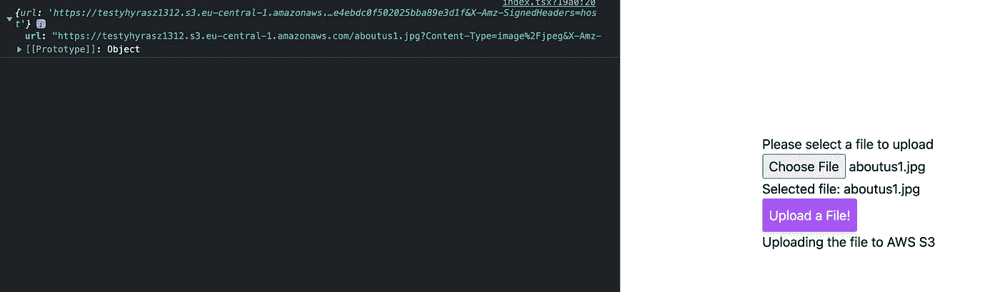

我们从 API 端点收到的已签名 URL 的示例

在 URL 中的部分直到。com/"是您的存储桶 URL。如果您想以后访问它，您可以复制它并将其存储在某个地方。

## **8。在您的存储桶中查看上传的文件**

现在，您应该可以在桶中看到新添加的文件。我们到此为止。

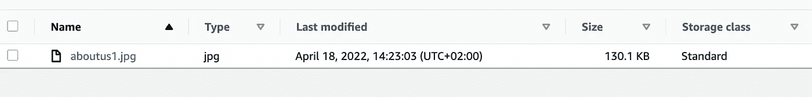

已成功上传桶中的文件

如果你想在 HTML 中显示一个图像，你可以这样做

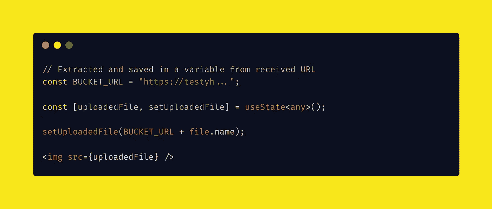

显示保存的图像

# 摘要

在本文中，您了解了如何创建一个 AWS 帐户，以及如何与 IAM 用户一起创建一个 S3 bucket。现在，您还可以创建 NextJS 应用程序，它将提供将文件上传到您的 bucket 并显示结果的功能。

如果您想获得一个代码，可以从以下网址获得:

[](https://github.com/kolberszymon/NextJS-AWSS3) [## GitHub-kolberszymon/NextJS-AWS S3

### 此时您不能执行该操作。您已使用另一个标签页或窗口登录。您已在另一个选项卡中注销，或者…

github.com](https://github.com/kolberszymon/NextJS-AWSS3)