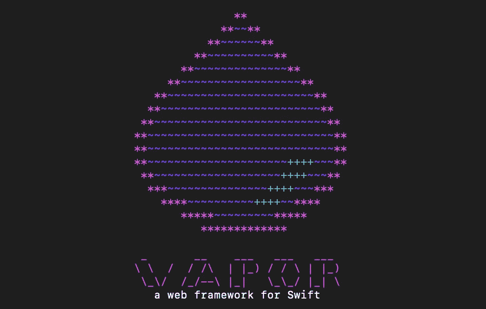
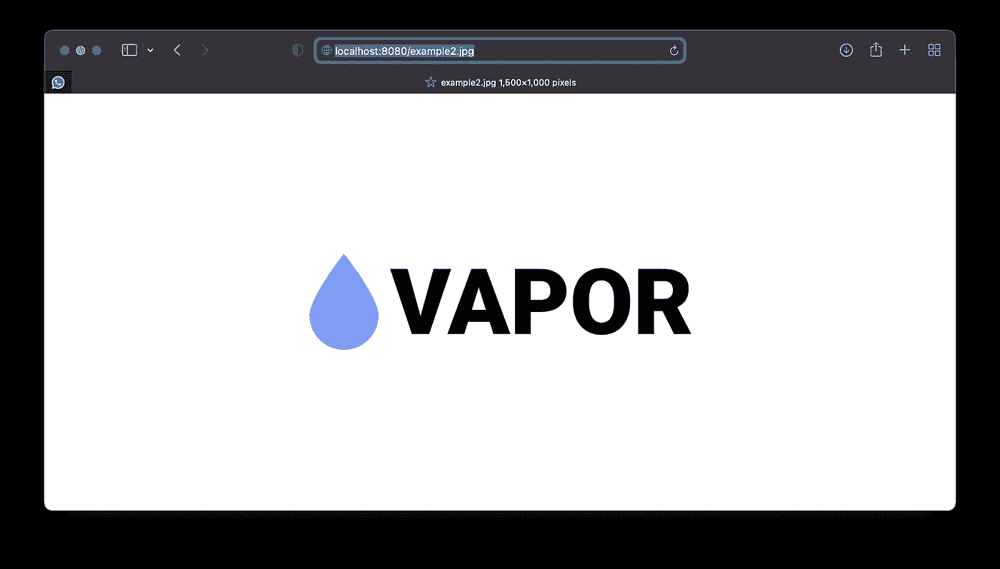

# 如何用 Vapor 4 上传、存储和提供图像

> 原文：<https://betterprogramming.pub/how-to-upload-images-store-them-and-serve-them-with-vapor-4-6d2f12cee62f>

## 展开待办事项应用程序，将图像链接到特定的待办事项列表



# 介绍

在过去的几周里，我一直在研究和分享关于 Vapor 4 及其功能的文章。我从一个简单的项目结构和 API 定义开始:

[](/getting-started-with-vapor-4-part-1-3d731e64fb45) [## Vapor 4 入门—在 Swift 中构建一个基本的 Todo 应用程序

### 了解这一以 Swift 编写的服务器优先工具的基础知识(不那么基础)

better 编程. pub](/getting-started-with-vapor-4-part-1-3d731e64fb45) 

并以此为基础来解释 DB 模型关系:

[](/getting-started-with-vapor-4-model-relationships-e6e73d6c2412) [## Vapor 4 入门—模型关系

### 扩展待办事项应用程序，了解这一以 Swift 编写的服务器优先工具的更多高级功能

better 编程. pub](/getting-started-with-vapor-4-model-relationships-e6e73d6c2412) 

在本文中，我们将对原始项目进行扩展，并学习如何上传图像、存储图像和提供图像服务。最后，我将提到一些我在研究中没有提到的其他有趣的特性。如果你迷路了，你可以在这里查看最终项目:

[https://github.com/fermoya/vapor-tutorial](https://github.com/fermoya/vapor-tutorial)

# 将图像上传到 Vapor

我们在这里的目标是创建一个新的端点`/todo-lists/<id>/upload-image`，它将接受一个带有图像的`multipart`表单。让我们首先创建端点。转到`TodoListViewController.boot(routes:)`方法并创建一条新路线:

```
func boot(routes: RoutesBuilder) throws {
  ...
  let singleListRoutes = ...
  singleListRoutes.get("upload-image", use: uploadImage)
}private func uploadImage(req: Request) throws -> EventLoopFuture<Response> {
  ...
}
```

现在，我们需要做的就是提取图像数据，但我们如何做呢？一旦我们有了文件，我们如何存储和提供它？

为此，我们可以利用`FileMiddleware`。一个`Middleware`只是一个类，它让你在传入的`request`到达`route`处理程序之前对其进行处理。你可以把它想象成一个代理。例如，您可以创建自己的回复，让所有回复都添加一个所有回复通用的标题:

出于我们的目的，Vapor 附带了`FileMiddleware`，它允许您从一个公共文件夹向客户提供资产。为了简单起见，我们将使用`workingDirectory`,但理想情况下，您将从特定的公共目录提供文件。

与数据库或迁移类似，任何类型的配置都需要在`configure.swift`内的`configure(_:)`函数中完成:

```
app.middleware.use(FileMiddleware(publicDirectory: app.directory.workingDirectory))
```

此外，我们需要增加请求的`defaultMaxBodySize`:

```
app.routes.defaultMaxBodySize = "10mb"
```

否则，你会得到一个有效载荷过大的错误。现在我们需要做的就是解码来自`request`的图像，并将其存储在服务器上。让我们这样做:

```
// 1.
let file = try req.content.decode(File.self)
let path = req.application.directory.workingDirectory + file.filename// 2.
return req.fileio
  .writeFile(file.data, at: file.filename)// 3.
  .transform(to: Response(status: .accepted))
```

让我们来分解一下:

*   首先，我们从响应中解码出一个`File`。Vapor 附带了这个工具。此外，我们形成了存储文件的路径。
*   接下来，我们使用`fileIO`将文件写入保存到服务器中的一个路径中
*   最后，我们返回一个`accepted`响应

说够了，我们试一试好吗？我下载了一个[样本图像](https://www.hackingwithswift.com/uploads/vapor.png)，然后我可以将它用于我的`TodoList`:

```
$ curl localhost:8080/v1/todo-lists \
    -X POST \
    -H "Content-Type:application/json" \
    --data "{ \"name\": \"Foo\" }"
{"id":"F65B591A-AFE9-4848-AFCB-4FC606002596","name":"Foo"}$ curl localhost:8080/v1/todo-lists/F65B591A-AFE9-4848-AFCB-4FC606002596/upload-image \
    -F filename=example.webp \
    -F data=@/Users/fermoya/Desktop/example.webp \
    -H "Content-Type:multipart/form-data"
```

不错！但是我现在的形象呢？嗯，我们用的文件`path`是`/<working_directory>/<file_name>`。这意味着该文件将在`localhost:8080/<file_name>`下可用:



然而，图像还没有链接到任何`TodoList`！事实上，我们只是存储图像，但如果不保存到我们的`TodoList`模型中，图像就会丢失。

# 将图像链接到我们的模型

目前，`TodoList`还没有准备好保存图像。我们需要向模型中添加一个新字段。如果您还记得以前的文章，这很容易做到:

请注意，我们只是更新了一个现有的表。对于我们的例子来说，这并不是必需的，因为我们使用的是内存数据库，但是对于真正的应用程序来说，您可能需要它。确保仅在`CreateTodoListMigration`中创建表格后才更新表格。

现在，我们只需要更新`/upload-image`实现:

这里有什么新鲜事？

*   首先，我们获取列表，如果`notFound`失败则中止
*   其次，保存图像后更新列表。这与我们在第 1 部分留给读者的一个练习有些关系
*   作为响应返回更新的列表

我们完了！如果您尝试这一次，您应该会得到如下结果:

```
$ curl localhost:8080/v1/todo-lists \
    -X POST \
    -H "Content-Type:application/json" \
    --data "{ \"name\": \"Foo\" }"
{"id":"F65B591A-AFE9-4848-AFCB-4FC606002596","name":"Foo", "imageURL": null}$ curl localhost:8080/v1/todo-lists/F65B591A-AFE9-4848-AFCB-4FC606002596/upload-image \
    -F filename=example.webp \
    -F data=@/Users/fermoya/Desktop/example.webp \
    -H "Content-Type:multipart/form-data" | jq
{
  "id": "F65B591A-AFE9-4848-AFCB-4FC606002596",
  "name": "Foo",
  "imageURL": "127.0.0.1:8080/example.webp"
}
```

这很简洁，尽管在这个实现中有一个很大的缺陷:我们没有真正正确地处理图像，并且如果，比方说，一个同名的图像被上传到一个完全不同的列表，那么覆盖这些改变是相当简单的。

解决这个问题的一个方法是忽略`multipart/form-data`中的`filename`字段，并像`MD5_Hash(#"<uuid>.<timestamp>")`一样编写名称，但是我们将把它留给读者作为练习。

# 从这里去哪里？

由于时间有限，我们在本系列中没有介绍太多特性，但是这些特性值得一提:

*   [Leaf](https://docs.vapor.codes/4.0/leaf/overview/) :我们关注的是 Vapor 的后端，但是框架附带了 Leaf，它可以帮助你将`Swift`转换成动态的`HTML`。这将帮助您创建 web 应用程序的前端。
*   [记录](https://docs.vapor.codes/4.0/logging/):`Request`和`Application`都有一个`logger`属性，有几个跟踪级别:`INFO`、`ERROR`、`DEBUG` …比如`req.logger.debug("Updating list with id \(id)")`
*   高级路由:我们没有涉及的一些事情是:
    –[重定向](https://docs.vapor.codes/4.0/routing/#redirections):例如，一个端点被重命名，您希望简单地重新路由到新的端点。
    –[Catchalls](https://docs.vapor.codes/4.0/routing/#catchall):使用`**`作为动态路线来匹配一个或多个组件，即`/foo/**`响应`/foo/bar`、`/foo/bar/abc`、…然后您可以使用`getCatchall`将其检索为一个数组`String`
    –[查看所有路线](https://docs.vapor.codes/4.0/routing/#viewing-routes):您可以通过`print(app.routes.all)`打印所有注册的路线
*   [HTTP 客户端](https://docs.vapor.codes/4.0/client/):谁说你不需要从你的一个端点发出 HTTP 请求？Vapor 附带了一个易于使用的 HTTP 客户端。
*   [Websockets](https://docs.vapor.codes/4.0/websockets/) :客户端和你的服务器之间的双向通信，比如说一个聊天应用。
*   [队列](https://docs.vapor.codes/4.0/queues/):如果您的端点触发了一些繁重的操作，这非常有用。你可以快速回复客户并安排一个`Job`。一个非常常见的例子是需要发送电子邮件的`reset-password`端点。
*   [服务](https://docs.vapor.codes/4.0/services/):在多个端点重用代码或使用第三方库时，它们会派上用场。
*   [APNS:](https://docs.vapor.codes/4.0/apns/)Swift 开发的 Vapor 很可能是为使用过 iOS/macOS 的人设计的，它使支持苹果通知变得很容易。