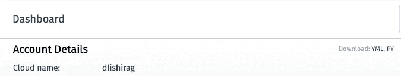

# 如何将图像上传到 Rails API——并再次取回它们

> 原文：<https://betterprogramming.pub/how-to-upload-images-to-a-rails-api-and-get-them-back-again-b7b3e1106a13>

## 有了 Rails API，图片上传并不像看起来那么简单


亚历山大·安德鲁斯在 [Unsplash](https://unsplash.com/s/photos/image?utm_source=unsplash&utm_medium=referral&utm_content=creditCopyText) 上的照片

我给自己一周的时间为 Supagram 编写 Rails API 后端，supa gram 是一个轻量级的基于浏览器的 Instagram 克隆，提供帖子、赞和你关注的用户按时间顺序排列的活动提要。

我预见到的最大困难是处于不同角色的用户之间的多态数据库关系，如追随者、被追随者、喜欢者等等。我一点也不知道，最不直观的工作实际上是围绕着 Instagram 的简单概念:图片上传。

让我带你解决这个问题。该服务器需要:

*   接受来自 React 前端的图像文件
*   将图像与数据库中新创建的帖子记录相关联
*   将图像上传到 Cloudinary 或 AWS 等内容交付网络进行存储和检索
*   获取图像 URL 并将其作为帖子创建的确认返回，并在后续的 GET 请求中返回给活动提要

关于如何做到这一点的现有资源极其分散。对于 Rails API 的具体环境，需要进行大量的推断或临时拼凑。这里有一个明确的、一步一步的指导来帮你减轻痛苦。

# 1.接受来自 JavaScript 前端的图像

将图像上传发送到服务器有两种常见方式:作为 FormData 或 base64 字符串。base64 编码和传输有相当大的性能缺点，所以我选择了 FormData。

我将使用 React 组件来演示，但是 FormData 是一个 web API——它不受任何特定框架的约束，甚至不受 JavaScript 本身的约束。

这里，一个简单的 HTML 表单接受一个标题和一张图片进行上传。字段的名称应该与您的 API 端点期望接收的参数相匹配，在本例中是`caption`和`image`。

在提交时，我们阻止默认的表单行为(刷新页面),并使用 JavaScript 的 FormData 构造函数从`event.target`创建一个 FormData 对象——整个表单。

完成后，我们第一次调用 API:

关于这个请求的配置对象，有两件重要的事情需要注意:

*   标题中没有`"Content-Type"`键—内容类型是`multipart/form-data`，这是由 FormData 对象本身隐含的。
*   尸体没有纤维化。FormData API 处理要通过 web 发送的图像的所有必要处理。

授权头是可选的，将取决于您发布到的端点的要求。在这个例子中，我使用的端点由`POSTS_URL`表示。

# 2.将图像与数据库中新创建的帖子记录相关联

在后端，我使用 ActiveStorage 在图像和它们所属的对象之间创建关联。从 Rails 5.2 开始，它就是文件关联的标准瑰宝，并逐渐取代了 CarrierWave 和 Paperclip 等旧解决方案。

要开始，只需运行`rails active_storage:install`。它将为数据库中的两个新表创建迁移，`active_storage_blobs`和`active_storage_attachments`。这些是自动管理的；你不需要碰它们。运行`rails db:migrate`来完成这个过程。

默认情况下，在开发环境中运行时，ActiveStorage 将使用本地存储来存储上传的文件。在生产中，这几乎肯定不是您想要的。这也为从服务器返回图像 URL 带来了一些独特的挑战。在第三部分中，我们将在查看我们的 Post 模型和附带的端点之后对此进行适当的配置。

## 迁移后/模型

为我的 post 模型研究这个迁移。这件事有点奇怪。

你会注意到这里没有任何关于图像的东西。图像和对图像的引用都不存在于 Posts 表中。

现在来看看这个模型:

这里的本质线是`has_one_attached :image`。这告诉 ActiveStorage 将一个文件与给定的 Post 实例相关联。

附加对象的名称应该与前端发送的参数相匹配。我将它命名为`:image`，因为我将相应的上传表单字段命名为 T6。你爱怎么叫就怎么叫，只要前端和后端一致。

作为奖励，我添加了验证功能，以确保没有图片的帖子无法创建。改变这一点，以适应您的目的。

好奇`include`语句和我的`get_image_url`方法？在回到这些之前，让我们检查一下创建后端点。

## 创建后端点

在这里，`post_params`方法可以说是最重要的。来自我们前端的数据以一个 Rails params hash 结束，其主体大致类似于:`{ "caption" => "Great caption", "image" => <FormData> }`。

这个散列的键必须与模型所期望的属性相匹配。

我的特定 post 模型需要一个 user_id，它不是在请求体中发送的，而是从请求头中的一个`Authorization`标记中解码出来的。那是发生在`get_current_user()`的幕后，你不需要担心。

当您将`post_params()`传递给`Post.create()`时，ActiveStorage 开始工作，根据包含在`image`参数中的表单数据保存一个文件，并将该文件与新的 Post 记录相关联。如果您使用本地存储，图像将默认保存在`root/storage`中。然而，那很可能不是你想要的。

# 3.将图像上传到 CDN 进行存储和检索

本地存储占用空间，无法与 Cloudinary 和 AWS 等专用内容交付网络的交付速度竞争。无论你的目的是什么，让自己熟悉这些基本服务都是一个好主意。

Cloudinary 非常用户友好，并且易于与 ActiveStorage 集成，所以这是我在这个项目中采用的方法。从现在开始，我假设你已经有了一个(免费的)Cloudinary 帐户。如果你更喜欢使用另一种服务，不要担心——这种方法对所有主要的提供商来说基本上都是一样的。

首先，将`cloudinary` gem 添加到您的 gem 文件并运行`bundle install`。

然后，在`/config`中，打开 ActiveRecord 的`storage.yml`配置文件并添加以下内容。其他不要修改。

接下来，导航到`config/environments/development.rb`和`./production.rb`，并分别将`config.active_storage.service`设置为`:cloudinary`。默认情况下，您的测试环境将继续使用本地存储。

最后，从您的 Cloudinary 仪表板下载`cloudinary.yml`配置文件，并将其放在`/config`文件夹中。



在您的仪表板帐户详细信息部分的右上角找到 YML 下载链接。

**注意**:此文件包含您的 Cloudinary 帐户的密钥。不要分享这个文件或把它推给你的 git repo，否则你的帐户可能会受到威胁。将`/config/cloudinary.yml`包含在您的`.gitignore`文件中。如果您不小心泄露了这些细节(我是凭经验说的)，请立即停用泄露的密钥，并通过您的 Cloudinary 仪表板生成一个新的密钥。更新`cloudinary.yml`以反映新的密钥。

这样，ActiveStorage 将自动从云中上传和检索图像。

# 4.获取图像 URL 并返回它

这是使用 ActiveStorage 最不直观的部分。获取图像非常容易。在没有指导的情况下让他们再次出来就像喝醉了解 12 面魔方一样。

如果像我一样，希望将构建端点响应的逻辑转移到专用的序列化程序类中，这将变得特别复杂。

在我的 post 控制器`respond_to_post()`方法中，我首先检查新的 post 是否有效，如果有效，从新的 post 和当前用户创建一个实例 PostSerializer，并使用序列化器的`serialize_new_post()` 方法呈现 JSON。

在 PostSerializer 中，我收集了关于帖子的详细信息，包括将最终用户重定向到 Cloudinary 托管的图像的 URL。如果显式地将实例变量`@post`传递给实例方法`serialize_post`看起来很奇怪，请忽略它——这是与本文无关的其他 PostSerializer 函数的要求。如果你好奇的话，完整的源代码在这里。同样，`serialize_user_details`方法的内容也不重要。

但是`post.get_image_url()`到底是如何工作的，它从何而来？

这是我在帖子模型本身上定义的方法，图片 URL 是帖子的伪属性。对我来说，帖子应该知道它的图片 URL 是有意义的。

为了访问 ActiveStorage 为每个图像创建的 URL，我们使用 Rails 的`url_for()`方法。但是有一个障碍:模特通常不能使用 Rails 的`url_helpers`。有必要`include Rails.application.routes.url_helpers`在班里排在前面才能用。

如果您试图在这个阶段从前端访问您的端点，您可能会在后端看到以下错误:

```
ArgumentError (Missing host to link to! Please provide the :host parameter, set default_url_options[:host], or set :only_path to true)
```

要解决这个问题，导航到`config/environments/development.rb`并添加`Rails.application.routes.default_url_options = { host: "http://localhost:3000" }`(或者您的首选开发端口，如果不是 3000 的话)。在`./production.rb`中，使用您的生产服务器的 web 根目录作为主机值，执行相同的操作。

如果一切正常，您的端点现在将返回包含图像链接的格式精美的 JSON。当点击或加载时，它会重定向到您的云托管的图像。

提交工作，推到 Github，松一口气。