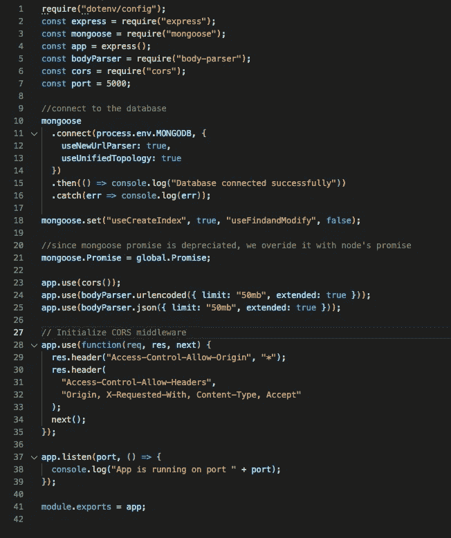
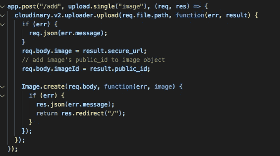
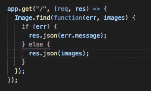
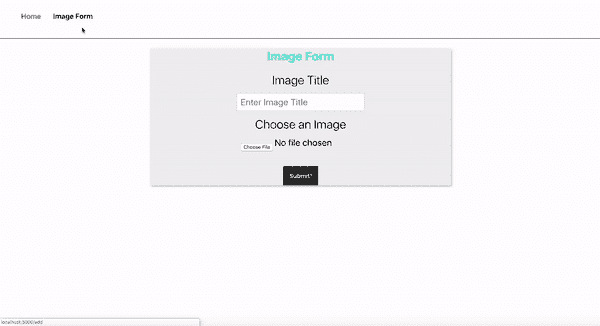

# 如何用 Cloudinary 和 MERN 上传图片，第 2 部分

> 原文：<https://betterprogramming.pub/how-to-upload-images-with-cloudinary-and-mern-part-2-83f8ee31b903>

## 设置后端


Jason Blackeye 在 [Unsplash](https://unsplash.com/s/photos/clouds?utm_source=unsplash&utm_medium=referral&utm_content=creditCopyText) 上拍摄的照片

在[第 1 部分](https://medium.com/better-programming/image-upload-with-cloudinary-mern-f18812d5d023)中，我们学习了如何设置上传图像的前端。现在我们可以开始设置我们的后端了。转到应用程序的主目录，在终端中输入以下命令:

```
mkdir back-end && cd back-end
```

在后端文件夹中，输入命令`npm init`并填写适当的字段。当到达入口点部分时，确保输入 *server.js* 。这是我们将用作后端服务器访问点的文件。你可以给它起任何你喜欢的名字。

由于这是一个 MERN 应用程序，我们将使用 MongoDB 作为我们的数据库。如果你还没有创建账户，你可以去 www.mlab.com 注册一个免费账户。选择沙箱(免费)作为计划类型。然后选择 Amazon Web Services 作为提供商，并选择您所在的地区。或者，我相信如果你以前没有注册 mlab 帐户，你现在可以使用[https://www.mongodb.com/cloud/atlas](https://www.mongodb.com/cloud/atlas)。这几乎是同样的事情，所以遵循相同的步骤。

现在让我们安装我们需要的其余库。确保您在后端文件夹中，然后输入以下命令:

```
npm install cloudinary multer express dotenv mongoose body-parser nodemon --save
```

首先，让我们将下面的代码添加到我们的`package.json`中来配置 nodemon。将它添加到脚本部分。

```
“start”: “node server.js”,“dev”: “nodemon server.js”
```

现在保存文件。

Nodemon 是一个让我们更容易保持服务器运行的包。每当我们保存一个文件，服务器就会重新加载，而不需要我们通过点击“CTRL + C”来手动重新加载服务器

现在让我们建立我们的`server.js`文件。确保您在后端文件夹中，并创建一个`server.js`文件。在您的`server.js`文件中包含以下代码:



server.js

现在让我们连接后端文件夹中的数据库。创建一个`.env`文件。这是一个环境变量文件，用来存储我们的敏感信息。这里我们将存储我们的 MongoDB URL。另外，需要注意的一点是，您必须从`dbuser`和`dbpassword`中删除<和>，否则当您输入自己的凭证时，它将无法连接。您还需要为数据库创建一个用户，该用户不是您创建的用于登录 mlab 或 MongoDB atlas 的用户名。

```
MONGODB = mongodb://<dbuser>:<dbpassword>[@ds217438.mlab.com](mailto:lawrence12@ds217438.mlab.com):17438/cloudinary-example
```

# 模型

让我们快速添加我们的猫鼬模型。对于这个例子，我们只需要三个字段:标题、图像和 ImageID。他们将有一个类型的*字符串*。Cloudinary 将自动填充 ImageID 和 Image 字段，一旦我们设置了发布路径，您就会看到这一点。不要忘记在`server.js`文件中包含您的模型，这样我们可以在稍后的发布路径中访问该模型。下面是我的模型文件的样子:


imageModel.js

# 配置 Multer 和 Cloudinary

现在，我们可以继续设置我们安装的 Multer 库和 Cloudinary。首先让我们将 Cloudinary API 密钥和 API 秘密添加到我们的`.env`文件中。你的`.env`文件现在应该是这样的。

```
MONGODB = mongodb://<dbuser>:<dbpassword>[@ds217438.mlab.com](mailto:lawrence12@ds217438.mlab.com):17438/cloudinary-example
CLOUDINARY_API_KEY = YOUR API KEY
CLOUDINARY_API_SECRET = YOUR API SECRET
```

现在将下面的代码添加到 Multer 和 Cloudinary 的`server.js`文件中。将变量放在文件的顶部也是一种惯例。

```
//IMAGE UPLOAD CONFIGURATIONconst multer = require(“multer”);const storage = multer.diskStorage({filename: function(req, file, callback) {callback(null, Date.now() + file.originalname);}});const imageFilter = function(req, file, cb) {// accept image files onlyif (!file.originalname.match(/\.(jpg|jpeg|png|gif)$/i)) {return cb(new Error(“Only image files are accepted!”), false);}cb(null, true);};const upload = multer({ storage: storage, fileFilter: imageFilter });const cloudinary = require(“cloudinary”);cloudinary.config({cloud_name: “lthomas92”, //ENTER YOUR CLOUDINARY NAMEapi_key: process.env.CLOUDINARY_API_KEY, // THIS IS COMING FROM CLOUDINARY WHICH WE SAVED FROM EARLIERapi_secret: process.env.CLOUDINARY_API_SECRET // ALSO COMING FROM CLOUDINARY WHICH WE SAVED EARLIER});
```

# **路线**

让我们完成我们的`server.js`文件，继续添加我们的路线。在一个较大的应用程序中，我们通常会将它分解到一个 routes 文件夹中，并将我们不同的路线存储在那里。我们还将在这些文件中使用快速路由器。但是，因为我们保持简单，我们可以将我们的路线存储在`server.js`文件中。先说邮政路线。



我认为，关于这条路线，最具挑战性的部分是理解为什么有时`req.file.path`可能会返回类似“路径未定义”的错误，这导致我在许多场合都感到紧张。这通常是由两个原因造成的。首先，`upload.single`需要与您在客户端表单中输入的名称相同。否则，它将返回一个错误。此外，很多时候很容易忘记 React 中的`encType=multipart/form-data`或 HTML 中的`enctype=multipart/form-data`。这必须作为属性包含在您的表单中，否则您将无法提交图像。`BodyParser`替我们打理文字输入，但不能处理图像，这就是为什么我们需要使用 Cloudinary 和 Multer。

`Image.create` 中的图片使用的是我们之前创建的猫鼬模型。它在我们的 MongoDB 数据库中创建一个对象，该对象将存储 Title、Image 和 ImageID 的值。MongoDB 还会自动给我们分配一个唯一的 id。

下一条路线很简单。这将是一条简单的路线。



现在我们都完成了我们的后端。检查 GitHub 中的`full server.js`代码，以确保没有任何错误。

# 完整的申请

这是我们填好的申请表！



感谢阅读！我希望这个教程是有帮助的。如有疑问，欢迎留言评论。我会尽力帮忙的！

在 [GitHub 上找到代码](https://github.com/LThomas92/cloudinary-example)