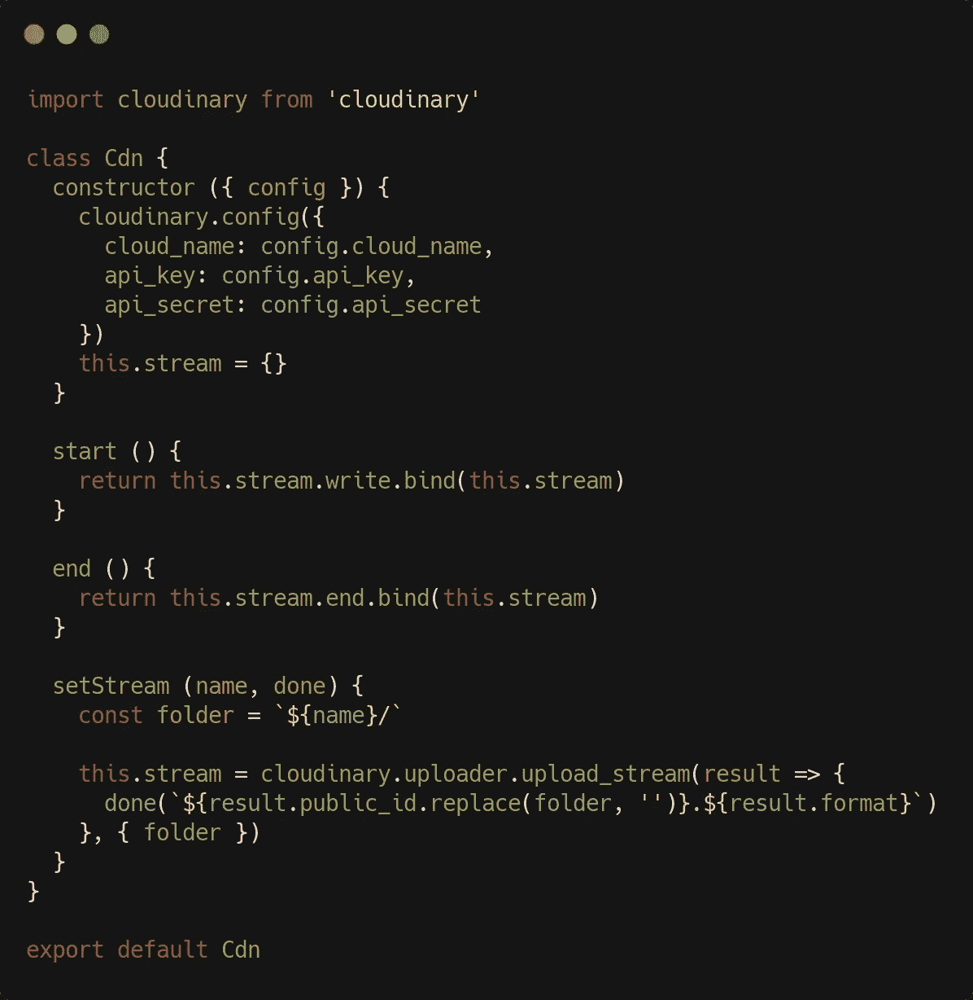
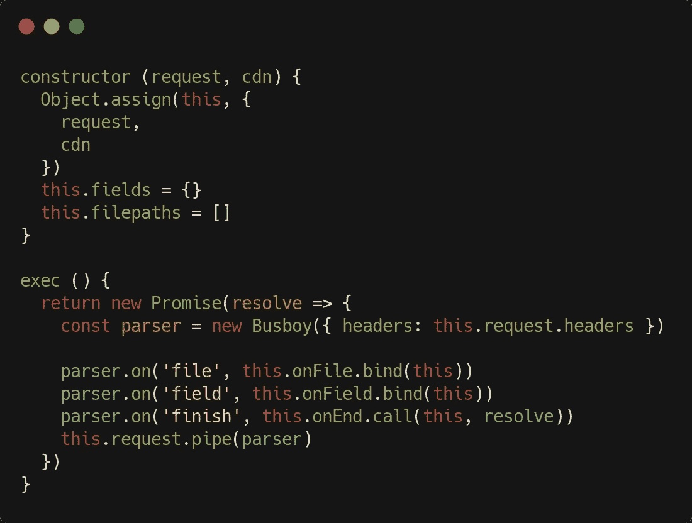
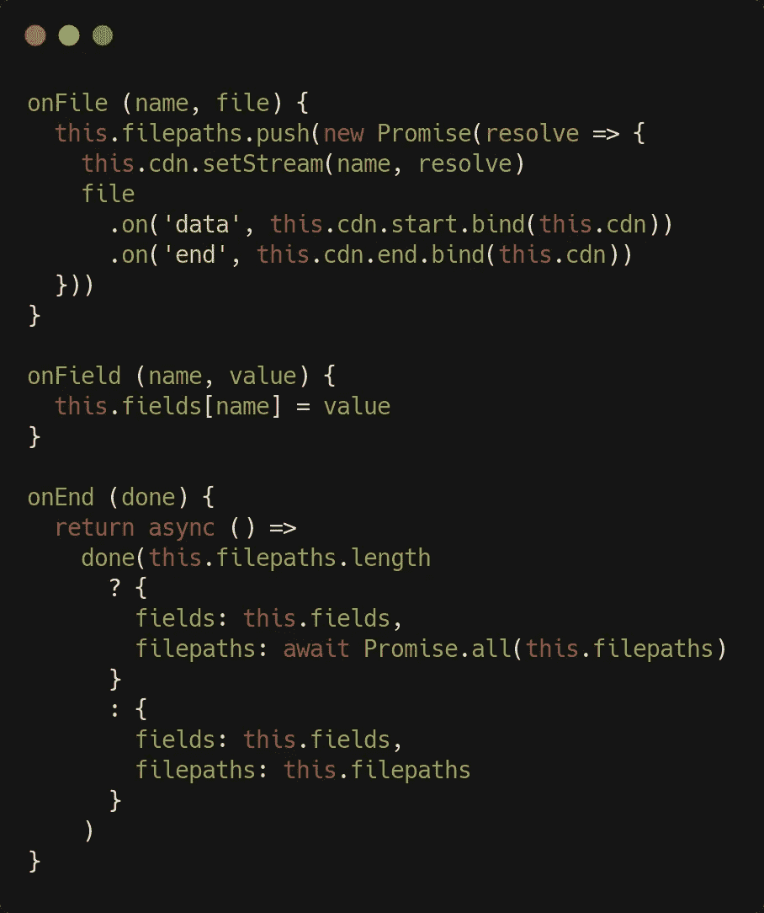
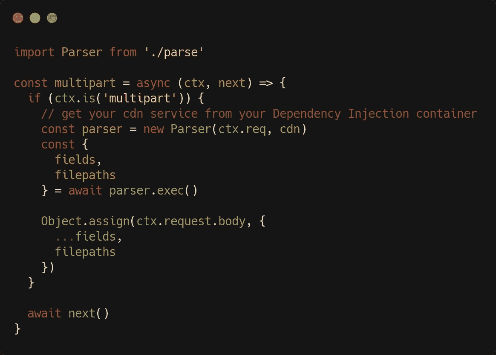

# 如何在 Node.js 服务器上上传媒体和处理多部分表单

> 原文：<https://betterprogramming.pub/how-to-upload-media-and-process-multipart-forms-on-node-js-server-cf483af5afa7>

## 高效上传图像和其他文件


我们上传吧！[范伟恩](https://unsplash.com/@vnwayne?utm_source=medium&utm_medium=referral)在 [Unsplash](https://unsplash.com?utm_source=medium&utm_medium=referral) 上的照片

因此，您有一个前端应用程序与后端通信，并且您需要在处理元数据之前将媒体上传到 CDN 提供商？太好了，我们将在 [Node.js](https://nodejs.org/en/) 下看看如何在考虑重用和灵活性的情况下做到这一点。

我们将介绍如何编写服务器端 CDN 服务，抽象出 CDN 提供者 API，以及多部分表单数据解析服务。我们还将简要地处理客户端代码。

这是我的“用 JavaScript 解决现实生活中的问题”系列的第二部分。第一部分是关于 WebSockets 的。

# 背景

我们将使用 CDN 提供商 API。我选择了 [**Cloudinary**](https://github.com/cloudinary/cloudinary_npm) ，它是一个很棒的工具，具有许多功能，一个慷慨的自由层，以及一个用于 Node.js 的 npm 包，对于解析 HTML 表单数据，我们将依靠优秀的 [**busboy**](https://github.com/mscdex/busboy) 库来完成底层工作。

现在，我们的目标是编写抽象这些工具的可重用服务(因此，如果您需要切换到另一个 CDN 提供商 API，您只需编辑 CDN 服务)，这样我们就可以在我们选择的服务器上使用服务器端。

# 设置 CDN 服务

CDN 服务将实现三个方法:`start`、`end`和`setStream`，它接受两个参数:一个文件夹名和一个回调。下面是完整的代码:



参见[要点](https://gist.github.com/iperiago/3d1a5ebe888ed98c617319064a726e5c#file-cdn-js)

当然，你需要在你的构造函数中注入一个`config`对象，并带有所需的 Cloudinary 配置参数(参见他们的[文档](https://cloudinary.com/documentation/image_upload_api_reference))。

上面的代码非常简单，但是依赖于 Cloudinary 的 API 自己的方法。请注意，我们在`setStream`方法中的回调是用一个专门构造的文件名调用的——在调用了 Cloudinary 的`uploader.upload_stream`方法*之后，它利用了 cloud inary 的 API 提供的`result` 对象。*

`result`对象的`public_id`属性具有以下形式:`[folder]/id`，因此我们通过仅保留`id`并添加媒体格式来构建文件名。

该文件名将在我们的应用程序中使用，例如，保存在数据库中。当然，通过向`setStream`方法提供额外的参数，您可以选择以完全不同的方式构建文件名。

# 设置解析器服务

既然我们已经抽象出了与 CDN 提供商通信的代码，我们可以在解析服务中使用它，作为一个依赖项。事实上，我鼓励您在服务中使用依赖注入(DI)机制。

因此，我们的解析服务的核心将具有以下代码:



参见[要点](https://gist.github.com/iperiago/3d1a5ebe888ed98c617319064a726e5c#file-parse-js)

我们的解析器属性是:请求(注入的)、我们的 CDN 服务(注入的)、文件路径(将通过我们的 CDN 服务获得)，以及伴随媒体的 HTML 表单的任何其他字段。

`exec`方法是基于承诺的。它用请求头调用 busboy，并设置一系列事件和事件处理程序。然后它通过管道将 busboy 解析器传递给请求。更多信息请参考[勤杂工文档](https://github.com/mscdex/busboy)。

现在事件处理程序如下:



参见[要点](https://gist.github.com/iperiago/3d1a5ebe888ed98c617319064a726e5c#file-parse-js)

`onFile`处理程序接受两个参数:`name`，它是媒体文件的字段名(在客户端，我们将该名称设置为 Cloudinary 文件夹，详见下文)，以及`file`，它是实际的媒体文件。

然后，该方法向服务`filepaths`数组添加一个新条目，这允许我们一次进行多次上传，只要有从 HTML 表单数据解析的文件。这个条目是一个等待文件上传时解决的承诺。

我们在这里使用了所有的 CDN 服务方法:`setStream`来设置上传及其结果格式(见上文:这将是我们专门构造的文件名)，然后`start`和`end`作为文件上传生命周期中的事件处理程序。

表单数据也可以包含由`onField`方法处理的常规字段。

最后，当解析完成时，我们可以解析我们的文件路径的所有承诺。这是`onEnd`方法的工作，它本身必须是异步的，因此返回一个承诺。这个过程解析了解析服务`exec`方法的包装承诺，结果是一个包含所有常规字段和所有文件路径(这里是我们的文件名)的对象。

由于整个过程涉及多个承诺，代码可能很难一目了然。但是一旦你理解了流程，你会发现它实际上非常简单。

完整的解析服务代码可以在本[概要](https://gist.github.com/iperiago/3d1a5ebe888ed98c617319064a726e5c#file-parse-js)中获得。

# 绑起来

所以我们现在有了解析服务，它本身使用我们的 CDN 服务。当收到一个新的多部分表单请求时，我们如何调用前者？当然，这取决于您使用的服务器框架，但是从一个框架适应另一个框架应该不成问题，所以我将使用 [**Koa**](https://koajs.com) 作为例子。我们可以这样编写多部分的 Koa 中间件:



参见[要点](https://gist.github.com/iperiago/3d1a5ebe888ed98c617319064a726e5c#file-multipart-js)

如果我们有一个多部分请求(Koa 提供了一种简便的检查方法)，我们只需用请求和我们的 CDN 服务实例化我们的解析器，然后等待解析器的`exec`方法进行解析。

然后，我们将结果字段和文件路径分配给请求体，这样就可以在控制器中处理路由了。该过程确保媒体已经上传，并且我们已经为它们获得了有效的文件路径。我们现在可以使用添加了信息的路由，例如，在数据库中保存每次上传的字段和文件路径。不过，剩下的过程由您来完成，因为这超出了本文的范围。

# 客户端设置

在客户端，基本上您所要做的就是发送一个多方请求。作为一个使用 Vue.js 和 [Quasar framework 的上传组件](https://quasar.dev/vue-components/uploader)的快速示例，您将编写:

```
<q-uploader :factory="uploader" multiple />
```

在最基本的层面上，您的 uploader 方法的 canva 将如下所示(假设我们在这里的`profile_pictures`文件夹中上传):

```
async uploader (files) {
  const data = new FormData() files.forEach(file => data.append(‘profile_pictures’, file)) // Add regular fields if needed then send the request
}
```

# 结论

当然，所有这些都可以在许多方面得到很大的改进——添加日志记录，一旦上传完成就从 CDN 提供商那里获得更多信息，等等。我故意省略了一些实现细节，特别是在客户端和 HTTP 服务器级别，主要是因为我想关注可以在许多不同上下文中使用的可重用服务。另外，因为我觉得如果你自己去做，会更有学习价值。

所以，我猜…编码快乐！