# 如何在 ARKit 和 SceneKit 应用程序中使用 SwiftUI 视图

> 原文：<https://betterprogramming.pub/how-to-use-a-swiftui-view-in-anarkit-scenekit-app-d6504d7b92d2>

## 将 SwiftUI 引入 AR

奥利维尔·米歇尔在 [Unsplash](https://unsplash.com/s/photos/reality?utm_source=unsplash&utm_medium=referral&utm_content=creditCopyText) 上拍摄的照片

AR 应用程序有很多 3D 元素，苹果公司提供了很好的工具来构建令人敬畏的 AR 应用程序，如 Reality Kit 和 Reality Composer。但是有时候你只需要在屏幕上显示一个简单的 UI。苹果在 2019 年 WWDC 上给了我们 SwiftUI，这是一种在你的应用程序中快速制作 UI 的惊人方法。

在这篇文章中，我们将探讨如何在 ARKit 应用程序中显示 SwiftUI 视图。我们不会在 Reality Kit 应用程序中研究如何做到这一点(也许在未来的帖子中)，但在这篇帖子中，我们将重点关注 SceneKit 作为我们的内容技术。

为了保持简单，我不做一个世界跟踪配置应用程序，而是，我将制作一个具有图像跟踪配置的应用程序，这样我们就可以更专注于显示 SwiftUI 视图。

如果你想探索，请尽一切办法创建一个世界跟踪应用程序，跟踪水平和垂直平面，做一些点击测试，并在你周围的墙上显示你创建的惊人的 SwiftUI 视图。

到本文结束时，你将拥有一个跟踪图像标记并在其上呈现 SwiftUI 视图的应用程序。

让我们开始吧。我使用的是 XCode 版本 11.4。

# 在 XCode 中创建新项目

选择增强现实应用并点击“下一步”。

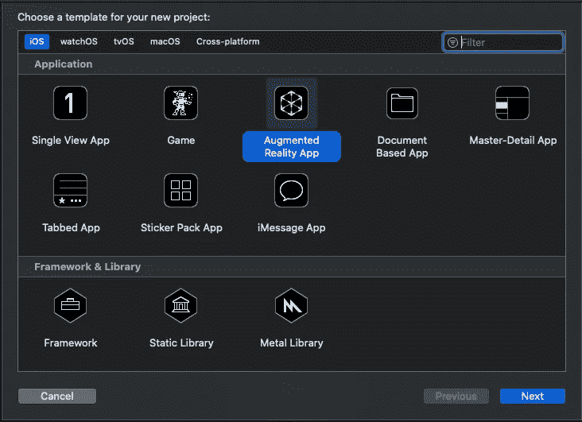

为你的应用程序选择一个名字，或者用我的。确定语言是 **Swift** ，内容技术是 **SceneKit** ，用户界面是**故事板**。如果您的内容技术是 SceneKit，那么在撰写本文时，您只能使用故事板。所以这里没有 SwiftUI。但是不用担心，您仍然可以在项目中使用 SwiftUI，我们将很快对此进行研究。

当我们创建一个新项目时，我们不需要 XCode 给我们的东西，所以让我们去掉一些东西，从头开始。

删除 ship.scn 和 texture.png 文件(右键单击并删除它们)。你不再需要它们了。

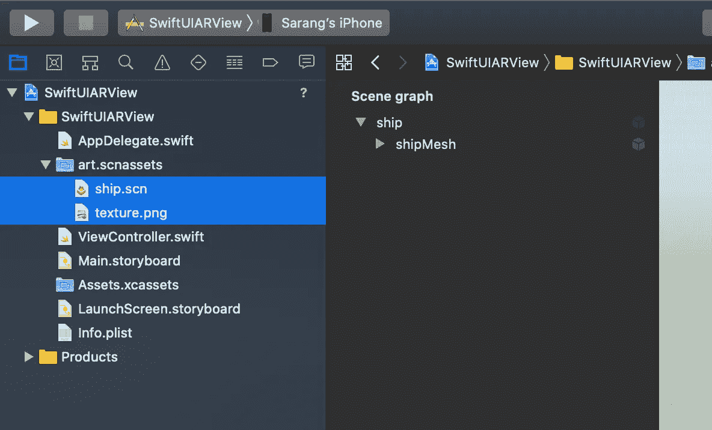

现在打开 ViewController.swift 文件，删除负责显示 ship.scn 文件的几行。您的 viewDidLoad()函数应该如下所示。

这就是我们要做的全部清理工作。现在，让我们跟踪一些图像来展示我们的观点。

# 在 AR 中跟踪图像

首先，我们需要添加一个我们可以跟踪的图像标记。我们有多种方法可以做到这一点:

备选方案 1。下载图像，将其添加到您的 XCode 项目，打印图像，并将其用作标记。

选项 2。使用您已经拥有的图片，使用 Google PhotoScan 等应用程序创建它的扫描，然后将它添加到您的 XCode 项目。

要将图像添加到 XCode 项目中，请打开 Assets.xcassets，右键单击并创建一个新的 AR 资源组。

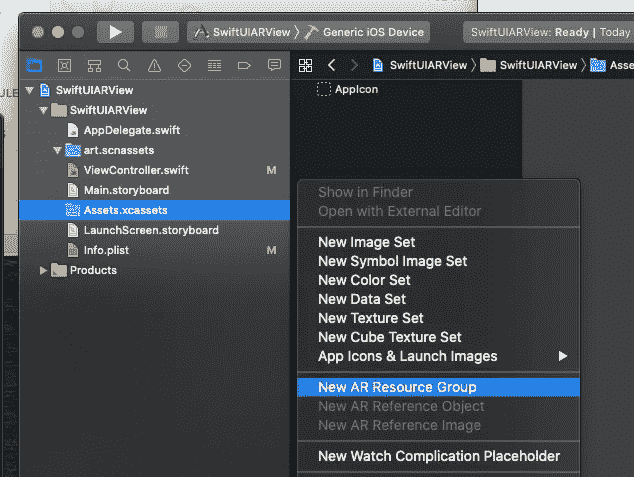

完成之后，您可以复制。png 或者。jpg 文件的图像被跟踪(只需拖放到图像的空间)。它应该看起来像这样。

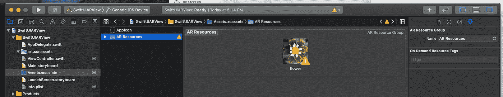

黄色警告标志表示有问题。这个标志基本上是告诉你你的图像是否适合追踪。而且每次你添加一张图片作为 AR 追踪图片，你都需要告诉 XCode 图片的实际物理大小将会是多少。我打印出的图像尺寸为 20 cm X 20 cm，所以我将添加这些尺寸以消除警告。

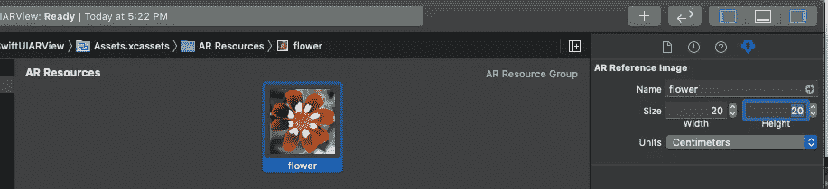

如果 XCode 告诉您的图像不适合跟踪，请尝试找到另一个您可以跟踪的图像。理想情况下，图像应该具有高对比度，并且应该是非对称的。这是为了让 ARKit 在看到图像时知道图像的方向。

*很重要的一点需要注意的是，你需要记下 AR 资源组的* ***名称*** *和镜像的* ***名称*** *。我们需要用代码把它们打出来，所以如果我们打错了，我们的图像就不会被跟踪。*

耶！您已经添加了您的第一张图片！ARKit 允许你同时追踪 100 张图片。所以，喜欢就多加！需要确定的一点是，它们应该被唯一地命名。

好了，现在让我们编写代码来跟踪我们的图像。打开 ViewController.swift，在 viewWillAppear(_ animated: Bool)函数中，将配置从**ARWorldTrackingConfiguration()**更改为**ARImageTrackingConfiguration()**。在这里，您还将让 ARKit 知道它应该跟踪哪个资源组中的图像。AR 资源组的名称应该与空格完全匹配。

您的 viewWillAppear()函数将如下所示。

现在取消对以下函数的注释，因为在这里我们可以告诉我们的应用程序，当它在相机的帧中找到要跟踪的图像时应该做什么:

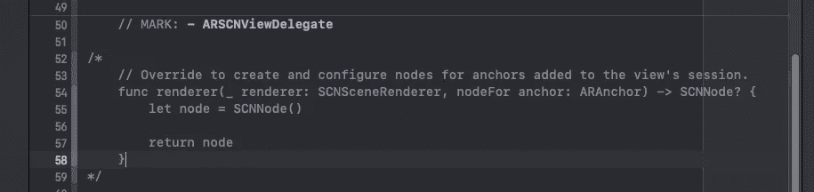

渲染器(_renderer:，锚点的节点:)-> SCNNode？当 ARKit 检测到一个图像(或者您要求会话跟踪的任何 AR 锚点)时，ARSCNView 将调用函数。它返回 3D 空间中检测到的图像的锚点。现在，我们所要做的就是制作一个 SwiftUI 视图，并把它贴在标记的顶部，但是这有点复杂，但是跟我学，很快你就会成为这方面的大师。

上述函数的锚点参数拥有被跟踪图像的所有信息，就像它的名字一样。因为我们知道我们正在跟踪一个图像锚点，所以我们可以将该锚点转换为一个 ARImageAnchor。

*从图像锚点中，我们可以找到被跟踪图像的名称。这将是您在 AR 资源组中指定的图像的名称。*

然后，我们基本上需要在这个函数中执行以下操作:如果 ARKit 找到的图像的名称与您的图像的名称匹配，则创建一个 SCNPlane(平面几何图形),它是找到的锚点的大小，使用这个平面几何图形创建一个新节点，并将这个新创建的平面节点添加为主节点的子节点。

这将使你的函数看起来如下。

我们还没有编写 createHostingController(for node:SCN node)函数，但是我们很快就会编写它。这是我们创建 SwiftUI 视图并将其附加到 SCNNode 的地方。我们将在一个单独的文件中创建 SwiftUI 视图，以便使用 XCode 预览。

# 在跟踪的图像上显示 SwiftUI 视图

唷，太多了。现在，让我们做你该做的事。让我们制作一个 SwiftUI 视图，并将其添加到图像的顶部。为此，我们首先要创建 SwiftUI 视图。

右键单击左窗格中的项目，选择 new file，选择 SwiftUI View，并随意命名。我把它叫做 SwiftUIARCardView。

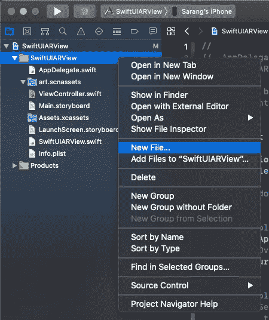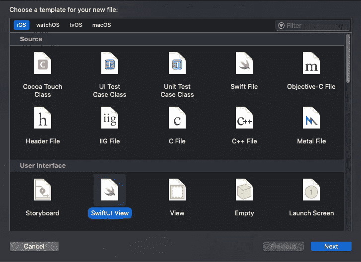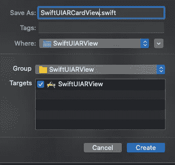

打开新文件，根据需要创建 SwiftUI 文件。在单独的文件中创建它的好处是可以使用 XCode 预览。

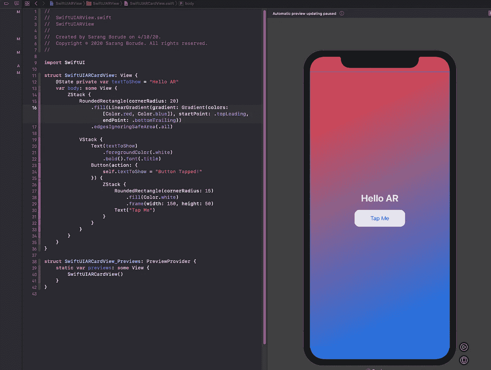

以下是我的 SwiftUIView 的代码。唯一的逻辑是，我有一个显示“Hello AR”文本的状态变量，当我点击按钮时，它会更新。

现在让我们回到 ViewController.swift，完成剩下的部分。

现在我们要做的就是实例化这个视图，然后将它设置为我们之前创建的平面几何体的漫射材质。这是你们期待已久的时刻！

因为我们在一个 UIKit 应用程序中，我们试图创建一个 SwiftUI 视图，我们将不得不使用一个 **UIHostingController** 。

苹果公司令人敬畏的工程师们做得非常好，所以你可以一起使用 SwiftUI 和 UIKit 代码。 **UIHostingController 基本上可以让你在 UIKit app** 中创建一个 SwiftUI 视图。这正是我们所需要的。

我们现在要创建两个函数。

**1。createHostingController(用于节点:SCNNode)**

第一个创建一个托管控制器来托管 SwiftUI 视图，并将其作为子视图添加到我们的主视图控制器中。在这里，我们还设置了视图的框架大小。需要记住的是，你在这里设置的尺寸只是视图的像素分辨率；实际大小将与标记的物理大小相匹配。因此，如果你想让视图实际上更大或更小，那么使用不同的物理图像。

**2 . show(view controller:UIHostingController<SwiftUICardView>，on node: SCNNode)**

该函数将宿主视图控制器的视图设置为平面节点材质的漫反射纹理。这实际上将我们的 SwiftUI 视图放到了图像上。

因此，如果你遵循它是正确的，我们做的步骤如下:

**检测图像- >在图像上放置一个平面几何体- >将平面几何体的材质改为 SwiftUI 视图。**

下面是完成所有这些工作的代码:

最终输出如下所示:

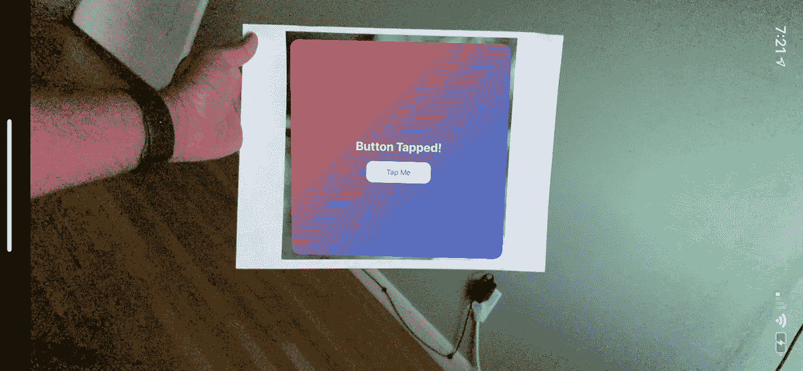

这个项目的代码可以在这里找到:

 [## sarangborude/SwiftUIARView

### 示例 ARKit 应用程序在跟踪的图像上显示 SwiftUI 视图。此报告与此中型文章配套…

github.com](https://github.com/sarangborude/SwiftUIARView.git) 

如果您对在 SceneKit 中显示 SwiftUI 视图感兴趣。可以在这里找到代码。

[https://github.com/sarangborude/SwiftUIViewSCNKit](https://github.com/sarangborude/SwiftUIViewSCNKit)

我希望你喜欢它。如果你是 XR 爱好者，请随时在 twitter [@doomdave](https://twitter.com/doomdave) 上联系。