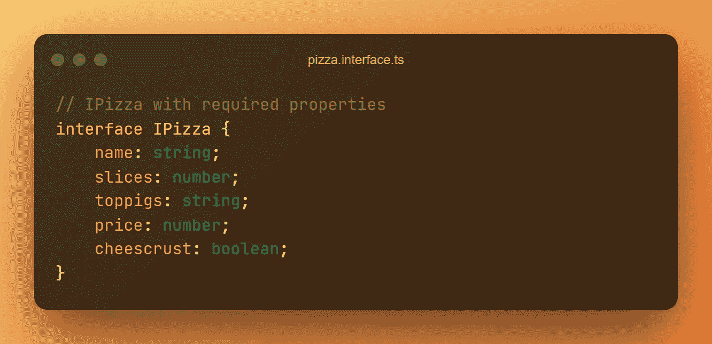
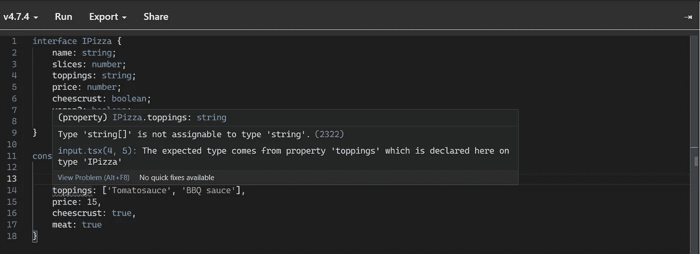

# 如何使用 TypeScript 接口

> 原文：<https://betterprogramming.pub/how-to-use-a-typescript-interface-4cbced319ee2>

## 通过早餐做披萨

作者截图

接口是对象的蓝图。它告诉您有哪些属性，哪些是必需的和可选的，以及它们包含哪种类型的数据。

TypeScript 比以往任何时候都更受欢迎。对我来说，这不是一见钟情，但现在我们联系在一起了。没有 TypeScript 我不会开始一个项目！所以如果你有同样的感受，你并不孤单。

TypeScript 中的大多数模型都是接口和类的组合。一个`interface`是一个类或对象的蓝图。在这个`IPizza`接口中，我们定义了比萨饼的所有属性。在每个属性中，我们定义了信息的数据类型。

在`interface`中定义的每个属性都是必需的。如果你想让它可选，你必须使用`?`。

例如，`propertyName?: string`如果我们在一个接口中定义这个属性，它就是可选的。如果属性在`Object`中丢失，TypeScript 不会给出错误。另一方面，如果一个属性是必需的，那么如果它丢失了，就会给出一个错误。

当一个属性没有在`interface`中定义时，你会从 TypeScript 编译器那里得到一个错误，因为数据与蓝图不符。

# 例子

我们都可以想出披萨的特性。

*   名字
*   切片(切片数量)
*   浇头
*   价格
*   奶酪皮
*   严格的素食主义者
*   素食者

让我们把它们放到接口中，决定它们是什么样的数据类型。

上面的例子为我们的比萨饼显示了一个`interface`。我们给所有的属性一个单一的数据类型。现在我们可以创建我们的 Pizza 对象，并使用接口来确保它具有正确的属性。

现在的`pizza`就是根据界面。`interface`现在是属性验证的一种形式。如果我们添加不在`interface`中的属性或者数据类型错误的属性，TypeScript 会给出错误。

有了这个对象，你会得到错误！👇( [*自己去 CodeSandbox 查一下*](https://codesandbox.io/s/typescript-error-with-wrong-property-information-kdi529?file=/index.ts) )

作者截图

# 多重值

但是如果我们想要一个字符串或数字的数组来给出我们的浇头或大小呢？我们可以很快做到这一点；在`interface`中写入`string[]`或`number[]`。

现在我们的`pizza`对象是有效的。

如果我们想要键入一个包含多个 pizza 对象的数组，我们可以用`IPizza[]`以同样的方式来完成。

# 条件值

有时候，你会说一个属性可以是一个`string`或者一个`null`。在这些情况下，我们使用竖线|来表示两者都是。

例如，`cheescrust`是可选的，但可以是布尔值或空值。

所以对于比萨饼金枪鱼，我们说我们不想提供奶酪皮，所以我们给它一个值`null`。

# 谢谢！

读完这个故事后，我希望你学到了一些新的东西，或者受到启发去创造一些新的东西！🤗

如果我给你留下了问题或一些要说的话作为回应，向下滚动并给我键入一条消息。如果你想保密，请在 Twitter @DevByRayRay 上给我发一条 [DM。我的 DM 永远是开放的😁](https://twitter.com/@devbyrayray)

[**通过电子邮件获取我的文章点击这里**](https://byrayray.medium.com/subscribe) **|** [**购买 5 美元中等会员**](https://byrayray.medium.com/membership)

# 阅读更多

[雷雷](https://byrayray.medium.com/?source=post_page-----4cbced319ee2--------------------------------)

## 最新的 JavaScript 和 TypeScript 故事

[View list](https://byrayray.medium.com/list/latest-javascript-typescript-stories-0358ad941491?source=post_page-----4cbced319ee2--------------------------------)14 stories