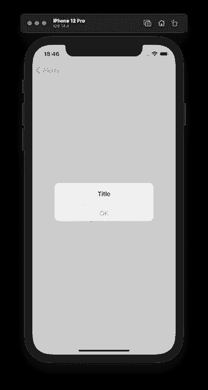
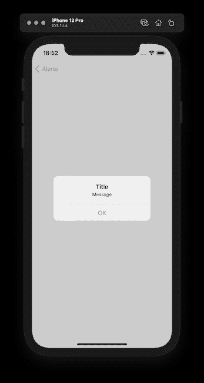
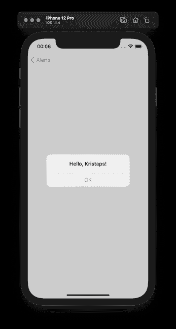
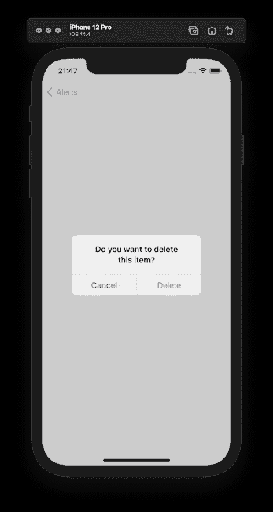

# 如何在 SwiftUI 中使用 Alert

> 原文：<https://betterprogramming.pub/how-to-use-alert-with-swiftui-f48a937fefcf>

## 构建直观的 iOS 应用


Evan Krause 在 [Unsplash](https://unsplash.com?utm_source=medium&utm_medium=referral) 上拍摄的照片。

提醒是 iOS 应用程序最重要的组成部分之一。如果某些事情需要更多时间，比如下载文件或确保一切正常，我们可以使用它们来通知用户出现错误。警报的另一个用例是当我们的应用程序用户想要删除一些东西或进行电汇时要求确认。

SwiftUI 有用于此的`Alert`组件，有几种方法可以使用它。我们去看看。

# 警报

用 SwiftUI 显示警报的最简单方法之一是使用一个本地状态变量来指示警报是否可见。之后，我们需要添加需要返回`Alert`视图的`.alert`视图修饰符。

在这个例子中，我们看到`showAlert`状态变量保持一个`bool`值。起初，警报是不可见的，是`false`。当我们按下按钮时，我们需要将状态变量更改为`true`，这将触发警报在屏幕上可见。



我们可以看到，默认情况下，警报有一个“OK”按钮来消除它。我们将在本文后面尝试添加更多的按钮。

对于`Alert`视图，我们不仅可以提供一个`title`，还可以提供一个`message`字段，一个接一个。

```
Alert(title: Text("Title"),
      message: Text("Message"))
```



# 带有可识别项目的警报

在 SwiftUI 中呈现警报的另一种方式是使用可识别的视图状态变量。使用这种方法，SwiftUI 的布局系统传递该状态变量的值，我们可以使用其内容填充警报标题、消息或事件按钮。好处是，一旦这个项目发生变化，SwiftUI 布局系统将使用新值更新警报，这是一个非常简洁的功能，我们可以免费获得。

让我们看看如何用代码实现它。首先，我们需要建立一个实现`Identifiable`协议的对象。让我们创建一个用户结构。我们需要创建一个`id`常量，我们可以使用`UUID`结构来表示一个全局唯一的值，该值可以标识它们之间的值。

```
struct User: Identifiable {
  let id: UUID
  let name: String
}
```

接下来，让我们转到 SwiftUI 部分并创建我们的视图:

值得注意的是，视图状态变量是可选的，因为 SwiftUI 决定了警报是否应该在屏幕上可见。

当使用`.alert`视图修饰符时，我们有一个带有输入变量的闭包，它是状态变量的当前值。例如，通过这种方式，我们可以填充警报标题。



# 警报按钮

现在我们知道了如何通过两种不同的方法使用 SwiftUI 在屏幕上显示警报。但是我们如何显示多个按钮并自定义它们呢？

为了给警告添加按钮，我们可以使用指定解除按钮的`Alert`初始化器，或者通过提供主要和次要按钮来初始化`Alert`。

让我们创建一个确认提醒，询问用户是否要从列表中删除某些内容:

让我们解开密码。为了显示警报，我们使用第一种方法，使用视图状态变量来指示何时在屏幕上显示警报。

在我们构建`Alert`表示的`.alert`视图修改器中，我们看到我们使用了不同的初始化器来提供关于警告按钮的信息。那是一个特定的[按钮](https://developer.apple.com/documentation/swiftui/alert/button)，代表一个警报的操作。我们可以在 SwiftUI 中使用四种不同风格的按钮:

*   `default`
*   `cancel` —用系统提供的标签表示取消。
*   `cancel(_:action:)` —与上面类似，但带有自定义标签。
*   `destructive` —表示破坏性动作，例如删除。

我们在确认提示中使用了`cancel`和`destructive`按钮样式，因为我们的用户可以从列表中取消或删除项目。



# 显示多个提醒

要在一个视图上显示多个警报，有两种方法。

## 使用状态变量

第一种方法是为每个警报保留一个视图状态变量。但是我们需要添加`.alert`修改器——不是为了全视图。例如，我们可以为调用警报的按钮添加它。如果我们一个接一个地添加两个`.alert`修饰符，SwiftUI 布局引擎将只显示第一个:

## 使用可识别的状态变量

我更喜欢第二种方法，因为它更加类型安全。首先，我们需要建立一个表示符合`Identifiable`协议的警报的结构。在这个结构中，我们有一个本地枚举类型，表示我们希望显示的所有警报类型，并返回特定的警报视图。理想情况下应该是分开的，但是为了演示，我把它保持成这样:

接下来，我们想要创建 SwiftUI 视图并使用它。当调用和构造警报时，我们的视图将拥有带有新的`AlertIdentifier`类型的本地状态变量。我们可以使用它和之前在`ActiveAlert`枚举中构建的计算出的`alertView`属性:

这里有很多东西需要解释，但主要的一点是，在同一个视图上显示多个警报是安全的，不需要为每个警报添加状态变量。使用这种方法，我们不需要担心我们的警告是否会显示给用户，因为我们没有分散在视图本身周围的多个`.alert`视图修改器。

# TL；速度三角形定位法(dead reckoning)

显示警告来通知我们的应用程序用户或要求确认对于用户界面来说是必不可少的。我们可以用两种方式显示 SwiftUI 的警报。第一种方法是使用一个状态变量来指示警报是否可见。第二个使用可识别的状态变量，该变量可用于填充警报标题、消息和按钮。

我们可以为警报设置多种类型的按钮。如果我们想要显示两个以上，我们需要使用 SwiftUI 表。

要在同一个视图中显示多个警报，我们可以使用多个视图状态变量或者使用一个负责创建警报本身的可识别结构来实现。

# 资源

*   [样本代码](https://github.com/fassko/swiftui-alert)
*   [预警正式文件](https://developer.apple.com/documentation/swiftui/alert)
*   [报警按钮官方文档](https://developer.apple.com/documentation/swiftui/alert/button)
*   [如何显示警报](https://www.hackingwithswift.com/quick-start/swiftui/how-to-show-an-alert)
*   [在 SwiftUI 中处理可识别项目](https://www.hackingwithswift.com/books/ios-swiftui/working-with-identifiable-items-in-swiftui)
*   [SwiftUI: Alert](http://www.thomashanning.com/swiftui-alert/)