# 如何在 Web 应用程序中使用 Ant 表单

> 原文：<https://betterprogramming.pub/how-to-use-ant-forms-in-your-web-app-3cc1a7468ff7>

## Ant 表单有助于管理 web 表单的样式、布局、验证和数据


照片由[克里斯蒂娜@ wocintechchat.com](https://unsplash.com/@wocintechchat?utm_source=medium&utm_medium=referral)在 [Unsplash](https://unsplash.com?utm_source=medium&utm_medium=referral) 上拍摄

[web 表单](https://en.wikipedia.org/wiki/Form_(HTML))允许我们输入发送到服务器进行处理的数据。例如，当我们订购产品时，可以使用一个表单来输入送货地址和信用卡信息。HTML `<form>`元素中包含了一个表单。它包含文本字段、选择、复选框、单选按钮等。

表单是 HTML/React 中复杂的元素/组件。在上一篇文章中，我们解释了表单的另一个方面:[表单自动填充如何工作](/6-autofill-features-for-web-developers-ac76b725b28a)。

在本文中，我们将探讨 Ant 表单是如何帮助管理表单的样式、布局、验证和数据的。

# 为什么我们需要一个蚂蚁表单？

Ant 表单是 [Ant 设计系统](/understanding-the-ant-design-system-a-ui-design-for-enterprises-39afdb188b06)的一部分，我们使用以下命令在 [Create React App](/upgrade-create-react-app-based-projects-to-version-4-cra-4-d7962aee11a6) 工作环境中设置它:

```
npx create-react-app my-app
cd my-app
```

要设置`antd`，请执行以下操作:

```
npm i antd
```

`antd`成为`package.json`中`[dependencies](/package-jsons-dependencies-in-depth-a1f0637a3129)`的一部分；

在整篇文章中，我们修改`src/App.js`来探索事物。下面是一个简单的表单:

它显示两个输入字段和一个提交按钮:

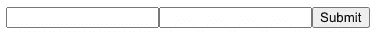

该输出有许多问题:

*   这些部件不美观。
*   没有标识输入字段的标签。
*   组件布局不合理。
*   没有对字段的验证。
*   输入字段数据不受控制。
*   当点击提交按钮时，没有任何反应。

Ant 表单就是为了解决这些问题而设计的。

# 蚂蚁风格

众所周知，原始的 HTML 元素并不美观。它们只是简单地挤在一起，没有边距或填充。每个元素看起来都很原始，在不同的浏览器中可能不会以相同的方式出现。Ant style 并不能解决所有的样式问题，因此不能使用 CSS 对文件输入(`<input type="file">`)进行彻底的样式化；然而，Ant Design 系统样式对于大多数封装在`Form.Item`中的常用组件来说形成得很好。

这是一种蚂蚁形式:

第 2 行导入 Ant 样式。

第 7 行设置表单名称，这将是表单项 id 的前缀。最佳做法是设置表单名称，尤其是当有多个表单时。

第 9–13 行将输入字段(第 12 行)放在`Form.Item`内。

第 14–18 行将输入字段(第 17 行)放在`Form.Item`内。

第 19–21 行将提交按钮(第 20 行)包装在`Form.Item`中。

下面的显示看起来不是更好吗？

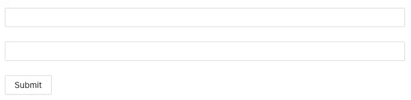

对于附加样式，`Form`有一个属性`size`，可以用来将一个表单设置为`"small"`、`"middle"`或`"large"`。

# 蚂蚁布局

`<label>`是一个简单的元素，但是在`Form.Item`中添加一个标签就更简单了。

第 10 行配置标签`"Name"`。

第 16 行配置标签`"Age"`。

以下显示具有有意义的标签:

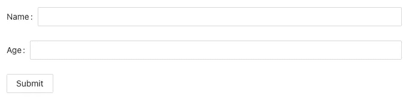

默认情况下，如果`Form`的`layout`为`"horizontal"`，每个标签都会附加冒号(`:`)。

冒号可以用`Form`的`colon={false}`关闭。

以下是`layout`为`"vertical"`时的显示。

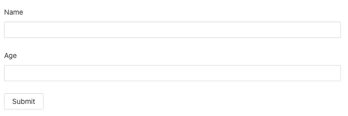

`layout`也可以是`"inline"`。


当布局为`"horizontal"`且显示尺寸较窄时，自动切换到`"vertical"`布局是响应式设计。

对于`"horizontal"`布局，我们可能希望标签和输入字段网格对齐。`labelCol`和`wrapperCol`就是为此而设计的。蚂蚁设计系统是一个 24 网格系统。`labelCol`和`wrapperCol`可以是定义`span`和/或`offset`的对象，也可以是定义`xs`、`sm`、`md`和/或`lg`的响应对象。

我们将`labelCol`和`wrapperCol`添加到布局中，如下所示:

第 8 行隐藏了冒号。

第 9–11 行将标签宽度定义为四个网格。

第 12–14 行将换行的输入字段宽度定义为 16 个网格。

第 29–32 行定义了提交按钮的布局，它从左边偏移了四个网格。

因为总共有 20 个网格，所以表单在可用空间中是左对齐的(额外的四个网格放在右侧)。

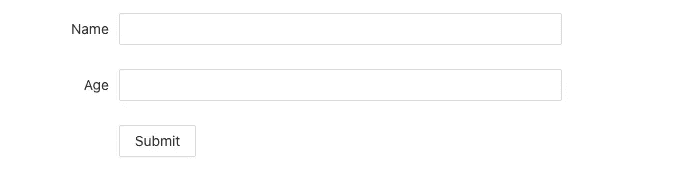

除了`Form.Item`之外，还有`Form.List`，为字段提供数组输入管理。一个`Form`组件可以包括`Form.Item`和/或`Form.List`。

以下是`Form.List`的官方示例:

# Ant 表单验证

表单验证是一种浏览器和/或 web 服务器，它检查表单数据的格式是否正确，是否在应用程序设置的约束范围内。在浏览器中完成的验证称为客户端验证，而在服务器上完成的验证称为服务器端验证。

Ant 表单验证由`Form.Item`的`rules` prop 执行，它是一个返回承诺的配置对象和/或函数的数组。它可以处理客户端和服务器端的验证。

## 客户端验证

让我们先用下面的代码来看看客户端验证:

第 19–28 行定义了`name`字段的`rules`。它由两个对象组成。

第一个规则对象(第 20–23 行)有两个属性。它声明该字段是必需的(第 21 行)，并定义了一条错误消息(第 22 行)。

第二个规则对象(第 24–27 行)有两个道具。它指定了一个用于验证的正则表达式模式(第 25 行)，并定义了一个错误消息(第 26 行)。

第 35–42 行定义了`age`字段的`rules`，它是一个`InputNumber`。

规则对象(第 36–41 行)有四个属性，它们定义了类型(第 37 行)、最小值(第 38 行)、最大值(第 39 行)和错误消息(第 40 行)。

输出显示如下:

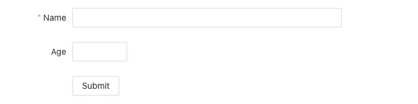

默认情况下，`InputNumber`字段具有固定宽度，而`Input`字段具有`100%`宽度。如果需要，您可以将`InputNumber`设置为`100%`宽度。

虽然 name 字段是必需的，但是当该字段是原始的，即未被用户触及时，错误消息不会显示。字段变脏(被触摸)或单击提交按钮后，会显示错误。

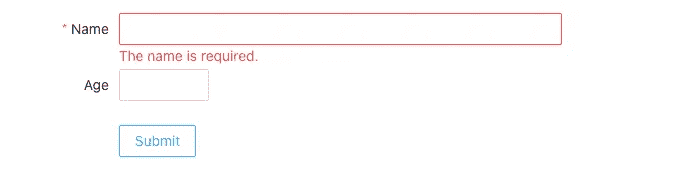

如果您不想让必填字段显示红色星号，可以通过设置`Form`的 prop `requiredMark={false}`将其关闭。

您还可以配置它，用`requiredMark="optional"`显式显示标签`(optional)`。在这种情况下，您可能还想设置`labelAlign="left"`以获得良好的视觉外观。

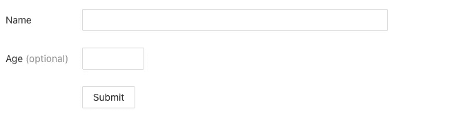

`name`字段有两个规则:一个是必需的，一个是特定的模式。在这种情况下，如果`name`为空字符串，则只会显示所需的错误。如果有两种模式并且都是错误的，则默认情况下会显示这两种错误。

将`age`字段更新为以下内容:

输入`-1`显示两个错误:

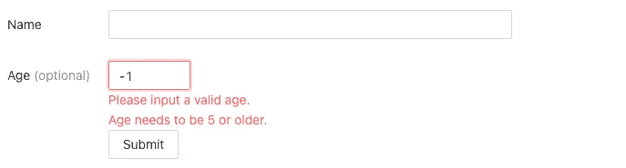

设置`Form.Item`的道具`validateFirst={true}`在遇到第一个错误时停止验证。

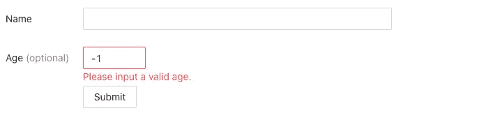

## 服务器端验证

上述验证示例是在客户端进行的。如果第二次验证`'Age needs to be 5 or older'`发生在服务器端会怎样？

这里有一个例子:

第 4–10 行模拟来自服务器的后端调用`isTooYong()`。

调用`isTooYong()`时，第 5 行在控制台上打印出一条消息。

第 53–55 行通过调用`isTooYong()`来验证信息。

当我们在“年龄”字段中键入“1111”时，该字段会在我们键入时得到验证。


但是，我们注意到它在控制台上打印出四条消息，如下所示:

```
Validate 1
Validate 11
Validate 111
Validate 1111
```

为每次击键执行服务器端验证是非常昂贵的。设置`Form.Item`的属性`validateTrigger="onBlur"`确保只有当字段失去焦点时才进行验证。

## 验证功能

除了对象之外，验证规则也可以是返回承诺的函数。代码如下:

第 53–57 行定义了一个调用`isTooYong()`的验证函数。

在这个验证函数中，我们不使用输入参数，它是一个`FormInstance`。如果记录了该参数，我们可以看到以下 API:

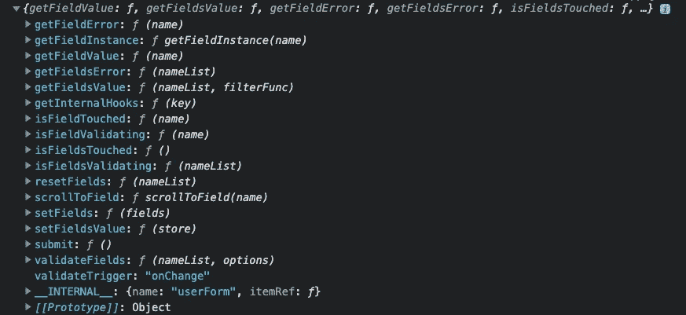

这些 API 用于数据控制。使用它们可以执行复杂的任务。

# Ant 表单数据

蚂蚁形态是一个[受控组件](/to-be-or-not-to-be-2c372198a01c#ba5c-4b7662162c8e-reply)。表单状态和属性封装在表单组件中。不需要编写代码来保存或管理`Form` / `Form.Item`数据。我们只需要提供一个名字。表单数据存储为一个对象，其中每个表单项都是一个名称-值对。

## 表单数据控件

用作确认输入参数的`FormInstance`可以通过`Form.useForm`获得。API 允许我们控制表单数据和验证数据。

下面是一个使用`FormInstance` API 的`setFieldsValue`生成`age`字段的例子:

第 5 行从`Form.useForm`生成表单实例`form`。该实例在第 10 行被用作`Form`的道具。

第 36–45 行定义了`onChange`处理器。基于`name`值，`age`字段由`form.setFieldsValue()`填充。

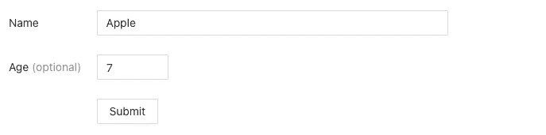

## 数据初始化

数据初始化可以发生在`Form`级或`Form.Item`级。

在`Form`级别，属性`initialValues`可用于初始化整个表单数据。代码如下:

第 20–23 行根据`Form.Item`的 name 键初始化表单数据。

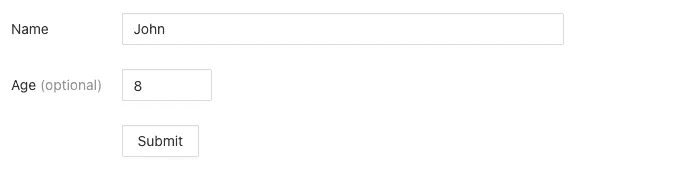

或者，每个`Form.Item`可以初始化自己的值。看看下面的代码:

在第 34 行，`name`字段被初始化为`"John"`。

在第 60 行，`age`字段被初始化为`8`。

## 数据提交

当我们准备好提交表单时，将使用当前表单数据调用`onFinish`处理程序。

第 7–9 行定义了当点击提交按钮时将在第 24 行调用的`onFinish`处理程序。

如果我们单击 submit 按钮，第 8 行将打印`Received values of form: {name: “John”, age: 8}`。

## 多种形式

如果有多个表单，可以放在`Form.Provider`下。当每个表单被提交时，它的`onFinish`处理程序被正常调用。另外，`Form.Provider`的`onFormFinish`处理程序也被调用。它可以处理表单之间的数据。

这里有一个例子:

第 17–49 行定义了`userForm1`，它有一个正常的`Form.Item`用于`username`(第 26–37 行)，一个禁用的`Form.Item`用于`age`(第 26–37 行)，还有一个提交按钮`Submit Name`(第 41–48 行)。

第 50–83 行定义了`userForm2`，它有一个禁用的`Form.Item`用于`username`(第 59–61 行)，一个正常的`Form.Item`用于`age`(第 62–74 行)，以及一个提交按钮`Submit Age`(第 75–82 行)。

第 7–15 行定义了`onFormFinish`处理程序，它检查表单名称。如果是`userForm1`，其`username`被复制到`userForm2`。如果是`userForm2`，它的`age`被复制到`userForm1`。

提交姓名和年龄后，将显示以下内容:

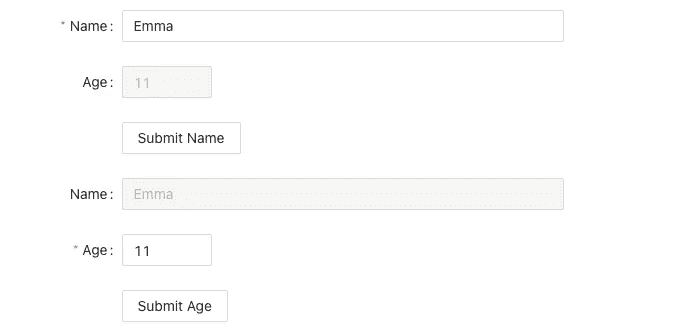

`onFormFinish`处理器有两个输入参数。第一个是提交表单名称，第二个是包含`values`对象和`forms`对象的对象。

这里有一个例子:

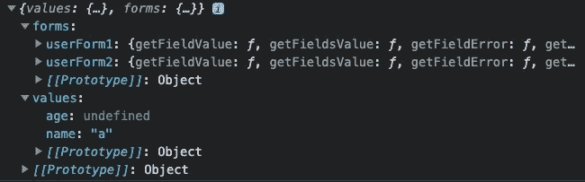

对象包括每个表单的表单实例。

`values`对象包含提交表单的值对象。

# 结论

Ant 表单有助于管理表单的样式、布局、验证和数据。它解决了原始形式的问题:

*   蚂蚁的形态很有美感。
*   向 Ant 表单添加标签很容易。
*   布局一个 Ant 表单有很多道具。
*   许多规则都可以用来验证 Ant 表单。
*   Ant 表单数据是完全受控的。
*   配置 Ant 表单提交很容易，包括多个表单之间的交互。

感谢阅读。我希望这有所帮助。如果你有兴趣，可以看看[我的其他媒体文章](https://jenniferfubook.medium.com/jennifer-fus-web-development-publications-1a887e4454af)。

*注:感谢悉达多钦塔帕利审阅我的* [*多米诺数据实验室*](https://www.dominodatalab.com/) *产品的表单代码！*